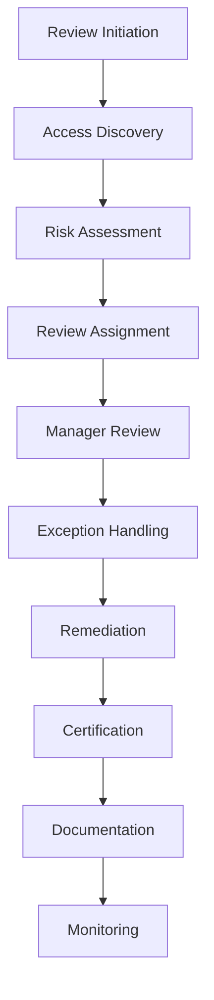
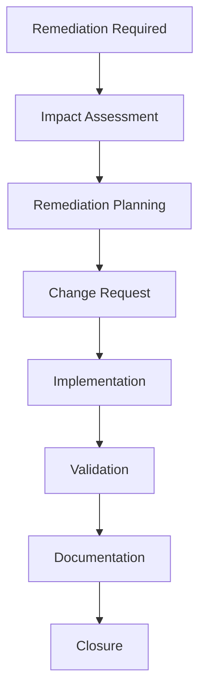

# Access Review and Certification Procedure - ISO 27001

## ArionComply Platform Metadata

```yaml
# Template Configuration
template_id: ISO27001-ACCESS-REVIEW-PROC-001
template_type: access_review_certification_procedure
template_version: 1.0
template_status: draft
created_date: {{CURRENT_DATE}}
last_modified: {{CURRENT_DATE}}
template_category: operational_procedure
compliance_framework: ISO27001:2022
template_owner: {{TEMPLATE_OWNER}}
approval_status: pending_review

# Platform Integration
platform_features:
  - automated_access_discovery
  - intelligent_review_orchestration
  - risk_based_prioritization
  - certification_automation
  - compliance_reporting
  - anomaly_detection

# Dependencies
depends_on:
  - security_monitoring_logging_procedure
  - access_control_policy
  - human_resources_security_policy
  - data_classification_policy
  - supplier_relationship_management_policy
  - information_security_incident_management_procedure

# Usage Context
applicable_controls:
  - A.9.2.5  # Review of user access rights
  - A.9.2.6  # Removal or adjustment of access rights
  - A.9.4.3  # Password management system
  - A.5.15   # Access control
  - A.6.5    # Information security responsibilities
  - A.8.2    # Privileged access rights
```

---

## **Document Control Information**

| **Element** | **Details** | **Description** |
|-------------|-------------|-----------------|
| **Document ID** | {{TEMPLATE_ID}} | *Unique identifier for this access review procedure* |
| **Document Title** | Access Review and Certification Procedure | *Detailed procedures for access review and certification operations* |
| **ISO 27001 Reference** | A.9.2.5, A.9.2.6, A.9.4.3, A.5.15, A.6.5, A.8.2 | *Primary controls addressed by this procedure* |
| **Document Owner** | {{PROCEDURE_OWNER}} | *Person responsible for procedure maintenance* |
| **Approval Authority** | {{APPROVAL_AUTHORITY}} | *Authority responsible for procedure approval* |
| **Effective Date** | {{EFFECTIVE_DATE}} | *Date when procedure becomes effective* |
| **Review Frequency** | {{REVIEW_FREQUENCY}} | *How often procedure will be reviewed* |
| **Next Review Date** | {{NEXT_REVIEW_DATE}} | *Scheduled date for next procedure review* |
| **Classification Level** | {{DOCUMENT_CLASSIFICATION}} | *Classification level of this document* |

---

## **1. Procedure Foundation**

### **1.1 Understanding Access Review and Certification**

Think of access review and certification like conducting a comprehensive security audit of a high-security facility. Just as a military base regularly reviews who has access to classified areas, validates their security clearances, ensures access cards are still needed, and promptly revokes access for personnel who have left or changed roles - access review and certification ensures that digital access rights remain appropriate, current, and secure across all organizational systems.

**Real-World Analogy**: Consider how a major hospital manages access to different areas:
- **Regular Audits**: Like quarterly reviews of who can access the pharmacy, surgical suites, and patient records
- **Role Validation**: Like verifying that only current cardiologists can access cardiac patient data
- **Access Certification**: Like department heads confirming that their staff members need their current access levels
- **Immediate Revocation**: Like instantly deactivating access for terminated employees or role changes
- **Exception Management**: Like managing temporary access for visiting specialists with proper approvals
- **Compliance Documentation**: Like maintaining detailed records for medical regulatory audits

Access review and certification provides ongoing assurance that access rights align with current business needs and security requirements.

### **1.2 Procedure Purpose**

This procedure establishes detailed operational steps to:
- **Validate Access Rights**: Systematically validate all user access rights and permissions
- **Ensure Appropriateness**: Confirm access rights align with current roles and responsibilities
- **Identify Excessive Access**: Detect and remediate excessive or inappropriate access
- **Maintain Compliance**: Meet regulatory and policy access review requirements
- **Support Certification**: Enable management certification of access appropriateness
- **Automate Reviews**: Leverage automation to improve review efficiency and accuracy
- **Track Remediation**: Monitor and track access remediation activities
- **Continuous Improvement**: Continuously improve access governance processes

### **1.3 Procedure Scope**

This procedure applies to:
- **All Access Types**: System access, application access, data access, and privileged access
- **All Users**: Employees, contractors, service accounts, and third-party users
- **All Systems**: On-premises systems, cloud services, and hybrid environments
- **All Environments**: Production, development, testing, and staging systems
- **All Access Levels**: Standard access, privileged access, and administrative access

---

## **2. Access Review Framework**

### **2.1 Review Types and Frequency**

#### **2.1.1 Review Classification Framework**
**Risk-Based Review Scheduling**:

| **Review Type** | **Frequency** | **Scope** | **Trigger Events** |
|-----------------|---------------|-----------|-------------------|
| **Regular Certification** | Quarterly | All standard access | Scheduled |
| **Privileged Access Review** | Monthly | Administrative access | Scheduled |
| **High-Risk System Review** | Monthly | Critical systems | Scheduled |
| **Role-Based Review** | Quarterly | Specific roles/departments | Scheduled |
| **Event-Triggered Review** | Immediate | Affected access | Incidents, changes |
| **Annual Comprehensive** | Annually | All access rights | Comprehensive audit |

#### **2.1.2 Review Scope Matrix**
**Comprehensive Review Coverage**:

| **System Category** | **Review Frequency** | **Review Depth** | **Certification Required** |
|-------------------|---------------------|------------------|---------------------------|
| **Mission Critical** | Monthly | Comprehensive | Executive level |
| **Business Critical** | Quarterly | Standard | Management level |
| **Important** | Bi-annually | Standard | Supervisor level |
| **Standard** | Annually | Basic | Automated + sampling |

### **2.2 Review Process Framework**

#### **2.2.1 End-to-End Review Process**
**Comprehensive Review Workflow**:


#### **2.2.2 Review Phases**
**Systematic Review Execution**:
1. **Preparation**: Review planning and scope definition
2. **Discovery**: Comprehensive access discovery and inventory
3. **Analysis**: Access risk analysis and prioritization
4. **Distribution**: Review task distribution and assignment
5. **Execution**: Manager and owner review execution
6. **Remediation**: Access right adjustment and remediation
7. **Certification**: Formal access certification and approval
8. **Documentation**: Complete review documentation and reporting

### **2.3 ArionComply Review Intelligence**

#### **2.3.1 Intelligent Review Orchestration**
**AI-Enhanced Review Management**:
```yaml
intelligent_review:
  automated_discovery:
    - comprehensive_access_inventory
    - relationship_mapping
    - risk_scoring
    - anomaly_detection
  
  review_optimization:
    - risk_based_prioritization
    - intelligent_grouping
    - workload_balancing
    - deadline_management
  
  certification_automation:
    - automated_low_risk_certification
    - exception_identification
    - remediation_tracking
    - compliance_reporting
```

#### **2.3.2 Predictive Access Analytics**
**AI-Powered Access Intelligence**:
- **Access Pattern Analysis**: Machine learning access pattern recognition
- **Anomaly Detection**: Automated access anomaly identification
- **Risk Prediction**: Predictive access risk modeling
- **Optimization Recommendations**: AI-driven access optimization suggestions
- **Compliance Forecasting**: Compliance trend analysis and forecasting
- **Resource Planning**: Review resource requirement prediction

---

## **3. Access Discovery and Inventory**

### **3.1 Comprehensive Access Discovery**

#### **3.1.1 Multi-Source Access Inventory**
**Enterprise Access Discovery**:
- **Identity Management Systems**: Centralized identity and access management
- **Directory Services**: Active Directory, LDAP, and directory services
- **Application-Specific Access**: Individual application access controls
- **Database Access**: Database user accounts and permissions
- **Cloud Service Access**: Cloud platform and service access rights
- **Network Device Access**: Network infrastructure access controls
- **Privileged Access**: Privileged access management systems
- **Service Accounts**: Automated service account inventories

#### **3.1.2 Access Relationship Mapping**
**Access Dependency Analysis**:
- **User-Role Relationships**: User to role assignment mapping
- **Role-Permission Relationships**: Role to permission assignment mapping
- **Group Memberships**: Security group and distribution list memberships
- **Resource Access**: Direct resource access assignments
- **Inheritance Chains**: Access inheritance and delegation chains
- **Cross-System Access**: Access relationships across multiple systems

### **3.2 Access Classification and Risk Assessment**

#### **3.2.1 Access Risk Scoring**
**Multi-Factor Risk Assessment**:

| **Risk Factor** | **High Risk** | **Medium Risk** | **Low Risk** |
|-----------------|---------------|-----------------|--------------|
| **Data Sensitivity** | Restricted/Confidential | Internal | Public |
| **System Criticality** | Mission-critical | Business-important | Standard |
| **Access Level** | Administrative | Power user | Standard user |
| **User Type** | External/Contractor | Internal privileged | Internal standard |
| **Access Frequency** | Unused >90 days | Infrequent | Regular use |

#### **3.2.2 Automated Risk Calculation**
**Dynamic Risk Assessment**:
- **Contextual Risk Analysis**: Business context and timing considerations
- **Historical Risk Analysis**: Historical access usage and risk patterns
- **Behavioral Risk Analysis**: User behavior and access pattern analysis
- **Compliance Risk Analysis**: Regulatory compliance risk assessment
- **Business Risk Analysis**: Business impact and criticality assessment
- **Aggregated Risk Scoring**: Multi-factor aggregated risk scoring

### **3.3 Access Anomaly Detection**

#### **3.3.1 Anomaly Identification**
**Automated Anomaly Detection**:
- **Orphaned Accounts**: Accounts without associated active users
- **Dormant Access**: Access rights unused for extended periods
- **Excessive Permissions**: Users with more access than role peers
- **Conflicting Access**: Access that violates segregation of duties
- **Temporary Access**: Temporary access that has become permanent
- **Cross-System Inconsistencies**: Inconsistent access across related systems

#### **3.3.2 Intelligence-Driven Detection**
**Advanced Anomaly Analytics**:
- **Machine Learning Detection**: ML-powered access anomaly detection
- **Peer Comparison**: Statistical peer group access comparison
- **Trend Analysis**: Historical access trend anomaly detection
- **Pattern Recognition**: Unusual access pattern identification
- **Risk Correlation**: Access risk correlation and analysis
- **Behavioral Deviation**: User behavior deviation detection

---

## **4. Review Assignment and Execution**

### **4.1 Review Assignment Strategy**

#### **4.1.1 Responsibility Matrix**
**Clear Review Responsibility Assignment**:

| **Access Type** | **Primary Reviewer** | **Secondary Reviewer** | **Final Approver** |
|-----------------|---------------------|----------------------|-------------------|
| **Standard User Access** | Direct manager | Resource owner | Department head |
| **Privileged Access** | Resource owner | Security team | CISO |
| **Administrative Access** | Security team | System owner | CTO |
| **External User Access** | Sponsor manager | Security team | Business owner |
| **Service Accounts** | System owner | Application owner | IT director |

#### **4.1.2 Intelligent Assignment**
**Automated Review Assignment**:
- **Role-Based Assignment**: Automatic assignment based on organizational roles
- **Workload Balancing**: Intelligent workload distribution and balancing
- **Expertise Matching**: Assignment based on system and domain expertise
- **Availability Consideration**: Review assignment based on reviewer availability
- **Escalation Rules**: Automatic escalation for unresponsive reviewers
- **Delegation Support**: Support for review delegation and alternate assignment

### **4.2 Review Execution Process**

#### **4.2.1 Manager Review Workflow**
**Structured Review Process**:
1. **Review Notification**: Automated review notification and assignment
2. **Access Assessment**: Review of assigned access rights and permissions
3. **Business Justification**: Validation of business need and appropriateness
4. **Risk Evaluation**: Assessment of access risk and potential impact
5. **Decision Making**: Decision to certify, modify, or revoke access
6. **Documentation**: Documentation of review decisions and rationale
7. **Submission**: Submission of completed review with recommendations

#### **4.2.2 Review Decision Framework**
**Standardized Decision Options**:
- **Certify**: Access is appropriate and should be maintained
- **Modify**: Access requires modification or adjustment
- **Revoke**: Access is no longer needed and should be removed
- **Transfer**: Access should be transferred to another user
- **Exception**: Access requires exception approval and documentation
- **Escalate**: Review requires escalation to higher authority

### **4.3 Review Quality Assurance**

#### **4.3.1 Review Quality Controls**
**Quality Assurance Framework**:
- **Completeness Verification**: Verification of review completeness
- **Decision Validation**: Validation of review decisions and rationale
- **Consistency Checking**: Cross-reviewer consistency analysis
- **Risk Assessment**: Review decision risk assessment
- **Compliance Verification**: Regulatory compliance verification
- **Documentation Review**: Review documentation quality assessment

#### **4.3.2 Review Performance Metrics**
**Review Effectiveness Measurement**:
- **Review Completion Rate**: Percentage of reviews completed on time
- **Review Quality Score**: Quality assessment of review decisions
- **Finding Rate**: Rate of access issues identified during reviews
- **Remediation Rate**: Rate of access issues successfully remediated
- **Reviewer Satisfaction**: Reviewer satisfaction with review process
- **Business Impact**: Business impact of review process and decisions

---

## **5. Exception Management**

### **5.1 Exception Framework**

#### **5.1.1 Exception Types and Criteria**
**Access Exception Classification**:

| **Exception Type** | **Criteria** | **Approval Required** | **Duration** |
|-------------------|--------------|----------------------|--------------|
| **Business Critical** | Critical business function | Business owner | 6 months |
| **Technical Limitation** | System constraint | Technical authority | 12 months |
| **Temporary Assignment** | Short-term role coverage | Manager | 90 days |
| **Compliance Requirement** | Regulatory mandate | Compliance officer | Ongoing |
| **Emergency Access** | Emergency response | Emergency authority | 48 hours |

#### **5.1.2 Exception Approval Process**
**Structured Exception Management**:
1. **Exception Request**: Formal exception request submission
2. **Risk Assessment**: Comprehensive exception risk assessment
3. **Business Justification**: Detailed business justification documentation
4. **Compensating Controls**: Identification of compensating controls
5. **Approval Workflow**: Multi-level exception approval workflow
6. **Documentation**: Complete exception documentation and tracking
7. **Monitoring**: Ongoing exception monitoring and review
8. **Renewal**: Regular exception renewal and reassessment

### **5.2 Compensating Controls**

#### **5.2.1 Control Framework**
**Exception Risk Mitigation**:
- **Enhanced Monitoring**: Increased monitoring and alerting for exceptions
- **Activity Logging**: Comprehensive activity logging and review
- **Periodic Review**: More frequent exception access reviews
- **Approval Workflow**: Additional approval requirements for access use
- **Time Restrictions**: Time-based access restrictions and controls
- **Segregation**: Additional segregation of duties controls

#### **5.2.2 Control Effectiveness**
**Compensating Control Validation**:
- **Effectiveness Assessment**: Regular assessment of control effectiveness
- **Risk Coverage**: Validation of risk coverage and mitigation
- **Performance Monitoring**: Continuous control performance monitoring
- **Gap Analysis**: Regular gap analysis and control enhancement
- **Cost-Benefit Analysis**: Control cost versus risk reduction analysis
- **Compliance Verification**: Regulatory compliance verification

### **5.3 Exception Lifecycle Management**

#### **5.3.1 Exception Tracking**
**Comprehensive Exception Management**:
- **Exception Registry**: Centralized exception tracking and registry
- **Status Monitoring**: Real-time exception status monitoring
- **Renewal Management**: Automated exception renewal management
- **Expiration Alerts**: Automated exception expiration alerting
- **Compliance Reporting**: Exception compliance reporting and metrics
- **Trend Analysis**: Exception trend analysis and optimization

#### **5.3.2 Exception Analytics**
**Exception Intelligence**:
- **Exception Pattern Analysis**: Analysis of exception patterns and trends
- **Risk Correlation**: Exception risk correlation and analysis
- **Cost Analysis**: Exception cost and resource impact analysis
- **Optimization Opportunities**: Exception reduction and optimization opportunities
- **Compliance Impact**: Exception compliance impact assessment
- **Process Improvement**: Exception process improvement recommendations

---

## **6. Remediation and Certification**

### **6.1 Access Remediation Process**

#### **6.1.1 Remediation Workflow**
**Systematic Access Remediation**:


#### **6.1.2 Remediation Categories**
**Access Remediation Types**:
- **Access Revocation**: Complete removal of access rights
- **Access Modification**: Adjustment of access permissions
- **Access Transfer**: Transfer of access to another user
- **Role Change**: Modification of user role assignments
- **Group Adjustment**: Security group membership changes
- **System Deprovisioning**: Complete system access removal

### **6.2 Remediation Execution**

#### **6.2.1 Automated Remediation**
**Intelligent Remediation Automation**:
- **Low-Risk Automation**: Automated remediation for low-risk changes
- **Workflow Integration**: Integration with change management workflows
- **Approval Automation**: Automated approval for routine remediation
- **Implementation Tracking**: Real-time remediation implementation tracking
- **Validation Automation**: Automated remediation validation and verification
- **Rollback Capability**: Automated rollback for failed remediations

#### **6.2.2 Manual Remediation**
**High-Risk Remediation Process**:
- **Manual Review**: Manual review for high-risk access changes
- **Impact Analysis**: Detailed business and technical impact analysis
- **Stakeholder Coordination**: Coordination with affected stakeholders
- **Implementation Planning**: Detailed implementation planning and scheduling
- **Testing**: Pre-implementation testing and validation
- **Monitoring**: Enhanced monitoring during and after implementation

### **6.3 Access Certification**

#### **6.3.1 Certification Process**
**Formal Access Certification**:
- **Review Completion**: Verification of review completion and quality
- **Decision Validation**: Validation of review decisions and actions
- **Risk Assessment**: Final risk assessment and acceptance
- **Stakeholder Approval**: Formal stakeholder approval and sign-off
- **Documentation**: Complete certification documentation
- **Compliance Verification**: Regulatory compliance verification

#### **6.3.2 Certification Levels**
**Multi-Level Certification Framework**:

| **Certification Level** | **Authority** | **Scope** | **Frequency** |
|------------------------|---------------|-----------|---------------|
| **Supervisor** | Direct supervisor | Standard access | Quarterly |
| **Manager** | Department manager | Departmental access | Quarterly |
| **Executive** | Executive management | Critical system access | Annually |
| **Board** | Board of directors | Enterprise-wide | Annually |

---

## **7. Automation and Workflow**

### **7.1 Review Automation Framework**

#### **7.1.1 Automation Capabilities**
**Comprehensive Review Automation**:
- **Schedule Management**: Automated review scheduling and planning
- **Notification System**: Automated reviewer notification and reminders
- **Progress Tracking**: Real-time review progress tracking and reporting
- **Escalation Management**: Automated escalation for overdue reviews
- **Quality Assurance**: Automated review quality checking and validation
- **Reporting**: Automated review reporting and dashboard generation

#### **7.1.2 Workflow Integration**
**Enterprise Workflow Integration**:
- **HR System Integration**: Integration with HR systems for role changes
- **Identity Management**: Integration with identity management systems
- **Change Management**: Integration with change management processes
- **Incident Management**: Integration with security incident management
- **Compliance Management**: Integration with compliance management systems
- **Business Intelligence**: Integration with BI and analytics platforms

### **7.2 ArionComply Automation Platform**

#### **7.2.1 Intelligent Automation Engine**
**AI-Powered Review Automation**:
```yaml
automation_platform:
  intelligent_scheduling:
    - risk_based_prioritization
    - workload_optimization
    - resource_availability
    - business_calendar_integration
  
  automated_decision_support:
    - access_pattern_analysis
    - risk_assessment_automation
    - recommendation_engine
    - exception_identification
  
  workflow_orchestration:
    - multi_system_coordination
    - approval_routing
    - escalation_management
    - status_tracking
```

#### **7.2.2 Machine Learning Integration**
**Advanced ML Capabilities**:
- **Predictive Analytics**: Predictive access risk and compliance analytics
- **Anomaly Detection**: Advanced anomaly detection and pattern recognition
- **Decision Support**: AI-powered review decision support and recommendations
- **Process Optimization**: Machine learning process optimization and improvement
- **Resource Planning**: Intelligent resource planning and allocation
- **Performance Prediction**: Review performance prediction and optimization

### **7.3 Workflow Optimization**

#### **7.3.1 Process Efficiency**
**Review Process Optimization**:
- **Task Automation**: Automation of routine review tasks
- **Parallel Processing**: Parallel review processing and coordination
- **Resource Optimization**: Optimal resource allocation and utilization
- **Timeline Optimization**: Review timeline optimization and acceleration
- **Quality Enhancement**: Automated quality assurance and improvement
- **User Experience**: Review user experience optimization

#### **7.3.2 Continuous Improvement**
**Process Enhancement Framework**:
- **Performance Analytics**: Review process performance analytics
- **Bottleneck Analysis**: Review bottleneck identification and resolution
- **Efficiency Metrics**: Process efficiency measurement and optimization
- **User Feedback**: Reviewer feedback collection and integration
- **Best Practice Integration**: Industry best practice integration
- **Innovation Adoption**: New technology and approach adoption

---

## **8. Compliance and Reporting**

### **8.1 Regulatory Compliance Framework**

#### **8.1.1 Compliance Requirements Matrix**
**Regulation-Specific Access Review Requirements**:

| **Regulation** | **Review Frequency** | **Scope** | **Documentation** |
|----------------|---------------------|-----------|-------------------|
| **SOX** | Quarterly | Financial system access | Complete attestation |
| **HIPAA** | Semi-annually | PHI access | Access logs required |
| **PCI DSS** | Quarterly | Payment system access | Detailed documentation |
| **GDPR** | Annually | Personal data access | Data processing records |
| **FISMA** | Continuously | Government system access | Continuous monitoring |

#### **8.1.2 Compliance Automation**
**Automated Compliance Management**:
- **Requirement Mapping**: Automated regulatory requirement mapping
- **Evidence Collection**: Automated compliance evidence collection
- **Report Generation**: Automated compliance report generation
- **Gap Analysis**: Automated compliance gap analysis
- **Remediation Tracking**: Compliance remediation tracking and management
- **Audit Support**: Automated audit preparation and support

### **8.2 Reporting and Analytics**

#### **8.2.1 Executive Reporting**
**Strategic Access Governance Reporting**:
- **Access Risk Dashboard**: Real-time access risk visibility
- **Compliance Status**: Current compliance status and trends
- **Review Performance**: Review completion and quality metrics
- **Remediation Progress**: Access remediation progress and effectiveness
- **Trend Analysis**: Access governance trends and forecasting
- **Cost Analysis**: Access review cost and ROI analysis

#### **8.2.2 Operational Reporting**
**Tactical Access Management Reporting**:
- **Review Status Reports**: Current review status and progress
- **Exception Reports**: Access exception status and management
- **Anomaly Reports**: Access anomaly detection and analysis
- **Performance Metrics**: Review process performance metrics
- **Quality Reports**: Review quality assessment and improvement
- **Resource Utilization**: Review resource utilization and planning

### **8.3 Audit Support**

#### **8.3.1 Audit Preparation**
**Comprehensive Audit Readiness**:
- **Documentation Repository**: Complete access review documentation
- **Evidence Collection**: Automated audit evidence collection
- **Report Compilation**: Automated audit report compilation
- **Timeline Reconstruction**: Access change timeline reconstruction
- **Compliance Verification**: Automated compliance verification
- **Gap Analysis**: Access governance gap analysis

#### **8.3.2 Audit Response**
**Audit Cooperation Framework**:
- **Auditor Coordination**: Structured auditor coordination and support
- **Information Provision**: Timely provision of requested information
- **Process Demonstration**: Access review process demonstration
- **Control Testing**: Support for access control testing
- **Finding Response**: Prompt response to audit findings
- **Improvement Implementation**: Implementation of audit recommendations

---

## **9. Performance Management and Metrics**

### **9.1 Key Performance Indicators**

#### **9.1.1 Review Performance Metrics**
**Access Review KPIs**:

| **Metric** | **Definition** | **Target** | **Frequency** |
|------------|----------------|------------|---------------|
| **Review Completion Rate** | Percentage of reviews completed on time | {{REVIEW_COMPLETION_TARGET}}% | Monthly |
| **Review Quality Score** | Average review quality assessment | {{REVIEW_QUALITY_TARGET}}/10 | Monthly |
| **Finding Rate** | Percentage of reviews identifying issues | {{FINDING_RATE_TARGET}}% | Monthly |
| **Remediation Time** | Average time to complete remediation | {{REMEDIATION_TIME_TARGET}} days | Monthly |
| **Compliance Score** | Regulatory compliance assessment | {{COMPLIANCE_SCORE_TARGET}}% | Quarterly |

#### **9.1.2 Access Governance Metrics**
**Strategic Governance Indicators**:
- **Access Risk Score**: Aggregate organizational access risk score
- **Exception Rate**: Percentage of access requiring exceptions
- **Automation Rate**: Percentage of review process automated
- **Cost per Review**: Average cost per access review completed
- **Stakeholder Satisfaction**: Reviewer and business stakeholder satisfaction
- **Audit Readiness**: Access governance audit readiness score

### **9.2 Performance Analysis**

#### **9.2.1 Trend Analysis**
**Access Governance Trends**:
- **Review Performance Trends**: Historical review performance analysis
- **Risk Trend Analysis**: Access risk trend analysis and forecasting
- **Compliance Trends**: Regulatory compliance trend analysis
- **Cost Trends**: Access review cost trend analysis
- **Efficiency Trends**: Process efficiency improvement trends
- **Quality Trends**: Review quality improvement trends

#### **9.2.2 Benchmarking**
**Performance Benchmarking Framework**:
- **Industry Benchmarks**: Comparison with industry standards
- **Peer Comparison**: Comparison with peer organizations
- **Best Practice Analysis**: Best practice adoption analysis
- **Maturity Assessment**: Access governance maturity assessment
- **Gap Analysis**: Performance gap identification
- **Improvement Opportunities**: Improvement opportunity identification

### **9.3 Continuous Improvement**

#### **9.3.1 Improvement Process**
**Systematic Improvement Framework**:
- **Performance Analysis**: Regular performance data analysis
- **Root Cause Analysis**: Performance issue root cause analysis
- **Improvement Planning**: Systematic improvement planning
- **Implementation**: Improvement implementation and monitoring
- **Effectiveness Measurement**: Improvement effectiveness measurement
- **Standardization**: Successful improvement standardization

#### **9.3.2 Innovation Integration**
**Innovation Adoption Framework**:
- **Technology Evaluation**: New technology evaluation and adoption
- **Process Innovation**: Access review process innovation
- **Best Practice Integration**: Industry best practice integration
- **Automation Enhancement**: Automation capability enhancement
- **User Experience Improvement**: Review user experience improvement
- **Value Optimization**: Review process value optimization

---

## **10. Implementation Checklist**

### **10.1 Pre-Implementation**
- [ ] **Access Inventory**: Complete comprehensive access inventory
- [ ] **Process Design**: Design access review processes and workflows
- [ ] **Tool Selection**: Select access review and automation tools
- [ ] **Role Definition**: Define access review roles and responsibilities
- [ ] **Policy Alignment**: Align with access control policies

### **10.2 Implementation Phase**
- [ ] **System Integration**: Integrate access review systems and tools
- [ ] **Workflow Configuration**: Configure review workflows and automation
- [ ] **Training Program**: Train access reviewers and administrators
- [ ] **Process Testing**: Test access review processes and procedures
- [ ] **Documentation**: Complete access review documentation

### **10.3 Post-Implementation**
- [ ] **Performance Monitoring**: Implement review performance monitoring
- [ ] **Quality Assurance**: Establish review quality assurance processes
- [ ] **Continuous Improvement**: Establish continuous improvement program
- [ ] **Compliance Verification**: Verify regulatory compliance
- [ ] **Stakeholder Training**: Train all stakeholders on review processes

---

## **11. Related Documents**

### **11.1 Policy Dependencies**
- **Access Control Policy**: Foundation access control requirements
- **Human Resources Security Policy**: Personnel access management
- **Data Classification Policy**: Data-driven access requirements
- **Supplier Management Policy**: Third-party access review requirements

### **11.2 Technical Procedures**
- **User Provisioning Procedures**: User lifecycle management procedures
- **Privileged Access Procedures**: Privileged access management procedures
- **System Access Procedures**: System-specific access procedures
- **Emergency Access Procedures**: Emergency access management procedures

### **11.3 Governance Documentation**
- **Access Review Charter**: Access review program charter
- **Responsibility Matrix**: Detailed responsibility assignment matrix
- **Exception Management**: Access exception management procedures
- **Compliance Guidelines**: Regulatory compliance guidelines

---

## **12. Appendices**

### **12.1 Review Schedule Matrix**
| **Access Type** | **Q1** | **Q2** | **Q3** | **Q4** |
|-----------------|--------|--------|--------|--------|
| **Standard Access** | ✓ | ✓ | ✓ | ✓ |
| **Privileged Access** | Monthly Reviews |  |  |  |
| **Administrative** | Monthly Reviews |  |  |  |
| **External Access** | ✓ | ✓ | ✓ | ✓ |

### **12.2 Risk Scoring Matrix**
| **Factor** | **Weight** | **High (3)** | **Medium (2)** | **Low (1)** |
|------------|------------|--------------|----------------|-------------|
| **Data Sensitivity** | 40% | Restricted | Confidential | Internal |
| **System Criticality** | 30% | Mission-critical | Business-important | Standard |
| **Access Level** | 20% | Administrative | Power user | Standard |
| **User Risk** | 10% | External | Privileged internal | Standard internal |

### **12.3 Remediation Priority Matrix**
| **Risk Score** | **Priority** | **Target Remediation** | **Escalation** |
|----------------|--------------|----------------------|----------------|
| **9-12** | P1 - Critical | 24 hours | Immediate |
| **6-8** | P2 - High | 72 hours | Management |
| **4-5** | P3 - Medium | 1 week | Supervisor |
| **1-3** | P4 - Low | 1 month | Standard |

---

**Document Status**: {{DOCUMENT_STATUS}}  
**Version**: {{VERSION_NUMBER}}  
**Last Updated**: {{LAST_UPDATED}}  
**Next Review**: {{NEXT_REVIEW_DATE}}  
**Owner**: {{DOCUMENT_OWNER}}  
**Approved By**: {{APPROVED_BY}}  
**Approval Date**: {{APPROVAL_DATE}}