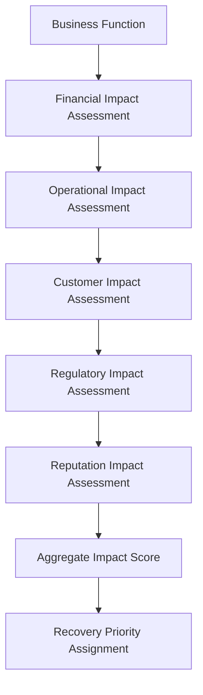
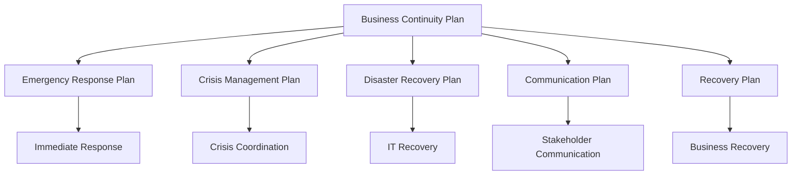
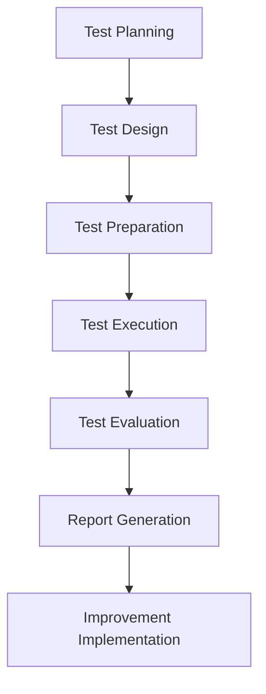

# Business Continuity Management Procedure - ISO 27001

## ArionComply Platform Metadata

```yaml
# Template Configuration
template_id: ISO27001-BCM-PROC-001
template_type: business_continuity_management_procedure
template_version: 1.0
template_status: draft
created_date: {{CURRENT_DATE}}
last_modified: {{CURRENT_DATE}}
template_category: operational_procedure
compliance_framework: ISO27001:2022
template_owner: {{TEMPLATE_OWNER}}
approval_status: pending_review

# Platform Integration
platform_features:
  - business_impact_analysis_automation
  - continuity_plan_orchestration
  - crisis_management_coordination
  - recovery_time_monitoring
  - dependency_mapping
  - scenario_simulation

# Dependencies
depends_on:
  - change_management_procedure
  - business_continuity_policy
  - information_security_incident_management_procedure
  - supplier_relationship_management_policy
  - physical_environmental_security_policy
  - communications_security_policy

# Usage Context
applicable_controls:
  - A.17.1.1  # Planning information security continuity
  - A.17.1.2  # Implementing information security continuity
  - A.17.1.3  # Verify, review and evaluate information security continuity
  - A.17.2.1  # Information processing facilities
  - A.5.29    # Information security during disruption
  - A.5.30    # ICT readiness for business continuity
```

---

## **Document Control Information**

| **Element** | **Details** | **Description** |
|-------------|-------------|-----------------|
| **Document ID** | {{TEMPLATE_ID}} | *Unique identifier for this business continuity procedure* |
| **Document Title** | Business Continuity Management Procedure | *Detailed procedures for managing business continuity* |
| **ISO 27001 Reference** | A.17.1.1-A.17.1.3, A.17.2.1, A.5.29-A.5.30 | *Primary controls addressed by this procedure* |
| **Document Owner** | {{PROCEDURE_OWNER}} | *Person responsible for procedure maintenance* |
| **Approval Authority** | {{APPROVAL_AUTHORITY}} | *Authority responsible for procedure approval* |
| **Effective Date** | {{EFFECTIVE_DATE}} | *Date when procedure becomes effective* |
| **Review Frequency** | {{REVIEW_FREQUENCY}} | *How often procedure will be reviewed* |
| **Next Review Date** | {{NEXT_REVIEW_DATE}} | *Scheduled date for next procedure review* |
| **Classification Level** | {{DOCUMENT_CLASSIFICATION}} | *Classification level of this document* |

---

## **1. Procedure Foundation**

### **1.1 Understanding Business Continuity Management**

Think of business continuity management like designing and operating a modern city's emergency response system. Just as a city must prepare for natural disasters, infrastructure failures, and various emergencies by having evacuation plans, backup power systems, emergency services coordination, and recovery procedures - business continuity management ensures an organization can continue essential functions during and after disruptive events.

**Real-World Analogy**: Consider how a major hospital prepares for and responds to emergencies:
- **Emergency Preparedness**: Like having disaster preparedness plans for earthquakes, power outages, or cyberattacks
- **Critical Function Identification**: Like identifying life-critical patient care that must never stop
- **Backup Systems**: Like having emergency generators, backup medical equipment, and alternative communication systems
- **Staff Coordination**: Like having trained emergency response teams with clear roles and procedures
- **Recovery Planning**: Like having plans to restore full operations after an emergency
- **Regular Testing**: Like conducting regular emergency drills and equipment testing
- **Continuous Improvement**: Like updating procedures based on lessons learned from real emergencies

Business continuity management ensures organizational resilience through preparation, response, and recovery capabilities.

### **1.2 Procedure Purpose**

This procedure establishes detailed operational steps to:
- **Ensure Continuity**: Maintain critical business functions during disruptions
- **Manage Crises**: Effectively respond to and manage crisis situations
- **Minimize Impact**: Minimize business impact and recovery time
- **Coordinate Response**: Coordinate multi-team response and recovery efforts
- **Protect Assets**: Protect critical information assets and systems
- **Enable Recovery**: Enable rapid and effective business recovery
- **Maintain Compliance**: Ensure regulatory compliance during disruptions
- **Learn and Improve**: Continuously improve continuity capabilities

### **1.3 Procedure Scope**

This procedure applies to:
- **All Business Functions**: Critical and non-critical business processes
- **All Disruption Types**: Natural disasters, cyber incidents, infrastructure failures
- **All Locations**: Primary sites, backup sites, and remote locations
- **All Personnel**: Employees, contractors, and third-party service providers
- **All Systems**: Information systems, applications, and infrastructure

---

## **2. Business Impact Analysis (BIA)**

### **2.1 BIA Framework**

#### **2.1.1 Critical Business Function Identification**
**Business Function Classification**:

| **Criticality Level** | **Definition** | **Maximum Tolerable Downtime** | **Recovery Priority** |
|----------------------|----------------|---------------------------------|----------------------|
| **Mission Critical** | Essential for survival | 0-2 hours | Priority 1 |
| **Business Critical** | Significant business impact | 2-24 hours | Priority 2 |
| **Important** | Moderate business impact | 1-3 days | Priority 3 |
| **Deferrable** | Minimal immediate impact | 3-7 days | Priority 4 |

#### **2.1.2 Impact Assessment Methodology**
**Multi-Dimensional Impact Analysis**:


#### **2.1.3 Dependency Mapping**
**Comprehensive Dependency Analysis**:
- **System Dependencies**: Technology systems and applications required
- **Personnel Dependencies**: Key personnel and skills required
- **Facility Dependencies**: Physical locations and facilities required
- **Supplier Dependencies**: Third-party services and suppliers required
- **Data Dependencies**: Critical data and information required
- **Process Dependencies**: Interdependent business processes
- **External Dependencies**: External services and utilities required

### **2.2 Recovery Objectives**

#### **2.2.1 Recovery Time Objectives (RTO)**
**Function-Based Recovery Targets**:

| **Business Function** | **RTO Target** | **RTO Maximum** | **Justification** |
|----------------------|----------------|-----------------|-------------------|
| **Customer Service** | 2 hours | 4 hours | Customer retention |
| **Order Processing** | 4 hours | 8 hours | Revenue protection |
| **Financial Systems** | 1 hour | 2 hours | Regulatory compliance |
| **Manufacturing** | 8 hours | 24 hours | Production continuity |
| **HR Systems** | 24 hours | 72 hours | Employee support |

#### **2.2.2 Recovery Point Objectives (RPO)**
**Data Loss Tolerance Framework**:
- **Mission Critical Data**: RPO of 15 minutes maximum
- **Business Critical Data**: RPO of 1 hour maximum
- **Important Data**: RPO of 4 hours maximum
- **Standard Data**: RPO of 24 hours maximum
- **Archival Data**: RPO of 1 week maximum

### **2.3 ArionComply BIA Integration**

#### **2.3.1 Automated Impact Analysis**
**Intelligent BIA Platform**:
```yaml
automated_bia:
  data_collection:
    - financial_system_integration
    - operational_metrics_gathering
    - customer_impact_modeling
    - regulatory_requirement_mapping
  
  impact_calculation:
    - multi_dimensional_scoring
    - time_based_impact_modeling
    - cascading_effect_analysis
    - scenario_impact_simulation
  
  dependency_analysis:
    - automated_dependency_discovery
    - impact_propagation_modeling
    - critical_path_analysis
    - single_point_failure_identification
```

#### **2.3.2 Dynamic Impact Assessment**
**Real-Time Impact Modeling**:
- **Live Data Integration**: Real-time business metrics and KPIs
- **Scenario Modeling**: Dynamic scenario impact modeling
- **Cost Calculation**: Real-time financial impact calculation
- **Trend Analysis**: Impact trend analysis and forecasting
- **Risk Correlation**: Correlation with risk management data
- **Compliance Mapping**: Real-time regulatory impact assessment

---

## **3. Business Continuity Strategy**

### **3.1 Continuity Strategy Framework**

#### **3.1.1 Strategy Options**
**Continuity Strategy Matrix**:

| **Strategy Type** | **Recovery Time** | **Cost** | **Complexity** | **Use Cases** |
|-------------------|------------------|----------|----------------|---------------|
| **Hot Site** | Minutes to hours | High | High | Mission-critical systems |
| **Warm Site** | Hours to days | Medium | Medium | Business-critical systems |
| **Cold Site** | Days to weeks | Low | Low | Non-critical systems |
| **Cloud Failover** | Minutes to hours | Medium | Medium | Cloud-native applications |
| **Work-from-Home** | Hours | Low | Low | Knowledge work |
| **Reciprocal Agreement** | Days | Low | Medium | Specialized facilities |

#### **3.1.2 Strategy Selection Criteria**
**Multi-Factor Strategy Selection**:
- **Recovery Requirements**: RTO and RPO requirements
- **Cost Constraints**: Available budget and cost-benefit analysis
- **Risk Tolerance**: Organizational risk appetite and tolerance
- **Complexity Management**: Organizational capability to manage complexity
- **Regulatory Requirements**: Compliance and regulatory mandates
- **Technology Compatibility**: Technology architecture alignment
- **Geographic Considerations**: Location and disaster risk factors

### **3.2 Resource Requirements**

#### **3.2.1 Resource Planning Framework**
**Comprehensive Resource Planning**:
- **Personnel Resources**: Required staff and skill sets
- **Technology Resources**: Systems, applications, and infrastructure
- **Facility Resources**: Physical space and environmental requirements
- **Data Resources**: Critical data and backup requirements
- **Communication Resources**: Communication systems and networks
- **Financial Resources**: Budget and funding requirements
- **Supplier Resources**: Third-party services and dependencies

#### **3.2.2 Resource Allocation Matrix**
**Priority-Based Resource Allocation**:

| **Resource Type** | **Priority 1** | **Priority 2** | **Priority 3** | **Priority 4** |
|-------------------|----------------|----------------|----------------|----------------|
| **Personnel** | 100% critical staff | 75% critical staff | 50% critical staff | 25% critical staff |
| **Technology** | Full redundancy | Partial redundancy | Shared resources | Basic capability |
| **Facilities** | Dedicated space | Shared space | Temporary space | Remote work |
| **Budget** | Unlimited | High priority | Medium priority | Low priority |

### **3.3 Alternative Processing Arrangements**

#### **3.3.1 Technology Alternatives**
**Technology Continuity Options**:
- **Primary Data Center**: Main production facility
- **Secondary Data Center**: Geographically separate backup facility
- **Cloud Infrastructure**: Public or private cloud alternatives
- **Hybrid Solutions**: Combination of on-premises and cloud
- **Mobile Solutions**: Mobile and portable technology solutions
- **Vendor Facilities**: Third-party vendor backup facilities

#### **3.3.2 Process Alternatives**
**Process Continuity Adaptations**:
- **Manual Processes**: Manual alternatives to automated processes
- **Simplified Processes**: Streamlined critical-only processes
- **Outsourced Processes**: Third-party process alternatives
- **Remote Processes**: Remote work process adaptations
- **Paper-Based Processes**: Paper backup for digital processes
- **Emergency Processes**: Emergency-only process variants

---

## **4. Business Continuity Plan Development**

### **4.1 Plan Structure**

#### **4.1.1 Plan Components**
**Comprehensive Plan Framework**:


#### **4.1.2 Plan Integration**
**Integrated Planning Approach**:
- **Emergency Response**: Immediate life safety and security response
- **Crisis Management**: Overall crisis coordination and leadership
- **Incident Management**: Security incident response integration
- **Disaster Recovery**: IT systems and data recovery
- **Business Recovery**: Business process and operation recovery
- **Communication Management**: Stakeholder communication coordination

### **4.2 Plan Development Process**

#### **4.2.1 Development Methodology**
**Systematic Plan Development**:
1. **Requirements Analysis**: Business requirements and regulatory compliance
2. **Strategy Selection**: Continuity strategy selection and validation
3. **Resource Planning**: Resource requirement planning and allocation
4. **Procedure Development**: Detailed procedure development and documentation
5. **Role Assignment**: Role and responsibility assignment
6. **Testing Strategy**: Testing and validation strategy development
7. **Training Plan**: Training and awareness plan development
8. **Maintenance Plan**: Plan maintenance and update procedures

#### **4.2.2 Plan Documentation Standards**
**Documentation Framework**:
- **Executive Summary**: High-level plan overview and objectives
- **Scope and Assumptions**: Plan scope, assumptions, and limitations
- **Roles and Responsibilities**: Detailed roles and responsibility matrix
- **Procedures**: Step-by-step recovery procedures
- **Contact Information**: Emergency contact information and escalation
- **Resource Lists**: Critical resource lists and inventories
- **Testing Records**: Testing results and lessons learned
- **Appendices**: Supporting documentation and references

### **4.3 ArionComply Plan Management**

#### **4.3.1 Automated Plan Generation**
**Intelligent Plan Development**:
```yaml
automated_plan_generation:
  template_based_generation:
    - function_specific_templates
    - role_based_customization
    - compliance_requirement_integration
    - best_practice_incorporation
  
  dynamic_content_generation:
    - real_time_data_integration
    - dependency_based_procedures
    - resource_availability_awareness
    - scenario_specific_adaptations
  
  collaborative_development:
    - stakeholder_input_integration
    - expert_knowledge_capture
    - cross_functional_coordination
    - version_control_management
```

#### **4.3.2 Plan Maintenance Automation**
**Continuous Plan Updates**:
- **Change Integration**: Automatic plan updates based on organizational changes
- **Resource Updates**: Real-time resource availability and contact updates
- **Dependency Updates**: Automatic dependency relationship updates
- **Compliance Updates**: Regulatory requirement change integration
- **Best Practice Updates**: Industry best practice integration
- **Lesson Integration**: Automatic lessons learned integration

---

## **5. Crisis Management**

### **5.1 Crisis Management Framework**

#### **5.1.1 Crisis Response Structure**
**Crisis Management Organization**:

| **Role** | **Responsibilities** | **Authority Level** | **Activation Trigger** |
|----------|---------------------|-------------------|------------------------|
| **Crisis Manager** | Overall crisis leadership | Executive | All major incidents |
| **Business Recovery Manager** | Business process recovery | Operational | Business disruptions |
| **IT Recovery Manager** | Technology recovery | Technical | IT system failures |
| **Communications Manager** | Stakeholder communication | Communication | Public-facing incidents |
| **Legal Counsel** | Legal and regulatory | Legal | Regulatory incidents |
| **HR Manager** | Personnel and safety | HR | Personnel-affecting incidents |

#### **5.1.2 Crisis Decision Making**
**Structured Decision Framework**:
- **Situation Assessment**: Rapid situation assessment and analysis
- **Option Analysis**: Available response option analysis
- **Impact Evaluation**: Potential impact evaluation for each option
- **Risk Assessment**: Risk analysis for each response option
- **Resource Analysis**: Required resource analysis
- **Decision Making**: Structured decision-making process
- **Implementation**: Decision implementation and monitoring
- **Communication**: Decision communication to stakeholders

### **5.2 Crisis Communication**

#### **5.2.1 Communication Framework**
**Multi-Stakeholder Communication**:

| **Stakeholder** | **Information Needs** | **Communication Method** | **Frequency** |
|-----------------|----------------------|-------------------------|---------------|
| **Executive Team** | Strategic situation overview | Secure briefing | Every 2 hours |
| **Employees** | Safety and work instructions | Email, intranet | Every 4 hours |
| **Customers** | Service impact status | Website, email | Every 6 hours |
| **Partners** | Collaboration impact | Direct contact | As needed |
| **Regulators** | Compliance status | Formal notification | As required |
| **Media** | Public information | Press releases | As appropriate |

#### **5.2.2 Communication Templates**
**Standardized Crisis Communication**:
- **Initial Crisis Notification**: First crisis notification template
- **Situation Update**: Regular situation update template
- **Service Impact Notice**: Customer service impact template
- **Employee Safety Notice**: Employee safety and instruction template
- **Regulatory Notification**: Regulatory compliance notification template
- **Media Statement**: Public media statement template
- **Resolution Announcement**: Crisis resolution announcement template

### **5.3 Crisis Coordination**

#### **5.3.1 Command and Control**
**Crisis Command Structure**:
- **Crisis Command Center**: Physical or virtual crisis coordination center
- **Command Protocols**: Clear command and control protocols
- **Decision Authority**: Clearly defined decision-making authority
- **Information Flow**: Structured information flow and reporting
- **Resource Coordination**: Crisis resource coordination and allocation
- **External Coordination**: External agency and partner coordination

#### **5.3.2 Information Management**
**Crisis Information Framework**:
- **Situation Monitoring**: Real-time situation monitoring and assessment
- **Information Collection**: Systematic information collection and verification
- **Information Analysis**: Rapid information analysis and interpretation
- **Decision Support**: Information-based decision support
- **Documentation**: Complete crisis documentation and record keeping
- **Knowledge Management**: Crisis knowledge capture and sharing

---

## **6. Business Recovery**

### **6.1 Recovery Planning**

#### **6.1.1 Recovery Strategy**
**Phased Recovery Approach**:
1. **Immediate Response**: Life safety and immediate threat response
2. **Stabilization**: Situation stabilization and damage assessment
3. **Critical Recovery**: Recovery of mission-critical functions
4. **Essential Recovery**: Recovery of business-critical functions
5. **Full Recovery**: Recovery of all business functions
6. **Improvement**: Post-recovery improvement and enhancement

#### **6.1.2 Recovery Priorities**
**Priority-Based Recovery Framework**:

| **Recovery Phase** | **Functions Included** | **Target Timeline** | **Success Criteria** |
|-------------------|------------------------|-------------------|----------------------|
| **Phase 1** | Life safety, security | 0-2 hours | Safety confirmed |
| **Phase 2** | Mission-critical systems | 2-8 hours | Critical functions restored |
| **Phase 3** | Business-critical systems | 8-24 hours | Core business operational |
| **Phase 4** | Important systems | 1-3 days | Normal operations resuming |
| **Phase 5** | All systems | 3-7 days | Full capability restored |

### **6.2 Recovery Procedures**

#### **6.2.1 System Recovery**
**Technology Recovery Framework**:
- **Infrastructure Recovery**: Network, server, and hardware recovery
- **Application Recovery**: Business application recovery and testing
- **Data Recovery**: Database recovery and validation
- **Security Recovery**: Security control restoration and validation
- **Communication Recovery**: Communication system restoration
- **Monitoring Recovery**: System monitoring and alerting restoration

#### **6.2.2 Business Process Recovery**
**Process Recovery Framework**:
- **Process Assessment**: Business process impact assessment
- **Process Adaptation**: Process adaptation for recovery environment
- **Resource Allocation**: Personnel and resource allocation
- **Training**: Staff training for recovery procedures
- **Quality Assurance**: Recovery quality assurance and validation
- **Performance Monitoring**: Recovery performance monitoring

### **6.3 Recovery Validation**

#### **6.3.1 Recovery Testing**
**Comprehensive Recovery Validation**:
- **Functionality Testing**: Business function testing and validation
- **Performance Testing**: System and process performance testing
- **Integration Testing**: System integration testing
- **User Acceptance Testing**: Business user acceptance testing
- **Security Testing**: Security control validation testing
- **Compliance Testing**: Regulatory compliance validation

#### **6.3.2 Recovery Metrics**
**Recovery Performance Measurement**:
- **Recovery Time**: Actual vs. target recovery times
- **Recovery Quality**: Quality of recovered systems and processes
- **Data Integrity**: Data accuracy and completeness validation
- **User Satisfaction**: User satisfaction with recovered services
- **Business Impact**: Actual business impact measurement
- **Cost Analysis**: Recovery cost analysis and optimization

---

## **7. Testing and Validation**

### **7.1 Testing Framework**

#### **7.1.1 Testing Types**
**Comprehensive Testing Strategy**:

| **Test Type** | **Scope** | **Frequency** | **Participants** |
|---------------|-----------|---------------|------------------|
| **Tabletop Exercise** | Plan review and discussion | Quarterly | Key stakeholders |
| **Walkthrough** | Procedure step-through | Bi-annually | Recovery teams |
| **Simulation** | Partial system simulation | Annually | IT and business teams |
| **Parallel Test** | Full system parallel test | Annually | All stakeholders |
| **Full Interruption** | Complete failover test | Every 2-3 years | Organization-wide |

#### **7.1.2 Testing Methodology**
**Structured Testing Approach**:


### **7.2 Test Planning and Execution**

#### **7.2.1 Test Planning Process**
**Comprehensive Test Planning**:
- **Objective Setting**: Clear test objectives and success criteria
- **Scenario Development**: Realistic test scenarios and conditions
- **Resource Planning**: Test resource requirements and allocation
- **Risk Assessment**: Test risk assessment and mitigation
- **Schedule Development**: Test schedule and timeline planning
- **Communication Planning**: Test communication and coordination
- **Safety Planning**: Test safety procedures and precautions

#### **7.2.2 Test Execution Process**
**Systematic Test Execution**:
- **Test Initiation**: Test start procedures and notification
- **Scenario Execution**: Test scenario execution and monitoring
- **Performance Monitoring**: Test performance measurement and tracking
- **Issue Management**: Test issue identification and management
- **Data Collection**: Test data collection and documentation
- **Test Conclusion**: Test completion and wrap-up procedures
- **Immediate Debrief**: Initial test results and observations

### **7.3 ArionComply Testing Integration**

#### **7.3.1 Automated Testing Platform**
**Intelligent Testing Automation**:
```yaml
automated_testing:
  test_orchestration:
    - scenario_based_automation
    - resource_coordination
    - timeline_management
    - communication_automation
  
  performance_monitoring:
    - real_time_metrics_collection
    - automated_threshold_monitoring
    - issue_detection_automation
    - escalation_automation
  
  results_analysis:
    - automated_results_compilation
    - performance_comparison
    - gap_analysis_automation
    - improvement_recommendation
```

#### **7.3.2 Testing Analytics**
**Test Performance Intelligence**:
- **Historical Analysis**: Historical test performance analysis
- **Trend Analysis**: Test performance trend analysis
- **Benchmark Comparison**: Industry benchmark comparison
- **Gap Analysis**: Performance gap identification
- **Predictive Analysis**: Future performance prediction
- **Optimization Recommendations**: Test optimization recommendations

---

## **8. Plan Maintenance and Updates**

### **8.1 Maintenance Framework**

#### **8.1.1 Maintenance Triggers**
**Plan Update Requirements**:
- **Organizational Changes**: Business structure, process, or strategy changes
- **Technology Changes**: IT system, application, or infrastructure changes
- **Personnel Changes**: Key personnel or role changes
- **Supplier Changes**: Third-party vendor or service provider changes
- **Regulatory Changes**: New or updated regulatory requirements
- **Risk Changes**: New or changed risk assessments
- **Test Results**: Testing results and lessons learned
- **Incident Learning**: Lessons learned from actual incidents

#### **8.1.2 Maintenance Process**
**Systematic Maintenance Approach**:
1. **Change Identification**: Identification of changes requiring plan updates
2. **Impact Assessment**: Assessment of change impact on continuity plans
3. **Update Planning**: Planning of required plan updates
4. **Update Implementation**: Implementation of plan changes
5. **Validation**: Validation of updated plans through testing
6. **Communication**: Communication of plan changes to stakeholders
7. **Training**: Training on updated plans and procedures
8. **Documentation**: Documentation of changes and rationale

### **8.2 Version Control**

#### **8.2.1 Version Management**
**Plan Version Control Framework**:
- **Version Numbering**: Systematic version numbering scheme
- **Change Documentation**: Complete change documentation
- **Approval Process**: Plan change approval process
- **Distribution Control**: Controlled plan distribution
- **Archive Management**: Historical version archive management
- **Access Control**: Version access control and permissions

#### **8.2.2 Configuration Management**
**Plan Configuration Control**:
- **Baseline Management**: Plan baseline establishment and management
- **Change Control**: Formal change control process
- **Integrity Verification**: Plan integrity verification
- **Consistency Checking**: Cross-plan consistency checking
- **Quality Assurance**: Plan quality assurance process
- **Audit Trail**: Complete plan change audit trail

### **8.3 Continuous Improvement**

#### **8.3.1 Improvement Process**
**Systematic Improvement Framework**:
- **Performance Analysis**: Continuity performance analysis
- **Gap Analysis**: Capability gap identification
- **Best Practice Research**: Industry best practice research
- **Innovation Assessment**: New technology and approach assessment
- **Cost-Benefit Analysis**: Improvement cost-benefit analysis
- **Implementation Planning**: Improvement implementation planning
- **Change Management**: Improvement change management
- **Effectiveness Measurement**: Improvement effectiveness measurement

#### **8.3.2 Learning Integration**
**Knowledge Management Framework**:
- **Lesson Capture**: Systematic lesson learned capture
- **Knowledge Sharing**: Cross-organizational knowledge sharing
- **Best Practice Documentation**: Best practice documentation
- **Training Integration**: Lesson integration into training
- **Process Enhancement**: Process enhancement based on learning
- **Culture Development**: Continuous improvement culture development

---

## **9. Metrics and Performance Management**

### **9.1 BCM Metrics Framework**

#### **9.1.1 Key Performance Indicators**
**BCM Performance Measurement**:

| **Metric** | **Definition** | **Target** | **Frequency** |
|------------|----------------|------------|---------------|
| **Plan Currency** | Percentage of plans updated within schedule | {{PLAN_CURRENCY_TARGET}}% | Monthly |
| **Test Completion** | Percentage of scheduled tests completed | {{TEST_COMPLETION_TARGET}}% | Quarterly |
| **RTO Achievement** | Percentage of RTO targets met in tests | {{RTO_ACHIEVEMENT_TARGET}}% | Per test |
| **Recovery Success Rate** | Percentage of successful recovery tests | {{RECOVERY_SUCCESS_TARGET}}% | Per test |
| **Staff Readiness** | Percentage of staff trained and ready | {{STAFF_READINESS_TARGET}}% | Monthly |

#### **9.1.2 Effectiveness Metrics**
**BCM Effectiveness Measurement**:
- **Response Time**: Time to activate business continuity response
- **Decision Quality**: Quality and timeliness of crisis decisions
- **Communication Effectiveness**: Stakeholder communication effectiveness
- **Resource Utilization**: Efficiency of resource utilization
- **Stakeholder Satisfaction**: Stakeholder satisfaction with BCM
- **Cost Effectiveness**: BCM cost versus benefit analysis

### **9.2 Performance Analysis**

#### **9.2.1 Trend Analysis**
**BCM Performance Trends**:
- **Capability Maturity**: BCM capability maturity trending
- **Test Performance**: Test performance improvement trends
- **Response Efficiency**: Crisis response efficiency trends
- **Cost Optimization**: BCM cost optimization trends
- **Stakeholder Satisfaction**: Satisfaction trend analysis
- **Compliance Performance**: Regulatory compliance trends

#### **9.2.2 Benchmarking**
**BCM Benchmark Analysis**:
- **Industry Benchmarks**: Comparison with industry standards
- **Peer Comparison**: Comparison with peer organizations
- **Best Practice Analysis**: Best practice adoption analysis
- **Maturity Assessment**: BCM maturity assessment
- **Gap Analysis**: Performance gap identification
- **Improvement Opportunities**: Improvement opportunity identification

### **9.3 ArionComply Analytics Integration**

#### **9.3.1 Advanced BCM Analytics**
**Intelligent BCM Performance Analysis**:
```yaml
bcm_analytics:
  performance_analytics:
    - real_time_dashboards
    - trend_analysis_engines
    - predictive_modeling
    - anomaly_detection
  
  test_analytics:
    - automated_test_analysis
    - performance_comparison
    - gap_identification
    - improvement_recommendations
  
  crisis_analytics:
    - response_time_analysis
    - decision_effectiveness
    - communication_analysis
    - outcome_optimization
```

#### **9.3.2 Predictive Analytics**
**Future BCM Performance Modeling**:
- **Capability Prediction**: Future BCM capability prediction
- **Risk Forecasting**: Business continuity risk forecasting
- **Resource Planning**: Predictive resource requirement planning
- **Cost Modeling**: Future BCM cost modeling
- **Performance Optimization**: BCM performance optimization modeling
- **Scenario Planning**: Future scenario impact modeling

---

## **10. Implementation Checklist**

### **10.1 Pre-Implementation**
- [ ] **BIA Completion**: Complete business impact analysis
- [ ] **Strategy Development**: Develop business continuity strategies
- [ ] **Resource Planning**: Plan business continuity resources
- [ ] **Team Formation**: Form business continuity management team
- [ ] **Policy Alignment**: Align with business continuity policy

### **10.2 Implementation Phase**
- [ ] **Plan Development**: Develop comprehensive business continuity plans
- [ ] **Procedure Documentation**: Document detailed recovery procedures
- [ ] **Team Training**: Train business continuity teams
- [ ] **Testing Program**: Implement business continuity testing program
- [ ] **Communication Setup**: Establish crisis communication capabilities

### **10.3 Post-Implementation**
- [ ] **Testing Execution**: Execute comprehensive testing program
- [ ] **Performance Monitoring**: Implement BCM performance monitoring
- [ ] **Continuous Improvement**: Establish continuous improvement process
- [ ] **Compliance Verification**: Verify regulatory compliance
- [ ] **Maturity Assessment**: Assess BCM program maturity

---

## **11. Related Documents**

### **11.1 Policy Dependencies**
- **Business Continuity Policy**: High-level business continuity policy
- **Incident Response Policy**: Security incident response integration
- **Risk Management Policy**: Risk assessment and treatment
- **Supplier Management Policy**: Third-party continuity requirements

### **11.2 Technical Procedures**
- **Disaster Recovery Procedures**: IT disaster recovery procedures
- **Emergency Response Procedures**: Emergency response procedures
- **Crisis Communication Procedures**: Crisis communication procedures
- **Recovery Testing Procedures**: Recovery testing procedures

### **11.3 Plan Templates**
- **Business Continuity Plan Template**: Standard plan template
- **Crisis Management Plan Template**: Crisis management template
- **Communication Plan Template**: Crisis communication template
- **Recovery Procedure Template**: Recovery procedure template

---

## **12. Appendices**

### **12.1 Business Function Priority Matrix**
| **Function** | **Criticality** | **RTO** | **RPO** | **Resources Required** |
|--------------|----------------|---------|---------|----------------------|
| **Customer Service** | Mission Critical | 2 hours | 15 minutes | 24/7 staff, backup systems |
| **Order Processing** | Business Critical | 4 hours | 1 hour | Key staff, primary systems |
| **Financial Systems** | Mission Critical | 1 hour | 15 minutes | Finance team, backup data center |
| **Manufacturing** | Business Critical | 8 hours | 4 hours | Production staff, equipment |

### **12.2 Recovery Strategy Matrix**
| **Function** | **Primary Strategy** | **Backup Strategy** | **Cost** | **Complexity** |
|--------------|---------------------|-------------------|----------|----------------|
| **IT Systems** | Hot site failover | Cloud backup | High | High |
| **Office Work** | Work from home | Alternate facility | Low | Low |
| **Manufacturing** | Alternate facility | Outsourcing | Medium | Medium |
| **Customer Service** | Remote agents | Partner facility | Medium | Low |

### **12.3 Test Schedule Matrix**
| **Test Type** | **Q1** | **Q2** | **Q3** | **Q4** |
|---------------|--------|--------|--------|--------|
| **Tabletop** | ✓ | ✓ | ✓ | ✓ |
| **Walkthrough** | ✓ | - | ✓ | - |
| **Simulation** | - | ✓ | - | - |
| **Parallel Test** | - | - | - | ✓ |

---

**Document Status**: {{DOCUMENT_STATUS}}  
**Version**: {{VERSION_NUMBER}}  
**Last Updated**: {{LAST_UPDATED}}  
**Next Review**: {{NEXT_REVIEW_DATE}}  
**Owner**: {{DOCUMENT_OWNER}}  
**Approved By**: {{APPROVED_BY}}  
**Approval Date**: {{APPROVAL_DATE}}