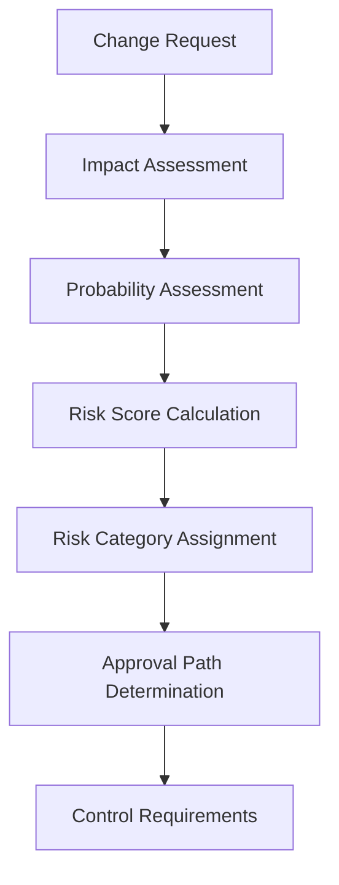
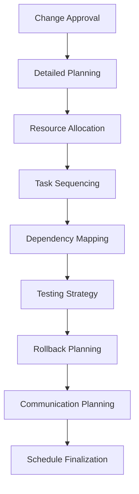
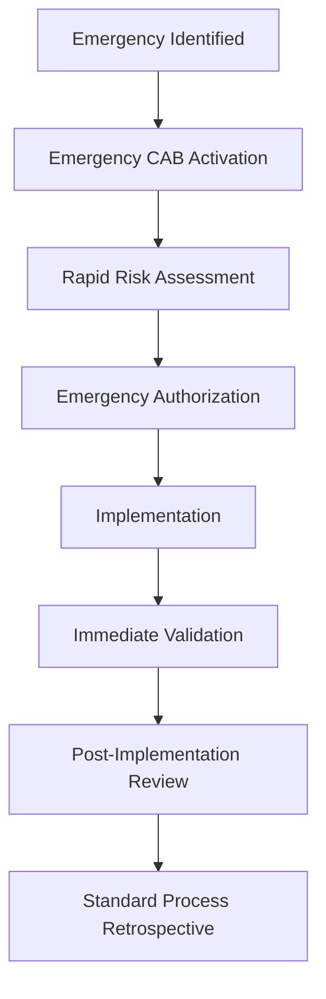

# Change Management Procedure - ISO 27001

## ArionComply Platform Metadata

```yaml
# Template Configuration
template_id: ISO27001-CHANGE-MGMT-PROC-001
template_type: change_management_procedure
template_version: 1.0
template_status: draft
created_date: {{CURRENT_DATE}}
last_modified: {{CURRENT_DATE}}
template_category: operational_procedure
compliance_framework: ISO27001:2022
template_owner: {{TEMPLATE_OWNER}}
approval_status: pending_review

# Platform Integration
platform_features:
  - change_request_automation
  - risk_assessment_integration
  - approval_workflow_automation
  - deployment_orchestration
  - rollback_automation
  - compliance_tracking

# Dependencies
depends_on:
  - vulnerability_management_procedure
  - system_acquisition_development_maintenance_policy
  - risk_management_policy
  - information_security_incident_management_procedure
  - business_continuity_policy
  - access_control_policy

# Usage Context
applicable_controls:
  - A.8.32   # Change management
  - A.12.1.2 # Change management
  - A.14.2.2 # System change control procedures
  - A.12.5.1 # Installation of software on operational systems
  - A.14.1.3 # Protection of systems during audit testing
```

---

## **Document Control Information**

| **Element** | **Details** | **Description** |
|-------------|-------------|-----------------|
| **Document ID** | {{TEMPLATE_ID}} | *Unique identifier for this change management procedure* |
| **Document Title** | Change Management Procedure | *Detailed procedures for managing system and process changes* |
| **ISO 27001 Reference** | A.8.32, A.12.1.2, A.14.2.2 | *Primary controls addressed by this procedure* |
| **Document Owner** | {{PROCEDURE_OWNER}} | *Person responsible for procedure maintenance* |
| **Approval Authority** | {{APPROVAL_AUTHORITY}} | *Authority responsible for procedure approval* |
| **Effective Date** | {{EFFECTIVE_DATE}} | *Date when procedure becomes effective* |
| **Review Frequency** | {{REVIEW_FREQUENCY}} | *How often procedure will be reviewed* |
| **Next Review Date** | {{NEXT_REVIEW_DATE}} | *Scheduled date for next procedure review* |
| **Classification Level** | {{DOCUMENT_CLASSIFICATION}} | *Classification level of this document* |

---

## **1. Procedure Foundation**

### **1.1 Understanding Change Management**

Think of change management like air traffic control at a major international airport. Just as air traffic controllers must carefully coordinate hundreds of flights, manage multiple runways, ensure safety protocols, and handle both scheduled and emergency landings - IT change management requires systematic coordination of system modifications, resource allocation, risk mitigation, and both planned and emergency changes.

**Real-World Analogy**: Consider how a hospital manages changes to critical patient care systems:
- **Planning**: Like scheduling non-urgent surgeries during optimal times with full preparation
- **Risk Assessment**: Like evaluating patient risk factors before any medical procedure
- **Approval Process**: Like requiring multiple physician approvals for high-risk procedures
- **Emergency Procedures**: Like having fast-track procedures for life-threatening emergencies
- **Monitoring**: Like continuous monitoring during and after medical procedures
- **Documentation**: Like maintaining detailed medical records for every intervention
- **Coordination**: Like coordinating between multiple medical teams and departments

Change management ensures that modifications to information systems are implemented safely, efficiently, and with minimal risk to business operations.

### **1.2 Procedure Purpose**

This procedure establishes detailed operational steps to:
- **Control Changes**: Systematically control all changes to information systems and processes
- **Assess Risk**: Evaluate and mitigate risks associated with proposed changes
- **Ensure Authorization**: Require appropriate authorization for all changes
- **Coordinate Implementation**: Coordinate change implementation across teams and systems
- **Minimize Disruption**: Minimize business disruption during change implementation
- **Enable Rollback**: Provide capability to quickly rollback failed changes
- **Maintain Compliance**: Ensure changes maintain security and regulatory compliance
- **Document Changes**: Maintain comprehensive records of all changes

### **1.3 Procedure Scope**

This procedure applies to:
- **All IT Systems**: Servers, networks, applications, databases, and infrastructure
- **All Environments**: Production, development, testing, and staging environments
- **All Change Types**: Software, hardware, configuration, and process changes
- **All Personnel**: IT staff, developers, vendors, and business users
- **All Change Categories**: Normal, standard, emergency, and major changes

---

## **2. Change Classification Framework**

### **2.1 Change Categories**

#### **2.1.1 Change Type Classification**
**Comprehensive Change Taxonomy**:

| **Change Category** | **Definition** | **Approval Required** | **Lead Time** |
|-------------------|----------------|----------------------|---------------|
| **Normal Change** | Standard changes requiring full process | Change Advisory Board | 5-14 days |
| **Standard Change** | Pre-approved, low-risk changes | Automated/Manager | 1-3 days |
| **Emergency Change** | Urgent changes to restore service | Emergency CAB | Immediate |
| **Major Change** | High-impact organizational changes | Executive Board | 30+ days |

#### **2.1.2 Technical Change Types**
**Technical Change Classification**:
- **Infrastructure Changes**: Server, network, and hardware modifications
- **Application Changes**: Software application updates and modifications
- **Configuration Changes**: System and application configuration modifications
- **Security Changes**: Security control and policy implementations
- **Data Changes**: Database schema and data modifications
- **Process Changes**: IT process and procedure modifications

### **2.2 Risk Assessment Framework**

#### **2.2.1 Risk Factors**
**Multi-Dimensional Risk Assessment**:

| **Risk Factor** | **High Risk** | **Medium Risk** | **Low Risk** |
|-----------------|---------------|-----------------|--------------|
| **System Criticality** | Mission-critical | Business-important | Supporting |
| **Business Impact** | Customer-facing | Internal operations | Development |
| **Change Complexity** | Multi-system | Single system | Component |
| **Implementation Window** | Business hours | Off-hours | Maintenance window |
| **Rollback Complexity** | Difficult/impossible | Moderate effort | Easy rollback |

#### **2.2.2 Risk Scoring Matrix**
**Quantitative Risk Assessment**:


### **2.3 ArionComply Risk Integration**

#### **2.3.1 Automated Risk Scoring**
**Intelligent Risk Assessment**:
```yaml
change_risk_assessment:
  impact_factors:
    - system_criticality_score
    - business_impact_assessment
    - user_population_affected
    - service_availability_impact
    - data_sensitivity_impact
  
  probability_factors:
    - change_complexity_score
    - team_experience_level
    - technology_maturity
    - testing_coverage
    - rollback_feasibility
  
  contextual_factors:
    - timing_considerations
    - resource_availability
    - concurrent_changes
    - business_calendar_events
  
  risk_calculation:
    - weighted_risk_score
    - confidence_interval
    - recommendation_engine
    - approval_path_suggestion
```

#### **2.3.2 Dynamic Risk Adjustment**
**Real-Time Risk Recalculation**:
- **Environmental Factors**: Current system load and performance
- **Historical Data**: Success rates for similar changes
- **Resource Availability**: Available skilled resources
- **Business Context**: Current business priorities and events
- **Concurrent Activities**: Other ongoing changes and activities
- **Seasonal Factors**: Seasonal business and technical patterns

---

## **3. Change Request Process**

### **3.1 Change Request Initiation**

#### **3.1.1 Request Submission**
**Standardized Request Process**:
- **Request Form**: Standardized change request form
- **Business Justification**: Clear business justification and benefits
- **Technical Details**: Detailed technical implementation plan
- **Impact Assessment**: Preliminary impact assessment
- **Resource Requirements**: Required resources and timeline
- **Risk Assessment**: Initial risk identification and mitigation
- **Success Criteria**: Clear success criteria and validation methods
- **Rollback Plan**: Comprehensive rollback and recovery plan

#### **3.1.2 Request Information Requirements**
**Comprehensive Request Documentation**:

| **Information Category** | **Required Details** | **Validation Criteria** |
|-------------------------|---------------------|-------------------------|
| **Business Information** | Justification, benefits, timing | Business case validation |
| **Technical Information** | Implementation details, dependencies | Technical feasibility |
| **Impact Information** | Systems, users, processes affected | Impact analysis completeness |
| **Risk Information** | Risks, mitigation strategies | Risk assessment quality |
| **Resource Information** | People, time, budget required | Resource availability |
| **Testing Information** | Test plan, success criteria | Testing adequacy |

### **3.2 Change Review and Assessment**

#### **3.2.1 Initial Review Process**
**Multi-Stage Review Framework**:
1. **Completeness Check**: Verify request completeness and quality
2. **Technical Review**: Technical feasibility and design review
3. **Risk Assessment**: Comprehensive risk assessment and scoring
4. **Impact Analysis**: Business and technical impact analysis
5. **Resource Validation**: Resource availability and allocation
6. **Scheduling Assessment**: Implementation timing and coordination
7. **Approval Routing**: Route to appropriate approval authority

#### **3.2.2 Technical Review Criteria**
**Technical Assessment Framework**:
- **Feasibility Analysis**: Technical feasibility and approach validation
- **Architecture Compliance**: Adherence to architectural standards
- **Security Assessment**: Security impact and control assessment
- **Performance Impact**: Performance and capacity impact analysis
- **Integration Testing**: Integration testing requirements and approach
- **Dependency Analysis**: System and process dependency analysis
- **Rollback Viability**: Rollback plan feasibility and testing

### **3.3 Change Advisory Board (CAB)

#### **3.3.1 CAB Structure and Roles**
**Change Advisory Board Composition**:

| **Role** | **Responsibilities** | **Voting Authority** |
|----------|---------------------|---------------------|
| **Change Manager** | Process oversight, coordination | Yes |
| **Technical Architect** | Technical review, standards compliance | Yes |
| **Security Representative** | Security impact assessment | Yes |
| **Business Representative** | Business impact and timing | Yes |
| **Operations Manager** | Operational impact and capacity | Yes |
| **Quality Assurance** | Testing and validation oversight | Advisory |

#### **3.3.2 CAB Decision Process**
**Structured Decision Framework**:
- **Change Presentation**: Detailed change presentation by requestor
- **Technical Discussion**: Technical review and discussion
- **Risk Evaluation**: Risk assessment and mitigation review
- **Business Alignment**: Business value and timing alignment
- **Resource Confirmation**: Resource availability confirmation
- **Decision Making**: Formal voting and decision process
- **Conditional Approval**: Conditions and requirements for approval
- **Documentation**: Complete decision documentation

---

## **4. Change Planning and Scheduling**

### **4.1 Implementation Planning**

#### **4.1.1 Planning Framework**
**Comprehensive Implementation Planning**:


#### **4.1.2 Planning Components**
**Detailed Planning Elements**:
- **Work Breakdown Structure**: Detailed task breakdown and dependencies
- **Resource Allocation**: People, tools, and environment assignments
- **Timeline Development**: Realistic timeline with buffer time
- **Risk Mitigation**: Specific risk mitigation actions and controls
- **Testing Plan**: Comprehensive testing strategy and procedures
- **Rollback Plan**: Detailed rollback procedures and triggers
- **Communication Plan**: Stakeholder communication and updates
- **Validation Plan**: Success criteria and validation procedures

### **4.2 Change Scheduling**

#### **4.2.1 Scheduling Framework**
**Strategic Scheduling Approach**:

| **Schedule Type** | **Characteristics** | **Use Cases** | **Approval Level** |
|-------------------|-------------------|---------------|-------------------|
| **Maintenance Window** | Planned, off-hours | Standard changes | Change manager |
| **Business Hours** | During operations | Low-impact changes | CAB approval |
| **Emergency** | Immediate implementation | Critical fixes | Emergency CAB |
| **Blackout Period** | No changes allowed | Critical business periods | Executive |

#### **4.2.2 Calendar Management**
**Change Calendar Coordination**:
- **Business Calendar**: Integration with business calendar and events
- **Maintenance Windows**: Scheduled maintenance windows and availability
- **Blackout Periods**: Periods when changes are prohibited
- **Resource Calendar**: Staff availability and vacation schedules
- **System Calendar**: System maintenance and upgrade schedules
- **Compliance Calendar**: Regulatory and audit calendar considerations
- **Release Calendar**: Software release and deployment schedules

### **4.3 ArionComply Planning Integration**

#### **4.3.1 Automated Planning**
**Intelligent Planning Automation**:
```yaml
automated_planning:
  resource_optimization:
    - skill_matching
    - availability_checking
    - workload_balancing
    - conflict_resolution
  
  scheduling_optimization:
    - window_identification
    - dependency_analysis
    - risk_minimization
    - resource_efficiency
  
  timeline_management:
    - critical_path_analysis
    - buffer_optimization
    - milestone_tracking
    - progress_monitoring
```

#### **4.3.2 Planning Analytics**
**Data-Driven Planning Insights**:
- **Historical Analysis**: Analysis of similar past changes
- **Success Probability**: Predictive success probability modeling
- **Resource Efficiency**: Resource utilization optimization
- **Timeline Accuracy**: Timeline estimation accuracy improvement
- **Risk Prediction**: Predictive risk modeling and mitigation
- **Optimization Recommendations**: AI-powered planning recommendations

---

## **5. Change Implementation**

### **5.1 Implementation Process**

#### **5.1.1 Implementation Phases**
**Structured Implementation Approach**:
1. **Pre-Implementation**: Final preparation and readiness verification
2. **Implementation**: Actual change implementation execution
3. **Validation**: Change validation and testing
4. **Monitoring**: Post-implementation monitoring and observation
5. **Completion**: Change completion and handover
6. **Documentation**: Implementation documentation and lessons learned

#### **5.1.2 Implementation Controls**
**Quality and Risk Controls**:
- **Pre-Implementation Checklist**: Comprehensive readiness checklist
- **Implementation Monitoring**: Real-time implementation monitoring
- **Quality Gates**: Quality checkpoints throughout implementation
- **Risk Monitoring**: Continuous risk monitoring and assessment
- **Rollback Triggers**: Predefined rollback triggers and criteria
- **Communication Protocol**: Regular stakeholder communication
- **Escalation Procedures**: Clear escalation paths and procedures

### **5.2 Testing and Validation**

#### **5.2.1 Testing Framework**
**Comprehensive Testing Strategy**:

| **Test Type** | **Purpose** | **Timing** | **Responsibility** |
|---------------|-------------|------------|-------------------|
| **Unit Testing** | Component functionality | Pre-implementation | Development team |
| **Integration Testing** | System integration | Pre-implementation | QA team |
| **User Acceptance Testing** | Business functionality | Pre-implementation | Business users |
| **Performance Testing** | System performance | Pre-implementation | Performance team |
| **Security Testing** | Security controls | Pre-implementation | Security team |
| **Regression Testing** | Existing functionality | Post-implementation | QA team |

#### **5.2.2 Validation Procedures**
**Change Validation Process**:
- **Functional Validation**: Verify intended functionality works correctly
- **Performance Validation**: Confirm performance meets requirements
- **Security Validation**: Validate security controls and configurations
- **Integration Validation**: Verify system integrations function properly
- **Business Validation**: Confirm business objectives are met
- **Compliance Validation**: Ensure regulatory compliance is maintained
- **User Validation**: Confirm user experience meets expectations

### **5.3 Rollback and Recovery**

#### **5.3.1 Rollback Framework**
**Comprehensive Rollback Strategy**:
- **Rollback Triggers**: Clear criteria for initiating rollback
- **Rollback Procedures**: Detailed step-by-step rollback procedures
- **Rollback Testing**: Pre-tested rollback procedures and validation
- **Data Recovery**: Data backup and recovery procedures
- **Service Restoration**: Service restoration and validation procedures
- **Communication**: Stakeholder communication during rollback
- **Post-Rollback Analysis**: Analysis and lessons learned

#### **5.3.2 Recovery Procedures**
**System and Service Recovery**:
- **Immediate Recovery**: Immediate service restoration procedures
- **Data Restoration**: Data backup restoration and validation
- **Configuration Recovery**: System configuration restoration
- **Performance Restoration**: Performance monitoring and optimization
- **User Access Restoration**: User access and permission restoration
- **Monitoring Restoration**: Monitoring and alerting restoration
- **Documentation Update**: Documentation and configuration updates

---

## **6. Emergency Change Management**

### **6.1 Emergency Change Process**

#### **6.1.1 Emergency Change Criteria**
**Emergency Change Triggers**:
- **Security Incidents**: Critical security vulnerabilities or breaches
- **System Failures**: Critical system failures affecting business operations
- **Data Loss**: Risk of significant data loss or corruption
- **Service Outages**: Major service outages affecting customers
- **Regulatory Requirements**: Urgent regulatory compliance requirements
- **Business Continuity**: Threats to business continuity or operations

#### **6.1.2 Emergency CAB Process**
**Expedited Emergency Process**:


### **6.2 Emergency Authorization**

#### **6.2.1 Emergency Authority Matrix**
**Emergency Decision Authority**:

| **Impact Level** | **Primary Authority** | **Backup Authority** | **Notification Required** |
|------------------|----------------------|---------------------|---------------------------|
| **Critical** | CISO/CTO | IT Director | CEO, Board |
| **High** | IT Director | Security Manager | Executive team |
| **Medium** | Security Manager | Operations Manager | Management team |
| **Low** | Operations Manager | Team Lead | Team members |

#### **6.2.2 Emergency Documentation**
**Expedited Documentation Process**:
- **Emergency Justification**: Clear emergency justification and rationale
- **Risk Assessment**: Rapid but thorough risk assessment
- **Implementation Plan**: Abbreviated but complete implementation plan
- **Rollback Plan**: Emergency rollback procedures and triggers
- **Communication Plan**: Emergency communication procedures
- **Post-Implementation**: Commitment to post-implementation review
- **Standard Process**: Plan to complete standard change process

### **6.3 Post-Emergency Review**

#### **6.3.1 Emergency Change Review**
**Comprehensive Post-Emergency Analysis**:
- **Decision Analysis**: Review of emergency decision-making process
- **Implementation Review**: Analysis of implementation effectiveness
- **Risk Assessment**: Retrospective risk assessment and management
- **Process Effectiveness**: Evaluation of emergency process effectiveness
- **Lessons Learned**: Identification of lessons learned and improvements
- **Process Updates**: Updates to emergency change procedures
- **Training Needs**: Identification of training and preparation needs

#### **6.3.2 Compliance Reconciliation**
**Post-Emergency Compliance**:
- **Documentation Completion**: Complete standard change documentation
- **Approval Reconciliation**: Obtain retrospective standard approvals
- **Audit Trail**: Ensure complete audit trail and documentation
- **Compliance Verification**: Verify continued regulatory compliance
- **Risk Mitigation**: Implement additional risk mitigation measures
- **Process Improvement**: Implement process improvements

---

## **7. Change Communication**

### **7.1 Communication Framework**

#### **7.1.1 Stakeholder Communication Matrix**
**Targeted Communication Strategy**:

| **Stakeholder Group** | **Information Needs** | **Communication Method** | **Timing** |
|----------------------|----------------------|-------------------------|------------|
| **Executive Leadership** | Business impact, risks | Executive briefing | Major changes |
| **Business Users** | Service impact, timing | Email, portal | All user-facing |
| **IT Operations** | Technical details | Technical briefing | All technical |
| **Help Desk** | User impact, troubleshooting | Training session | User-facing |
| **External Customers** | Service availability | Public notice | Customer-impacting |

#### **7.1.2 Communication Templates**
**Standardized Communication**:
- **Change Notification**: Initial change notification template
- **Implementation Notice**: Pre-implementation notice template
- **Progress Update**: Implementation progress update template
- **Completion Notice**: Change completion notification template
- **Issue Alert**: Change-related issue alert template
- **Rollback Notice**: Rollback notification template
- **Post-Implementation**: Post-implementation summary template

### **7.2 Communication Timing**

#### **7.2.1 Communication Schedule**
**Phased Communication Approach**:
- **Change Approval**: Initial notification of approved changes
- **Pre-Implementation**: Advance notice before implementation
- **Implementation Start**: Notification of implementation start
- **Progress Updates**: Regular progress updates during implementation
- **Issue Notifications**: Immediate notification of issues or delays
- **Completion**: Notification of successful completion
- **Post-Implementation**: Summary and lessons learned

#### **7.2.2 Emergency Communication**
**Crisis Communication Protocol**:
- **Immediate Notification**: Immediate stakeholder notification
- **Regular Updates**: Frequent status updates during emergency
- **Issue Escalation**: Escalated communication for serious issues
- **Resolution Notice**: Notification of issue resolution
- **Post-Emergency**: Post-emergency communication and analysis

### **7.3 ArionComply Communication Integration**

#### **7.3.1 Automated Communication**
**Intelligent Communication Automation**:
```yaml
communication_automation:
  stakeholder_identification:
    - impact_based_targeting
    - role_based_targeting
    - preference_based_delivery
    - escalation_path_automation
  
  content_generation:
    - template_based_generation
    - personalized_content
    - risk_based_messaging
    - compliance_language
  
  delivery_orchestration:
    - multi_channel_delivery
    - timing_optimization
    - confirmation_tracking
    - feedback_collection
```

#### **7.3.2 Communication Analytics**
**Communication Effectiveness Measurement**:
- **Delivery Metrics**: Communication delivery and receipt confirmation
- **Engagement Metrics**: Stakeholder engagement and response rates
- **Effectiveness Metrics**: Communication clarity and understanding
- **Satisfaction Metrics**: Stakeholder satisfaction with communication
- **Issue Metrics**: Communication-related issues and confusion
- **Improvement Metrics**: Communication process improvement opportunities

---

## **8. Change Monitoring and Control**

### **8.1 Implementation Monitoring**

#### **8.1.1 Monitoring Framework**
**Comprehensive Monitoring Strategy**:
- **Technical Monitoring**: System performance, availability, and functionality
- **Business Monitoring**: Business process and service monitoring
- **Security Monitoring**: Security control and event monitoring
- **User Monitoring**: User experience and satisfaction monitoring
- **Compliance Monitoring**: Regulatory compliance monitoring
- **Risk Monitoring**: Risk materialization and mitigation monitoring

#### **8.1.2 Monitoring Metrics**
**Key Performance Indicators**:

| **Metric Category** | **Specific Metrics** | **Target** | **Alert Threshold** |
|--------------------|---------------------|------------|-------------------|
| **Performance** | Response time, throughput | Baseline ± 10% | Baseline ± 20% |
| **Availability** | System uptime, service availability | 99.9% | <99.5% |
| **Functionality** | Feature success rate | 100% | <95% |
| **Security** | Security event rate | Baseline | 2x baseline |
| **User Experience** | User satisfaction score | >4.0/5.0 | <3.5/5.0 |

### **8.2 Change Control**

#### **8.2.1 Control Framework**
**Multi-Layer Control Strategy**:
- **Preventive Controls**: Controls to prevent unauthorized changes
- **Detective Controls**: Controls to detect unauthorized or failed changes
- **Corrective Controls**: Controls to correct issues and restore service
- **Compensating Controls**: Alternative controls when primary controls fail
- **Administrative Controls**: Process and procedure controls
- **Technical Controls**: Automated and system-based controls

#### **8.2.2 Control Validation**
**Control Effectiveness Validation**:
- **Control Testing**: Regular testing of control effectiveness
- **Gap Analysis**: Identification of control gaps and weaknesses
- **Performance Monitoring**: Continuous control performance monitoring
- **Compliance Verification**: Regular compliance verification and audit
- **Improvement Planning**: Control improvement planning and implementation
- **Risk Assessment**: Regular control risk assessment and update

### **8.3 Post-Implementation Review**

#### **8.3.1 Review Process**
**Comprehensive Post-Implementation Analysis**:
1. **Success Evaluation**: Evaluation against success criteria
2. **Performance Analysis**: Analysis of system and business performance
3. **Issue Analysis**: Analysis of issues and resolution effectiveness
4. **Risk Assessment**: Post-implementation risk assessment
5. **Stakeholder Feedback**: Collection and analysis of stakeholder feedback
6. **Lessons Learned**: Identification of lessons learned
7. **Process Improvement**: Process improvement recommendations
8. **Documentation Update**: Update of procedures and documentation

#### **8.3.2 Success Metrics**
**Change Success Measurement**:
- **Objective Achievement**: Achievement of stated change objectives
- **Timeline Performance**: Implementation timeline performance
- **Budget Performance**: Implementation budget performance
- **Quality Performance**: Implementation quality performance
- **Risk Management**: Risk management effectiveness
- **Stakeholder Satisfaction**: Overall stakeholder satisfaction
- **Business Value**: Realization of expected business value

---

## **9. Metrics and Performance Management**

### **9.1 Change Management Metrics**

#### **9.1.1 Operational Metrics**
**Key Performance Indicators**:

| **Metric** | **Definition** | **Target** | **Frequency** |
|------------|----------------|------------|---------------|
| **Change Success Rate** | Percentage of successful changes | {{SUCCESS_RATE_TARGET}}% | Monthly |
| **Emergency Change Rate** | Percentage of emergency changes | {{EMERGENCY_RATE_TARGET}}% | Monthly |
| **Change Backlog** | Number of pending changes | {{BACKLOG_TARGET}} | Weekly |
| **Average Implementation Time** | Mean time for change implementation | {{IMPLEMENTATION_TIME_TARGET}} days | Monthly |
| **Rollback Rate** | Percentage of changes requiring rollback | {{ROLLBACK_RATE_TARGET}}% | Monthly |

#### **9.1.2 Quality Metrics**
**Change Quality Indicators**:
- **First-Time Success Rate**: Percentage of changes successful on first attempt
- **Change-Related Incidents**: Number of incidents caused by changes
- **Customer Satisfaction**: Customer satisfaction with change impact
- **Process Compliance**: Adherence to change management process
- **Documentation Quality**: Quality and completeness of change documentation
- **Risk Prediction Accuracy**: Accuracy of risk assessments

### **9.2 Performance Analysis**

#### **9.2.1 Trend Analysis**
**Performance Trend Monitoring**:
- **Success Rate Trends**: Trends in change success rates
- **Implementation Time Trends**: Trends in implementation timelines
- **Risk Assessment Accuracy**: Trends in risk prediction accuracy
- **Resource Utilization**: Trends in resource utilization efficiency
- **Cost Analysis**: Trends in change implementation costs
- **Customer Impact**: Trends in customer impact and satisfaction

#### **9.2.2 Benchmarking**
**Performance Benchmarking Framework**:
- **Industry Benchmarks**: Comparison with industry standards
- **Internal Benchmarks**: Comparison with historical performance
- **Best Practice Analysis**: Analysis of industry best practices
- **Maturity Assessment**: Change management maturity assessment
- **Gap Analysis**: Performance gap identification and analysis
- **Improvement Opportunities**: Identification of improvement opportunities

### **9.3 ArionComply Analytics Integration**

#### **9.3.1 Advanced Analytics**
**AI-Powered Change Analytics**:
```yaml
change_analytics:
  predictive_analytics:
    - success_probability_modeling
    - risk_prediction_algorithms
    - resource_requirement_forecasting
    - timeline_estimation_models
  
  performance_analytics:
    - real_time_dashboards
    - trend_analysis_engines
    - anomaly_detection
    - root_cause_analysis
  
  optimization_analytics:
    - process_optimization_recommendations
    - resource_allocation_optimization
    - scheduling_optimization
    - risk_mitigation_optimization
```

#### **9.3.2 Continuous Improvement**
**Data-Driven Improvement Framework**:
- **Performance Monitoring**: Continuous performance monitoring and analysis
- **Pattern Recognition**: AI-powered pattern recognition and insights
- **Recommendation Engine**: Automated improvement recommendations
- **A/B Testing**: Process improvement testing and validation
- **Feedback Integration**: Stakeholder feedback integration and analysis
- **Best Practice Evolution**: Continuous best practice identification and implementation

---

## **10. Compliance and Audit**

### **10.1 Regulatory Compliance**

#### **10.1.1 Compliance Framework**
**Multi-Regulatory Compliance**:
- **SOX Compliance**: Financial system change controls
- **HIPAA Compliance**: Healthcare system change controls
- **PCI DSS Compliance**: Payment system change controls
- **ISO 27001 Compliance**: Information security change controls
- **Industry Standards**: Industry-specific change requirements

#### **10.1.2 Compliance Controls**
**Compliance Control Framework**:
- **Authorization Controls**: Required authorizations for changes
- **Documentation Controls**: Complete change documentation
- **Segregation Controls**: Segregation of duties in change process
- **Testing Controls**: Mandatory testing and validation
- **Monitoring Controls**: Change monitoring and oversight
- **Audit Controls**: Audit trail and evidence collection

### **10.2 Audit Support**

#### **10.2.1 Audit Preparation**
**Audit Readiness Framework**:
- **Documentation Management**: Complete change documentation repository
- **Evidence Collection**: Comprehensive change evidence collection
- **Process Documentation**: Detailed process documentation and procedures
- **Control Evidence**: Evidence of control effectiveness
- **Compliance Reports**: Regular compliance reporting and metrics
- **Audit Trail**: Complete audit trail for all changes

#### **10.2.2 Audit Response**
**Audit Cooperation Framework**:
- **Auditor Coordination**: Coordination with internal and external auditors
- **Evidence Provision**: Timely provision of requested evidence
- **Process Demonstration**: Demonstration of change management processes
- **Control Testing**: Support for control testing and validation
- **Finding Response**: Prompt response to audit findings
- **Improvement Implementation**: Implementation of audit recommendations

### **10.3 Continuous Compliance**

#### **10.3.1 Ongoing Compliance Monitoring**
**Continuous Compliance Framework**:
- **Real-Time Monitoring**: Real-time compliance monitoring and alerting
- **Compliance Dashboards**: Compliance status dashboards and reporting
- **Gap Detection**: Automated compliance gap detection
- **Remediation Tracking**: Compliance remediation tracking and management
- **Reporting Automation**: Automated compliance reporting
- **Trend Analysis**: Compliance trend analysis and forecasting

#### **10.3.2 Compliance Improvement**
**Compliance Enhancement Process**:
- **Regular Assessment**: Regular compliance assessment and review
- **Gap Analysis**: Compliance gap analysis and remediation
- **Process Enhancement**: Compliance process enhancement
- **Training Updates**: Compliance training updates and delivery
- **Best Practice Integration**: Compliance best practice integration
- **Technology Enhancement**: Compliance technology enhancement

---

## **11. Implementation Checklist**

### **11.1 Pre-Implementation**
- [ ] **Process Design**: Design change management processes and workflows
- [ ] **Tool Selection**: Select and procure change management tools
- [ ] **Team Formation**: Form change management team and assign roles
- [ ] **Policy Development**: Develop change management policies and procedures
- [ ] **Training Planning**: Plan change management training programs

### **11.2 Implementation Phase**
- [ ] **Tool Deployment**: Deploy and configure change management tools
- [ ] **Process Implementation**: Implement change management processes
- [ ] **CAB Formation**: Establish Change Advisory Board
- [ ] **Integration**: Integrate with existing IT service management
- [ ] **Training Delivery**: Deliver change management training

### **11.3 Post-Implementation**
- [ ] **Process Validation**: Validate change management processes
- [ ] **Metrics Implementation**: Implement change management metrics
- [ ] **Continuous Monitoring**: Establish continuous process monitoring
- [ ] **Improvement Process**: Establish continuous improvement process
- [ ] **Compliance Verification**: Verify regulatory compliance

---

## **12. Related Documents**

### **12.1 Policy Dependencies**
- **System Acquisition, Development and Maintenance Policy**: Development change management
- **Risk Management Policy**: Change risk assessment and treatment
- **Business Continuity Policy**: Change impact on business continuity
- **Incident Response Policy**: Change-related incident response

### **12.2 Technical Procedures**
- **Deployment Procedures**: System deployment and release procedures
- **Testing Procedures**: System testing and validation procedures
- **Rollback Procedures**: System rollback and recovery procedures
- **Configuration Management**: System configuration management procedures

### **12.3 Governance Documents**
- **Change Advisory Board Charter**: CAB roles and responsibilities
- **Emergency Change Procedures**: Emergency change authorization
- **Change Calendar**: Change scheduling and calendar management
- **Approval Matrix**: Change approval authority matrix

---

## **13. Appendices**

### **13.1 Change Risk Matrix**
| **Risk Level** | **Approval Required** | **Testing Required** | **Implementation Window** | **Rollback Plan** |
|----------------|----------------------|---------------------|---------------------------|-------------------|
| **High** | Executive/CAB | Comprehensive | Maintenance window | Detailed |
| **Medium** | CAB | Standard | Off-hours preferred | Standard |
| **Low** | Manager | Basic | Any time | Basic |
| **Minimal** | Automated | Automated | Any time | Automated |

### **13.2 Emergency Change Matrix**
| **Emergency Type** | **Authorization Level** | **Documentation Required** | **Post-Implementation** |
|-------------------|------------------------|---------------------------|------------------------|
| **Security** | CISO | Security justification | Security review |
| **System Failure** | IT Director | Failure analysis | Root cause analysis |
| **Data Loss** | CTO | Risk assessment | Data recovery validation |
| **Service Outage** | Operations Manager | Impact assessment | Service restoration review |

### **13.3 Communication Matrix**
| **Change Type** | **Advance Notice** | **Implementation Notice** | **Completion Notice** |
|-----------------|-------------------|-------------------------|----------------------|
| **Major** | 30 days | 24 hours | Immediate |
| **Normal** | 14 days | 4 hours | 24 hours |
| **Standard** | 3 days | 1 hour | 4 hours |
| **Emergency** | None | Immediate | Immediate |

---

**Document Status**: {{DOCUMENT_STATUS}}  
**Version**: {{VERSION_NUMBER}}  
**Last Updated**: {{LAST_UPDATED}}  
**Next Review**: {{NEXT_REVIEW_DATE}}  
**Owner**: {{DOCUMENT_OWNER}}  
**Approved By**: {{APPROVED_BY}}  
**Approval Date**: {{APPROVAL_DATE}}