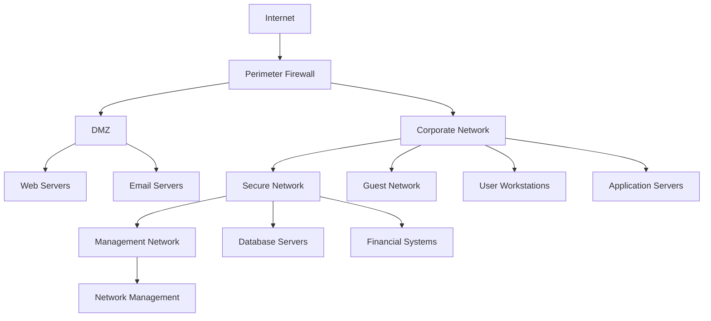

# Communications Security Policy - ISO 27001

## ArionComply Platform Metadata

```yaml
# Template Configuration
template_id: ISO27001-COMMS-SECURITY-001
template_type: communications_security_policy
template_version: 1.0
template_status: draft
created_date: {{CURRENT_DATE}}
last_modified: {{CURRENT_DATE}}
template_category: technical_policy
compliance_framework: ISO27001:2022
template_owner: {{TEMPLATE_OWNER}}
approval_status: pending_review

# Platform Integration
platform_features:
  - network_security_monitoring
  - communication_analytics
  - encryption_management
  - compliance_reporting
  - threat_detection
  - incident_correlation

# Dependencies
depends_on:
  - cryptographic_controls_policy
  - access_control_policy
  - data_classification_policy
  - incident_response_policy
  - physical_environmental_security_policy

# Usage Context
applicable_controls:
  - A.13.1  # Network security management
  - A.13.2  # Information transfer
  - A.8.9   # Configuration management
  - A.8.20  # Networks security
  - A.8.21  # Security of network services
  - A.8.22  # Segregation of networks
  - A.8.23  # Web filtering
```

---

## **Document Control Information**

| **Element** | **Details** | **Description** |
|-------------|-------------|-----------------|
| **Document ID** | {{TEMPLATE_ID}} | *Unique identifier for this communications security policy* |
| **Document Title** | Communications Security Policy | *Policy for secure communications and network security* |
| **ISO 27001 Reference** | A.13.1, A.13.2, A.8.9, A.8.20-A.8.23 | *Primary controls addressed by this policy* |
| **Document Owner** | {{POLICY_OWNER}} | *Person responsible for policy maintenance* |
| **Approval Authority** | {{APPROVAL_AUTHORITY}} | *Authority responsible for policy approval* |
| **Effective Date** | {{EFFECTIVE_DATE}} | *Date when policy becomes effective* |
| **Review Frequency** | {{REVIEW_FREQUENCY}} | *How often policy will be reviewed* |
| **Next Review Date** | {{NEXT_REVIEW_DATE}} | *Scheduled date for next policy review* |
| **Classification Level** | {{DOCUMENT_CLASSIFICATION}} | *Classification level of this document* |

---

## **1. Policy Foundation**

### **1.1 Understanding Communications Security**

Think of communications security like a sophisticated postal system combined with a secure telephone network. Just as a postal service needs secure mail sorting facilities, trusted delivery routes, and protected mailboxes, digital communications require secure networks, encrypted channels, and protected endpoints to ensure information reaches its intended destination safely.

**Real-World Analogy**: Consider a diplomatic communications system:
- **Network Security**: Like the secure communication infrastructure between embassies
- **Encryption**: Like diplomatic pouches that protect sensitive messages in transit
- **Access Control**: Like the security clearances required to send or receive diplomatic communications
- **Monitoring**: Like the security personnel who monitor communication channels for threats
- **Segregation**: Like separate communication channels for different levels of classified information

### **1.2 Policy Purpose**

This policy establishes a comprehensive framework to:
- **Secure Networks**: Protect network infrastructure and communications channels
- **Protect Data in Transit**: Ensure confidentiality and integrity of transmitted information
- **Control Access**: Manage access to communication systems and services
- **Monitor Communications**: Detect and respond to communication security threats
- **Ensure Compliance**: Meet regulatory and business requirements for secure communications

### **1.3 Policy Scope**

This policy applies to:
- **All Networks**: Internal, external, wireless, and partner networks
- **All Communications**: Data, voice, video, and messaging communications
- **All Devices**: Computers, mobile devices, IoT devices, and network equipment
- **All Personnel**: Employees, contractors, vendors, and business partners
- **All Locations**: On-premises, remote, cloud, and hybrid environments

---

## **2. Network Security Framework**

### **2.1 Network Architecture**

#### **2.1.1 Network Segmentation**
**Segmentation Strategy**:
Think of network segmentation like a castle with multiple defensive walls and courtyards. Each segment serves a specific purpose and has appropriate security controls.

**Network Segments**:

| **Segment** | **Purpose** | **Security Level** | **Access Controls** |
|-------------|-------------|-------------------|---------------------|
| **Internet DMZ** | External-facing services | High | Firewall, IDS/IPS |
| **Corporate Network** | Internal business systems | Medium | VLAN, access control |
| **Secure Network** | Confidential systems | High | Micro-segmentation |
| **Management Network** | Network management | Very High | Isolated, encrypted |
| **Guest Network** | Visitor access | Low | Isolated, filtered |

#### **2.1.2 Network Topology**
**Secure Network Design**:


#### **2.1.3 Zero Trust Architecture**
**Zero Trust Principles**:
- **Never Trust, Always Verify**: Verify every user and device
- **Least Privilege Access**: Grant minimum necessary access
- **Micro-Segmentation**: Segment networks into small, secure zones
- **Continuous Monitoring**: Monitor all network activity
- **Encryption Everywhere**: Encrypt all communications

### **2.2 Network Security Controls**

#### **2.2.1 Perimeter Security**
**Firewall Configuration**:
- **Next-Generation Firewalls**: Deploy NGFW with application awareness
- **Intrusion Detection**: Deploy IDS/IPS for threat detection
- **Web Application Firewall**: Protect web applications
- **DDoS Protection**: Implement DDoS mitigation
- **VPN Termination**: Secure VPN termination points

**Firewall Rules Matrix**:
| **Source** | **Destination** | **Service** | **Action** | **Logging** |
|------------|-----------------|-------------|------------|-------------|
| **Internet** | **DMZ** | HTTP/HTTPS | Allow | Yes |
| **Corporate** | **Internet** | HTTP/HTTPS | Allow | Yes |
| **Guest** | **Corporate** | Any | Deny | Yes |
| **Secure** | **Internet** | Any | Deny | Yes |

#### **2.2.2 Internal Network Security**
**Network Access Control**:
- **802.1X Authentication**: Network access authentication
- **MAC Address Filtering**: Device-based access control
- **VLAN Segmentation**: Logical network segmentation
- **Network Quarantine**: Quarantine for non-compliant devices
- **Wireless Security**: Secure wireless network configuration

#### **2.2.3 Wireless Network Security**
**Wireless Security Standards**:

| **Network Type** | **Security Standard** | **Authentication** | **Encryption** |
|------------------|----------------------|-------------------|----------------|
| **Corporate** | WPA3-Enterprise | 802.1X | AES-256 |
| **Guest** | WPA3-Personal | Pre-shared key | AES-128 |
| **IoT** | WPA3-SAE | Device certificates | AES-256 |
| **Legacy** | WPA2-Enterprise | 802.1X | AES-128 |

---

## **3. Information Transfer Security**

### **3.1 Data Classification and Transfer**

#### **3.1.1 Transfer Requirements by Classification**

**Public Information Transfer**:
- **Encryption**: Not required but recommended
- **Access Control**: Standard access controls
- **Monitoring**: Basic monitoring
- **Retention**: Standard retention policies
- **Approval**: No special approval required

**Internal Information Transfer**:
- **Encryption**: Required for external transfer
- **Access Control**: Role-based access controls
- **Monitoring**: Standard monitoring with logging
- **Retention**: Standard retention with archival
- **Approval**: Manager approval for external transfer

**Confidential Information Transfer**:
- **Encryption**: Required for all transfers
- **Access Control**: Need-to-know basis
- **Monitoring**: Enhanced monitoring with alerts
- **Retention**: Extended retention with secure archival
- **Approval**: Senior management approval required

**Restricted Information Transfer**:
- **Encryption**: Strongest encryption required
- **Access Control**: Multi-factor authentication
- **Monitoring**: Comprehensive monitoring with real-time alerts
- **Retention**: Permanent retention with enhanced security
- **Approval**: Executive approval with justification

### **3.2 Secure Communication Channels**

#### **3.2.1 Email Security**
**Email Protection Framework**:
- **Encryption**: S/MIME or PGP for confidential emails
- **Digital Signatures**: Email authentication and integrity
- **Anti-Malware**: Real-time malware scanning
- **Anti-Spam**: Spam filtering and quarantine
- **Data Loss Prevention**: DLP for sensitive information

**Email Security Controls**:
| **Control** | **Implementation** | **Monitoring** | **Compliance** |
|-------------|-------------------|----------------|----------------|
| **Encryption** | S/MIME, TLS | Certificate monitoring | Automatic |
| **Authentication** | SPF, DKIM, DMARC | Authentication reports | Daily |
| **Filtering** | Anti-spam, anti-malware | Quarantine logs | Real-time |
| **DLP** | Content inspection | Alert generation | Continuous |

#### **3.2.2 File Transfer Security**
**Secure File Transfer Methods**:
- **SFTP/FTPS**: Secure file transfer protocols
- **Managed File Transfer**: Enterprise MFT solutions
- **Secure Email**: Encrypted email attachments
- **Secure Portals**: Web-based secure portals
- **API Integration**: Secure API-based transfers

**File Transfer Security Matrix**:
| **Transfer Type** | **Protocol** | **Authentication** | **Encryption** | **Monitoring** |
|-------------------|--------------|-------------------|----------------|----------------|
| **Internal** | SFTP | SSH keys | AES-256 | Standard |
| **External** | MFT | Multi-factor | AES-256 | Enhanced |
| **Partner** | AS2/AS4 | Certificates | AES-256 | Comprehensive |
| **Cloud** | HTTPS | OAuth 2.0 | TLS 1.3 | Continuous |

#### **3.2.3 Voice and Video Communications**
**Unified Communications Security**:
- **VoIP Security**: Secure voice over IP communications
- **Video Conferencing**: Secure video conferencing platforms
- **Instant Messaging**: Encrypted messaging platforms
- **Collaboration Tools**: Secure collaboration platforms
- **Mobile Communications**: Secure mobile communication apps

---

## **4. ArionComply Communications Integration**

### **4.1 Network Security Monitoring**

#### **4.1.1 Real-Time Monitoring**
**Monitoring Platform Integration**:
```yaml
network_monitoring:
  traffic_analysis:
    - deep_packet_inspection
    - flow_analysis
    - protocol_analysis
    - anomaly_detection
  
  security_monitoring:
    - intrusion_detection
    - malware_detection
    - data_exfiltration_detection
    - threat_hunting
  
  compliance_monitoring:
    - policy_enforcement
    - configuration_compliance
    - encryption_verification
    - access_control_validation
```

#### **4.1.2 Advanced Analytics**
**Communication Analytics**:
- **Behavior Analysis**: Unusual communication pattern detection
- **Threat Intelligence**: Integration with threat intelligence feeds
- **Machine Learning**: ML-based threat detection
- **Predictive Analytics**: Predictive threat analysis
- **Automated Response**: Automated threat response capabilities

### **4.2 Encryption Management**

#### **4.2.1 Centralized Encryption Management**
**Encryption Orchestration**:
```yaml
encryption_management:
  key_management:
    - centralized_key_storage
    - automated_key_rotation
    - key_lifecycle_management
    - hardware_security_modules
  
  policy_enforcement:
    - encryption_policy_enforcement
    - compliance_verification
    - performance_monitoring
    - audit_logging
  
  integration:
    - communication_platforms
    - file_transfer_systems
    - email_systems
    - collaboration_tools
```

#### **4.2.2 Encryption Performance Monitoring**
**Performance Optimization**:
- **Throughput Monitoring**: Encryption performance monitoring
- **Latency Analysis**: Communication latency analysis
- **Resource Utilization**: Encryption resource utilization
- **Capacity Planning**: Encryption capacity planning
- **Optimization**: Automated performance optimization

---

## **5. Network Services Security**

### **5.1 DNS Security**

#### **5.1.1 DNS Protection**
**DNS Security Framework**:
- **DNS Filtering**: Block malicious domains and URLs
- **DNS over HTTPS**: Encrypted DNS queries
- **DNS Monitoring**: Monitor DNS queries and responses
- **DNS Reputation**: Use DNS reputation services
- **DNS Redundancy**: Redundant DNS infrastructure

#### **5.1.2 DNS Configuration**
**Secure DNS Configuration**:
| **Setting** | **Configuration** | **Security Benefit** |
|-------------|-------------------|---------------------|
| **Recursion** | Disabled on public servers | Prevents DNS amplification |
| **Zone Transfer** | Restricted to authorized servers | Prevents information disclosure |
| **DNSSEC** | Enabled | Prevents DNS spoofing |
| **Logging** | Comprehensive logging | Enables threat detection |

### **5.2 Web Security**

#### **5.2.1 Web Filtering**
**Content Filtering Framework**:
- **URL Filtering**: Block malicious and inappropriate URLs
- **Category Filtering**: Block content categories
- **SSL Inspection**: Inspect encrypted web traffic
- **Application Control**: Control web application access
- **Bandwidth Management**: Manage web traffic bandwidth

#### **5.2.2 Web Application Security**
**Web Application Protection**:
- **Web Application Firewall**: Protect web applications
- **SSL/TLS Termination**: Secure SSL/TLS termination
- **Certificate Management**: Automated certificate management
- **API Security**: Secure API gateways
- **DDoS Protection**: Web application DDoS protection

### **5.3 Remote Access Security**

#### **5.3.1 VPN Security**
**VPN Implementation**:
- **IPsec VPN**: Site-to-site VPN connectivity
- **SSL VPN**: Remote user VPN access
- **Split Tunneling**: Controlled split tunneling
- **Multi-Factor Authentication**: VPN MFA requirements
- **Session Management**: VPN session monitoring

#### **5.3.2 Zero Trust Network Access**
**ZTNA Implementation**:
- **Identity Verification**: Continuous identity verification
- **Device Trust**: Device trust assessment
- **Application Access**: Application-specific access
- **Micro-Tunnels**: Encrypted micro-tunnels
- **Session Recording**: Session recording and monitoring

---

## **6. Mobile and Wireless Security**

### **6.1 Mobile Device Communications**

#### **6.1.1 Mobile Device Management**
**MDM Security Framework**:
- **Device Enrollment**: Secure device enrollment
- **Application Management**: Mobile application management
- **Data Protection**: Mobile data protection
- **Communication Security**: Secure mobile communications
- **Compliance Monitoring**: Mobile compliance monitoring

#### **6.1.2 Mobile Communication Security**
**Mobile Security Controls**:
| **Control** | **Implementation** | **Monitoring** | **Compliance** |
|-------------|-------------------|----------------|----------------|
| **Encryption** | Device and app encryption | Encryption status | Continuous |
| **VPN** | Always-on VPN | Connection monitoring | Real-time |
| **Certificates** | Device certificates | Certificate status | Automated |
| **App Control** | Approved app list | App usage monitoring | Daily |

### **6.2 Wireless Network Security**

#### **6.2.1 Enterprise Wireless**
**Wireless Security Framework**:
- **Access Point Security**: Secure AP configuration
- **Wireless Intrusion Detection**: WIDS/WIPS deployment
- **Guest Network Isolation**: Isolated guest networks
- **Wireless Monitoring**: Continuous wireless monitoring
- **Rogue AP Detection**: Unauthorized AP detection

#### **6.2.2 IoT Device Communications**
**IoT Security Framework**:
- **Device Authentication**: Certificate-based authentication
- **Network Segmentation**: Isolated IoT networks
- **Communication Encryption**: Encrypted IoT communications
- **Device Monitoring**: IoT device monitoring
- **Firmware Management**: Secure firmware updates

---

## **7. Cloud Communications Security**

### **7.1 Cloud Network Security**

#### **7.1.1 Cloud Network Architecture**
**Secure Cloud Connectivity**:
- **Direct Connect**: Dedicated cloud connections
- **VPN Gateways**: Cloud VPN gateways
- **Transit Gateways**: Cloud transit gateways
- **Network Peering**: Secure network peering
- **Hybrid Connectivity**: Secure hybrid cloud connectivity

#### **7.1.2 Cloud Security Controls**
**Cloud Communication Security**:
| **Control** | **AWS** | **Azure** | **GCP** |
|-------------|---------|-----------|---------|
| **Encryption** | TLS 1.3 | TLS 1.3 | TLS 1.3 |
| **Access Control** | IAM | Azure AD | Cloud IAM |
| **Monitoring** | CloudTrail | Monitor | Cloud Logging |
| **Firewall** | Security Groups | NSG | Firewall Rules |

### **7.2 SaaS Communications Security**

#### **7.2.1 SaaS Security Framework**
**SaaS Communication Security**:
- **API Security**: Secure API communications
- **Data Encryption**: Data encryption in transit
- **Authentication**: Strong authentication mechanisms
- **Session Management**: Secure session management
- **Compliance**: Regulatory compliance verification

#### **7.2.2 Cloud Access Security Broker**
**CASB Implementation**:
- **Shadow IT Discovery**: Discover unauthorized cloud services
- **Data Protection**: Cloud data protection
- **Access Control**: Cloud access control
- **Threat Protection**: Cloud threat protection
- **Compliance**: Cloud compliance monitoring

---

## **8. Incident Response and Monitoring**

### **8.1 Communication Security Incidents**

#### **8.1.1 Incident Types**
**Communication Security Incidents**:
- **Network Intrusion**: Unauthorized network access
- **Data Exfiltration**: Unauthorized data transmission
- **Malware Communication**: Malware command and control
- **DDoS Attacks**: Distributed denial of service attacks
- **Man-in-the-Middle**: Interception of communications

#### **8.1.2 Incident Response Process**
**Communication Incident Response**:
1. **Detection**: Automated threat detection and alerting
2. **Analysis**: Rapid incident analysis and classification
3. **Containment**: Immediate containment of threats
4. **Investigation**: Detailed forensic investigation
5. **Recovery**: System recovery and restoration
6. **Lessons Learned**: Post-incident improvement

### **8.2 Security Monitoring**

#### **8.2.1 Network Security Monitoring**
**Continuous Monitoring**:
- **Traffic Analysis**: Continuous network traffic analysis
- **Anomaly Detection**: Behavioral anomaly detection
- **Threat Hunting**: Proactive threat hunting
- **Compliance Monitoring**: Continuous compliance monitoring
- **Performance Monitoring**: Network performance monitoring

#### **8.2.2 Security Information and Event Management**
**SIEM Integration**:
```yaml
siem_integration:
  log_sources:
    - firewall_logs
    - ids_ips_logs
    - vpn_logs
    - email_logs
    - web_proxy_logs
  
  correlation_rules:
    - threat_detection
    - policy_violations
    - anomaly_detection
    - compliance_monitoring
  
  response_automation:
    - automated_blocking
    - incident_creation
    - notification_systems
    - escalation_procedures
```

---

## **9. Compliance and Regulatory Requirements**

### **9.1 Regulatory Compliance**

#### **9.1.1 Data Protection Regulations**
**GDPR Compliance**:
- **Data Minimization**: Minimize data in communications
- **Encryption**: Encrypt personal data in transit
- **Access Control**: Control access to personal data
- **Audit Logging**: Comprehensive audit logging
- **Breach Notification**: Rapid breach notification

#### **9.1.2 Industry Standards**
**Communication Security Standards**:
| **Standard** | **Requirements** | **Implementation** |
|--------------|------------------|-------------------|
| **ISO 27001** | Communication security controls | Policy framework |
| **NIST** | Network security framework | Technical controls |
| **SOC 2** | Communication monitoring | Audit controls |
| **PCI DSS** | Payment data protection | Encryption requirements |

### **9.2 Audit and Assessment**

#### **9.2.1 Security Assessments**
**Assessment Types**:
- **Network Penetration Testing**: External and internal penetration testing
- **Vulnerability Assessment**: Network vulnerability scanning
- **Security Architecture Review**: Network security architecture assessment
- **Compliance Audit**: Regulatory compliance assessment
- **Risk Assessment**: Communication security risk assessment

#### **9.2.2 Compliance Metrics**
**Key Performance Indicators**:
- **Network Availability**: {{NETWORK_AVAILABILITY_TARGET}}%
- **Encryption Coverage**: {{ENCRYPTION_COVERAGE_TARGET}}%
- **Incident Response Time**: {{INCIDENT_RESPONSE_TARGET}} minutes
- **Compliance Score**: {{COMPLIANCE_SCORE_TARGET}}%
- **Threat Detection Rate**: {{THREAT_DETECTION_TARGET}}%

---

## **10. Training and Awareness**

### **10.1 Security Training Program**

#### **10.1.1 Role-Based Training**
**Training by Role**:
- **Network Administrators**: Advanced network security training
- **Security Analysts**: Threat detection and response training
- **IT Support**: Basic network security awareness
- **End Users**: Communication security awareness
- **Management**: Communication security governance

#### **10.1.2 Training Topics**
**Core Training Areas**:
- **Network Security Fundamentals**: Basic network security concepts
- **Secure Communications**: Secure communication practices
- **Incident Response**: Communication incident response
- **Compliance**: Regulatory compliance requirements
- **Threat Awareness**: Current threat landscape

### **10.2 Security Awareness**

#### **10.2.1 Awareness Programs**
**Awareness Activities**:
- **Security Bulletins**: Regular security updates
- **Phishing Simulations**: Email security training
- **Security Workshops**: Interactive security workshops
- **Incident Sharing**: Lessons learned sharing
- **Best Practices**: Communication security best practices

#### **10.2.2 Competency Assessment**
**Assessment Methods**:
- **Knowledge Testing**: Regular security knowledge testing
- **Practical Exercises**: Hands-on security exercises
- **Incident Simulation**: Security incident simulation
- **Compliance Verification**: Regular compliance verification
- **Continuous Learning**: Ongoing security education

---

## **11. Vendor and Third-Party Management**

### **11.1 Communication Service Providers**

#### **11.1.1 Service Provider Requirements**
**Security Requirements**:
- **Encryption Standards**: Minimum encryption requirements
- **Access Controls**: Service provider access controls
- **Monitoring**: Service provider monitoring capabilities
- **Incident Response**: Service provider incident response
- **Compliance**: Regulatory compliance verification

#### **11.1.2 Service Level Agreements**
**Communication SLA Requirements**:
| **Service** | **Availability** | **Response Time** | **Security** |
|-------------|------------------|-------------------|--------------|
| **Internet** | 99.9% | 4 hours | Encrypted |
| **VPN** | 99.5% | 2 hours | Multi-factor |
| **Email** | 99.9% | 1 hour | S/MIME |
| **Voice** | 99.5% | 2 hours | Encrypted |

### **11.2 Technology Vendors**

#### **11.2.1 Vendor Security Requirements**
**Vendor Management**:
- **Security Assessment**: Vendor security assessments
- **Contract Requirements**: Security contract requirements
- **Monitoring**: Vendor security monitoring
- **Incident Response**: Vendor incident response requirements
- **Compliance**: Vendor compliance verification

#### **11.2.2 Vendor Performance Monitoring**
**Performance Metrics**:
- **Security Compliance**: Vendor security compliance
- **Incident Response**: Vendor incident response performance
- **Service Quality**: Communication service quality
- **Cost Effectiveness**: Vendor cost effectiveness
- **Innovation**: Vendor technology innovation

---

## **12. Business Continuity and Disaster Recovery**

### **12.1 Communication Continuity**

#### **12.1.1 Redundancy and Failover**
**Communication Redundancy**:
- **Network Redundancy**: Multiple network paths and providers
- **Equipment Redundancy**: Redundant network equipment
- **Data Center Redundancy**: Multiple data center locations
- **Service Provider Redundancy**: Multiple service providers
- **Power Redundancy**: Backup power for communications

#### **12.1.2 Disaster Recovery**
**Communication DR Framework**:
- **Recovery Planning**: Communication recovery plans
- **Alternative Sites**: Alternative communication sites
- **Mobile Communications**: Mobile communication capabilities
- **Satellite Communications**: Satellite backup communications
- **Testing**: Regular DR testing and validation

### **12.2 Emergency Communications**

#### **12.2.1 Emergency Communication Plans**
**Emergency Communications**:
- **Crisis Communication**: Crisis communication procedures
- **Emergency Contacts**: Emergency contact lists
- **Communication Channels**: Emergency communication channels
- **Backup Systems**: Backup communication systems
- **Recovery Procedures**: Communication recovery procedures

#### **12.2.2 Business Continuity**
**Continuity Planning**:
- **Critical Communications**: Critical communication identification
- **Recovery Priorities**: Communication recovery priorities
- **Resource Allocation**: Emergency resource allocation
- **Performance Monitoring**: Continuity performance monitoring
- **Stakeholder Communication**: Stakeholder communication during emergencies

---

## **13. Emerging Technologies and Future Planning**

### **13.1 Emerging Communication Technologies**

#### **13.1.1 5G and Edge Computing**
**5G Security Framework**:
- **Network Slicing**: Secure network slicing
- **Edge Security**: Edge computing security
- **IoT Communications**: 5G IoT security
- **Mobile Security**: 5G mobile security
- **Infrastructure Security**: 5G infrastructure security

#### **13.1.2 Quantum Communications**
**Quantum Communication Security**:
- **Quantum Key Distribution**: Quantum key distribution
- **Post-Quantum Cryptography**: Post-quantum algorithms
- **Quantum-Safe Communications**: Quantum-safe protocols
- **Quantum Threat Assessment**: Quantum threat assessment
- **Migration Planning**: Quantum-safe migration planning

### **13.2 Future Planning**

#### **13.2.1 Technology Roadmap**
**Communication Technology Roadmap**:
- **Network Evolution**: Network technology evolution
- **Security Enhancement**: Security technology enhancement
- **Compliance Evolution**: Regulatory compliance evolution
- **Threat Evolution**: Threat landscape evolution
- **Business Evolution**: Business requirement evolution

#### **13.2.2 Innovation Integration**
**Innovation Adoption**:
- **Emerging Technologies**: Evaluation of emerging technologies
- **Pilot Programs**: Technology pilot programs
- **Risk Assessment**: Technology risk assessment
- **Implementation Planning**: Technology implementation planning
- **Performance Monitoring**: Technology performance monitoring

---

## **14. Implementation Checklist**

### **14.1 Pre-Implementation**
- [ ] **Network Assessment**: Conduct comprehensive network assessment
- [ ] **Security Gap Analysis**: Perform security gap analysis
- [ ] **Requirements Definition**: Define security requirements
- [ ] **Architecture Design**: Design secure network architecture
- [ ] **Vendor Selection**: Select security vendors and solutions

### **14.2 Implementation Phase**
- [ ] **Network Deployment**: Deploy secure network infrastructure
- [ ] **Security Controls**: Implement security controls
- [ ] **Monitoring Setup**: Deploy monitoring systems
- [ ] **Integration**: Integrate with ArionComply platform
- [ ] **Testing**: Comprehensive security testing

### **14.3 Post-Implementation**
- [ ] **Monitoring Activation**: Activate security monitoring
- [ ] **Compliance Verification**: Verify regulatory compliance
- [ ] **Performance Testing**: Test communication performance
- [ ] **Training Delivery**: Deliver security training
- [ ] **Continuous Improvement**: Establish improvement processes

---

## **15. Related Documents**

### **15.1 Policy Dependencies**
- **Cryptographic Controls Policy**: Encryption and key management
- **Access Control Policy**: Network access controls
- **Data Classification Policy**: Data protection requirements
- **Incident Response Policy**: Communication incident response

### **15.2 Technical Standards**
- **Network Security Standards**: Network security implementation standards
- **Encryption Standards**: Communication encryption standards
- **Monitoring Standards**: Network monitoring standards
- **Wireless Security Standards**: Wireless network security standards

### **15.3 Operational Procedures**
- **Network Management Procedures**: Network management procedures
- **Incident Response Procedures**: Communication incident response
- **Change Management Procedures**: Network change management
- **Monitoring Procedures**: Network monitoring procedures

---

## **16. Appendices**

### **16.1 Network Security Matrix**
| **Network Segment** | **Encryption** | **Access Control** | **Monitoring** | **Compliance** |
|---------------------|----------------|-------------------|----------------|----------------|
| **DMZ** | TLS 1.3 | Firewall rules | 24/7 monitoring | SOC 2 |
| **Corporate** | IPsec | 802.1X | Standard monitoring | ISO 27001 |
| **Secure** | AES-256 | Multi-factor | Enhanced monitoring | PCI DSS |
| **Management** | End-to-end | Certificate-based | Comprehensive | All standards |

### **16.2 Communication Protocol Security**
| **Protocol** | **Encryption** | **Authentication** | **Integrity** | **Use Case** |
|--------------|----------------|-------------------|---------------|--------------|
| **HTTPS** | TLS 1.3 | Certificates | SHA-256 | Web communications |
| **SSH** | AES-256 | Public key | HMAC | Secure shell |
| **SFTP** | SSH | Key-based | SSH integrity | File transfer |
| **S/MIME** | AES-256 | Certificates | Digital signature | Email |

### **16.3 Incident Response Matrix**
| **Incident Type** | **Detection Time** | **Response Time** | **Recovery Time** | **Escalation** |
|-------------------|-------------------|-------------------|-------------------|----------------|
| **Network Intrusion** | 15 minutes | 30 minutes | 2 hours | CISO |
| **Data Exfiltration** | 5 minutes | 15 minutes | 1 hour | CEO |
| **DDoS Attack** | 1 minute | 5 minutes | 30 minutes | IT Director |
| **Malware** | 10 minutes | 20 minutes | 1 hour | Security Team |

---

**Document Status**: {{DOCUMENT_STATUS}}  
**Version**: {{VERSION_NUMBER}}  
**Last Updated**: {{LAST_UPDATED}}  
**Next Review**: {{NEXT_REVIEW_DATE}}  
**Owner**: {{DOCUMENT_OWNER}}  
**Approved By**: {{APPROVED_BY}}  
**Approval Date**: {{APPROVAL_DATE}}