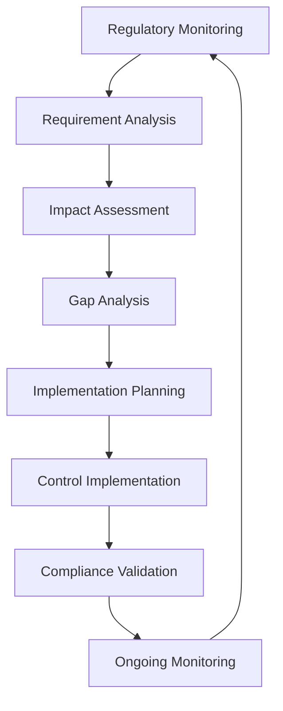
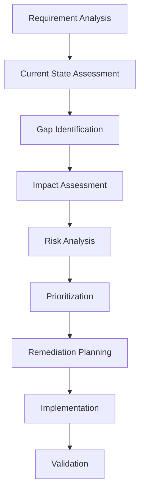

# Compliance and Audit Management Procedure - ISO 27001

## ArionComply Platform Metadata

```yaml
# Template Configuration
template_id: ISO27001-COMPLIANCE-AUDIT-PROC-001
template_type: compliance_audit_management_procedure
template_version: 1.0
template_status: draft
created_date: {{CURRENT_DATE}}
last_modified: {{CURRENT_DATE}}
template_category: operational_procedure
compliance_framework: ISO27001:2022
template_owner: {{TEMPLATE_OWNER}}
approval_status: pending_review

# Platform Integration
platform_features:
  - automated_compliance_monitoring
  - audit_preparation_automation
  - evidence_collection_orchestration
  - gap_analysis_intelligence
  - remediation_tracking
  - regulatory_intelligence

# Dependencies
depends_on:
  - penetration_testing_security_assessment_procedure
  - internal_audit_program_template
  - management_review_procedure_template
  - security_monitoring_logging_procedure
  - vulnerability_management_procedure
  - access_review_certification_procedure

# Usage Context
applicable_controls:
  - A.18.1.1  # Identification of applicable legislation and contractual requirements
  - A.18.1.2  # Intellectual property rights
  - A.18.1.3  # Protection of records
  - A.18.1.4  # Privacy and protection of personally identifiable information
  - A.18.1.5  # Regulation of cryptographic controls
  - A.18.2.1  # Independent review of information security
  - A.18.2.2  # Compliance with security policies and standards
  - A.18.2.3  # Technical compliance review
```

---

## **Document Control Information**

| **Element** | **Details** | **Description** |
|-------------|-------------|-----------------|
| **Document ID** | {{TEMPLATE_ID}} | *Unique identifier for this compliance audit procedure* |
| **Document Title** | Compliance and Audit Management Procedure | *Detailed procedures for compliance and audit management* |
| **ISO 27001 Reference** | A.18.1.1-A.18.1.5, A.18.2.1-A.18.2.3 | *Primary controls addressed by this procedure* |
| **Document Owner** | {{PROCEDURE_OWNER}} | *Person responsible for procedure maintenance* |
| **Approval Authority** | {{APPROVAL_AUTHORITY}} | *Authority responsible for procedure approval* |
| **Effective Date** | {{EFFECTIVE_DATE}} | *Date when procedure becomes effective* |
| **Review Frequency** | {{REVIEW_FREQUENCY}} | *How often procedure will be reviewed* |
| **Next Review Date** | {{NEXT_REVIEW_DATE}} | *Scheduled date for next procedure review* |
| **Classification Level** | {{DOCUMENT_CLASSIFICATION}} | *Classification level of this document* |

---

## **1. Procedure Foundation**

### **1.1 Understanding Compliance and Audit Management**

Think of compliance and audit management like operating a comprehensive quality assurance and inspection system for a highly regulated industry. Just as a pharmaceutical company must continuously monitor regulatory requirements, prepare for FDA inspections, maintain detailed documentation, and demonstrate compliance with safety standards - compliance and audit management ensures an organization systematically monitors regulatory obligations, prepares for audits, maintains evidence, and demonstrates adherence to security and privacy requirements.

**Real-World Analogy**: Consider how a commercial airline manages aviation compliance:
- **Regulatory Monitoring**: Like continuously tracking FAA regulations, international aviation standards, and safety requirements
- **Documentation Management**: Like maintaining detailed maintenance records, pilot certifications, and safety procedures
- **Inspection Readiness**: Like being prepared for surprise FAA inspections with organized evidence and responsive staff
- **Continuous Monitoring**: Like real-time monitoring of flight operations, safety metrics, and compliance indicators
- **Gap Remediation**: Like quickly addressing any compliance gaps or safety concerns identified
- **Stakeholder Communication**: Like coordinating with regulators, insurers, and safety boards

Compliance and audit management provides systematic assurance that the organization meets all applicable legal, regulatory, and contractual requirements.

### **1.2 Procedure Purpose**

This procedure establishes detailed operational steps to:
- **Monitor Compliance**: Continuously monitor regulatory and contractual compliance requirements
- **Prepare for Audits**: Systematically prepare for internal and external audits
- **Manage Evidence**: Collect, organize, and maintain compliance evidence and documentation
- **Coordinate Audits**: Effectively coordinate and support audit activities
- **Track Remediation**: Monitor and track compliance gap remediation efforts
- **Ensure Readiness**: Maintain audit readiness and compliance posture
- **Support Certification**: Support security and compliance certification processes
- **Drive Improvement**: Continuously improve compliance and audit processes

### **1.3 Procedure Scope**

This procedure applies to:
- **All Regulations**: Legal, regulatory, contractual, and standard requirements
- **All Audit Types**: Internal audits, external audits, and regulatory inspections
- **All Evidence Types**: Documentation, system logs, process records, and test results
- **All Stakeholders**: Internal teams, external auditors, and regulatory bodies
- **All Compliance Domains**: Security, privacy, operational, and financial compliance

---

## **2. Regulatory Compliance Framework**

### **2.1 Compliance Requirement Management**

#### **2.1.1 Regulatory Landscape Mapping**
**Comprehensive Compliance Requirements**:

| **Regulation Category** | **Primary Regulations** | **Applicability** | **Update Frequency** |
|------------------------|------------------------|------------------|---------------------|
| **Data Protection** | GDPR, CCPA, PIPEDA | Personal data processing | Quarterly |
| **Financial** | SOX, PCI DSS, Banking regs | Financial operations | Bi-annual |
| **Healthcare** | HIPAA, HITECH, FDA | Healthcare data/services | Annual |
| **Government** | FedRAMP, FISMA, NIST | Government contracts | Continuous |
| **Industry Standards** | ISO 27001, SOC 2, CSF | Security framework | Annual |
| **Sectoral** | Industry-specific reqs | Sector operations | Variable |

#### **2.1.2 Requirement Lifecycle Management**
**Dynamic Compliance Tracking**:


#### **2.1.3 Compliance Obligation Register**
**Centralized Compliance Management**:
- **Regulatory Inventory**: Complete inventory of applicable regulations
- **Requirement Mapping**: Detailed requirement mapping to controls
- **Responsibility Assignment**: Clear responsibility assignment for compliance
- **Timeline Management**: Compliance deadline and milestone tracking
- **Status Monitoring**: Real-time compliance status monitoring
- **Change Management**: Regulatory change impact management

### **2.2 ArionComply Regulatory Intelligence**

#### **2.2.1 Intelligent Compliance Monitoring**
**AI-Enhanced Regulatory Management**:
```yaml
regulatory_intelligence:
  automated_monitoring:
    - regulatory_change_detection
    - requirement_impact_analysis
    - compliance_gap_identification
    - deadline_management
  
  intelligent_analysis:
    - regulatory_text_analysis
    - requirement_extraction
    - cross_regulation_correlation
    - predictive_compliance_modeling
  
  compliance_orchestration:
    - automated_evidence_collection
    - compliance_workflow_automation
    - remediation_tracking
    - reporting_automation
```

#### **2.2.2 Predictive Compliance Analytics**
**Proactive Compliance Management**:
- **Regulatory Trend Analysis**: Analysis of regulatory trends and future requirements
- **Compliance Risk Prediction**: Predictive modeling of compliance risks
- **Gap Forecasting**: Prediction of future compliance gaps
- **Resource Planning**: Compliance resource requirement forecasting
- **Impact Modeling**: Regulatory change impact modeling
- **Optimization Recommendations**: Compliance process optimization recommendations

### **2.3 Compliance Control Framework**

#### **2.3.1 Control Mapping Matrix**
**Comprehensive Control Alignment**:

| **Control Domain** | **Regulations** | **Control Objectives** | **Validation Method** |
|-------------------|----------------|----------------------|----------------------|
| **Access Control** | GDPR, HIPAA, SOX | Identity management, authorization | Access reviews, testing |
| **Data Protection** | GDPR, CCPA, HIPAA | Data minimization, encryption | Data audits, testing |
| **Incident Response** | GDPR, SOX, PCI DSS | Breach notification, response | Incident reviews, exercises |
| **Monitoring** | SOX, PCI DSS, FISMA | Logging, monitoring, alerting | Log reviews, testing |
| **Vendor Management** | GDPR, SOX, HIPAA | Third-party risk management | Vendor assessments |

#### **2.3.2 Control Effectiveness Monitoring**
**Continuous Control Validation**:
- **Automated Testing**: Automated control testing and validation
- **Manual Assessment**: Periodic manual control assessment
- **Compliance Metrics**: Key compliance performance indicators
- **Trend Analysis**: Control effectiveness trend analysis
- **Exception Management**: Control exception identification and management
- **Improvement Planning**: Control improvement planning and implementation

---

## **3. Audit Preparation and Management**

### **3.1 Audit Planning Framework**

#### **3.1.1 Audit Type Classification**
**Comprehensive Audit Management**:

| **Audit Type** | **Purpose** | **Frequency** | **Preparation Time** |
|----------------|-------------|---------------|---------------------|
| **Internal Audit** | Self-assessment, improvement | Quarterly | 2-4 weeks |
| **External Audit** | Independent validation | Annual | 6-8 weeks |
| **Regulatory Inspection** | Compliance verification | Variable | 2-4 weeks |
| **Certification Audit** | Standards certification | Annual/Tri-annual | 8-12 weeks |
| **Vendor Audit** | Third-party assessment | As needed | 2-6 weeks |
| **Special Investigation** | Incident investigation | As needed | 1-2 weeks |

#### **3.1.2 Audit Preparation Process**
**Systematic Audit Readiness**:
1. **Audit Notification**: Receipt and analysis of audit notification
2. **Scope Analysis**: Detailed audit scope and requirement analysis
3. **Preparation Planning**: Comprehensive audit preparation planning
4. **Evidence Collection**: Systematic evidence collection and organization
5. **Team Preparation**: Audit team preparation and training
6. **Documentation Review**: Final documentation review and validation
7. **Logistics Coordination**: Audit logistics and facility coordination
8. **Readiness Validation**: Final audit readiness validation

### **3.2 Evidence Management**

#### **3.2.1 Evidence Collection Framework**
**Comprehensive Evidence Management**:
- **Policy Documentation**: Current policies, procedures, and standards
- **Control Documentation**: Control design and implementation evidence
- **Testing Evidence**: Control testing results and validation reports
- **Training Records**: Security awareness and training documentation
- **Incident Documentation**: Security incident records and responses
- **Monitoring Evidence**: Security monitoring and logging evidence
- **Change Documentation**: Change management records and approvals
- **Vendor Documentation**: Third-party assessments and contracts

#### **3.2.2 Evidence Organization System**
**Structured Evidence Repository**:
- **Document Management**: Centralized document repository and versioning
- **Metadata Management**: Comprehensive evidence metadata and tagging
- **Access Control**: Role-based evidence access control
- **Version Control**: Document version control and history
- **Search and Retrieval**: Advanced search and retrieval capabilities
- **Audit Trail**: Complete evidence access and modification audit trail

### **3.3 Audit Execution Support**

#### **3.3.1 Auditor Coordination**
**Professional Audit Support**:
- **Auditor Onboarding**: Auditor orientation and facility access
- **Interview Coordination**: Staff interview scheduling and coordination
- **Information Requests**: Timely response to auditor information requests
- **Technical Demonstrations**: System and control demonstrations
- **Progress Monitoring**: Audit progress monitoring and support
- **Issue Resolution**: Real-time issue identification and resolution

#### **3.3.2 Quality Assurance**
**Audit Quality Management**:
- **Response Quality**: Quality assurance for audit responses
- **Documentation Review**: Evidence documentation quality review
- **Technical Accuracy**: Technical accuracy validation and verification
- **Completeness Verification**: Evidence completeness verification
- **Consistency Checking**: Cross-reference consistency checking
- **Expert Review**: Subject matter expert review and validation

---

## **4. Compliance Monitoring and Assessment**

### **4.1 Continuous Compliance Monitoring**

#### **4.1.1 Real-Time Monitoring Framework**
**Continuous Compliance Assurance**:
- **Automated Monitoring**: Automated compliance control monitoring
- **Policy Compliance**: Real-time policy compliance monitoring
- **Configuration Monitoring**: System configuration compliance monitoring
- **Access Compliance**: User access compliance monitoring
- **Data Compliance**: Data handling compliance monitoring
- **Process Compliance**: Business process compliance monitoring

#### **4.1.2 Compliance Metrics and KPIs**
**Key Compliance Indicators**:

| **Metric** | **Definition** | **Target** | **Frequency** |
|------------|----------------|------------|---------------|
| **Compliance Score** | Overall compliance percentage | {{COMPLIANCE_SCORE_TARGET}}% | Monthly |
| **Control Effectiveness** | Percentage of effective controls | {{CONTROL_EFFECTIVENESS_TARGET}}% | Monthly |
| **Audit Readiness** | Audit preparation readiness score | {{AUDIT_READINESS_TARGET}}% | Continuous |
| **Remediation Rate** | Rate of compliance gap remediation | {{REMEDIATION_RATE_TARGET}}% | Monthly |
| **Training Compliance** | Training completion compliance | {{TRAINING_COMPLIANCE_TARGET}}% | Monthly |

### **4.2 Compliance Assessment Process**

#### **4.2.1 Regular Assessment Schedule**
**Systematic Compliance Evaluation**:
- **Monthly Reviews**: Operational compliance monitoring and review
- **Quarterly Assessments**: Comprehensive compliance assessment
- **Semi-Annual Reviews**: Strategic compliance review and planning
- **Annual Evaluation**: Complete compliance program evaluation
- **Event-Triggered**: Compliance assessment for significant changes

#### **4.2.2 Assessment Methodology**
**Structured Assessment Approach**:
- **Control Testing**: Systematic control testing and validation
- **Documentation Review**: Compliance documentation review
- **Interview Process**: Stakeholder interview and validation
- **System Testing**: Technical system compliance testing
- **Process Observation**: Business process compliance observation
- **Gap Analysis**: Compliance gap identification and analysis

### **4.3 ArionComply Compliance Analytics**

#### **4.3.1 Intelligent Compliance Dashboard**
**Real-Time Compliance Visibility**:
```yaml
compliance_analytics:
  real_time_monitoring:
    - compliance_status_dashboard
    - control_effectiveness_tracking
    - regulatory_change_impact
    - audit_readiness_score
  
  predictive_analytics:
    - compliance_risk_forecasting
    - gap_prediction_modeling
    - resource_requirement_planning
    - audit_outcome_prediction
  
  optimization_intelligence:
    - process_optimization_recommendations
    - resource_allocation_optimization
    - cost_benefit_analysis
    - performance_improvement_insights
```

#### **4.3.2 Advanced Analytics Capabilities**
**Data-Driven Compliance Insights**:
- **Trend Analysis**: Long-term compliance trend analysis
- **Correlation Analysis**: Compliance metric correlation analysis
- **Benchmark Comparison**: Industry benchmark comparison
- **Risk Assessment**: Compliance risk assessment and modeling
- **Cost Analysis**: Compliance program cost-benefit analysis
- **Optimization**: Compliance process optimization recommendations

---

## **5. Gap Analysis and Remediation**

### **5.1 Gap Identification Framework**

#### **5.1.1 Multi-Source Gap Detection**
**Comprehensive Gap Analysis**:
- **Regulatory Gaps**: Gaps between requirements and current controls
- **Implementation Gaps**: Control implementation deficiencies
- **Performance Gaps**: Control performance and effectiveness gaps
- **Documentation Gaps**: Documentation and evidence gaps
- **Process Gaps**: Business process compliance gaps
- **Training Gaps**: Awareness and competency gaps

#### **5.1.2 Gap Assessment Methodology**
**Systematic Gap Analysis Process**:


### **5.2 Remediation Management**

#### **5.2.1 Remediation Planning Framework**
**Strategic Remediation Approach**:
- **Priority Assessment**: Risk-based remediation prioritization
- **Resource Planning**: Remediation resource requirement planning
- **Timeline Development**: Realistic remediation timeline development
- **Dependency Management**: Remediation dependency identification
- **Impact Analysis**: Business impact analysis and mitigation
- **Success Criteria**: Clear remediation success criteria definition

#### **5.2.2 Remediation Execution**
**Systematic Remediation Implementation**:
- **Project Management**: Remediation project management and oversight
- **Progress Monitoring**: Real-time remediation progress monitoring
- **Quality Assurance**: Remediation quality assurance and validation
- **Stakeholder Communication**: Regular stakeholder communication
- **Risk Management**: Remediation risk management and mitigation
- **Change Management**: Remediation change management integration

### **5.3 Validation and Closure**

#### **5.3.1 Remediation Validation Process**
**Comprehensive Validation Framework**:
- **Implementation Verification**: Remediation implementation verification
- **Control Testing**: Post-remediation control testing
- **Documentation Review**: Updated documentation review
- **Process Validation**: Modified process validation
- **User Acceptance**: Stakeholder acceptance and sign-off
- **Effectiveness Monitoring**: Ongoing effectiveness monitoring

#### **5.3.2 Closure and Reporting**
**Remediation Completion Management**:
- **Formal Closure**: Formal remediation closure and approval
- **Documentation Update**: Final documentation update and archival
- **Lesson Learned**: Lesson learned capture and sharing
- **Process Improvement**: Process improvement identification
- **Reporting**: Remediation completion reporting
- **Knowledge Transfer**: Remediation knowledge transfer

---

## **6. Audit Findings Management**

### **6.1 Finding Classification and Analysis**

#### **6.1.1 Finding Categorization Framework**
**Systematic Finding Classification**:

| **Finding Type** | **Severity** | **Response Time** | **Remediation Timeline** |
|------------------|--------------|-------------------|-------------------------|
| **Critical** | Immediate risk | 24 hours | 30 days |
| **High** | Significant risk | 72 hours | 90 days |
| **Medium** | Moderate risk | 1 week | 180 days |
| **Low** | Minor risk | 2 weeks | 365 days |
| **Observation** | Improvement opportunity | 1 month | Next audit cycle |

#### **6.1.2 Root Cause Analysis**
**Systematic Finding Analysis**:
- **Immediate Cause**: Direct cause of the finding
- **Root Cause**: Underlying systemic cause
- **Contributing Factors**: Factors that contributed to the finding
- **System Analysis**: Systemic issues and process failures
- **Prevention Analysis**: Measures to prevent recurrence
- **Impact Assessment**: Business and compliance impact analysis

### **6.2 Corrective Action Planning**

#### **6.2.1 Action Plan Development**
**Comprehensive Corrective Action Planning**:
- **Immediate Actions**: Immediate corrective actions and containment
- **Short-term Actions**: Short-term remediation measures
- **Long-term Actions**: Long-term systemic improvements
- **Preventive Actions**: Measures to prevent recurrence
- **Monitoring Actions**: Ongoing monitoring and validation
- **Communication Actions**: Stakeholder communication plan

#### **6.2.2 Resource Allocation**
**Remediation Resource Management**:
- **Human Resources**: Required personnel and expertise
- **Financial Resources**: Budget and cost allocation
- **Technology Resources**: Required tools and systems
- **Time Resources**: Timeline and schedule requirements
- **External Resources**: Third-party services and support
- **Training Resources**: Training and development needs

### **6.3 Progress Tracking and Reporting**

#### **6.3.1 Progress Monitoring Framework**
**Real-Time Progress Tracking**:
- **Milestone Tracking**: Key milestone achievement tracking
- **Progress Metrics**: Quantitative progress measurement
- **Quality Indicators**: Remediation quality indicators
- **Risk Indicators**: Risk and issue indicators
- **Resource Utilization**: Resource utilization monitoring
- **Timeline Performance**: Timeline adherence monitoring

#### **6.3.2 Status Reporting**
**Structured Progress Communication**:
- **Executive Reports**: High-level executive status reports
- **Stakeholder Updates**: Regular stakeholder progress updates
- **Auditor Communication**: Formal auditor progress communication
- **Board Reporting**: Board-level remediation reporting
- **Regulatory Reporting**: Regulatory progress reporting when required
- **Internal Communication**: Internal team communication and coordination

---

## **7. Regulatory Change Management**

### **7.1 Regulatory Monitoring System**

#### **7.1.1 Change Detection Framework**
**Proactive Regulatory Monitoring**:
- **Official Sources**: Direct regulatory agency monitoring
- **Industry Sources**: Industry association and peer monitoring
- **Legal Sources**: Legal and professional service monitoring
- **News Sources**: Regulatory news and media monitoring
- **Vendor Sources**: Technology vendor regulatory updates
- **Academic Sources**: Research and academic analysis

#### **7.1.2 Change Impact Analysis**
**Systematic Impact Assessment**:
- **Applicability Analysis**: Regulation applicability determination
- **Scope Analysis**: Organizational scope and impact assessment
- **Timeline Analysis**: Implementation timeline and deadline analysis
- **Resource Analysis**: Required resource and capability analysis
- **Risk Analysis**: Compliance risk and exposure analysis
- **Cost Analysis**: Implementation cost and budget impact

### **7.2 Regulatory Implementation Planning**

#### **7.2.1 Implementation Strategy**
**Strategic Regulatory Response**:
- **Compliance Strategy**: Overall compliance strategy development
- **Implementation Approach**: Phased implementation approach
- **Resource Strategy**: Resource allocation and acquisition strategy
- **Timeline Strategy**: Implementation timeline and milestone planning
- **Risk Strategy**: Risk mitigation and management strategy
- **Communication Strategy**: Stakeholder communication strategy

#### **7.2.2 Project Management**
**Regulatory Implementation Execution**:
- **Project Planning**: Detailed implementation project planning
- **Team Formation**: Implementation team formation and management
- **Progress Monitoring**: Implementation progress monitoring
- **Quality Assurance**: Implementation quality assurance
- **Risk Management**: Implementation risk management
- **Change Management**: Organizational change management

### **7.3 ArionComply Regulatory Intelligence**

#### **7.3.1 Intelligent Regulatory Monitoring**
**AI-Enhanced Regulatory Tracking**:
```yaml
regulatory_monitoring:
  automated_detection:
    - regulatory_text_analysis
    - change_identification
    - impact_assessment
    - deadline_extraction
  
  intelligent_analysis:
    - regulatory_language_processing
    - requirement_extraction
    - cross_reference_analysis
    - trend_identification
  
  proactive_planning:
    - implementation_planning
    - resource_estimation
    - timeline_optimization
    - risk_assessment
```

#### **7.3.2 Regulatory Compliance Automation**
**Automated Compliance Management**:
- **Requirement Mapping**: Automated requirement mapping to controls
- **Gap Analysis**: Automated compliance gap analysis
- **Evidence Collection**: Automated evidence collection and organization
- **Reporting**: Automated compliance reporting generation
- **Monitoring**: Continuous compliance monitoring and alerting
- **Optimization**: Compliance process optimization recommendations

---

## **8. Documentation and Record Management**

### **8.1 Documentation Framework**

#### **8.1.1 Document Classification System**
**Comprehensive Documentation Management**:

| **Document Type** | **Retention Period** | **Access Level** | **Review Frequency** |
|-------------------|---------------------|------------------|---------------------|
| **Policies** | 7 years post-supersession | Controlled | Annual |
| **Procedures** | 7 years post-supersession | Controlled | Bi-annual |
| **Audit Reports** | 10 years | Restricted | N/A |
| **Evidence** | 7 years minimum | Controlled | As needed |
| **Training Records** | 7 years | Controlled | Annual |
| **Incident Records** | 10 years | Restricted | As needed |

#### **8.1.2 Document Lifecycle Management**
**Systematic Document Management**:
- **Creation**: Document creation standards and templates
- **Review**: Document review and approval process
- **Distribution**: Controlled document distribution
- **Maintenance**: Document maintenance and updates
- **Archival**: Document archival and retention
- **Disposal**: Secure document disposal

### **8.2 Evidence Management System**

#### **8.2.1 Evidence Collection Standards**
**Comprehensive Evidence Management**:
- **Collection Criteria**: Evidence collection criteria and standards
- **Quality Standards**: Evidence quality and completeness standards
- **Metadata Standards**: Evidence metadata and tagging standards
- **Storage Standards**: Evidence storage and security standards
- **Access Standards**: Evidence access and authorization standards
- **Retention Standards**: Evidence retention and disposal standards

#### **8.2.2 Evidence Repository**
**Centralized Evidence Management**:
- **Repository Structure**: Logical evidence repository structure
- **Search Capabilities**: Advanced search and retrieval capabilities
- **Version Control**: Evidence version control and history
- **Access Control**: Role-based evidence access control
- **Audit Trail**: Complete evidence access audit trail
- **Backup and Recovery**: Evidence backup and recovery procedures

### **8.3 Record Retention and Disposal**

#### **8.3.1 Retention Schedule**
**Legal and Regulatory Retention Requirements**:
- **Legal Requirements**: Legal record retention requirements
- **Regulatory Requirements**: Regulatory retention mandates
- **Business Requirements**: Business record retention needs
- **Contractual Requirements**: Contract-based retention obligations
- **Industry Standards**: Industry standard retention practices
- **Best Practices**: Record management best practices

#### **8.3.2 Secure Disposal Process**
**Controlled Record Disposal**:
- **Disposal Authorization**: Formal disposal authorization process
- **Disposal Methods**: Secure disposal methods and standards
- **Disposal Documentation**: Complete disposal documentation
- **Disposal Verification**: Disposal verification and certification
- **Disposal Audit**: Disposal process audit and review
- **Legal Compliance**: Legal compliance for record disposal

---

## **9. Training and Competency Management**

### **9.1 Compliance Training Framework**

#### **9.1.1 Role-Based Training Requirements**
**Comprehensive Training Program**:

| **Role** | **Training Focus** | **Frequency** | **Competency Assessment** |
|----------|-------------------|---------------|---------------------------|
| **Executive** | Governance, oversight | Annual | Board assessment |
| **Compliance Officer** | Detailed requirements | Quarterly | Certification |
| **Managers** | Implementation, oversight | Bi-annual | Performance review |
| **Staff** | Awareness, procedures | Annual | Testing |
| **Auditors** | Audit techniques | Ongoing | Certification |

#### **9.1.2 Training Content Development**
**Current and Relevant Training Content**:
- **Regulatory Updates**: Current regulatory requirement training
- **Policy Training**: Organizational policy and procedure training
- **Technical Training**: System and control technical training
- **Process Training**: Business process compliance training
- **Awareness Training**: General compliance awareness training
- **Specialized Training**: Role-specific compliance training

### **9.2 Competency Assessment**

#### **9.2.1 Assessment Framework**
**Comprehensive Competency Evaluation**:
- **Knowledge Assessment**: Regulatory and policy knowledge testing
- **Skill Assessment**: Practical skill demonstration
- **Behavior Assessment**: Compliance behavior observation
- **Performance Assessment**: Job performance evaluation
- **Certification Assessment**: Professional certification validation
- **Continuous Assessment**: Ongoing competency monitoring

#### **9.2.2 Competency Development**
**Systematic Competency Building**:
- **Gap Analysis**: Individual competency gap analysis
- **Development Planning**: Personalized development planning
- **Training Delivery**: Targeted training and development
- **Mentoring**: Expert mentoring and knowledge transfer
- **Experience**: Practical experience and application
- **Validation**: Competency validation and certification

### **9.3 Knowledge Management**

#### **9.3.1 Compliance Knowledge Base**
**Centralized Knowledge Repository**:
- **Regulatory Library**: Comprehensive regulatory reference library
- **Policy Repository**: Organizational policy and procedure repository
- **Best Practices**: Compliance best practice documentation
- **Lessons Learned**: Audit and compliance lessons learned
- **FAQ Database**: Frequently asked questions database
- **Expert Network**: Internal expert identification and networking

#### **9.3.2 Knowledge Sharing**
**Collaborative Knowledge Management**:
- **Communities of Practice**: Compliance communities of practice
- **Knowledge Sharing**: Regular knowledge sharing sessions
- **Expert Consultation**: Internal expert consultation services
- **External Networking**: External professional networking
- **Research Sharing**: Regulatory research and analysis sharing
- **Innovation**: Compliance innovation and improvement sharing

---

## **10. Performance Management and Metrics**

### **10.1 Compliance Performance Framework**

#### **10.1.1 Key Performance Indicators**
**Strategic Compliance Metrics**:

| **Metric** | **Definition** | **Target** | **Frequency** |
|------------|----------------|------------|---------------|
| **Overall Compliance Score** | Aggregate compliance percentage | {{OVERALL_COMPLIANCE_TARGET}}% | Monthly |
| **Audit Pass Rate** | Percentage of audits passed | {{AUDIT_PASS_RATE_TARGET}}% | Per audit |
| **Finding Resolution Time** | Average time to resolve findings | {{RESOLUTION_TIME_TARGET}} days | Monthly |
| **Regulatory Currency** | Percentage of current regulations tracked | {{REGULATORY_CURRENCY_TARGET}}% | Monthly |
| **Training Compliance** | Training completion percentage | {{TRAINING_COMPLIANCE_TARGET}}% | Monthly |

#### **10.1.2 Operational Metrics**
**Tactical Performance Measurement**:
- **Control Effectiveness**: Individual control effectiveness measurement
- **Process Efficiency**: Compliance process efficiency measurement
- **Resource Utilization**: Compliance resource utilization measurement
- **Cost Effectiveness**: Compliance program cost effectiveness
- **Stakeholder Satisfaction**: Stakeholder satisfaction with compliance program
- **Audit Efficiency**: Audit preparation and execution efficiency

### **10.2 Performance Analysis**

#### **10.2.1 Trend Analysis**
**Long-Term Performance Trends**:
- **Compliance Trends**: Historical compliance performance trends
- **Audit Trends**: Audit outcome and finding trends
- **Regulatory Trends**: Regulatory change and impact trends
- **Cost Trends**: Compliance program cost trends
- **Efficiency Trends**: Process efficiency improvement trends
- **Quality Trends**: Compliance quality improvement trends

#### **10.2.2 Benchmarking**
**Comparative Performance Analysis**:
- **Industry Benchmarks**: Industry compliance performance benchmarks
- **Peer Comparison**: Peer organization comparison
- **Best Practice Analysis**: Compliance best practice analysis
- **Maturity Assessment**: Compliance program maturity assessment
- **Gap Analysis**: Performance gap identification
- **Improvement Opportunities**: Performance improvement opportunities

### **10.3 Continuous Improvement**

#### **10.3.1 Improvement Process**
**Systematic Improvement Framework**:
- **Performance Analysis**: Regular performance data analysis
- **Root Cause Analysis**: Performance issue root cause analysis
- **Improvement Planning**: Systematic improvement planning
- **Implementation**: Improvement implementation and monitoring
- **Effectiveness Measurement**: Improvement effectiveness measurement
- **Standardization**: Successful improvement standardization

#### **10.3.2 Innovation Integration**
**Compliance Innovation Adoption**:
- **Technology Innovation**: New compliance technology evaluation
- **Process Innovation**: Compliance process innovation
- **Best Practice Integration**: Industry best practice integration
- **Automation Enhancement**: Compliance automation enhancement
- **Efficiency Improvement**: Process efficiency improvement
- **Value Optimization**: Compliance value optimization

---

## **11. Implementation Checklist**

### **11.1 Pre-Implementation**
- [ ] **Regulatory Assessment**: Complete regulatory applicability assessment
- [ ] **Current State Analysis**: Assess current compliance posture
- [ ] **Gap Analysis**: Identify compliance gaps and requirements
- [ ] **Resource Planning**: Plan compliance program resources
- [ ] **Tool Selection**: Select compliance management tools

### **11.2 Implementation Phase**
- [ ] **Process Implementation**: Implement compliance management processes
- [ ] **System Deployment**: Deploy compliance management systems
- [ ] **Training Program**: Develop and deliver compliance training
- [ ] **Documentation**: Complete compliance documentation
- [ ] **Evidence Collection**: Establish evidence collection processes

### **11.3 Post-Implementation**
- [ ] **Monitoring Setup**: Implement compliance monitoring systems
- [ ] **Performance Measurement**: Establish performance measurement
- [ ] **Audit Readiness**: Achieve and maintain audit readiness
- [ ] **Continuous Improvement**: Establish continuous improvement
- [ ] **Stakeholder Communication**: Maintain stakeholder communication

---

## **12. Related Documents**

### **12.1 Policy Dependencies**
- **Information Security Policy**: Foundation security requirements
- **Risk Management Policy**: Risk-based compliance approach
- **Data Classification Policy**: Data protection compliance
- **Human Resources Security Policy**: Personnel compliance requirements

### **12.2 Operational Procedures**
- **Internal Audit Program**: Internal audit coordination
- **Management Review Procedure**: Management oversight integration
- **Incident Response Procedures**: Compliance incident response
- **Change Management Procedures**: Compliance change management

### **12.3 Compliance Documentation**
- **Regulatory Register**: Complete regulatory requirement register
- **Compliance Matrix**: Control-to-requirement mapping matrix
- **Evidence Templates**: Standardized evidence collection templates
- **Audit Guides**: Audit preparation and execution guides

---

## **13. Appendices**

### **13.1 Regulatory Compliance Matrix**
| **Regulation** | **Applicability** | **Key Requirements** | **Assessment Frequency** |
|----------------|-------------------|---------------------|-------------------------|
| **GDPR** | Personal data processing | Consent, breach notification | Quarterly |
| **SOX** | Public companies | Financial controls | Annual |
| **HIPAA** | Healthcare data | Privacy, security | Bi-annual |
| **PCI DSS** | Payment processing | Cardholder data protection | Annual |

### **13.2 Audit Schedule Matrix**
| **Quarter** | **Internal Audits** | **External Audits** | **Regulatory** | **Certifications** |
|-------------|-------------------|-------------------|----------------|-------------------|
| **Q1** | Risk Management | - | - | ISO 27001 prep |
| **Q2** | Access Controls | SOC 2 | - | - |
| **Q3** | Data Protection | - | PCI DSS | - |
| **Q4** | Incident Response | Financial | - | ISO 27001 |

### **13.3 Finding Resolution Matrix**
| **Severity** | **Response Time** | **Resolution Target** | **Escalation** | **Board Reporting** |
|--------------|-------------------|---------------------|----------------|-------------------|
| **Critical** | 24 hours | 30 days | Immediate | Immediate |
| **High** | 72 hours | 90 days | 1 week | Quarterly |
| **Medium** | 1 week | 180 days | 1 month | Annually |
| **Low** | 2 weeks | 365 days | Quarterly | Annually |

---

**Document Status**: {{DOCUMENT_STATUS}}  
**Version**: {{VERSION_NUMBER}}  
**Last Updated**: {{LAST_UPDATED}}  
**Next Review**: {{NEXT_REVIEW_DATE}}  
**Owner**: {{DOCUMENT_OWNER}}  
**Approved By**: {{APPROVED_BY}}  
**Approval Date**: {{APPROVAL_DATE}}