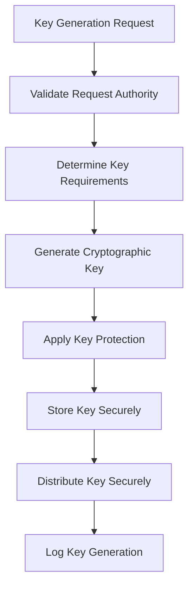

# Cryptographic Controls Policy - ISO 27001

## ArionComply Platform Metadata

```yaml
# Template Configuration
template_id: ISO27001-CRYPTO-CONTROLS-001
template_type: cryptographic_controls_policy
template_version: 1.0
template_status: draft
created_date: {{CURRENT_DATE}}
last_modified: {{CURRENT_DATE}}
template_category: technical_policy
compliance_framework: ISO27001:2022
template_owner: {{TEMPLATE_OWNER}}
approval_status: pending_review

# Platform Integration
platform_features:
  - key_management_system
  - crypto_policy_enforcement
  - algorithm_compliance_monitoring
  - certificate_lifecycle_management
  - crypto_inventory_tracking
  - compliance_reporting

# Dependencies
depends_on:
  - data_classification_policy
  - access_control_policy
  - information_security_policy
  - risk_management_policy

# Usage Context
applicable_controls:
  - A.10.1.1  # Policy on the use of cryptographic controls
  - A.10.1.2  # Key management
  - A.8.24    # Use of cryptography
  - A.13.2.1  # Information transfer policies and procedures
```

---

## **Document Control Information**

| **Element** | **Details** | **Description** |
|-------------|-------------|-----------------|
| **Document ID** | {{TEMPLATE_ID}} | *Unique identifier for this cryptographic controls policy* |
| **Document Title** | Cryptographic Controls Policy | *Policy for cryptographic protection of information* |
| **ISO 27001 Reference** | A.10.1.1, A.10.1.2, A.8.24 | *Primary controls addressed by this policy* |
| **Document Owner** | {{POLICY_OWNER}} | *Person responsible for policy maintenance* |
| **Approval Authority** | {{APPROVAL_AUTHORITY}} | *Authority responsible for policy approval* |
| **Effective Date** | {{EFFECTIVE_DATE}} | *Date when policy becomes effective* |
| **Review Frequency** | {{REVIEW_FREQUENCY}} | *How often policy will be reviewed* |
| **Next Review Date** | {{NEXT_REVIEW_DATE}} | *Scheduled date for next policy review* |
| **Classification Level** | {{DOCUMENT_CLASSIFICATION}} | *Classification level of this document* |

---

## **1. Policy Foundation**

### **1.1 Understanding Cryptographic Controls**

Think of cryptographic controls like a sophisticated safe system for your most valuable possessions. Just as a bank uses multiple layers of security - from the vault door to individual safety deposit boxes, each with different keys and access methods - cryptographic controls provide multiple layers of protection for your digital information.

**Real-World Analogy**: Consider a diplomatic courier service:
- **Encryption**: Like placing sensitive documents in a locked diplomatic pouch that only the intended recipient can open
- **Digital Signatures**: Like a wax seal that proves the document is authentic and hasn't been tampered with
- **Key Management**: Like the secure process of creating, distributing, and managing the special keys needed to open diplomatic pouches
- **Certificates**: Like diplomatic credentials that verify the identity of the courier and recipient

### **1.2 Policy Purpose**

This policy establishes a comprehensive framework to:
- **Protect Information**: Ensure appropriate cryptographic protection for sensitive information
- **Manage Keys**: Establish secure key management throughout the entire lifecycle
- **Ensure Compliance**: Meet regulatory and industry cryptographic requirements
- **Enable Trust**: Provide foundation for secure communications and transactions
- **Manage Risk**: Reduce risks associated with information disclosure and tampering

### **1.3 Policy Scope**

This policy applies to:
- **All Cryptographic Systems**: Hardware, software, and hybrid cryptographic implementations
- **All Information Assets**: Data requiring cryptographic protection based on classification
- **All Personnel**: Users, administrators, and stakeholders involved in cryptographic operations
- **All Environments**: On-premises, cloud, hybrid, and mobile environments
- **All Cryptographic Functions**: Encryption, decryption, digital signatures, key management, and authentication

---

## **2. Cryptographic Framework**

### **2.1 Cryptographic Objectives**

#### **2.1.1 Confidentiality**
**Protecting Information from Unauthorized Disclosure**:
- **Data at Rest**: Information stored in databases, files, and backup systems
- **Data in Transit**: Information transmitted over networks and communications
- **Data in Use**: Information being processed in applications and systems
- **Data in Memory**: Information temporarily stored in system memory

#### **2.1.2 Integrity**
**Ensuring Information Accuracy and Completeness**:
- **Data Integrity**: Preventing unauthorized modification of information
- **Message Integrity**: Ensuring communications are not altered in transit
- **System Integrity**: Protecting system configurations and software
- **Transaction Integrity**: Ensuring business transaction completeness

#### **2.1.3 Authentication**
**Verifying Identity and Origin**:
- **User Authentication**: Verifying user identities
- **System Authentication**: Verifying system identities
- **Message Authentication**: Verifying message origin and integrity
- **Digital Signatures**: Providing non-repudiation and authentication

#### **2.1.4 Non-Repudiation**
**Preventing Denial of Actions**:
- **Origin Non-Repudiation**: Proof of message origin
- **Delivery Non-Repudiation**: Proof of message delivery
- **Transaction Non-Repudiation**: Proof of transaction completion
- **Audit Non-Repudiation**: Proof of system actions

### **2.2 Cryptographic Requirements by Classification**

#### **2.2.1 Public Information**
**Cryptographic Requirements**: None required, optional for system consistency

**Acceptable Approaches**:
- **Encryption**: Not required
- **Digital Signatures**: Optional for authenticity
- **Key Management**: Standard key management if encryption used
- **Compliance**: No specific regulatory requirements

#### **2.2.2 Internal Information**
**Cryptographic Requirements**: Recommended for external transmission

**Required Approaches**:
- **Encryption**: Recommended for external transmission
- **Digital Signatures**: Recommended for important communications
- **Key Management**: Standard key management procedures
- **Compliance**: Industry best practices

#### **2.2.3 Confidential Information**
**Cryptographic Requirements**: Mandatory for storage and transmission

**Required Approaches**:
- **Encryption**: AES-256 minimum for data at rest and in transit
- **Digital Signatures**: Required for important documents and transactions
- **Key Management**: Formal key management with role separation
- **Compliance**: Regulatory compliance requirements

#### **2.2.4 Restricted Information**
**Cryptographic Requirements**: Enhanced cryptographic protection

**Required Approaches**:
- **Encryption**: Strongest approved algorithms with hardware security modules
- **Digital Signatures**: Mandatory with certificate-based authentication
- **Key Management**: Enhanced key management with multi-person control
- **Compliance**: Highest regulatory and industry standards

---

## **3. Approved Cryptographic Standards**

### **3.1 Encryption Algorithms**

#### **3.1.1 Symmetric Encryption**
**Approved Algorithms**:

| **Algorithm** | **Key Size** | **Use Case** | **Status** |
|---------------|--------------|--------------|------------|
| **AES** | 256-bit | General purpose encryption | **Recommended** |
| **AES** | 128-bit | Legacy systems, performance-sensitive | **Acceptable** |
| **ChaCha20** | 256-bit | Stream encryption, mobile devices | **Recommended** |
| **3DES** | 168-bit | Legacy system support only | **Deprecated** |

**Prohibited Algorithms**:
- **DES**: Single DES is prohibited
- **RC4**: Stream cipher is prohibited
- **MD5**: Hash function is prohibited
- **SHA-1**: Hash function is prohibited for new implementations

#### **3.1.2 Asymmetric Encryption**
**Approved Algorithms**:

| **Algorithm** | **Key Size** | **Use Case** | **Status** |
|---------------|--------------|--------------|------------|
| **RSA** | 4096-bit | New implementations | **Recommended** |
| **RSA** | 2048-bit | Existing systems | **Acceptable** |
| **ECC** | P-384 | High-performance applications | **Recommended** |
| **ECC** | P-256 | General purpose | **Acceptable** |
| **Ed25519** | 256-bit | Digital signatures | **Recommended** |

### **3.2 Hash Functions**

#### **3.2.1 Approved Hash Functions**
**Cryptographic Hash Functions**:

| **Algorithm** | **Output Size** | **Use Case** | **Status** |
|---------------|-----------------|--------------|------------|
| **SHA-3** | 256/512-bit | New implementations | **Recommended** |
| **SHA-2** | 256/512-bit | General purpose | **Recommended** |
| **BLAKE2** | 256/512-bit | High-performance hashing | **Acceptable** |
| **SHA-1** | 160-bit | Legacy verification only | **Deprecated** |

#### **3.2.2 Password Hashing**
**Specialized Password Hashing**:

| **Algorithm** | **Configuration** | **Use Case** | **Status** |
|---------------|-------------------|--------------|------------|
| **Argon2id** | Memory: 64MB, Iterations: 3 | New implementations | **Recommended** |
| **scrypt** | N=32768, r=8, p=1 | General purpose | **Acceptable** |
| **bcrypt** | Cost: 12+ | Legacy systems | **Acceptable** |
| **PBKDF2** | 100,000+ iterations | Legacy support only | **Deprecated** |

### **3.3 Digital Signature Standards**

#### **3.3.1 Digital Signature Algorithms**
**Approved Signature Algorithms**:

| **Algorithm** | **Key Size** | **Hash Function** | **Use Case** |
|---------------|--------------|-------------------|--------------|
| **RSA-PSS** | 4096-bit | SHA-256/SHA-3 | High-security applications |
| **RSA-PKCS1** | 2048-bit | SHA-256 | General purpose |
| **ECDSA** | P-384 | SHA-384 | High-performance applications |
| **EdDSA** | Ed25519 | SHA-512 | Modern implementations |

---

## **4. Key Management Framework**

### **4.1 Key Lifecycle Management**

#### **4.1.1 Key Generation**
**Key Generation Requirements**:
- **Random Number Generation**: Cryptographically secure random number generators
- **Key Strength**: Minimum key lengths based on classification level
- **Hardware Security**: Hardware-based key generation for restricted information
- **Entropy Sources**: Multiple entropy sources for key generation
- **Generation Logging**: Complete audit trail of key generation activities

**Key Generation Process**:


#### **4.1.2 Key Distribution**
**Secure Key Distribution**:
- **Out-of-Band Distribution**: Keys distributed through separate secure channels
- **Key Escrow**: Secure key escrow for business continuity
- **Split Knowledge**: Critical keys split among multiple authorized personnel
- **Dual Control**: Multiple persons required for key operations
- **Chain of Custody**: Complete chain of custody for key distribution

#### **4.1.3 Key Storage**
**Key Storage Requirements**:

| **Classification** | **Storage Method** | **Access Control** | **Backup** |
|-------------------|-------------------|-------------------|------------|
| **Public Keys** | Standard storage | Role-based access | Standard backup |
| **Internal Keys** | Secure storage | Multi-factor auth | Encrypted backup |
| **Confidential Keys** | Hardware security module | Dual control | Segregated backup |
| **Restricted Keys** | Enhanced HSM | Multi-person control | Air-gapped backup |

#### **4.1.4 Key Usage**
**Key Usage Controls**:
- **Purpose Limitation**: Keys used only for intended purposes
- **Usage Monitoring**: Real-time monitoring of key usage
- **Access Logging**: Comprehensive logging of key access
- **Usage Limits**: Limits on key usage frequency and volume
- **Expiration Enforcement**: Automatic enforcement of key expiration

#### **4.1.5 Key Rotation**
**Key Rotation Schedule**:

| **Key Type** | **Rotation Frequency** | **Trigger Events** |
|--------------|------------------------|-------------------|
| **Encryption Keys** | {{ENCRYPTION_KEY_ROTATION}} | Compromise, personnel change |
| **Signing Keys** | {{SIGNING_KEY_ROTATION}} | Certificate expiration, compromise |
| **Authentication Keys** | {{AUTH_KEY_ROTATION}} | Role change, access review |
| **Session Keys** | Per session | Session termination |

#### **4.1.6 Key Archival and Destruction**
**Key Archival Process**:
- **Archival Criteria**: Criteria for key archival decisions
- **Secure Archival**: Secure storage of archived keys
- **Retrieval Process**: Controlled process for key retrieval
- **Archival Period**: Defined archival retention periods
- **Destruction Schedule**: Scheduled destruction of archived keys

**Key Destruction Process**:
- **Destruction Authorization**: Formal authorization for key destruction
- **Secure Destruction**: Cryptographic destruction methods
- **Verification**: Verification of complete key destruction
- **Documentation**: Complete documentation of destruction
- **Compliance**: Compliance with regulatory requirements

### **4.2 ArionComply Key Management Integration**

#### **4.2.1 Automated Key Management**
**Platform Integration**:
```yaml
key_management_system:
  key_generation:
    - hardware_security_modules
    - cryptographic_libraries
    - random_number_generators
    - entropy_sources
  
  key_distribution:
    - secure_channels
    - key_escrow_systems
    - split_knowledge_protocols
    - dual_control_mechanisms
  
  key_storage:
    - hardware_security_modules
    - encrypted_databases
    - secure_key_vaults
    - backup_systems
  
  key_lifecycle:
    - automated_rotation
    - expiration_monitoring
    - usage_tracking
    - compliance_reporting
```

#### **4.2.2 Key Management Workflows**
**Automated Workflows**:
1. **Key Request**: Automated key request processing
2. **Approval**: Workflow-based approval process
3. **Generation**: Automated key generation with HSM
4. **Distribution**: Secure automated key distribution
5. **Monitoring**: Real-time key usage monitoring
6. **Rotation**: Automated key rotation scheduling
7. **Archival**: Automated key archival process
8. **Destruction**: Scheduled key destruction

---

## **5. Implementation Requirements**

### **5.1 System Implementation**

#### **5.1.1 Data at Rest Encryption**
**Database Encryption**:
- **Transparent Data Encryption**: Database-level encryption for all confidential data
- **Column-Level Encryption**: Specific encryption for sensitive columns
- **Key Management**: Separate key management for database encryption
- **Performance**: Optimization for encrypted database performance
- **Backup Encryption**: Encrypted backups with separate key management

**File System Encryption**:
- **Full Disk Encryption**: Complete disk encryption for all systems
- **File-Level Encryption**: Specific file encryption for sensitive documents
- **Cloud Storage**: Encrypted cloud storage with customer-managed keys
- **Removable Media**: Mandatory encryption for all removable media
- **Mobile Devices**: Full device encryption for all mobile devices

#### **5.1.2 Data in Transit Encryption**
**Network Encryption**:
- **TLS/SSL**: Minimum TLS 1.3 for all web communications
- **VPN**: IPsec or equivalent for remote access
- **Email**: S/MIME or PGP for confidential email communications
- **File Transfer**: SFTP or equivalent for secure file transfers
- **API Communications**: Encrypted API communications with authentication

**Transport Layer Security**:
| **Protocol** | **Version** | **Cipher Suites** | **Key Exchange** |
|--------------|-------------|-------------------|------------------|
| **TLS** | 1.3 | AES-256-GCM | ECDHE-RSA/ECDSA |
| **TLS** | 1.2 | AES-256-GCM | ECDHE-RSA/ECDSA |
| **IPsec** | IKEv2 | AES-256-GCM | ECDHE |
| **SSH** | 2.0 | AES-256-GCM | ECDH |

#### **5.1.3 Application-Level Encryption**
**Application Integration**:
- **Encryption Libraries**: Approved cryptographic libraries
- **Key Management APIs**: Secure integration with key management systems
- **Certificate Management**: Automated certificate lifecycle management
- **Crypto Agility**: Design for cryptographic algorithm updates
- **Error Handling**: Secure error handling for cryptographic operations

### **5.2 Certificate Management**

#### **5.2.1 Certificate Authority Framework**
**CA Hierarchy**:
- **Root CA**: Offline root certificate authority
- **Intermediate CAs**: Online intermediate certificate authorities
- **Issuing CAs**: Certificate issuing authorities for specific purposes
- **External CAs**: Trusted external certificate authorities
- **Certificate Validation**: Real-time certificate validation services

#### **5.2.2 Certificate Lifecycle**
**Certificate Management Process**:
1. **Certificate Request**: Automated certificate request generation
2. **Identity Verification**: Verification of certificate requestor identity
3. **Certificate Issuance**: Automated certificate issuance
4. **Certificate Distribution**: Secure certificate distribution
5. **Certificate Monitoring**: Real-time certificate monitoring
6. **Certificate Renewal**: Automated certificate renewal
7. **Certificate Revocation**: Emergency certificate revocation
8. **Certificate Archival**: Secure certificate archival

#### **5.2.3 Certificate Types**
**Certificate Classifications**:

| **Certificate Type** | **Validation Level** | **Use Case** | **Validity Period** |
|---------------------|---------------------|--------------|-------------------|
| **Domain Validated** | Basic | Web services | 1 year |
| **Organization Validated** | Standard | Corporate communications | 2 years |
| **Extended Validation** | Enhanced | High-security applications | 1 year |
| **Code Signing** | Enhanced | Software signing | 3 years |
| **Client Certificates** | Standard | User authentication | 1 year |

---

## **6. Compliance and Regulatory Requirements**

### **6.1 Regulatory Compliance**

#### **6.1.1 GDPR Compliance**
**Data Protection Requirements**:
- **Encryption by Design**: Privacy by design with encryption
- **Data Minimization**: Encrypt only necessary data
- **Right to Erasure**: Cryptographic deletion capabilities
- **Data Portability**: Encrypted data export capabilities
- **Breach Notification**: Encryption status in breach notifications

#### **6.1.2 Industry Standards**
**Compliance Frameworks**:

| **Standard** | **Requirements** | **Implementation** |
|--------------|------------------|-------------------|
| **FIPS 140-2** | Hardware security modules | Level 3 HSM minimum |
| **Common Criteria** | Cryptographic validation | EAL4+ evaluations |
| **NIST Cybersecurity** | Cryptographic controls | Framework implementation |
| **ISO 27001** | Information security | Annex A controls |
| **PCI DSS** | Payment card protection | Strong cryptography |

#### **6.1.3 Export Control Compliance**
**Cryptographic Export Controls**:
- **Export Regulations**: Compliance with cryptographic export regulations
- **Import Restrictions**: Compliance with import restrictions
- **Documentation**: Proper documentation for export/import
- **Licensing**: Appropriate licensing for cryptographic products
- **Notification**: Notification requirements for cryptographic use

### **6.2 Audit and Compliance Monitoring**

#### **6.2.1 Compliance Metrics**
**Key Performance Indicators**:
- **Algorithm Compliance**: {{ALGORITHM_COMPLIANCE_TARGET}}%
- **Key Management Compliance**: {{KEY_MGMT_COMPLIANCE_TARGET}}%
- **Certificate Compliance**: {{CERT_COMPLIANCE_TARGET}}%
- **Encryption Coverage**: {{ENCRYPTION_COVERAGE_TARGET}}%
- **Incident Response**: {{CRYPTO_INCIDENT_RESPONSE_TARGET}} hours

#### **6.2.2 Audit Requirements**
**Audit Scope**:
- **Cryptographic Systems**: All systems using cryptographic controls
- **Key Management**: Complete key management lifecycle
- **Certificate Management**: Certificate authority and lifecycle
- **Compliance**: Regulatory and standard compliance
- **Incident Response**: Cryptographic incident response

---

## **7. Risk Management**

### **7.1 Cryptographic Risk Assessment**

#### **7.1.1 Risk Categories**
**Cryptographic Risks**:
- **Algorithm Weakness**: Cryptographic algorithm vulnerabilities
- **Implementation Flaws**: Poor cryptographic implementation
- **Key Compromise**: Unauthorized access to cryptographic keys
- **Side-Channel Attacks**: Physical attacks on cryptographic systems
- **Quantum Computing**: Future quantum computing threats

#### **7.1.2 Risk Mitigation Strategies**
**Mitigation Approaches**:
- **Crypto Agility**: Design for algorithm updates
- **Defense in Depth**: Multiple layers of cryptographic protection
- **Hardware Security**: Hardware-based cryptographic protection
- **Regular Assessment**: Regular cryptographic risk assessments
- **Incident Response**: Cryptographic incident response capabilities

### **7.2 Quantum-Resistant Cryptography**

#### **7.2.1 Post-Quantum Cryptography**
**Quantum Threat Preparation**:
- **Algorithm Monitoring**: Monitor NIST post-quantum standardization
- **Hybrid Approaches**: Implement hybrid classical/quantum-resistant solutions
- **Migration Planning**: Plan for quantum-resistant algorithm migration
- **Risk Assessment**: Assess quantum computing timeline and impact
- **Pilot Programs**: Pilot post-quantum cryptographic implementations

#### **7.2.2 Quantum-Safe Transition**
**Transition Strategy**:
1. **Inventory**: Inventory all cryptographic implementations
2. **Risk Assessment**: Assess quantum vulnerability of each system
3. **Prioritization**: Prioritize systems for quantum-safe migration
4. **Testing**: Test quantum-safe algorithms in pilot environments
5. **Migration**: Gradual migration to quantum-safe algorithms
6. **Monitoring**: Monitor quantum computing developments

---

## **8. Incident Response**

### **8.1 Cryptographic Incident Types**

#### **8.1.1 Key Compromise**
**Incident Response Process**:
1. **Detection**: Immediate detection of key compromise
2. **Containment**: Immediate containment of compromised keys
3. **Assessment**: Assess scope and impact of compromise
4. **Revocation**: Immediate revocation of compromised keys
5. **Re-keying**: Emergency re-keying of affected systems
6. **Investigation**: Forensic investigation of compromise
7. **Recovery**: System recovery and restoration
8. **Lessons Learned**: Post-incident review and improvements

#### **8.1.2 Algorithm Vulnerability**
**Vulnerability Response**:
1. **Monitoring**: Continuous monitoring of cryptographic vulnerabilities
2. **Assessment**: Rapid assessment of vulnerability impact
3. **Patching**: Emergency patching of vulnerable implementations
4. **Migration**: Migration to secure algorithms
5. **Communication**: Stakeholder communication about vulnerabilities
6. **Documentation**: Documentation of vulnerability response

### **8.2 Emergency Procedures**

#### **8.2.1 Emergency Key Revocation**
**Revocation Process**:
- **Immediate Revocation**: Immediate certificate/key revocation
- **Notification**: Rapid notification to all stakeholders
- **System Updates**: Emergency system updates
- **Alternative Access**: Alternative access procedures
- **Recovery Planning**: Recovery and restoration planning

#### **8.2.2 Cryptographic Disaster Recovery**
**Recovery Procedures**:
- **Key Escrow**: Access to escrowed keys for recovery
- **Backup Systems**: Activation of backup cryptographic systems
- **Alternative CAs**: Use of alternative certificate authorities
- **Manual Procedures**: Manual cryptographic procedures
- **System Restoration**: Complete system restoration procedures

---

## **9. Training and Awareness**

### **9.1 Training Program**

#### **9.1.1 Role-Based Training**
**Training by Role**:
- **Cryptographic Officers**: Advanced cryptographic management
- **System Administrators**: Cryptographic system administration
- **Developers**: Secure cryptographic programming
- **Security Officers**: Cryptographic security oversight
- **End Users**: Basic cryptographic awareness

#### **9.1.2 Training Topics**
**Core Training Areas**:
- **Cryptographic Fundamentals**: Basic cryptographic concepts
- **Key Management**: Key lifecycle management
- **Implementation**: Secure cryptographic implementation
- **Compliance**: Regulatory and standard compliance
- **Incident Response**: Cryptographic incident response

### **9.2 Awareness Activities**

#### **9.2.1 Regular Communications**
**Communication Methods**:
- **Security Bulletins**: Cryptographic security updates
- **Training Sessions**: Regular cryptographic training
- **Best Practices**: Cryptographic best practice sharing
- **Incident Sharing**: Lessons learned from incidents
- **Technology Updates**: Updates on cryptographic technologies

#### **9.2.2 Competency Assessment**
**Assessment Methods**:
- **Knowledge Tests**: Regular cryptographic knowledge testing
- **Practical Assessments**: Hands-on cryptographic assessments
- **Certification**: Professional cryptographic certifications
- **Peer Review**: Peer review of cryptographic implementations
- **Continuous Learning**: Ongoing cryptographic education

---

## **10. Continuous Improvement**

### **10.1 Technology Evolution**

#### **10.1.1 Algorithm Updates**
**Update Process**:
- **Monitoring**: Continuous monitoring of cryptographic standards
- **Evaluation**: Regular evaluation of new algorithms
- **Testing**: Comprehensive testing of new algorithms
- **Migration**: Planned migration to new algorithms
- **Retirement**: Secure retirement of deprecated algorithms

#### **10.1.2 Performance Optimization**
**Optimization Areas**:
- **Hardware Acceleration**: Hardware-accelerated cryptography
- **Algorithm Selection**: Optimal algorithm selection
- **Key Management**: Efficient key management
- **System Integration**: Optimized system integration
- **Monitoring**: Performance monitoring and optimization

### **10.2 Program Enhancement**

#### **10.2.1 Metrics and Improvement**
**Improvement Metrics**:
- **Security Effectiveness**: Measurement of security improvements
- **Performance Impact**: Assessment of performance impact
- **Compliance**: Regulatory compliance improvements
- **User Experience**: User experience enhancements
- **Cost Effectiveness**: Cost-benefit analysis of improvements

#### **10.2.2 Innovation Integration**
**Emerging Technologies**:
- **Homomorphic Encryption**: Computation on encrypted data
- **Secure Multi-Party Computation**: Collaborative computation
- **Zero-Knowledge Proofs**: Privacy-preserving verification
- **Blockchain Integration**: Distributed ledger cryptography
- **AI/ML Security**: Cryptographic protection for AI/ML

---

## **11. Vendor and Third-Party Management**

### **11.1 Vendor Requirements**

#### **11.1.1 Cryptographic Standards**
**Vendor Compliance Requirements**:
- **Algorithm Compliance**: Use of approved cryptographic algorithms
- **Key Management**: Secure key management practices
- **Certificate Management**: Proper certificate management
- **Audit Compliance**: Regular cryptographic audits
- **Incident Response**: Cryptographic incident response capabilities

#### **11.1.2 Third-Party Integration**
**Integration Requirements**:
- **API Security**: Secure cryptographic APIs
- **Data Protection**: Cryptographic data protection
- **Key Exchange**: Secure key exchange protocols
- **Authentication**: Strong authentication mechanisms
- **Monitoring**: Cryptographic monitoring and logging

### **11.2 Cloud Service Providers**

#### **11.2.1 Cloud Cryptography**
**Cloud Requirements**:
- **Encryption Standards**: Cloud encryption standards
- **Key Management**: Customer-managed key requirements
- **Compliance**: Regulatory compliance in cloud
- **Data Location**: Data location and sovereignty
- **Incident Response**: Cloud cryptographic incident response

#### **11.2.2 Hybrid Cloud Security**
**Hybrid Implementation**:
- **Consistent Standards**: Consistent cryptographic standards
- **Key Federation**: Secure key federation across environments
- **Monitoring**: Unified cryptographic monitoring
- **Incident Response**: Coordinated incident response
- **Compliance**: Unified compliance management

---

## **12. Implementation Checklist**

### **12.1 Pre-Implementation**
- [ ] **Cryptographic Assessment**: Conduct comprehensive cryptographic assessment
- [ ] **Standards Selection**: Select appropriate cryptographic standards
- [ ] **Architecture Design**: Design cryptographic architecture
- [ ] **Resource Planning**: Plan necessary resources and budget
- [ ] **Vendor Selection**: Select cryptographic vendors and solutions

### **12.2 Implementation Phase**
- [ ] **System Deployment**: Deploy cryptographic systems
- [ ] **Key Management**: Implement key management system
- [ ] **Certificate Authority**: Establish certificate authority
- [ ] **Policy Deployment**: Deploy cryptographic policies
- [ ] **Training Delivery**: Deliver cryptographic training

### **12.3 Post-Implementation**
- [ ] **Compliance Verification**: Verify regulatory compliance
- [ ] **Performance Testing**: Test cryptographic performance
- [ ] **Incident Response**: Establish incident response procedures
- [ ] **Monitoring Setup**: Implement cryptographic monitoring
- [ ] **Continuous Improvement**: Establish improvement processes

---

## **13. Related Documents**

### **13.1 Policy Dependencies**
- **Data Classification Policy**: Classification-based cryptographic requirements
- **Access Control Policy**: Cryptographic access control integration
- **Information Security Policy**: Overall security framework
- **Risk Management Policy**: Cryptographic risk management

### **13.2 Technical Standards**
- **Encryption Standards**: Detailed encryption implementation standards
- **Key Management Standards**: Key management technical standards
- **Certificate Standards**: Certificate authority and management standards
- **API Security Standards**: Cryptographic API security requirements

### **13.3 Operational Procedures**
- **Key Management Procedures**: Detailed key management procedures
- **Certificate Management Procedures**: Certificate lifecycle procedures
- **Incident Response Procedures**: Cryptographic incident response
- **Audit Procedures**: Cryptographic audit and compliance procedures

---

## **14. Appendices**

### **14.1 Approved Algorithm List**
| **Category** | **Algorithm** | **Key Size** | **Status** | **Use Case** |
|--------------|---------------|--------------|------------|--------------|
| **Symmetric** | AES | 256-bit | Recommended | General encryption |
| **Asymmetric** | RSA | 4096-bit | Recommended | Key exchange |
| **Hash** | SHA-3 | 256-bit | Recommended | General hashing |
| **Signature** | ECDSA | P-384 | Recommended | Digital signatures |

### **14.2 Key Management Matrix**
| **Key Type** | **Generation** | **Distribution** | **Storage** | **Rotation** |
|--------------|----------------|------------------|-------------|--------------|
| **Encryption** | HSM | Secure channel | HSM | Annual |
| **Signing** | HSM | Certificate | HSM | 3 years |
| **Authentication** | Software | Manual | Database | 6 months |
| **Session** | Software | TLS | Memory | Per session |

### **14.3 Compliance Requirements**
| **Regulation** | **Requirement** | **Implementation** | **Verification** |
|---------------|-----------------|-------------------|------------------|
| **GDPR** | Data protection | Encryption by design | Privacy assessment |
| **FIPS 140-2** | Hardware security | Level 3 HSM | FIPS validation |
| **Common Criteria** | Evaluation | EAL4+ products | CC certificates |
| **PCI DSS** | Strong cryptography | Approved algorithms | PCI audit |

---

**Document Status**: {{DOCUMENT_STATUS}}  
**Version**: {{VERSION_NUMBER}}  
**Last Updated**: {{LAST_UPDATED}}  
**Next Review**: {{NEXT_REVIEW_DATE}}  
**Owner**: {{DOCUMENT_OWNER}}  
**Approved By**: {{APPROVED_BY}}  
**Approval Date**: {{APPROVAL_DATE}}