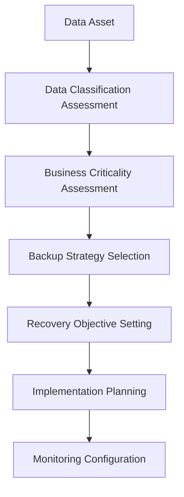
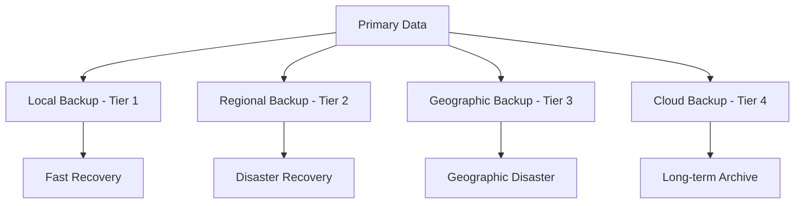
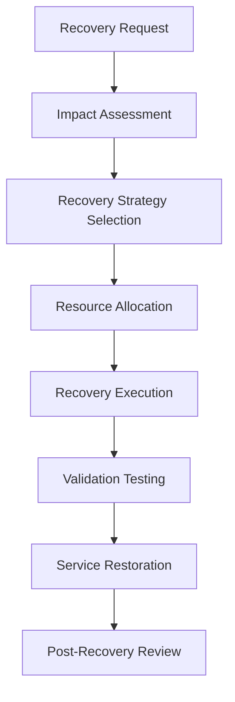

# Data Backup and Recovery Procedure - ISO 27001

## ArionComply Platform Metadata

```yaml
# Template Configuration
template_id: ISO27001-DATA-BACKUP-PROC-001
template_type: data_backup_recovery_procedure
template_version: 1.0
template_status: draft
created_date: {{CURRENT_DATE}}
last_modified: {{CURRENT_DATE}}
template_category: operational_procedure
compliance_framework: ISO27001:2022
template_owner: {{TEMPLATE_OWNER}}
approval_status: pending_review

# Platform Integration
platform_features:
  - automated_backup_orchestration
  - recovery_point_monitoring
  - backup_integrity_verification
  - recovery_time_optimization
  - compliance_reporting
  - predictive_analytics

# Dependencies
depends_on:
  - business_continuity_management_procedure
  - data_classification_policy
  - cryptographic_controls_policy
  - change_management_procedure
  - supplier_relationship_management_policy
  - physical_environmental_security_policy

# Usage Context
applicable_controls:
  - A.8.13   # Information backup
  - A.8.14   # Redundancy of information processing facilities
  - A.17.1.2 # Implementing information security continuity
  - A.12.3.1 # Information backup
  - A.11.1.4 # Protecting against environmental threats
```

---

## **Document Control Information**

| **Element** | **Details** | **Description** |
|-------------|-------------|-----------------|
| **Document ID** | {{TEMPLATE_ID}} | *Unique identifier for this backup and recovery procedure* |
| **Document Title** | Data Backup and Recovery Procedure | *Detailed procedures for data backup and recovery operations* |
| **ISO 27001 Reference** | A.8.13, A.8.14, A.17.1.2, A.12.3.1 | *Primary controls addressed by this procedure* |
| **Document Owner** | {{PROCEDURE_OWNER}} | *Person responsible for procedure maintenance* |
| **Approval Authority** | {{APPROVAL_AUTHORITY}} | *Authority responsible for procedure approval* |
| **Effective Date** | {{EFFECTIVE_DATE}} | *Date when procedure becomes effective* |
| **Review Frequency** | {{REVIEW_FREQUENCY}} | *How often procedure will be reviewed* |
| **Next Review Date** | {{NEXT_REVIEW_DATE}} | *Scheduled date for next procedure review* |
| **Classification Level** | {{DOCUMENT_CLASSIFICATION}} | *Classification level of this document* |

---

## **1. Procedure Foundation**

### **1.1 Understanding Data Backup and Recovery**

Think of data backup and recovery like operating a sophisticated insurance and restoration system for an art museum. Just as a museum must carefully document, photograph, and store detailed records of every precious artifact while maintaining multiple secure storage locations and having expert restoration capabilities - data backup and recovery requires systematic protection, multiple storage strategies, and rapid restoration capabilities for organizational information assets.

**Real-World Analogy**: Consider how a major bank protects its critical financial records:
- **Multiple Copies**: Like maintaining original documents, microfilm copies, and digital archives
- **Geographic Distribution**: Like storing copies in different vaults across multiple cities
- **Security Controls**: Like using fireproof safes, armed guards, and access controls
- **Regular Testing**: Like periodically verifying that archived records are readable and complete
- **Rapid Access**: Like having procedures to quickly retrieve records for audits or investigations
- **Legal Compliance**: Like maintaining records according to regulatory retention requirements
- **Disaster Recovery**: Like having procedures to reconstruct operations from backup records

Data backup and recovery ensures business continuity through comprehensive data protection and rapid restoration capabilities.

### **1.2 Procedure Purpose**

This procedure establishes detailed operational steps to:
- **Protect Data Assets**: Systematically protect all critical organizational data
- **Ensure Availability**: Maintain data availability during system failures or disasters
- **Meet Recovery Objectives**: Achieve defined recovery point and time objectives
- **Maintain Integrity**: Preserve data integrity throughout backup and recovery processes
- **Enable Business Continuity**: Support business continuity and disaster recovery
- **Ensure Compliance**: Meet regulatory and legal data retention requirements
- **Minimize Data Loss**: Minimize data loss during incidents or disasters
- **Optimize Recovery**: Optimize recovery time and process efficiency

### **1.3 Procedure Scope**

This procedure applies to:
- **All Data Types**: Structured and unstructured data, databases, files, and configurations
- **All Systems**: Servers, workstations, applications, and cloud services
- **All Environments**: Production, development, testing, and staging environments
- **All Locations**: On-premises, cloud, hybrid, and remote locations
- **All Lifecycle Phases**: From backup creation through verified recovery

---

## **2. Data Classification and Backup Requirements**

### **2.1 Data-Driven Backup Strategy**

#### **2.1.1 Backup Requirements by Data Classification**
**Classification-Based Backup Framework**:

| **Data Classification** | **Backup Frequency** | **Retention Period** | **Recovery Priority** | **Recovery Time Objective** |
|------------------------|---------------------|---------------------|----------------------|---------------------------|
| **Restricted** | Real-time/15 min | 7 years + | Priority 1 | 15 minutes |
| **Confidential** | Hourly | 5 years | Priority 2 | 1 hour |
| **Internal** | Daily | 3 years | Priority 3 | 4 hours |
| **Public** | Weekly | 1 year | Priority 4 | 24 hours |

#### **2.1.2 Business Criticality Integration**
**Business-Driven Backup Priorities**:


#### **2.1.3 Regulatory Compliance Requirements**
**Compliance-Driven Backup Standards**:
- **Financial Data (SOX)**: 7-year retention with quarterly verification
- **Healthcare Data (HIPAA)**: 6-year retention with access logging
- **Payment Data (PCI DSS)**: 3-year retention with encryption
- **Personal Data (GDPR)**: Variable retention with deletion rights
- **Government Data**: Varies by classification and contract requirements

### **2.2 Recovery Objectives Framework**

#### **2.2.1 Recovery Point Objectives (RPO)**
**Data Loss Tolerance by System Type**:

| **System Category** | **RPO Target** | **Maximum RPO** | **Backup Method** |
|-------------------|----------------|-----------------|-------------------|
| **Mission Critical** | 5 minutes | 15 minutes | Continuous replication |
| **Business Critical** | 1 hour | 4 hours | Hourly snapshots |
| **Important** | 4 hours | 24 hours | Daily incremental |
| **Standard** | 24 hours | 72 hours | Daily full backup |

#### **2.2.2 Recovery Time Objectives (RTO)**
**Recovery Speed Requirements**:
- **Tier 1 Systems**: 15 minutes maximum recovery time
- **Tier 2 Systems**: 1 hour maximum recovery time
- **Tier 3 Systems**: 4 hours maximum recovery time
- **Tier 4 Systems**: 24 hours maximum recovery time

### **2.3 ArionComply Backup Intelligence**

#### **2.3.1 Intelligent Backup Orchestration**
**AI-Driven Backup Management**:
```yaml
intelligent_backup:
  data_analysis:
    - data_classification_integration
    - change_rate_analysis
    - access_pattern_analysis
    - business_criticality_scoring
  
  backup_optimization:
    - frequency_optimization
    - method_selection
    - storage_tier_assignment
    - bandwidth_optimization
  
  predictive_analytics:
    - failure_prediction
    - capacity_forecasting
    - performance_optimization
    - cost_optimization
```

#### **2.3.2 Dynamic Backup Adjustment**
**Adaptive Backup Strategies**:
- **Workload Analysis**: Real-time workload pattern analysis
- **Change Detection**: Automated change rate detection and adjustment
- **Performance Monitoring**: Backup performance monitoring and optimization
- **Cost Optimization**: Dynamic cost optimization based on business value
- **Compliance Monitoring**: Automated compliance requirement monitoring
- **Risk Assessment**: Dynamic risk-based backup strategy adjustment

---

## **3. Backup Infrastructure and Architecture**

### **3.1 Backup Architecture Framework**

#### **3.1.1 Multi-Tier Backup Architecture**
**Comprehensive Backup Infrastructure**:


#### **3.1.2 Storage Technology Matrix**
**Backup Storage Technologies**:

| **Storage Type** | **Performance** | **Capacity** | **Cost** | **Use Case** |
|------------------|-----------------|--------------|----------|--------------|
| **NVMe SSD** | Very High | Low | Very High | Critical system snapshots |
| **SATA SSD** | High | Medium | High | Important system backups |
| **High-Speed HDD** | Medium | High | Medium | Standard daily backups |
| **Archive HDD** | Low | Very High | Low | Long-term retention |
| **Tape Storage** | Very Low | Very High | Very Low | Compliance archives |
| **Cloud Storage** | Variable | Unlimited | Variable | Offsite and DR |

### **3.2 Backup Methods and Technologies**

#### **3.2.1 Backup Method Selection**
**Technology-Specific Backup Approaches**:

| **Backup Method** | **Recovery Speed** | **Storage Efficiency** | **Network Impact** | **Best For** |
|-------------------|-------------------|----------------------|-------------------|--------------|
| **Full Backup** | Fastest | Lowest | Highest | Weekly/monthly baseline |
| **Incremental** | Medium | Highest | Lowest | Daily changes |
| **Differential** | Medium | Medium | Medium | Weekly accumulation |
| **Snapshot** | Fastest | High | Minimal | Real-time point-in-time |
| **Continuous** | Instant | Medium | Medium | Mission-critical data |
| **Mirror/RAID** | Instant | Lowest | None | High availability |

#### **3.2.2 Backup Technology Integration**
**Enterprise Backup Technologies**:
- **Database Backup**: Native database backup tools and procedures
- **File System Backup**: File-level backup with versioning
- **Image Backup**: Complete system and application images
- **Virtual Machine Backup**: VM-aware backup with instant recovery
- **Cloud-Native Backup**: Cloud service native backup capabilities
- **Application-Specific**: Application-aware backup solutions

### **3.3 Geographic Distribution Strategy**

#### **3.3.1 Geographic Backup Framework**
**Multi-Location Backup Strategy**:
- **Local Backup**: Same facility, different system (Tier 1)
- **Metropolitan Backup**: Same city, different facility (Tier 2)
- **Regional Backup**: Different region, same country (Tier 3)
- **Geographic Backup**: Different country/continent (Tier 4)
- **Cloud Backup**: Multiple cloud regions (Tier 5)

#### **3.3.2 Site Selection Criteria**
**Backup Site Requirements**:
- **Distance Requirements**: Minimum distance from primary site
- **Disaster Risk Assessment**: Different disaster risk profiles
- **Connectivity Requirements**: Adequate network connectivity
- **Security Requirements**: Appropriate physical and logical security
- **Compliance Requirements**: Regulatory compliance alignment
- **Cost Considerations**: Total cost of ownership optimization

---

## **4. Backup Operations**

### **4.1 Backup Scheduling and Orchestration**

#### **4.1.1 Backup Schedule Framework**
**Comprehensive Backup Scheduling**:

| **Schedule Type** | **Frequency** | **Window** | **Systems Included** |
|-------------------|---------------|------------|---------------------|
| **Continuous** | Real-time | 24/7 | Mission-critical databases |
| **Hourly** | Every hour | Business hours | Critical applications |
| **Daily** | Nightly | Off-hours | Standard systems |
| **Weekly** | Weekends | Extended window | Full system images |
| **Monthly** | Month-end | Maintenance window | Archive snapshots |

#### **4.1.2 Backup Window Management**
**Optimized Backup Windows**:
- **Business Hour Considerations**: Minimal impact during business hours
- **Performance Impact Management**: Network and system performance optimization
- **Dependency Management**: Backup dependency and sequencing
- **Resource Allocation**: Optimal resource allocation and scheduling
- **Conflict Resolution**: Backup conflict detection and resolution
- **Change Integration**: Integration with change management windows

### **4.2 Backup Execution Process**

#### **4.2.1 Pre-Backup Procedures**
**Backup Preparation Process**:
1. **System Health Check**: Verify system health and readiness
2. **Resource Verification**: Confirm backup resource availability
3. **Dependency Check**: Verify backup dependency requirements
4. **Schedule Validation**: Confirm backup schedule and parameters
5. **Security Check**: Verify backup security configurations
6. **Notification**: Send backup start notifications
7. **Logging Initialization**: Initialize backup logging and monitoring

#### **4.2.2 Backup Execution Monitoring**
**Real-Time Backup Monitoring**:
- **Progress Tracking**: Real-time backup progress monitoring
- **Performance Monitoring**: Backup performance and throughput monitoring
- **Error Detection**: Real-time error detection and alerting
- **Resource Monitoring**: Backup resource utilization monitoring
- **Network Monitoring**: Network impact and bandwidth monitoring
- **Compliance Monitoring**: Backup compliance verification
- **Quality Monitoring**: Backup quality and integrity monitoring

### **4.3 Backup Validation and Verification**

#### **4.3.1 Integrity Verification**
**Backup Integrity Assurance**:
- **Checksum Verification**: File and block-level checksum validation
- **Hash Verification**: Cryptographic hash verification
- **Completeness Check**: Backup completeness verification
- **Consistency Check**: Data consistency validation
- **Corruption Detection**: Backup corruption detection
- **Version Verification**: Backup version and metadata verification

#### **4.3.2 Recovery Testing**
**Backup Recovery Validation**:
- **Test Restore Procedures**: Regular test restore operations
- **Recovery Time Validation**: Recovery time objective validation
- **Data Integrity Testing**: Restored data integrity verification
- **Application Testing**: Application functionality testing
- **Performance Testing**: Restored system performance testing
- **Documentation**: Test result documentation and analysis

### **4.4 ArionComply Backup Automation**

#### **4.4.1 Intelligent Backup Orchestration**
**Advanced Backup Automation**:
```yaml
backup_orchestration:
  automated_scheduling:
    - dynamic_schedule_optimization
    - workload_based_scheduling
    - resource_availability_awareness
    - conflict_resolution
  
  execution_management:
    - parallel_backup_coordination
    - dependency_management
    - error_handling_automation
    - retry_logic_optimization
  
  quality_assurance:
    - automated_integrity_checking
    - performance_optimization
    - compliance_verification
    - success_validation
```

#### **4.4.2 Backup Intelligence**
**AI-Enhanced Backup Operations**:
- **Predictive Scheduling**: AI-powered optimal backup scheduling
- **Anomaly Detection**: Automated backup anomaly detection
- **Performance Optimization**: Machine learning performance optimization
- **Failure Prediction**: Predictive backup failure detection
- **Capacity Planning**: Intelligent backup capacity planning
- **Cost Optimization**: Automated backup cost optimization

---

## **5. Data Recovery Operations**

### **5.1 Recovery Planning and Preparation**

#### **5.1.1 Recovery Strategy Framework**
**Multi-Tier Recovery Approach**:

| **Recovery Tier** | **Recovery Method** | **Recovery Time** | **Use Cases** |
|-------------------|-------------------|------------------|---------------|
| **Tier 1 - Instant** | Live failover, snapshots | <15 minutes | Mission-critical systems |
| **Tier 2 - Rapid** | Hot standby, replication | 15-60 minutes | Business-critical systems |
| **Tier 3 - Standard** | Backup restore | 1-4 hours | Important systems |
| **Tier 4 - Extended** | Archive restore | 4-24 hours | Standard systems |

#### **5.1.2 Recovery Scenario Planning**
**Comprehensive Recovery Scenarios**:
- **File Recovery**: Individual file or folder recovery
- **Database Recovery**: Database point-in-time recovery
- **System Recovery**: Complete system restoration
- **Application Recovery**: Application-specific recovery
- **Site Recovery**: Complete site disaster recovery
- **Partial Recovery**: Selective data recovery

### **5.2 Recovery Execution Process**

#### **5.2.1 Recovery Initiation**
**Structured Recovery Process**:


#### **5.2.2 Recovery Procedures**
**Systematic Recovery Execution**:
1. **Recovery Authorization**: Obtain appropriate recovery authorization
2. **Environment Preparation**: Prepare recovery environment and resources
3. **Recovery Execution**: Execute recovery procedures and monitoring
4. **Data Validation**: Validate recovered data integrity and completeness
5. **System Testing**: Test system functionality and performance
6. **Service Validation**: Validate service availability and functionality
7. **Go-Live Decision**: Make informed go-live decision
8. **Documentation**: Document recovery process and results

### **5.3 Recovery Validation and Testing**

#### **5.3.1 Recovery Validation Framework**
**Comprehensive Recovery Testing**:
- **Data Integrity Testing**: Verify data accuracy and completeness
- **Application Functionality**: Test application functionality and features
- **Performance Testing**: Validate system performance and capacity
- **Integration Testing**: Test system and application integrations
- **Security Testing**: Verify security controls and configurations
- **User Acceptance Testing**: Business user validation and acceptance

#### **5.3.2 Recovery Time Optimization**
**Recovery Performance Enhancement**:
- **Parallel Recovery**: Parallel recovery process optimization
- **Resource Optimization**: Recovery resource allocation optimization
- **Network Optimization**: Recovery network utilization optimization
- **Storage Optimization**: Recovery storage performance optimization
- **Process Optimization**: Recovery process workflow optimization
- **Automation Enhancement**: Recovery automation and orchestration

### **5.4 ArionComply Recovery Intelligence**

#### **5.4.1 Intelligent Recovery Orchestration**
**AI-Powered Recovery Management**:
```yaml
recovery_intelligence:
  recovery_planning:
    - optimal_strategy_selection
    - resource_requirement_prediction
    - timeline_estimation
    - risk_assessment_automation
  
  execution_optimization:
    - parallel_recovery_coordination
    - real_time_performance_monitoring
    - automated_validation
    - quality_assurance_automation
  
  predictive_analytics:
    - recovery_time_prediction
    - success_probability_modeling
    - resource_optimization
    - cost_estimation
```

#### **5.4.2 Recovery Analytics**
**Data-Driven Recovery Insights**:
- **Historical Analysis**: Recovery performance historical analysis
- **Trend Analysis**: Recovery time and success trend analysis
- **Optimization Recommendations**: AI-powered optimization recommendations
- **Predictive Modeling**: Recovery success predictive modeling
- **Cost Analysis**: Recovery cost analysis and optimization
- **Risk Assessment**: Recovery risk assessment and mitigation

---

## **6. Backup Storage Management**

### **6.1 Storage Lifecycle Management**

#### **6.1.1 Storage Tier Strategy**
**Intelligent Storage Tiering**:

| **Storage Tier** | **Performance** | **Cost** | **Retention** | **Access Pattern** |
|------------------|-----------------|----------|---------------|-------------------|
| **Hot Storage** | High | High | 30 days | Frequent access |
| **Warm Storage** | Medium | Medium | 6 months | Occasional access |
| **Cool Storage** | Low | Low | 2 years | Infrequent access |
| **Archive Storage** | Very Low | Very Low | 7+ years | Rare access |

#### **6.1.2 Automated Storage Management**
**Lifecycle Automation Framework**:
- **Automatic Tiering**: Automated data movement between storage tiers
- **Compression**: Automated backup compression and optimization
- **Deduplication**: Automated duplicate data elimination
- **Encryption**: Automated backup encryption and key management
- **Retention Management**: Automated retention policy enforcement
- **Cleanup**: Automated expired backup cleanup and disposal

### **6.2 Storage Optimization**

#### **6.2.1 Capacity Optimization**
**Storage Efficiency Techniques**:
- **Data Deduplication**: Eliminate duplicate data across backups
- **Compression**: Compress backup data to reduce storage requirements
- **Delta Backups**: Store only changed data between backups
- **Synthetic Backups**: Create full backups from incremental chains
- **Reference Management**: Optimize backup reference and dependency management
- **Archive Optimization**: Optimize long-term archive storage

#### **6.2.2 Performance Optimization**
**Storage Performance Enhancement**:
- **Storage Tiering**: Optimize storage tier placement and movement
- **Parallel Processing**: Parallel backup and recovery processing
- **Network Optimization**: Optimize backup network utilization
- **Cache Optimization**: Optimize backup and recovery caching
- **Bandwidth Management**: Manage backup bandwidth utilization
- **Queue Management**: Optimize backup and recovery queue management

### **6.3 Storage Security**

#### **6.3.1 Encryption Framework**
**Comprehensive Backup Encryption**:
- **Data-at-Rest Encryption**: Encrypt all backup data at rest
- **Data-in-Transit Encryption**: Encrypt backup data during transmission
- **Key Management**: Secure backup encryption key management
- **Algorithm Standards**: Use approved encryption algorithms and standards
- **Performance Optimization**: Optimize encryption performance impact
- **Compliance**: Meet regulatory encryption requirements

#### **6.3.2 Access Control**
**Backup Access Security**:
- **Role-Based Access**: Role-based backup system access control
- **Privileged Access**: Privileged backup operation access control
- **Audit Logging**: Comprehensive backup access audit logging
- **Multi-Factor Authentication**: MFA for backup system access
- **Segregation of Duties**: Segregate backup and recovery duties
- **Least Privilege**: Implement least privilege access principles

---

## **7. Compliance and Retention Management**

### **7.1 Regulatory Compliance Framework**

#### **7.1.1 Retention Requirements by Regulation**
**Compliance-Driven Retention**:

| **Regulation** | **Data Type** | **Retention Period** | **Special Requirements** |
|----------------|---------------|---------------------|-------------------------|
| **SOX** | Financial records | 7 years | Quarterly verification |
| **HIPAA** | Health records | 6 years | Access logging required |
| **PCI DSS** | Payment data | 3 years | Encryption mandatory |
| **GDPR** | Personal data | Variable | Right to erasure |
| **SEC** | Investment records | 5 years | Immutable storage |

#### **7.1.2 Compliance Automation**
**Automated Compliance Management**:
- **Retention Policy Enforcement**: Automated retention policy enforcement
- **Compliance Monitoring**: Real-time compliance monitoring and alerting
- **Audit Trail Management**: Comprehensive compliance audit trail
- **Regulatory Reporting**: Automated regulatory compliance reporting
- **Exception Management**: Compliance exception management and tracking
- **Legal Hold**: Automated legal hold and litigation support

### **7.2 Data Lifecycle Management**

#### **7.2.1 Lifecycle Policy Framework**
**Comprehensive Data Lifecycle**:
1. **Creation**: Backup creation and initial classification
2. **Active Retention**: Active retention period management
3. **Archive Transition**: Transition to long-term archive storage
4. **Extended Retention**: Extended retention period management
5. **Legal Hold**: Legal hold and litigation support
6. **Disposition**: Secure data disposition and destruction

#### **7.2.2 Automated Lifecycle Management**
**Lifecycle Automation**:
- **Policy Engine**: Automated lifecycle policy engine
- **Transition Management**: Automated storage tier transitions
- **Retention Monitoring**: Automated retention period monitoring
- **Disposition Scheduling**: Automated disposition scheduling
- **Compliance Verification**: Automated compliance verification
- **Exception Handling**: Automated exception and variance handling

### **7.3 ArionComply Compliance Integration**

#### **7.3.1 Intelligent Compliance Management**
**AI-Enhanced Compliance Automation**:
```yaml
compliance_automation:
  regulatory_intelligence:
    - regulation_monitoring
    - requirement_analysis
    - policy_adaptation
    - compliance_gap_detection
  
  lifecycle_management:
    - automated_policy_enforcement
    - intelligent_disposition
    - legal_hold_management
    - audit_trail_automation
  
  reporting_automation:
    - compliance_dashboard
    - regulatory_reporting
    - audit_preparation
    - exception_management
```

#### **7.3.2 Compliance Analytics**
**Data-Driven Compliance Insights**:
- **Compliance Metrics**: Real-time compliance performance metrics
- **Risk Assessment**: Compliance risk assessment and monitoring
- **Trend Analysis**: Compliance trend analysis and forecasting
- **Cost Analysis**: Compliance cost analysis and optimization
- **Audit Readiness**: Automated audit preparation and support
- **Regulatory Intelligence**: Regulatory change monitoring and impact analysis

---

## **8. Monitoring and Alerting**

### **8.1 Backup Monitoring Framework**

#### **8.1.1 Comprehensive Monitoring Strategy**
**Multi-Layer Monitoring Approach**:
- **Infrastructure Monitoring**: Backup infrastructure health and performance
- **Application Monitoring**: Backup application and service monitoring
- **Data Monitoring**: Backup data integrity and quality monitoring
- **Performance Monitoring**: Backup and recovery performance monitoring
- **Compliance Monitoring**: Backup compliance and policy monitoring
- **Security Monitoring**: Backup security and access monitoring

#### **8.1.2 Key Performance Indicators**
**Backup and Recovery KPIs**:

| **Metric** | **Definition** | **Target** | **Alert Threshold** |
|------------|----------------|------------|-------------------|
| **Backup Success Rate** | Percentage of successful backups | {{BACKUP_SUCCESS_TARGET}}% | <{{BACKUP_SUCCESS_ALERT}}% |
| **Recovery Time** | Average recovery time by tier | Per RTO targets | >RTO + 25% |
| **Backup Window Compliance** | Backup completion within window | {{WINDOW_COMPLIANCE_TARGET}}% | <{{WINDOW_COMPLIANCE_ALERT}}% |
| **Storage Utilization** | Backup storage utilization rate | <{{STORAGE_UTIL_TARGET}}% | >{{STORAGE_UTIL_ALERT}}% |
| **Data Growth Rate** | Rate of backup data growth | {{DATA_GROWTH_TARGET}}% monthly | >{{DATA_GROWTH_ALERT}}% |

### **8.2 Alerting and Notification**

#### **8.2.1 Alert Classification**
**Tiered Alert Framework**:

| **Alert Level** | **Response Time** | **Escalation** | **Examples** |
|----------------|-------------------|----------------|--------------|
| **Critical** | Immediate | On-call engineer | Backup failure, corruption |
| **High** | 15 minutes | Backup team | Performance degradation |
| **Medium** | 1 hour | Business hours | Capacity warnings |
| **Low** | 4 hours | Next business day | Informational notices |

#### **8.2.2 Notification Management**
**Intelligent Notification System**:
- **Role-Based Notification**: Notifications based on roles and responsibilities
- **Escalation Management**: Automated escalation and follow-up
- **Notification Optimization**: Intelligent notification deduplication and batching
- **Multi-Channel Delivery**: Email, SMS, mobile app, and dashboard notifications
- **Acknowledgment Tracking**: Notification acknowledgment and response tracking
- **Feedback Integration**: Notification effectiveness feedback and optimization

### **8.3 Performance Analytics**

#### **8.3.1 Backup Performance Analysis**
**Comprehensive Performance Analytics**:
- **Trend Analysis**: Backup performance trend analysis
- **Capacity Analysis**: Storage capacity utilization and forecasting
- **Efficiency Analysis**: Backup efficiency and optimization analysis
- **Cost Analysis**: Backup cost analysis and optimization
- **Quality Analysis**: Backup quality and reliability analysis
- **Comparative Analysis**: Performance comparison and benchmarking

#### **8.3.2 Predictive Analytics**
**AI-Powered Backup Intelligence**:
- **Failure Prediction**: Predictive backup failure detection
- **Capacity Forecasting**: Intelligent storage capacity forecasting
- **Performance Optimization**: Machine learning performance optimization
- **Cost Optimization**: Predictive cost optimization recommendations
- **Risk Assessment**: Predictive risk assessment and mitigation
- **Maintenance Planning**: Predictive maintenance planning and scheduling

---

## **9. Disaster Recovery Integration**

### **9.1 DR Integration Framework**

#### **9.1.1 Backup-DR Coordination**
**Integrated Recovery Strategy**:
- **Primary Recovery**: Local backup-based recovery
- **Secondary Recovery**: Regional disaster recovery site
- **Tertiary Recovery**: Geographic disaster recovery
- **Cloud Recovery**: Cloud-based disaster recovery
- **Hybrid Recovery**: Multi-tier recovery coordination
- **Emergency Recovery**: Emergency recovery procedures

#### **9.1.2 Recovery Site Management**
**Multi-Site Recovery Coordination**:
- **Hot Site Integration**: Real-time hot site data synchronization
- **Warm Site Coordination**: Scheduled warm site data updates
- **Cold Site Preparation**: Cold site data restoration procedures
- **Cloud Integration**: Cloud disaster recovery coordination
- **Cross-Site Validation**: Cross-site backup validation and testing
- **Failover Coordination**: Coordinated failover and failback procedures

### **9.2 Recovery Testing**

#### **9.2.1 Integrated Testing Framework**
**Comprehensive Recovery Testing**:
- **Backup Restore Testing**: Regular backup restore validation
- **DR Site Testing**: Disaster recovery site testing
- **End-to-End Testing**: Complete disaster recovery testing
- **Partial Recovery Testing**: Selective recovery testing
- **Automated Testing**: Automated recovery testing procedures
- **Cross-Platform Testing**: Multi-platform recovery testing

#### **9.2.2 Testing Coordination**
**Coordinated Testing Approach**:
- **Test Planning**: Integrated backup and DR test planning
- **Test Execution**: Coordinated test execution and monitoring
- **Results Analysis**: Comprehensive test results analysis
- **Improvement Planning**: Integrated improvement planning
- **Documentation**: Complete test documentation and reporting
- **Lesson Integration**: Lessons learned integration and implementation

### **9.3 Business Continuity Support**

#### **9.3.1 BC-Backup Integration**
**Business Continuity Data Support**:
- **Critical Data Identification**: Critical business data identification
- **Priority Recovery**: Business priority-based recovery sequencing
- **Service Restoration**: Business service restoration support
- **Communication Support**: Business communication data recovery
- **Compliance Support**: Regulatory compliance data recovery
- **Audit Support**: Business audit and investigation support

#### **9.3.2 Stakeholder Coordination**
**Cross-Functional Coordination**:
- **Business Units**: Business unit recovery coordination
- **IT Operations**: IT operations recovery coordination
- **Security Team**: Security control recovery coordination
- **Compliance Team**: Regulatory compliance coordination
- **Executive Management**: Executive decision support
- **External Stakeholders**: External partner and vendor coordination

---

## **10. Implementation Checklist**

### **10.1 Pre-Implementation**
- [ ] **Data Assessment**: Complete data inventory and classification
- [ ] **Infrastructure Planning**: Plan backup infrastructure and architecture
- [ ] **Strategy Development**: Develop backup and recovery strategies
- [ ] **Tool Selection**: Select backup and recovery tools and technologies
- [ ] **Resource Planning**: Plan backup and recovery resources

### **10.2 Implementation Phase**
- [ ] **Infrastructure Deployment**: Deploy backup infrastructure and systems
- [ ] **Tool Configuration**: Configure backup and recovery tools
- [ ] **Policy Implementation**: Implement backup policies and procedures
- [ ] **Testing Program**: Implement backup testing and validation program
- [ ] **Training Delivery**: Train backup and recovery teams

### **10.3 Post-Implementation**
- [ ] **Monitoring Setup**: Implement backup monitoring and alerting
- [ ] **Performance Validation**: Validate backup and recovery performance
- [ ] **Compliance Verification**: Verify regulatory compliance
- [ ] **Continuous Improvement**: Establish continuous improvement process
- [ ] **Documentation**: Complete backup and recovery documentation

---

## **11. Related Documents**

### **11.1 Policy Dependencies**
- **Data Classification Policy**: Data-driven backup requirements
- **Business Continuity Policy**: Business continuity integration
- **Cryptographic Controls Policy**: Backup encryption requirements
- **Supplier Management Policy**: Third-party backup service management

### **11.2 Technical Procedures**
- **Recovery Testing Procedures**: Backup recovery testing procedures
- **Disaster Recovery Procedures**: Disaster recovery integration procedures
- **Change Management Procedures**: Backup system change management
- **Incident Response Procedures**: Backup-related incident response

### **11.3 Operational Documentation**
- **Backup Schedules**: Detailed backup scheduling documentation
- **Recovery Playbooks**: Step-by-step recovery playbooks
- **Tool Configuration**: Backup tool configuration documentation
- **Performance Baselines**: Backup performance baseline documentation

---

## **12. Appendices**

### **12.1 Backup Strategy Matrix**
| **Data Type** | **Classification** | **Backup Method** | **Frequency** | **Retention** |
|---------------|-------------------|-------------------|---------------|---------------|
| **Database** | Restricted | Continuous replication | Real-time | 7 years |
| **Application Data** | Confidential | Hourly snapshots | Hourly | 5 years |
| **User Files** | Internal | Daily incremental | Daily | 3 years |
| **System Configs** | Confidential | Daily full | Daily | 5 years |

### **12.2 Recovery Time Matrix**
| **System Tier** | **RTO Target** | **RPO Target** | **Recovery Method** | **Validation Required** |
|------------------|----------------|----------------|--------------------|-----------------------|
| **Tier 1** | 15 minutes | 5 minutes | Live failover | Automated |
| **Tier 2** | 1 hour | 1 hour | Hot standby | Semi-automated |
| **Tier 3** | 4 hours | 4 hours | Backup restore | Manual |
| **Tier 4** | 24 hours | 24 hours | Archive restore | Full testing |

### **12.3 Compliance Requirements Matrix**
| **Regulation** | **Data Types** | **Retention** | **Encryption** | **Access Control** |
|----------------|----------------|---------------|----------------|-------------------|
| **SOX** | Financial | 7 years | AES-256 | Role-based |
| **HIPAA** | Healthcare | 6 years | AES-256 | Audit logged |
| **PCI DSS** | Payment | 3 years | AES-256 | Multi-factor |
| **GDPR** | Personal | Variable | AES-256 | Right to erasure |

---

**Document Status**: {{DOCUMENT_STATUS}}  
**Version**: {{VERSION_NUMBER}}  
**Last Updated**: {{LAST_UPDATED}}  
**Next Review**: {{NEXT_REVIEW_DATE}}  
**Owner**: {{DOCUMENT_OWNER}}  
**Approved By**: {{APPROVED_BY}}  
**Approval Date**: {{APPROVAL_DATE}}