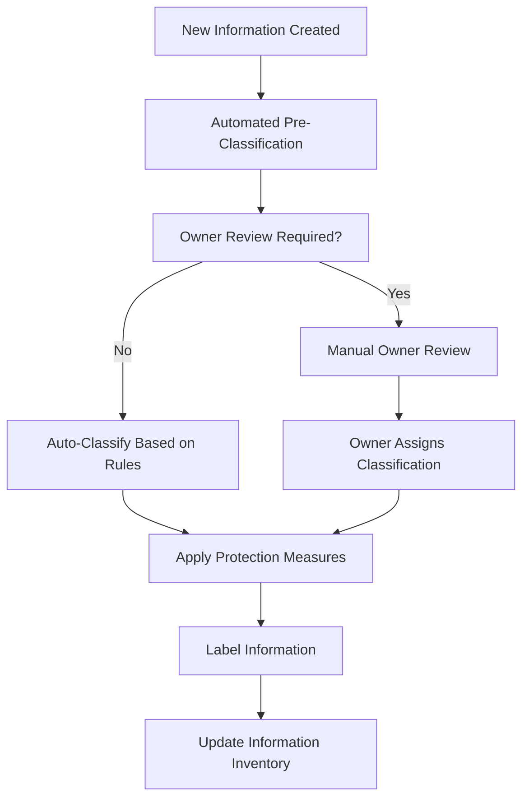

# Data Classification Policy - ISO 27001

## ArionComply Platform Metadata

```yaml
# Template Configuration
template_id: ISO27001-DATA-CLASSIFICATION-001
template_type: data_classification_policy
template_version: 1.0
template_status: draft
created_date: {{CURRENT_DATE}}
last_modified: {{CURRENT_DATE}}
template_category: operational_policy
compliance_framework: ISO27001:2022
template_owner: {{TEMPLATE_OWNER}}
approval_status: pending_review

# Platform Integration
platform_features:
  - automated_classification
  - data_discovery
  - classification_workflows
  - compliance_reporting
  - integration_apis
  - audit_logging

# Dependencies
depends_on:
  - access_control_policy
  - information_security_policy
  - isms_policy
  - risk_management_policy

# Usage Context
applicable_controls:
  - A.5.12  # Classification of information
  - A.5.13  # Labelling of information
  - A.5.14  # Information transfer
  - A.8.10  # Information deletion
  - A.8.12  # Data leakage prevention
```

---

## **Document Control Information**

| **Element** | **Details** | **Description** |
|-------------|-------------|-----------------|
| **Document ID** | {{TEMPLATE_ID}} | *Unique identifier for this data classification policy* |
| **Document Title** | Data Classification Policy | *Policy for classifying and handling organizational information* |
| **ISO 27001 Reference** | A.5.12, A.5.13, A.5.14 | *Primary controls addressed by this policy* |
| **Document Owner** | {{POLICY_OWNER}} | *Person responsible for policy maintenance* |
| **Approval Authority** | {{APPROVAL_AUTHORITY}} | *Authority responsible for policy approval* |
| **Effective Date** | {{EFFECTIVE_DATE}} | *Date when policy becomes effective* |
| **Review Frequency** | {{REVIEW_FREQUENCY}} | *How often policy will be reviewed* |
| **Next Review Date** | {{NEXT_REVIEW_DATE}} | *Scheduled date for next policy review* |
| **Classification Level** | {{DOCUMENT_CLASSIFICATION}} | *Classification level of this document* |

---

## **1. Policy Foundation**

### **1.1 Understanding Data Classification**

Think of data classification like organizing a library. Just as a library categorizes books by subject, sensitivity, and access level (public reading room vs. restricted archives), organizations must categorize their information assets based on their value, sensitivity, and the level of protection they require.

**Real-World Analogy**: Consider a hospital's information:
- **Public Information**: Hospital location, visiting hours (like books in the lobby)
- **Internal Information**: Staff schedules, policy manuals (like books in the staff library)
- **Confidential Information**: Patient records, financial data (like medical files in locked cabinets)
- **Restricted Information**: Research data, merger plans (like highly sensitive documents in a vault)

### **1.2 Policy Purpose**

This policy establishes a systematic approach to:
- **Identify** information assets and their business value
- **Classify** information based on sensitivity and criticality
- **Label** information appropriately for proper handling
- **Protect** information according to its classification level
- **Ensure** compliance with regulatory and business requirements

### **1.3 Policy Scope**

This policy applies to:
- **All Information Assets**: Digital, physical, and verbal information
- **All Personnel**: Employees, contractors, vendors, and business partners
- **All Systems**: IT systems, applications, databases, and storage media
- **All Locations**: On-premises, cloud, remote, and mobile environments
- **All Processes**: Creation, processing, storage, transmission, and disposal

---

## **2. Classification Framework**

### **2.1 Classification Levels**

#### **2.1.1 Public Information**
**Definition**: Information that can be freely shared with the public without risk to the organization.

**Characteristics**:
- **Business Impact**: No negative impact if disclosed
- **Regulatory Status**: No regulatory restrictions
- **Competitive Value**: No competitive advantage loss
- **Access Control**: No access restrictions required

**Examples**:
- Marketing materials and public websites
- Published research and whitepapers
- Press releases and public announcements
- General company information and policies

**Handling Requirements**:
- **Storage**: No special storage requirements
- **Transmission**: No encryption required
- **Access**: Unrestricted access
- **Disposal**: Standard disposal methods

#### **2.1.2 Internal Information**
**Definition**: Information intended for internal use within the organization.

**Characteristics**:
- **Business Impact**: Minor impact if disclosed externally
- **Regulatory Status**: May have some regulatory considerations
- **Competitive Value**: Limited competitive sensitivity
- **Access Control**: Access limited to authorized personnel

**Examples**:
- Internal policies and procedures
- Employee directories and organizational charts
- Project plans and meeting minutes
- Training materials and documentation

**Handling Requirements**:
- **Storage**: Controlled access storage systems
- **Transmission**: Secure channels for external transmission
- **Access**: Role-based access controls
- **Disposal**: Secure deletion/destruction

#### **2.1.3 Confidential Information**
**Definition**: Sensitive information that could cause significant harm if disclosed.

**Characteristics**:
- **Business Impact**: Significant negative impact if disclosed
- **Regulatory Status**: May be subject to regulatory protection
- **Competitive Value**: High competitive sensitivity
- **Access Control**: Strict access controls required

**Examples**:
- Customer data and personal information
- Financial records and business plans
- Proprietary technology and trade secrets
- Vendor contracts and pricing information

**Handling Requirements**:
- **Storage**: Encrypted storage with access logging
- **Transmission**: Encrypted transmission channels
- **Access**: Need-to-know basis with approval
- **Disposal**: Certified secure destruction

#### **2.1.4 Restricted Information**
**Definition**: Highly sensitive information requiring the highest level of protection.

**Characteristics**:
- **Business Impact**: Severe or catastrophic impact if disclosed
- **Regulatory Status**: Subject to strict regulatory requirements
- **Competitive Value**: Critical competitive advantage
- **Access Control**: Extremely limited access with strong controls

**Examples**:
- Merger and acquisition plans
- Executive compensation details
- Classified government information
- Critical security vulnerabilities

**Handling Requirements**:
- **Storage**: Highest security storage with multi-factor authentication
- **Transmission**: Encrypted and authenticated channels only
- **Access**: Executive approval required with detailed justification
- **Disposal**: Witnessed destruction with certificates

### **2.2 Classification Criteria Matrix**

| **Criteria** | **Public** | **Internal** | **Confidential** | **Restricted** |
|--------------|------------|--------------|------------------|----------------|
| **Business Impact** | None | Low | Medium-High | Severe |
| **Regulatory Requirements** | None | Minimal | Moderate | High |
| **Competitive Sensitivity** | None | Low | High | Critical |
| **Access Restrictions** | None | Role-based | Need-to-know | Executive approval |
| **Encryption Requirements** | None | External only | Always | Always + enhanced |
| **Audit Logging** | None | Basic | Detailed | Comprehensive |
| **Retention Period** | Indefinite | Standard | Extended | Lifetime |

---

## **3. Classification Process**

### **3.1 Data Discovery and Inventory**

#### **3.1.1 Automated Discovery**
**ArionComply Platform Integration**:
```yaml
data_discovery:
  automated_scanning:
    - file_systems
    - databases
    - cloud_storage
    - email_systems
    - collaboration_tools
  
  discovery_methods:
    - content_analysis
    - pattern_matching
    - metadata_examination
    - user_behavior_analysis
  
  classification_engines:
    - machine_learning_models
    - rule_based_classification
    - content_fingerprinting
    - context_analysis
```

#### **3.1.2 Manual Classification Process**
**Step-by-Step Classification**:

1. **Information Identification**
   - Catalog all information assets
   - Document information flows
   - Identify information owners
   - Map system dependencies

2. **Business Impact Assessment**
   - Evaluate potential business impact
   - Consider regulatory requirements
   - Assess competitive implications
   - Determine access requirements

3. **Classification Assignment**
   - Apply classification criteria
   - Document classification rationale
   - Assign information owner
   - Define handling requirements

4. **Validation and Approval**
   - Review classification decisions
   - Obtain owner approval
   - Document exceptions
   - Update information inventory

### **3.2 Information Ownership**

#### **3.2.1 Owner Responsibilities**
**Information Owner Duties**:
- **Classification**: Determine appropriate classification level
- **Access Control**: Define who can access information
- **Handling Requirements**: Specify protection requirements
- **Review and Updates**: Regularly review classification decisions
- **Compliance**: Ensure adherence to classification requirements

#### **3.2.2 Custodian Responsibilities**
**Information Custodian Duties**:
- **Implementation**: Implement protection measures
- **Maintenance**: Maintain security controls
- **Monitoring**: Monitor access and usage
- **Reporting**: Report security incidents
- **Support**: Provide technical support for protection measures

### **3.3 Classification Workflows**

#### **3.3.1 New Information Classification**


#### **3.3.2 Reclassification Process**
**Triggers for Reclassification**:
- **Scheduled Review**: Regular classification reviews
- **Content Changes**: Significant information updates
- **Business Changes**: Change in business value or sensitivity
- **Regulatory Changes**: New regulatory requirements
- **Security Incidents**: Incidents affecting information sensitivity

---

## **4. Information Labeling**

### **4.1 Labeling Requirements**

#### **4.1.1 Digital Information Labeling**
**Metadata Labels**:
- **Classification Level**: Public, Internal, Confidential, Restricted
- **Information Owner**: Responsible business owner
- **Creation Date**: When information was created
- **Classification Date**: When classification was assigned
- **Review Date**: Next scheduled review date
- **Handling Instructions**: Specific protection requirements

**Visual Labels**:
- **Document Headers**: Classification level in document header
- **Email Subjects**: Classification prefix in email subjects
- **File Names**: Classification indicator in file names
- **Watermarks**: Visual classification watermarks

#### **4.1.2 Physical Information Labeling**
**Physical Labels**:
- **Document Covers**: Classification level prominently displayed
- **Storage Containers**: Classification labels on boxes/cabinets
- **Media Labels**: Classification on removable media
- **Workstation Labels**: Classification of displayed information

### **4.2 Labeling Standards**

#### **4.2.1 Label Formats**
**Standard Label Formats**:
- **Public**: `[PUBLIC]` - Green color coding
- **Internal**: `[INTERNAL]` - Blue color coding  
- **Confidential**: `[CONFIDENTIAL]` - Yellow color coding
- **Restricted**: `[RESTRICTED]` - Red color coding

#### **4.2.2 ArionComply Automated Labeling**
```yaml
automated_labeling:
  digital_content:
    - document_metadata
    - email_headers
    - file_properties
    - database_records
  
  labeling_rules:
    - classification_triggers
    - content_patterns
    - user_roles
    - system_contexts
  
  label_propagation:
    - derivative_content
    - shared_documents
    - extracted_data
    - backup_copies
```

---

## **5. Information Handling Requirements**

### **5.1 Handling by Classification Level**

#### **5.1.1 Public Information Handling**
**Storage Requirements**:
- **Access Control**: No special access controls required
- **Encryption**: Not required
- **Backup**: Standard backup procedures
- **Archival**: Standard archival processes

**Transmission Requirements**:
- **Internal**: No encryption required
- **External**: No special requirements
- **Email**: Standard email acceptable
- **File Transfer**: Standard methods acceptable

#### **5.1.2 Internal Information Handling**
**Storage Requirements**:
- **Access Control**: Role-based access controls
- **Encryption**: Recommended for sensitive systems
- **Backup**: Encrypted backup recommended
- **Archival**: Secure archival with access controls

**Transmission Requirements**:
- **Internal**: Secure internal networks
- **External**: Encrypted transmission preferred
- **Email**: Encrypted email for sensitive content
- **File Transfer**: Secure file transfer methods

#### **5.1.3 Confidential Information Handling**
**Storage Requirements**:
- **Access Control**: Strict role-based access with approval
- **Encryption**: Required for all storage
- **Backup**: Encrypted backup with access logging
- **Archival**: Encrypted archival with extended retention

**Transmission Requirements**:
- **Internal**: Encrypted internal transmission
- **External**: Encrypted transmission mandatory
- **Email**: Encrypted email mandatory
- **File Transfer**: Secure, encrypted file transfer only

#### **5.1.4 Restricted Information Handling**
**Storage Requirements**:
- **Access Control**: Multi-factor authentication required
- **Encryption**: Strongest encryption standards
- **Backup**: Encrypted backup with segregated access
- **Archival**: Lifetime retention with enhanced security

**Transmission Requirements**:
- **Internal**: Encrypted with authentication
- **External**: Encrypted with digital signatures
- **Email**: Encrypted email with receipt confirmation
- **File Transfer**: Secure, authenticated transfer only

### **5.2 Special Handling Requirements**

#### **5.2.1 Regulatory Data Handling**
**GDPR Personal Data**:
- **Classification**: Minimum Confidential level
- **Access Control**: Data subject rights compliance
- **Retention**: Defined retention periods
- **Deletion**: Right to erasure compliance
- **Transfer**: Adequate protection requirements

**Financial Data**:
- **Classification**: Minimum Confidential level
- **Access Control**: Segregation of duties
- **Retention**: Regulatory retention requirements
- **Audit**: Comprehensive audit trails
- **Reporting**: Regular compliance reporting

#### **5.2.2 Third-Party Data Handling**
**Customer Data**:
- **Classification**: Based on customer requirements
- **Access Control**: Customer-defined access controls
- **Retention**: Customer-specified retention
- **Deletion**: Customer-controlled deletion
- **Transfer**: Customer-approved transfer methods

**Vendor Data**:
- **Classification**: Based on vendor agreements
- **Access Control**: Vendor-specified controls
- **Retention**: Contract-defined retention
- **Deletion**: Vendor-specified deletion
- **Transfer**: Contract-approved methods

---

## **6. ArionComply Platform Integration**

### **6.1 Automated Classification Engine**

#### **6.1.1 Machine Learning Classification**
**Classification Models**:
```yaml
ml_classification:
  content_analysis:
    - text_classification
    - pattern_recognition
    - sentiment_analysis
    - entity_extraction
  
  training_data:
    - historical_classifications
    - regulatory_patterns
    - business_rules
    - expert_feedback
  
  model_types:
    - supervised_learning
    - unsupervised_clustering
    - deep_learning_models
    - natural_language_processing
```

#### **6.1.2 Rule-Based Classification**
**Classification Rules**:
- **Content Patterns**: Keywords, phrases, data formats
- **Source Systems**: System-based classification rules
- **User Roles**: Role-based classification defaults
- **Context Analysis**: Situational classification logic

### **6.2 Classification Workflows**

#### **6.2.1 Automated Workflows**
**Classification Processes**:
1. **Content Discovery**: Automated content scanning
2. **Pre-Classification**: Initial classification assignment
3. **Owner Notification**: Notification to information owners
4. **Review Process**: Owner review and approval
5. **Label Application**: Automated label application
6. **Protection Implementation**: Security control application

#### **6.2.2 Manual Override Capabilities**
**Manual Controls**:
- **Owner Override**: Information owner can override classification
- **Exception Handling**: Process for classification exceptions
- **Escalation Path**: Escalation for classification disputes
- **Audit Trail**: Complete audit trail of classification decisions

### **6.3 Compliance Reporting**

#### **6.3.1 Classification Metrics**
**Key Performance Indicators**:
- **Classification Coverage**: Percentage of information classified
- **Classification Accuracy**: Accuracy of automated classification
- **Review Compliance**: Percentage of timely reviews completed
- **Exception Rate**: Rate of classification exceptions
- **Reclassification Rate**: Rate of classification changes

#### **6.3.2 Regulatory Reporting**
**Compliance Reports**:
- **Data Inventory**: Complete inventory of classified information
- **Access Reports**: Access control compliance reports
- **Retention Reports**: Retention compliance tracking
- **Deletion Reports**: Information deletion compliance
- **Transfer Reports**: Information transfer compliance

---

## **7. Training and Awareness**

### **7.1 Training Program**

#### **7.1.1 Role-Based Training**
**Training by Role**:
- **Information Owners**: Classification decision making
- **Information Custodians**: Technical protection implementation
- **End Users**: Classification recognition and handling
- **Executives**: Business impact and compliance requirements

#### **7.1.2 Training Content**
**Core Training Topics**:
- **Classification Framework**: Understanding classification levels
- **Business Impact**: Impact of misclassification
- **Handling Requirements**: Proper handling procedures
- **Compliance Requirements**: Regulatory and legal obligations
- **Platform Usage**: ArionComply platform training

### **7.2 Awareness Activities**

#### **7.2.1 Regular Communications**
**Communication Methods**:
- **Monthly Newsletters**: Classification tips and updates
- **Lunch and Learn**: Interactive classification sessions
- **Poster Campaigns**: Visual classification reminders
- **Email Updates**: Regular classification reminders

#### **7.2.2 Performance Monitoring**
**Awareness Metrics**:
- **Training Completion**: Percentage of required training completed
- **Assessment Scores**: Training assessment performance
- **Compliance Rates**: Classification handling compliance
- **Incident Rates**: Classification-related incidents

---

## **8. Monitoring and Compliance**

### **8.1 Monitoring Framework**

#### **8.1.1 Automated Monitoring**
**Monitoring Capabilities**:
- **Access Monitoring**: Real-time access monitoring
- **Usage Monitoring**: Information usage tracking
- **Transfer Monitoring**: Information transfer monitoring
- **Compliance Monitoring**: Automated compliance checking

#### **8.1.2 Manual Reviews**
**Review Processes**:
- **Classification Reviews**: Regular classification reviews
- **Handling Reviews**: Handling procedure reviews
- **Compliance Audits**: Formal compliance audits
- **Exception Reviews**: Classification exception reviews

### **8.2 Compliance Measurement**

#### **8.2.1 Compliance Metrics**
**Key Metrics**:
- **Classification Coverage**: {{CLASSIFICATION_COVERAGE_TARGET}}%
- **Classification Accuracy**: {{CLASSIFICATION_ACCURACY_TARGET}}%
- **Review Timeliness**: {{REVIEW_TIMELINESS_TARGET}}%
- **Handling Compliance**: {{HANDLING_COMPLIANCE_TARGET}}%
- **Training Compliance**: {{TRAINING_COMPLIANCE_TARGET}}%

#### **8.2.2 Performance Reporting**
**Reporting Schedule**:
- **Monthly Reports**: Operational metrics and trends
- **Quarterly Reports**: Compliance assessment and improvements
- **Annual Reports**: Comprehensive program assessment
- **Incident Reports**: Classification-related incidents

---

## **9. Continuous Improvement**

### **9.1 Review and Update Process**

#### **9.1.1 Regular Reviews**
**Review Schedule**:
- **Monthly**: Operational metrics review
- **Quarterly**: Policy effectiveness review
- **Annually**: Comprehensive policy review
- **As Needed**: Incident-driven reviews

#### **9.1.2 Update Process**
**Update Triggers**:
- **Regulatory Changes**: New regulatory requirements
- **Business Changes**: Changes in business environment
- **Technology Changes**: New technology implementations
- **Incident Lessons**: Lessons learned from incidents

### **9.2 Program Enhancement**

#### **9.2.1 Improvement Initiatives**
**Enhancement Areas**:
- **Classification Accuracy**: Improve automated classification
- **User Experience**: Enhance user interface and workflows
- **Integration**: Improve system integrations
- **Compliance**: Enhance compliance capabilities

#### **9.2.2 Innovation Opportunities**
**Emerging Technologies**:
- **AI/ML Enhancement**: Advanced classification algorithms
- **Blockchain**: Immutable classification records
- **Zero Trust**: Enhanced access controls
- **Cloud Security**: Cloud-native classification

---

## **10. Exceptions and Variances**

### **10.1 Exception Management**

#### **10.1.1 Exception Process**
**Exception Workflow**:
1. **Exception Request**: Submit exception request with justification
2. **Risk Assessment**: Assess risks of exception
3. **Approval Process**: Obtain appropriate approvals
4. **Implementation**: Implement exception with controls
5. **Monitoring**: Monitor exception compliance
6. **Review**: Regular review of exception necessity

#### **10.1.2 Exception Types**
**Common Exceptions**:
- **Technical Limitations**: System cannot support classification
- **Business Requirements**: Business needs override classification
- **Regulatory Conflicts**: Conflicting regulatory requirements
- **Legacy Systems**: Legacy system limitations

### **10.2 Variance Management**

#### **10.2.1 Variance Tracking**
**Variance Categories**:
- **Classification Variances**: Deviations from classification standards
- **Handling Variances**: Deviations from handling requirements
- **Process Variances**: Deviations from standard processes
- **Compliance Variances**: Deviations from compliance requirements

#### **10.2.2 Variance Resolution**
**Resolution Process**:
1. **Variance Identification**: Identify and document variance
2. **Root Cause Analysis**: Determine cause of variance
3. **Corrective Action**: Implement corrective measures
4. **Prevention**: Implement preventive measures
5. **Monitoring**: Monitor variance resolution

---

## **11. Roles and Responsibilities**

### **11.1 Organizational Roles**

#### **11.1.1 Data Classification Officer**
**Primary Responsibilities**:
- **Policy Development**: Develop and maintain classification policy
- **Program Management**: Manage classification program
- **Training Coordination**: Coordinate training and awareness
- **Compliance Monitoring**: Monitor compliance with policy
- **Continuous Improvement**: Drive program improvements

#### **11.1.2 Information Owners**
**Key Responsibilities**:
- **Classification Decisions**: Make classification decisions
- **Access Control**: Define access requirements
- **Handling Requirements**: Specify handling requirements
- **Review and Updates**: Review and update classifications
- **Compliance**: Ensure compliance with requirements

#### **11.1.3 Information Custodians**
**Technical Responsibilities**:
- **Implementation**: Implement technical controls
- **Maintenance**: Maintain security measures
- **Monitoring**: Monitor system compliance
- **Reporting**: Report issues and incidents
- **Support**: Provide technical support

### **11.2 User Responsibilities**

#### **11.2.1 All Users**
**Basic Responsibilities**:
- **Recognition**: Recognize classification labels
- **Handling**: Handle information according to classification
- **Reporting**: Report classification issues
- **Training**: Complete required training
- **Compliance**: Comply with policy requirements

#### **11.2.2 Privileged Users**
**Enhanced Responsibilities**:
- **Enhanced Care**: Exercise enhanced care with classified information
- **Access Logging**: Understand access logging requirements
- **Incident Reporting**: Report incidents promptly
- **Compliance Monitoring**: Monitor own compliance
- **Best Practices**: Follow security best practices

---

## **12. Implementation Checklist**

### **12.1 Pre-Implementation**
- [ ] **Stakeholder Engagement**: Engage key stakeholders
- [ ] **Resource Allocation**: Allocate necessary resources
- [ ] **System Requirements**: Define system requirements
- [ ] **Training Development**: Develop training materials
- [ ] **Communication Plan**: Develop communication plan

### **12.2 Implementation Phase**
- [ ] **System Configuration**: Configure ArionComply platform
- [ ] **Policy Deployment**: Deploy classification policy
- [ ] **Training Delivery**: Deliver training to users
- [ ] **Pilot Testing**: Conduct pilot testing
- [ ] **Go-Live**: Full implementation go-live

### **12.3 Post-Implementation**
- [ ] **Monitoring Setup**: Establish monitoring processes
- [ ] **Compliance Measurement**: Implement compliance measurement
- [ ] **Continuous Improvement**: Establish improvement processes
- [ ] **Regular Reviews**: Schedule regular reviews
- [ ] **Incident Response**: Establish incident response procedures

---

## **13. Related Documents**

### **13.1 Policy Dependencies**
- **Information Security Policy**: Overall security framework
- **Access Control Policy**: Access control requirements
- **Risk Management Policy**: Risk assessment and treatment
- **ISMS Policy**: Information security management system

### **13.2 Procedure References**
- **Data Handling Procedures**: Detailed handling procedures
- **Access Control Procedures**: Access control implementation
- **Incident Response Procedures**: Incident handling procedures
- **Training Procedures**: Training delivery procedures

### **13.3 Technical Standards**
- **Encryption Standards**: Encryption requirements
- **Labeling Standards**: Label format standards
- **System Standards**: System security standards
- **Monitoring Standards**: Monitoring requirements

---

## **14. Appendices**

### **14.1 Classification Decision Tree**
```
START: New Information Asset
├── Is it publicly available? → YES → [PUBLIC]
├── Is it for internal use only? → YES → [INTERNAL]
├── Would disclosure cause significant harm? → YES → [CONFIDENTIAL]
└── Would disclosure cause severe harm? → YES → [RESTRICTED]
```

### **14.2 Handling Requirements Summary**
| **Classification** | **Storage** | **Transmission** | **Access** | **Disposal** |
|-------------------|-------------|------------------|------------|--------------|
| **Public** | Standard | Standard | Open | Standard |
| **Internal** | Controlled | Secure preferred | Role-based | Secure |
| **Confidential** | Encrypted | Encrypted | Need-to-know | Certified |
| **Restricted** | Enhanced | Authenticated | Executive approval | Witnessed |

### **14.3 Regulatory Mapping**
| **Regulation** | **Requirements** | **Classification Impact** |
|---------------|------------------|---------------------------|
| **GDPR** | Personal data protection | Minimum Confidential |
| **SOX** | Financial data protection | Minimum Confidential |
| **HIPAA** | Health data protection | Minimum Confidential |
| **PCI DSS** | Payment card data | Minimum Confidential |

---

**Document Status**: {{DOCUMENT_STATUS}}  
**Version**: {{VERSION_NUMBER}}  
**Last Updated**: {{LAST_UPDATED}}  
**Next Review**: {{NEXT_REVIEW_DATE}}  
**Owner**: {{DOCUMENT_OWNER}}  
**Approved By**: {{APPROVED_BY}}  
**Approval Date**: {{APPROVAL_DATE}}