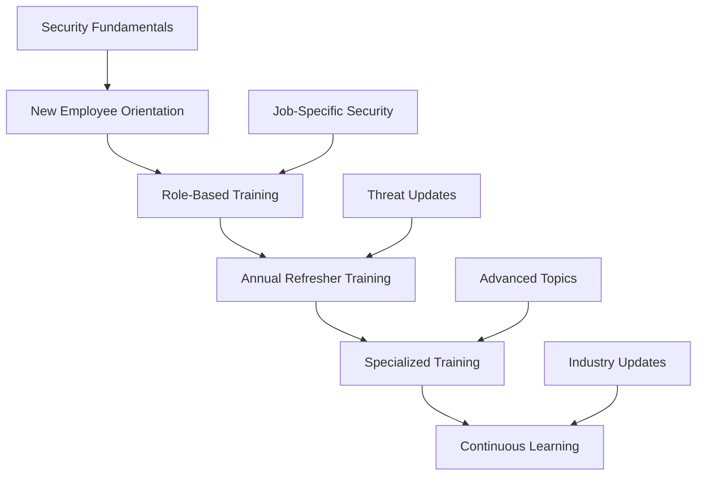
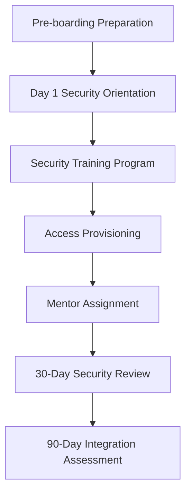

# Human Resources Security Policy - ISO 27001

## ArionComply Platform Metadata

```yaml
# Template Configuration
template_id: ISO27001-HR-SECURITY-001
template_type: human_resources_security_policy
template_version: 1.0
template_status: draft
created_date: {{CURRENT_DATE}}
last_modified: {{CURRENT_DATE}}
template_category: operational_policy
compliance_framework: ISO27001:2022
template_owner: {{TEMPLATE_OWNER}}
approval_status: pending_review

# Platform Integration
platform_features:
  - employee_lifecycle_management
  - security_training_tracking
  - access_review_automation
  - compliance_monitoring
  - incident_correlation
  - performance_analytics

# Dependencies
depends_on:
  - supplier_relationship_management_policy
  - access_control_policy
  - data_classification_policy
  - incident_response_policy
  - information_security_policy
  - physical_environmental_security_policy

# Usage Context
applicable_controls:
  - A.6.1   # Screening
  - A.6.2   # Terms and conditions of employment
  - A.6.3   # Information security awareness, education and training
  - A.6.4   # Disciplinary process
  - A.6.5   # Information security responsibilities
  - A.6.6   # Confidentiality or non-disclosure agreements
  - A.6.7   # Remote working
  - A.6.8   # Information security event reporting
```

---

## **Document Control Information**

| **Element** | **Details** | **Description** |
|-------------|-------------|-----------------|
| **Document ID** | {{TEMPLATE_ID}} | *Unique identifier for this HR security policy* |
| **Document Title** | Human Resources Security Policy | *Policy for managing human resources security throughout employment lifecycle* |
| **ISO 27001 Reference** | A.6.1-A.6.8 | *Primary controls addressed by this policy* |
| **Document Owner** | {{POLICY_OWNER}} | *Person responsible for policy maintenance* |
| **Approval Authority** | {{APPROVAL_AUTHORITY}} | *Authority responsible for policy approval* |
| **Effective Date** | {{EFFECTIVE_DATE}} | *Date when policy becomes effective* |
| **Review Frequency** | {{REVIEW_FREQUENCY}} | *How often policy will be reviewed* |
| **Next Review Date** | {{NEXT_REVIEW_DATE}} | *Scheduled date for next policy review* |
| **Classification Level** | {{DOCUMENT_CLASSIFICATION}} | *Classification level of this document* |

---

## **1. Policy Foundation**

### **1.1 Understanding Human Resources Security**

Think of human resources security like building and maintaining a trusted team for a high-security operation. Just as a government intelligence agency must carefully vet, train, and manage its personnel throughout their careers - from initial recruitment through retirement - organizations must implement comprehensive security measures throughout the entire employee lifecycle to protect their most valuable assets: information and systems.

**Real-World Analogy**: Consider how a bank manages its employees:
- **Pre-Employment**: Like conducting thorough background checks before hiring tellers who will handle money
- **Onboarding**: Like providing extensive training on security procedures and bank policies
- **Ongoing Management**: Like regular training updates and periodic security reviews
- **Access Management**: Like ensuring employees only have access to the vaults and systems they need
- **Incident Response**: Like having clear procedures when an employee reports suspicious activity
- **Termination**: Like immediately revoking access and collecting all bank property when someone leaves

Each stage requires different security considerations and controls to maintain the trust and security of the institution.

### **1.2 Policy Purpose**

This policy establishes a comprehensive framework to:
- **Secure the Employment Lifecycle**: Implement security controls throughout employment phases
- **Manage Human Risk**: Identify, assess, and mitigate risks associated with personnel
- **Ensure Competency**: Maintain appropriate security knowledge and skills
- **Protect Information Assets**: Safeguard information through proper personnel management
- **Maintain Compliance**: Meet regulatory and legal requirements for personnel security

### **1.3 Policy Scope**

This policy applies to:
- **All Personnel**: Employees, contractors, temporary staff, and interns
- **All Employment Phases**: Pre-employment, onboarding, employment, and termination
- **All Roles**: From entry-level positions to executive management
- **All Locations**: On-site, remote, hybrid, and traveling employees
- **All Employment Types**: Full-time, part-time, contract, and temporary positions

---

## **2. Pre-Employment Security**

### **2.1 Background Screening Framework**

#### **2.1.1 Risk-Based Screening**
**Screening Requirements by Role Risk Level**:

| **Risk Level** | **Role Examples** | **Screening Requirements** | **Verification Depth** |
|----------------|-------------------|----------------------------|------------------------|
| **High Risk** | Executives, IT admins, finance | Comprehensive background check | 7-10 years |
| **Medium Risk** | Managers, customer service | Standard background check | 5-7 years |
| **Standard Risk** | General employees | Basic background check | 3-5 years |
| **Low Risk** | Temporary, limited access | Reference check | Current employment |

#### **2.1.2 Screening Components**
**Comprehensive Screening Framework**:
- **Identity Verification**: Government-issued ID verification
- **Employment History**: Previous employment verification
- **Education Verification**: Educational credential verification
- **Criminal Background**: Criminal history check
- **Credit Check**: Financial background check (when relevant)
- **Reference Checks**: Professional and personal references
- **Social Media Review**: Public social media screening
- **Professional Licenses**: Professional license verification

#### **2.1.3 Specialized Screening Requirements**
**Enhanced Screening for Sensitive Roles**:

**IT and Security Roles**:
- **Technical Certifications**: IT and security certification verification
- **Previous Security Incidents**: History of security-related issues
- **Access to Sensitive Systems**: Enhanced background investigation
- **Ongoing Monitoring**: Periodic re-screening requirements

**Financial Roles**:
- **Financial History**: Detailed financial background check
- **Bankruptcy History**: Bankruptcy and financial distress history
- **Credit Score**: Credit score and financial stability assessment
- **Financial Crimes**: History of financial crimes or misconduct

**Customer-Facing Roles**:
- **Customer Interaction History**: Previous customer service issues
- **Communication Skills**: Communication and interpersonal skills assessment
- **Cultural Fit**: Organizational culture alignment assessment
- **Conflict Resolution**: Conflict resolution and problem-solving skills

### **2.2 Pre-Employment Assessment**

#### **2.2.1 Security Awareness Assessment**
**Baseline Security Knowledge Evaluation**:
- **Security Fundamentals**: Basic information security concepts
- **Policy Understanding**: Understanding of security policies
- **Threat Awareness**: Awareness of common security threats
- **Incident Reporting**: Knowledge of incident reporting procedures
- **Compliance Understanding**: Understanding of relevant regulations

#### **2.2.2 Role-Specific Assessments**
**Technical and Functional Assessments**:
- **Technical Skills**: Role-specific technical competency assessment
- **Security Skills**: Security-related skill assessment
- **Problem-Solving**: Security problem-solving scenarios
- **Ethics**: Ethical decision-making scenarios
- **Judgment**: Security judgment and decision-making assessment

### **2.3 ArionComply Pre-Employment Integration**

#### **2.3.1 Automated Screening Workflow**
**Screening Automation Platform**:
```yaml
pre_employment_screening:
  screening_automation:
    - background_check_integration
    - reference_verification
    - education_verification
    - criminal_history_check
  
  risk_assessment:
    - role_risk_classification
    - screening_requirement_determination
    - risk_score_calculation
    - approval_workflow
  
  compliance_tracking:
    - regulatory_compliance
    - documentation_management
    - audit_trail_maintenance
    - exception_tracking
```

#### **2.3.2 Screening Analytics**
**Data-Driven Screening Insights**:
- **Screening Effectiveness**: Analysis of screening effectiveness
- **Risk Indicators**: Identification of risk indicators and patterns
- **Compliance Metrics**: Screening compliance measurement
- **Quality Metrics**: Screening quality and accuracy metrics
- **Trend Analysis**: Screening trend analysis and forecasting

---

## **3. Employment Terms and Agreements**

### **3.1 Security-Related Employment Terms**

#### **3.1.1 Information Security Responsibilities**
**Core Security Responsibilities**:
- **Policy Compliance**: Adherence to all information security policies
- **Asset Protection**: Protection of organizational information assets
- **Access Control**: Appropriate use of system and data access
- **Incident Reporting**: Prompt reporting of security incidents
- **Confidentiality**: Maintenance of information confidentiality
- **Continuous Learning**: Participation in security training and awareness

#### **3.1.2 Acceptable Use Provisions**
**Technology and Information Use**:
- **System Usage**: Appropriate use of organizational systems
- **Internet Usage**: Acceptable internet and email usage
- **Mobile Device Usage**: Personal and corporate mobile device usage
- **Social Media Usage**: Professional social media conduct
- **Intellectual Property**: Respect for intellectual property rights
- **Data Handling**: Proper handling of organizational data

### **3.2 Confidentiality and Non-Disclosure Agreements**

#### **3.2.1 NDA Framework by Role**
**Role-Based Confidentiality Requirements**:

| **Role Level** | **NDA Type** | **Scope** | **Duration** |
|----------------|--------------|-----------|--------------|
| **Executive** | Comprehensive | All business information | Indefinite |
| **Management** | Standard | Department information | 5 years post-employment |
| **Professional** | Standard | Role-specific information | 3 years post-employment |
| **General** | Basic | General business information | 2 years post-employment |

#### **3.2.2 Confidentiality Categories**
**Information Classification in NDAs**:
- **Trade Secrets**: Proprietary methods, processes, and innovations
- **Customer Information**: Customer data, lists, and preferences
- **Financial Information**: Financial data, plans, and projections
- **Strategic Information**: Business plans, strategies, and decisions
- **Technical Information**: Technical specifications, designs, and code
- **Personnel Information**: Employee data and organizational structure

### **3.3 Security Responsibilities Matrix**

#### **3.3.1 Role-Based Security Responsibilities**
**Security Responsibilities by Role**:

| **Role Category** | **Information Security** | **Physical Security** | **Personnel Security** |
|-------------------|-------------------------|----------------------|----------------------|
| **Executives** | Strategic oversight | Facility security | Background requirements |
| **Managers** | Team compliance | Area security | Team screening |
| **IT Staff** | System security | Equipment security | Enhanced screening |
| **General Staff** | Data protection | Workspace security | Standard screening |

#### **3.3.2 Accountability Framework**
**Performance and Security Integration**:
- **Performance Goals**: Security-related performance objectives
- **Competency Requirements**: Security competency requirements
- **Training Requirements**: Mandatory security training requirements
- **Review Criteria**: Security-related performance review criteria
- **Consequences**: Consequences for security policy violations

---

## **4. Security Awareness and Training**

### **4.1 Security Training Framework**

#### **4.1.1 Training Program Structure**
**Comprehensive Training Curriculum**:



#### **4.1.2 Training Content by Role**
**Role-Specific Training Programs**:

**Executive Training**:
- **Governance and Oversight**: Security governance and executive responsibilities
- **Risk Management**: Security risk management and decision-making
- **Incident Response**: Executive incident response and crisis management
- **Compliance**: Regulatory compliance and legal responsibilities
- **Strategic Planning**: Security strategy and business alignment

**Management Training**:
- **Team Leadership**: Leading security-conscious teams
- **Policy Implementation**: Implementing security policies and procedures
- **Incident Management**: Managing security incidents and responses
- **Performance Management**: Security performance management
- **Change Management**: Managing security-related changes

**Technical Training**:
- **System Security**: Technical system security controls
- **Threat Detection**: Security monitoring and threat detection
- **Incident Response**: Technical incident response procedures
- **Secure Development**: Secure coding and development practices
- **Vulnerability Management**: Vulnerability assessment and remediation

**General Employee Training**:
- **Security Awareness**: Basic security awareness and concepts
- **Threat Recognition**: Recognizing common security threats
- **Safe Practices**: Safe computing and information handling practices
- **Incident Reporting**: Reporting security incidents and concerns
- **Compliance**: Understanding and complying with security policies

### **4.2 Training Delivery Methods**

#### **4.2.1 Multi-Modal Training Approach**
**Training Delivery Options**:
- **Instructor-Led Training**: Face-to-face classroom training
- **Virtual Training**: Online instructor-led training sessions
- **E-Learning**: Self-paced online training modules
- **Microlearning**: Short, focused learning segments
- **Simulation**: Hands-on security simulation exercises
- **Gamification**: Game-based security learning experiences

#### **4.2.2 Personalized Learning**
**Adaptive Training Framework**:
- **Learning Paths**: Personalized learning paths based on role and experience
- **Competency Assessment**: Pre and post-training competency assessment
- **Progress Tracking**: Individual progress tracking and reporting
- **Remedial Training**: Additional training for knowledge gaps
- **Advanced Training**: Advanced training for high performers

### **4.3 ArionComply Training Integration**

#### **4.3.1 Training Management Platform**
**Integrated Training System**:
```yaml
training_management:
  content_delivery:
    - multi_modal_training
    - personalized_learning_paths
    - competency_assessments
    - progress_tracking
  
  training_automation:
    - automated_enrollment
    - reminder_notifications
    - completion_tracking
    - compliance_reporting
  
  analytics:
    - learning_analytics
    - performance_metrics
    - compliance_monitoring
    - effectiveness_measurement
```

#### **4.3.2 Training Analytics and Reporting**
**Training Performance Insights**:
- **Completion Rates**: Training completion rates by role and department
- **Competency Scores**: Security competency assessment scores
- **Knowledge Retention**: Knowledge retention and application metrics
- **Behavioral Change**: Security behavior change measurement
- **ROI Analysis**: Training return on investment analysis

---

## **5. Remote Work Security**

### **5.1 Remote Work Framework**

#### **5.1.1 Remote Work Risk Assessment**
**Remote Work Risk Categories**:
- **Technical Risks**: Insecure networks, personal devices, software vulnerabilities
- **Physical Risks**: Unauthorized access, equipment theft, privacy concerns
- **Operational Risks**: Reduced supervision, communication challenges
- **Compliance Risks**: Regulatory compliance in remote environments
- **Human Risks**: Isolation, reduced security awareness, family access

#### **5.1.2 Remote Work Security Controls**
**Comprehensive Remote Work Security**:

| **Control Category** | **Requirements** | **Implementation** | **Monitoring** |
|---------------------|------------------|--------------------|----------------|
| **Network Security** | VPN, secure Wi-Fi | Mandatory VPN usage | Connection monitoring |
| **Device Security** | Endpoint protection | MDM deployment | Device compliance |
| **Data Protection** | Encryption, DLP | Automatic encryption | Data access monitoring |
| **Physical Security** | Secure workspace | Home office guidelines | Self-assessment |
| **Access Control** | MFA, time limits | Identity management | Access logging |

### **5.2 Remote Work Policies**

#### **5.2.1 Home Office Security**
**Home Office Requirements**:
- **Physical Security**: Secure workspace requirements
- **Environmental Security**: Appropriate lighting, ergonomics, and privacy
- **Network Security**: Secure internet connection requirements
- **Device Security**: Personal and corporate device security
- **Family Access**: Restrictions on family member access
- **Visitor Policies**: Policies for visitors during work hours

#### **5.2.2 Mobile and Flexible Work**
**Mobile Work Security**:
- **Location Restrictions**: Approved work locations and restrictions
- **Public Wi-Fi**: Public Wi-Fi usage policies and restrictions
- **Travel Security**: Security requirements for business travel
- **Coworking Spaces**: Security requirements for coworking spaces
- **Client Sites**: Security requirements when working at client locations

### **5.3 Remote Work Monitoring and Support**

#### **5.3.1 Remote Work Monitoring**
**Monitoring Framework**:
- **Productivity Monitoring**: Work productivity and output monitoring
- **Security Monitoring**: Security event and incident monitoring
- **Compliance Monitoring**: Policy compliance monitoring
- **Well-being Monitoring**: Employee well-being and engagement
- **Performance Monitoring**: Work performance and quality monitoring

#### **5.3.2 Remote Work Support**
**Support Services**:
- **Technical Support**: Remote technical support and troubleshooting
- **Security Support**: Remote security support and guidance
- **Training Support**: Remote training and skill development
- **Mental Health Support**: Mental health and well-being support
- **Career Development**: Remote career development and advancement

---

## **6. Employee Performance and Conduct**

### **6.1 Security Performance Management**

#### **6.1.1 Security Performance Metrics**
**Individual Security Performance Indicators**:
- **Policy Compliance**: Adherence to security policies and procedures
- **Training Completion**: Security training completion and scores
- **Incident Reporting**: Quality and timeliness of incident reporting
- **Security Behavior**: Observable security-conscious behavior
- **Continuous Improvement**: Participation in security improvement initiatives

#### **6.1.2 Performance Review Integration**
**Security in Performance Reviews**:
- **Security Objectives**: Security-related performance objectives
- **Competency Assessment**: Security competency evaluation
- **Behavioral Assessment**: Security behavior and attitude assessment
- **Development Planning**: Security skill development planning
- **Recognition**: Recognition for exceptional security performance

### **6.2 Disciplinary Framework**

#### **6.2.1 Progressive Discipline**
**Security Violation Response Framework**:

| **Severity Level** | **Examples** | **First Offense** | **Repeat Offense** |
|-------------------|--------------|-------------------|-------------------|
| **Minor** | Password sharing, unlocked workstation | Verbal warning | Written warning |
| **Moderate** | Policy violation, unauthorized access | Written warning | Suspension |
| **Serious** | Data breach, malicious activity | Suspension | Termination |
| **Severe** | Criminal activity, intentional harm | Immediate termination | Legal action |

#### **6.2.2 Investigation Process**
**Security Incident Investigation**:
1. **Immediate Response**: Immediate containment and preservation
2. **Investigation Planning**: Investigation scope and resource planning
3. **Evidence Collection**: Digital and physical evidence collection
4. **Interview Process**: Witness and subject interviews
5. **Analysis**: Evidence analysis and conclusion development
6. **Reporting**: Investigation report and recommendations
7. **Action Implementation**: Disciplinary or corrective action implementation

### **6.3 Employee Recognition and Incentives**

#### **6.3.1 Security Recognition Programs**
**Positive Reinforcement Framework**:
- **Security Champion**: Monthly security champion recognition
- **Incident Reporting**: Recognition for effective incident reporting
- **Continuous Learning**: Recognition for ongoing security education
- **Innovation**: Recognition for security innovation and improvement
- **Team Achievement**: Team-based security achievement recognition

#### **6.3.2 Incentive Programs**
**Security Incentive Structure**:
- **Training Incentives**: Incentives for completing additional training
- **Certification Incentives**: Support for security certifications
- **Performance Bonuses**: Security performance-based bonuses
- **Career Advancement**: Security skills in promotion criteria
- **Professional Development**: Security conference and training opportunities

---

## **7. Employee Lifecycle Management**

### **7.1 Onboarding Security**

#### **7.1.1 Security Onboarding Process**
**Comprehensive Security Onboarding**:


#### **7.1.2 New Employee Security Checklist**
**Onboarding Security Requirements**:
- **Security Orientation**: Comprehensive security orientation session
- **Policy Acknowledgment**: Security policy review and acknowledgment
- **Training Enrollment**: Security training program enrollment
- **Access Provisioning**: Role-appropriate access provisioning
- **Equipment Assignment**: Secure equipment assignment and configuration
- **Mentor Assignment**: Security mentor assignment
- **Contact Information**: Emergency and security contact information

### **7.2 Role Changes and Transfers**

#### **7.2.1 Internal Mobility Security**
**Role Change Security Process**:
- **Access Review**: Current access review and modification
- **New Role Training**: Security training for new role responsibilities
- **Clearance Verification**: Security clearance verification for new role
- **Transition Planning**: Secure knowledge and responsibility transition
- **Monitoring**: Enhanced monitoring during transition period

#### **7.2.2 Promotion and Career Development**
**Career Development Security**:
- **Security Leadership Training**: Leadership security training programs
- **Advanced Certifications**: Advanced security certification support
- **Mentoring Programs**: Security mentoring and development programs
- **Cross-Training**: Security cross-training opportunities
- **Succession Planning**: Security succession planning

### **7.3 Employee Termination Security**

#### **7.3.1 Termination Process**
**Secure Termination Framework**:

| **Termination Type** | **Notice Period** | **Access Termination** | **Equipment Return** |
|---------------------|-------------------|------------------------|---------------------|
| **Voluntary** | 2 weeks standard | Last day | Scheduled return |
| **Involuntary** | Immediate | Immediate | Immediate return |
| **Retirement** | 30 days | Last day | Scheduled return |
| **Security Violation** | Immediate | Immediate | Escorted return |

#### **7.3.2 Termination Security Checklist**
**Comprehensive Termination Security**:
- **Access Termination**: Immediate termination of all system access
- **Equipment Return**: Return of all organizational equipment
- **Data Deletion**: Deletion of organizational data from personal devices
- **Key Return**: Return of physical keys and access cards
- **Knowledge Transfer**: Secure knowledge transfer to remaining staff
- **Exit Interview**: Security-focused exit interview
- **Documentation**: Complete termination documentation
- **Monitoring**: Post-termination monitoring for unusual activity

---

## **8. Contractor and Temporary Staff Management**

### **8.1 Non-Employee Security Framework**

#### **8.1.1 Contractor Classification**
**Contractor Risk Assessment**:

| **Contractor Type** | **Risk Level** | **Screening Requirements** | **Supervision Level** |
|---------------------|----------------|----------------------------|----------------------|
| **Long-term IT** | High | Full background check | Direct supervision |
| **Short-term Professional** | Medium | Standard screening | Regular check-ins |
| **Temporary Administrative** | Low | Basic screening | Minimal supervision |
| **Consulting Services** | Variable | Risk-based screening | Project-based |

#### **8.1.2 Contractor Security Requirements**
**Non-Employee Security Controls**:
- **Screening**: Risk-appropriate background screening
- **Training**: Security awareness training appropriate to role
- **Access Control**: Least privilege access with regular reviews
- **Supervision**: Appropriate supervision and monitoring
- **Documentation**: Complete documentation of activities
- **Termination**: Secure termination procedures

### **8.2 Contractor Management Process**

#### **8.2.1 Contractor Onboarding**
**Contractor Security Onboarding**:
- **Security Briefing**: Contractor security orientation
- **Policy Training**: Relevant security policy training
- **Access Provisioning**: Limited, role-specific access provisioning
- **Supervision Assignment**: Supervisor assignment and briefing
- **Contact Information**: Emergency contact and escalation procedures

#### **8.2.2 Ongoing Contractor Management**
**Contractor Oversight Framework**:
- **Regular Reviews**: Regular performance and security reviews
- **Access Reviews**: Periodic access reviews and adjustments
- **Training Updates**: Security training updates and refreshers
- **Incident Reporting**: Contractor incident reporting procedures
- **Performance Monitoring**: Continuous performance monitoring

### **8.3 Third-Party Staff Security**

#### **8.3.1 Vendor Employee Management**
**Third-Party Personnel Oversight**:
- **Vendor Screening**: Vendor employee screening requirements
- **Access Control**: Vendor employee access control
- **Supervision**: Vendor employee supervision requirements
- **Training**: Vendor employee training requirements
- **Monitoring**: Vendor employee activity monitoring

#### **8.3.2 Collaborative Security**
**Joint Security Management**:
- **Shared Responsibilities**: Clear security responsibility definition
- **Communication**: Regular security communication and updates
- **Incident Response**: Joint incident response procedures
- **Compliance**: Shared compliance monitoring and reporting
- **Continuous Improvement**: Joint security improvement initiatives

---

## **9. Insider Threat Management**

### **9.1 Insider Threat Framework**

#### **9.1.1 Insider Threat Categories**
**Types of Insider Threats**:
- **Malicious Insiders**: Employees with intentional harmful intent
- **Negligent Insiders**: Employees who inadvertently cause security incidents
- **Compromised Insiders**: Employees whose credentials have been compromised
- **Third-Party Insiders**: Contractors or vendors with insider access
- **Departing Insiders**: Employees leaving the organization

#### **9.1.2 Risk Indicators**
**Behavioral Risk Indicators**:
- **Access Anomalies**: Unusual access patterns or privilege escalation attempts
- **Data Exfiltration**: Large or unusual data downloads or transfers
- **Policy Violations**: Repeated security policy violations
- **Behavioral Changes**: Significant changes in work behavior or attitude
- **Financial Stress**: Indicators of financial distress or lifestyle changes
- **Disgruntlement**: Signs of employee dissatisfaction or grievances

### **9.2 Detection and Monitoring**

#### **9.2.1 Monitoring Framework**
**Insider Threat Detection**:
- **User Behavior Analytics**: Automated behavior analysis and anomaly detection
- **Data Loss Prevention**: Monitoring for unauthorized data access and transfer
- **Access Monitoring**: Real-time access monitoring and logging
- **Communication Monitoring**: Monitoring of internal communications
- **Physical Monitoring**: Physical access and behavior monitoring

#### **9.2.2 ArionComply Insider Threat Integration**
**Advanced Insider Threat Detection**:
```yaml
insider_threat_detection:
  behavioral_analytics:
    - user_behavior_modeling
    - anomaly_detection
    - risk_scoring
    - alert_generation
  
  data_monitoring:
    - data_access_monitoring
    - data_transfer_monitoring
    - privilege_escalation_detection
    - policy_violation_detection
  
  response_automation:
    - automated_alerts
    - incident_creation
    - access_restriction
    - investigation_support
```

### **9.3 Response and Investigation**

#### **9.3.1 Insider Threat Response**
**Response Process Framework**:
1. **Detection**: Automated or manual threat detection
2. **Triage**: Initial assessment and risk classification
3. **Investigation**: Detailed investigation and evidence collection
4. **Containment**: Immediate containment and risk mitigation
5. **Resolution**: Final resolution and corrective action
6. **Prevention**: Preventive measures and lessons learned

#### **9.3.2 Investigation Procedures**
**Insider Threat Investigation**:
- **Evidence Preservation**: Digital and physical evidence preservation
- **Forensic Analysis**: Digital forensic analysis and investigation
- **Interview Process**: Structured interview process
- **Legal Consultation**: Legal consultation and guidance
- **Documentation**: Complete investigation documentation
- **Reporting**: Investigation reporting and recommendations

---

## **10. Security Culture and Awareness**

### **10.1 Security Culture Development**

#### **10.1.1 Culture Assessment**
**Security Culture Measurement**:
- **Awareness Surveys**: Regular security awareness surveys
- **Behavior Observation**: Security behavior observation and assessment
- **Incident Analysis**: Security incident pattern analysis
- **Training Effectiveness**: Training effectiveness measurement
- **Culture Maturity**: Security culture maturity assessment

#### **10.1.2 Culture Building Initiatives**
**Culture Development Programs**:
- **Leadership Commitment**: Visible leadership commitment to security
- **Communication**: Regular security communication and messaging
- **Recognition**: Security achievement recognition programs
- **Participation**: Employee participation in security initiatives
- **Continuous Improvement**: Continuous culture improvement initiatives

### **10.2 Awareness Programs**

#### **10.2.1 Awareness Campaign Framework**
**Multi-Channel Awareness Strategy**:
- **Campaign Themes**: Rotating security awareness themes
- **Communication Channels**: Multiple communication channels and methods
- **Interactive Content**: Interactive and engaging content
- **Measurement**: Awareness campaign effectiveness measurement
- **Feedback**: Employee feedback and improvement

#### **10.2.2 Awareness Activities**
**Engaging Awareness Programs**:
- **Security Newsletter**: Regular security newsletter and updates
- **Lunch and Learn**: Security lunch and learn sessions
- **Security Fairs**: Security awareness fairs and events
- **Phishing Simulations**: Simulated phishing attack campaigns
- **Security Challenges**: Security knowledge challenges and competitions

### **10.3 Continuous Improvement**

#### **10.3.1 Performance Measurement**
**Security Culture Metrics**:
- **Awareness Levels**: Security awareness measurement
- **Behavior Change**: Security behavior change measurement
- **Incident Rates**: Security incident rate trends
- **Training Effectiveness**: Training program effectiveness
- **Culture Maturity**: Overall security culture maturity

#### **10.3.2 Improvement Process**
**Continuous Culture Enhancement**:
- **Regular Assessment**: Regular culture assessment and measurement
- **Gap Analysis**: Culture gap identification and analysis
- **Improvement Planning**: Culture improvement initiative planning
- **Implementation**: Improvement initiative implementation
- **Monitoring**: Improvement effectiveness monitoring

---

## **11. Compliance and Legal Requirements**

### **11.1 Employment Law Compliance**

#### **11.1.1 Privacy and Monitoring**
**Employee Privacy Framework**:
- **Monitoring Disclosure**: Clear disclosure of monitoring activities
- **Consent**: Employee consent for monitoring and data collection
- **Data Protection**: Employee personal data protection
- **Access Rights**: Employee access to personal information
- **Retention**: Employee data retention and disposal

#### **11.1.2 Discrimination and Equal Opportunity**
**Equal Opportunity in Security**:
- **Non-Discrimination**: Non-discriminatory security practices
- **Reasonable Accommodation**: Security accommodations for disabilities
- **Equal Access**: Equal access to security training and opportunities
- **Fair Treatment**: Fair treatment in security-related decisions
- **Complaint Process**: Security-related complaint and grievance process

### **11.2 Regulatory Compliance**

#### **11.2.1 Industry-Specific Requirements**
**Regulatory HR Security Requirements**:
- **Financial Services**: Background check requirements for financial roles
- **Healthcare**: HIPAA requirements for healthcare personnel
- **Government**: Security clearance requirements for government contracts
- **Education**: FERPA requirements for educational personnel
- **Technology**: Export control requirements for technology personnel

#### **11.2.2 International Compliance**
**Global HR Security Compliance**:
- **Data Protection**: GDPR and other data protection regulations
- **Employment Law**: Local employment law compliance
- **Background Checks**: Country-specific background check requirements
- **Training Requirements**: Local training and certification requirements
- **Reporting**: Regulatory reporting requirements

### **11.3 Documentation and Record Keeping**

#### **11.3.1 Record Management**
**HR Security Documentation**:
- **Training Records**: Security training completion records
- **Assessment Records**: Security assessment and evaluation records
- **Incident Records**: Security incident and investigation records
- **Performance Records**: Security performance evaluation records
- **Compliance Records**: Regulatory compliance documentation

#### **11.3.2 Audit and Reporting**
**Audit Support Framework**:
- **Audit Preparation**: HR security audit preparation
- **Documentation**: Comprehensive audit documentation
- **Reporting**: Regular compliance reporting
- **Corrective Action**: Audit finding corrective action
- **Continuous Monitoring**: Ongoing compliance monitoring

---

## **12. Implementation Checklist**

### **12.1 Pre-Implementation**
- [ ] **Current State Assessment**: Assess current HR security practices
- [ ] **Gap Analysis**: Identify gaps and improvement opportunities
- [ ] **Legal Review**: Review legal and regulatory requirements
- [ ] **Resource Planning**: Plan necessary resources and budget
- [ ] **Stakeholder Engagement**: Engage HR and business stakeholders

### **12.2 Implementation Phase**
- [ ] **Policy Development**: Develop HR security policies and procedures
- [ ] **Process Implementation**: Implement HR security processes
- [ ] **Training Program**: Develop and deploy training programs
- [ ] **System Integration**: Integrate with ArionComply platform
- [ ] **Communication**: Communicate changes to organization

### **12.3 Post-Implementation**
- [ ] **Monitoring Setup**: Implement HR security monitoring
- [ ] **Performance Measurement**: Establish performance metrics
- [ ] **Compliance Verification**: Verify regulatory compliance
- [ ] **Continuous Improvement**: Establish improvement processes
- [ ] **Regular Reviews**: Schedule regular program reviews

---

## **13. Related Documents**

### **13.1 Policy Dependencies**
- **Access Control Policy**: Employee access management
- **Data Classification Policy**: Employee data handling requirements
- **Incident Response Policy**: Employee incident reporting
- **Physical Security Policy**: Employee physical security requirements
- **Information Security Policy**: Overall security framework

### **13.2 HR Procedures**
- **Recruitment Procedures**: Security-aware recruitment procedures
- **Training Procedures**: Security training delivery procedures
- **Performance Management Procedures**: Security performance management
- **Disciplinary Procedures**: Security violation disciplinary procedures

### **13.3 Legal and Compliance**
- **Employment Contracts**: Security terms in employment contracts
- **Non-Disclosure Agreements**: Confidentiality agreement templates
- **Code of Conduct**: Employee code of conduct
- **Compliance Manual**: HR compliance manual and guidelines

---

## **14. Appendices**

### **14.1 Screening Requirements Matrix**
| **Role Risk Level** | **Background Check** | **Reference Check** | **Education Verification** | **Re-screening** |
|---------------------|---------------------|--------------------|-----------------------------|------------------|
| **High Risk** | Comprehensive | 3 references | Verified | Every 3 years |
| **Medium Risk** | Standard | 2 references | Verified | Every 5 years |
| **Standard Risk** | Basic | 2 references | Verified | Every 7 years |
| **Low Risk** | Reference only | 1 reference | Not required | Not required |

### **14.2 Training Requirements Matrix**
| **Role Category** | **Initial Training** | **Annual Training** | **Specialized Training** | **Compliance** |
|-------------------|---------------------|--------------------|-----------------------|----------------|
| **Executives** | 8 hours | 4 hours | Leadership security | 100% |
| **Managers** | 6 hours | 3 hours | Team management | 100% |
| **IT Staff** | 16 hours | 8 hours | Technical security | 100% |
| **General Staff** | 4 hours | 2 hours | Role-specific | 95% |

### **14.3 Performance Metrics Dashboard**
| **Metric** | **Target** | **Current** | **Trend** | **Action** |
|------------|------------|-------------|-----------|------------|
| **Training Completion** | {{TRAINING_COMPLETION_TARGET}}% | {{CURRENT_TRAINING}}% | {{TRAINING_TREND}} | {{TRAINING_ACTION}} |
| **Security Incidents** | {{SECURITY_INCIDENT_TARGET}} per month | {{CURRENT_INCIDENTS}} | {{INCIDENT_TREND}} | {{INCIDENT_ACTION}} |
| **Culture Score** | {{CULTURE_SCORE_TARGET}}/10 | {{CURRENT_CULTURE}} | {{CULTURE_TREND}} | {{CULTURE_ACTION}} |
| **Compliance Rate** | {{COMPLIANCE_TARGET}}% | {{CURRENT_COMPLIANCE}}% | {{COMPLIANCE_TREND}} | {{COMPLIANCE_ACTION}} |

---

**Document Status**: {{DOCUMENT_STATUS}}  
**Version**: {{VERSION_NUMBER}}  
**Last Updated**: {{LAST_UPDATED}}  
**Next Review**: {{NEXT_REVIEW_DATE}}  
**Owner**: {{DOCUMENT_OWNER}}  
**Approved By**: {{APPROVED_BY}}  
**Approval Date**: {{APPROVAL_DATE}}