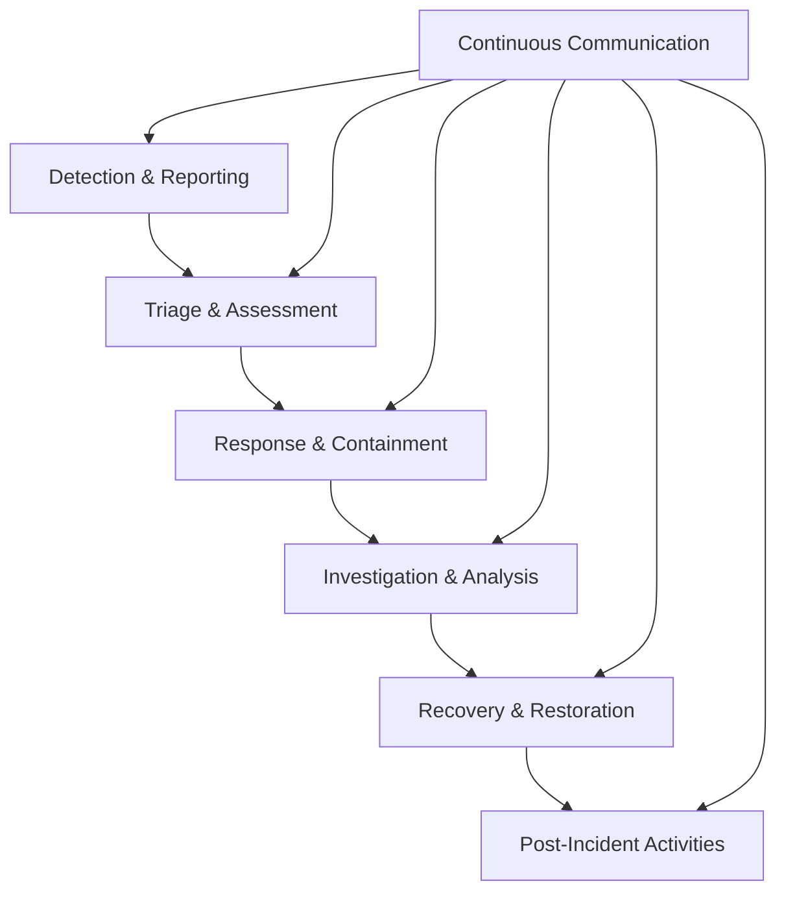
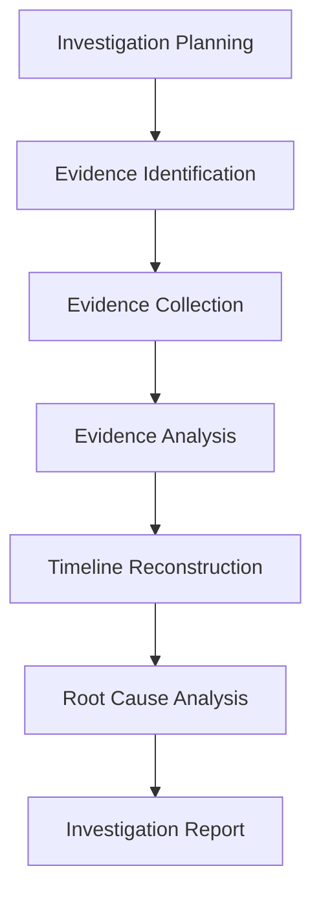

# Information Security Incident Management Procedure - ISO 27001

## ArionComply Platform Metadata

```yaml
# Template Configuration
template_id: ISO27001-INCIDENT-MGMT-PROC-001
template_type: incident_management_procedure
template_version: 1.0
template_status: draft
created_date: {{CURRENT_DATE}}
last_modified: {{CURRENT_DATE}}
template_category: operational_procedure
compliance_framework: ISO27001:2022
template_owner: {{TEMPLATE_OWNER}}
approval_status: pending_review

# Platform Integration
platform_features:
  - incident_detection_automation
  - response_orchestration
  - forensic_analysis_tools
  - communication_automation
  - compliance_reporting
  - lessons_learned_tracking

# Dependencies
depends_on:
  - incident_response_policy
  - human_resources_security_policy
  - communications_security_policy
  - access_control_policy
  - business_continuity_policy
  - supplier_relationship_management_policy

# Usage Context
applicable_controls:
  - A.16.1.1  # Responsibilities and procedures
  - A.16.1.2  # Reporting information security events
  - A.16.1.3  # Reporting information security weaknesses
  - A.16.1.4  # Assessment of and decision on information security events
  - A.16.1.5  # Response to information security incidents
  - A.16.1.6  # Learning from information security incidents
  - A.16.1.7  # Collection of evidence
```

---

## **Document Control Information**

| **Element** | **Details** | **Description** |
|-------------|-------------|-----------------|
| **Document ID** | {{TEMPLATE_ID}} | *Unique identifier for this incident management procedure* |
| **Document Title** | Information Security Incident Management Procedure | *Detailed procedures for managing security incidents* |
| **ISO 27001 Reference** | A.16.1.1-A.16.1.7 | *Primary controls addressed by this procedure* |
| **Document Owner** | {{PROCEDURE_OWNER}} | *Person responsible for procedure maintenance* |
| **Approval Authority** | {{APPROVAL_AUTHORITY}} | *Authority responsible for procedure approval* |
| **Effective Date** | {{EFFECTIVE_DATE}} | *Date when procedure becomes effective* |
| **Review Frequency** | {{REVIEW_FREQUENCY}} | *How often procedure will be reviewed* |
| **Next Review Date** | {{NEXT_REVIEW_DATE}} | *Scheduled date for next procedure review* |
| **Classification Level** | {{DOCUMENT_CLASSIFICATION}} | *Classification level of this document* |

---

## **1. Procedure Foundation**

### **1.1 Understanding Incident Management**

Think of incident management like operating an emergency response center for a major city. Just as emergency services need clear procedures for receiving 911 calls, dispatching appropriate responders, coordinating multi-agency responses, and conducting post-incident analysis - security incident management requires structured processes to detect, respond to, and learn from security events.

**Real-World Analogy**: Consider how a hospital emergency department operates:
- **Triage**: Quickly assess incoming patients and prioritize based on severity
- **Immediate Response**: Deploy appropriate medical teams and resources
- **Coordination**: Coordinate with specialists, labs, and other departments
- **Documentation**: Maintain detailed records for medical and legal purposes
- **Communication**: Keep families informed while protecting patient privacy
- **Continuous Improvement**: Analyze cases to improve emergency response procedures

Security incident management follows similar principles - rapid assessment, appropriate response, coordinated effort, thorough documentation, stakeholder communication, and continuous improvement.

### **1.2 Procedure Purpose**

This procedure establishes detailed operational steps to:
- **Detect and Report**: Identify and report security events and incidents
- **Assess and Classify**: Evaluate and classify security incidents by severity
- **Respond and Contain**: Execute appropriate response and containment actions
- **Investigate and Analyze**: Conduct thorough incident investigation and analysis
- **Communicate and Coordinate**: Manage stakeholder communication and coordination
- **Recover and Restore**: Restore normal operations and implement improvements
- **Learn and Improve**: Capture lessons learned and improve incident response

### **1.3 Procedure Scope**

This procedure applies to:
- **All Security Events**: Any observable occurrence that may impact security
- **All Security Incidents**: Confirmed security events requiring response action
- **All Personnel**: Employees, contractors, and third parties involved in incident response
- **All Systems**: Information systems, networks, applications, and infrastructure
- **All Locations**: On-premises, cloud, remote, and third-party environments

---

## **2. Incident Classification and Severity Framework**

### **2.1 Event vs. Incident Definition**

#### **2.1.1 Security Event Classification**
**Event Types and Characteristics**:

| **Event Type** | **Definition** | **Examples** | **Initial Response** |
|----------------|----------------|--------------|---------------------|
| **Security Event** | Observable occurrence | Failed login, blocked connection | Monitor and log |
| **Security Incident** | Confirmed compromise | Successful breach, malware infection | Activate response |
| **Security Weakness** | Potential vulnerability | Unpatched system, misconfiguration | Risk assessment |
| **Near Miss** | Potential incident | Phishing attempt, social engineering | Document and learn |

#### **2.1.2 Incident Confirmation Criteria**
**Criteria for Incident Declaration**:
- **Unauthorized Access**: Confirmed unauthorized access to systems or data
- **Data Compromise**: Confirmed or suspected data theft, exposure, or modification
- **System Compromise**: Confirmed malware infection or system compromise
- **Service Disruption**: Security-related service outage or degradation
- **Policy Violation**: Confirmed violation of security policies with impact
- **Regulatory Breach**: Incident requiring regulatory notification

### **2.2 Incident Severity Classification**

#### **2.2.1 Severity Level Framework**
**Multi-Dimensional Severity Assessment**:

| **Severity** | **Impact** | **Urgency** | **Response Time** | **Escalation** |
|--------------|------------|-------------|-------------------|----------------|
| **Critical** | Massive business impact | Immediate | 15 minutes | CEO/Board |
| **High** | Significant business impact | High | 1 hour | C-level |
| **Medium** | Moderate business impact | Medium | 4 hours | Management |
| **Low** | Minimal business impact | Low | 24 hours | Team Lead |

#### **2.2.2 Severity Assessment Criteria**
**Impact Assessment Matrix**:

**Business Impact Factors**:
- **Data Sensitivity**: Classification level of affected data
- **System Criticality**: Business criticality of affected systems
- **Service Availability**: Impact on service availability
- **Customer Impact**: Number and type of customers affected
- **Regulatory Impact**: Potential regulatory violations or penalties
- **Reputation Impact**: Potential damage to organizational reputation
- **Financial Impact**: Direct and indirect financial impact

**Technical Impact Factors**:
- **Scope of Compromise**: Number of systems or accounts affected
- **Attack Sophistication**: Complexity and skill level of attack
- **Data Volume**: Amount of data potentially compromised
- **System Access**: Level of system access achieved by attacker
- **Persistence**: Attacker's ability to maintain persistent access
- **Lateral Movement**: Evidence of lateral movement within network

### **2.3 ArionComply Severity Calculation**

#### **2.3.1 Automated Severity Scoring**
**Dynamic Severity Assessment**:
```yaml
severity_calculation:
  impact_scoring:
    - data_classification_score
    - system_criticality_score
    - customer_impact_score
    - regulatory_impact_score
    - financial_impact_score
  
  urgency_scoring:
    - attack_progression_score
    - threat_actor_capability
    - exploit_availability
    - business_context_score
  
  final_severity:
    - weighted_impact_score
    - weighted_urgency_score
    - modifier_factors
    - severity_level_assignment
```

#### **2.3.2 Dynamic Severity Adjustment**
**Real-Time Severity Updates**:
- **Intelligence Integration**: Threat intelligence feed integration
- **Context Awareness**: Business context and timing considerations
- **Escalation Triggers**: Automatic escalation based on severity changes
- **Stakeholder Notification**: Automated stakeholder notification based on severity
- **Resource Allocation**: Automatic resource allocation based on severity

---

## **3. Incident Detection and Reporting**

### **3.1 Detection Methods**

#### **3.1.1 Automated Detection**
**Technology-Based Detection Sources**:
- **Security Information and Event Management (SIEM)**: Centralized log analysis and correlation
- **Intrusion Detection Systems (IDS)**: Network and host-based intrusion detection
- **Endpoint Detection and Response (EDR)**: Endpoint behavior analysis and response
- **Data Loss Prevention (DLP)**: Data exfiltration detection and prevention
- **User and Entity Behavior Analytics (UEBA)**: Behavioral anomaly detection
- **Vulnerability Scanners**: Automated vulnerability detection
- **Threat Intelligence Platforms**: External threat intelligence integration

#### **3.1.2 Human Detection**
**People-Based Detection Sources**:
- **User Reporting**: Employee reporting of suspicious activities
- **Security Team Monitoring**: Active security monitoring and hunting
- **IT Operations**: System administrator observations
- **Third-Party Notifications**: Vendor, partner, or customer notifications
- **External Notifications**: Law enforcement, threat intelligence, media reports
- **Audit Findings**: Internal or external audit discoveries

### **3.2 Incident Reporting Process**

#### **3.2.1 Reporting Channels**
**Multiple Reporting Mechanisms**:

| **Reporting Method** | **Availability** | **Use Case** | **Response Time** |
|---------------------|------------------|--------------|-------------------|
| **Security Portal** | 24/7 | General incidents | Immediate |
| **Emergency Hotline** | 24/7 | Critical incidents | Immediate |
| **Email** | 24/7 | Non-urgent incidents | 1 hour |
| **Manager Escalation** | Business hours | Policy violations | 4 hours |
| **Automated Alerts** | 24/7 | System-generated | Real-time |

#### **3.2.2 Initial Incident Report**
**Required Incident Information**:
- **Reporter Information**: Name, contact information, role
- **Discovery Information**: How, when, and where incident was discovered
- **Incident Description**: Detailed description of observed incident
- **Affected Systems**: Systems, applications, or data potentially affected
- **Initial Assessment**: Initial impact and severity assessment
- **Immediate Actions**: Any immediate actions taken
- **Evidence**: Initial evidence collection and preservation
- **Contact Information**: Key contacts and stakeholders

### **3.3 ArionComply Detection Integration**

#### **3.3.1 Unified Detection Platform**
**Integrated Detection Ecosystem**:
```yaml
detection_integration:
  automated_sources:
    - siem_integration
    - edr_integration
    - network_monitoring
    - cloud_security_monitoring
    - application_monitoring
  
  human_sources:
    - user_reporting_portal
    - security_team_alerts
    - third_party_notifications
    - audit_findings
  
  intelligence_sources:
    - threat_intelligence_feeds
    - vulnerability_databases
    - indicator_feeds
    - dark_web_monitoring
```

#### **3.3.2 Advanced Detection Analytics**
**AI-Powered Detection Enhancement**:
- **Machine Learning Models**: Advanced threat detection models
- **Behavioral Analysis**: User and entity behavior analysis
- **Anomaly Detection**: Statistical and machine learning anomaly detection
- **Threat Hunting**: Proactive threat hunting capabilities
- **False Positive Reduction**: AI-driven false positive reduction

---

## **4. Incident Response Process**

### **4.1 Incident Response Lifecycle**

#### **4.1.1 Response Phase Overview**
**Six-Phase Incident Response Process**:



#### **4.1.2 Response Team Activation**
**Incident Response Team Structure**:

| **Role** | **Responsibilities** | **Activation Criteria** | **Authority Level** |
|----------|---------------------|-------------------------|-------------------|
| **Incident Commander** | Overall incident leadership | All incidents | Full authority |
| **Security Analyst** | Technical investigation | All incidents | Technical decisions |
| **IT Operations** | System recovery | System-affecting incidents | Operational decisions |
| **Communications** | Stakeholder communication | High/Critical incidents | Communication authority |
| **Legal Counsel** | Legal and regulatory guidance | Regulatory incidents | Legal decisions |
| **Executive Sponsor** | Executive decisions | Critical incidents | Business decisions |

### **4.2 Triage and Assessment**

#### **4.2.1 Initial Triage Process**
**Rapid Initial Assessment**:
1. **Incident Verification**: Confirm incident occurrence and basic facts
2. **Severity Assessment**: Initial severity classification using framework
3. **Team Activation**: Activate appropriate response team members
4. **Resource Allocation**: Allocate initial response resources
5. **Communication**: Initial stakeholder notification
6. **Documentation**: Begin incident documentation and tracking

#### **4.2.2 Detailed Assessment**
**Comprehensive Incident Analysis**:
- **Scope Determination**: Determine full scope of incident impact
- **Timeline Reconstruction**: Reconstruct incident timeline and progression
- **Threat Actor Analysis**: Analyze threat actor tactics, techniques, and procedures
- **Impact Assessment**: Assess business, technical, and regulatory impact
- **Containment Planning**: Plan containment and mitigation strategies
- **Recovery Planning**: Initial recovery and restoration planning

### **4.3 Response and Containment**

#### **4.3.1 Containment Strategies**
**Layered Containment Approach**:

| **Containment Type** | **Objective** | **Methods** | **Considerations** |
|---------------------|---------------|-------------|-------------------|
| **Immediate** | Stop ongoing damage | Network isolation, account lockdown | May disrupt business |
| **Short-term** | Prevent spread | Patch vulnerabilities, increase monitoring | Temporary solutions |
| **Long-term** | Permanent fix | System rebuild, process changes | Sustainable solutions |

#### **4.3.2 Containment Procedures**
**Systematic Containment Process**:
- **Threat Isolation**: Isolate compromised systems and accounts
- **Access Revocation**: Revoke potentially compromised access credentials
- **Network Segmentation**: Implement additional network segmentation
- **Malware Removal**: Remove malware and malicious artifacts
- **Vulnerability Patching**: Apply emergency patches and configurations
- **Monitoring Enhancement**: Increase monitoring and detection capabilities

---

## **5. Investigation and Forensic Analysis**

### **5.1 Investigation Framework**

#### **5.1.1 Investigation Objectives**
**Core Investigation Goals**:
- **Root Cause Analysis**: Determine how the incident occurred
- **Scope Assessment**: Understand full extent of compromise
- **Attribution**: Identify threat actor and motivation
- **Evidence Collection**: Collect and preserve digital evidence
- **Timeline Reconstruction**: Create detailed incident timeline
- **Impact Assessment**: Quantify business and technical impact

#### **5.1.2 Investigation Process**
**Systematic Investigation Methodology**:


### **5.2 Digital Forensics**

#### **5.2.1 Evidence Collection**
**Forensic Evidence Handling**:
- **Chain of Custody**: Maintain detailed chain of custody documentation
- **Evidence Preservation**: Preserve digital evidence integrity
- **Imaging**: Create forensic images of affected systems
- **Log Collection**: Collect and preserve relevant log files
- **Memory Analysis**: Capture and analyze system memory
- **Network Traffic**: Capture and analyze network traffic
- **Mobile Devices**: Handle mobile device evidence appropriately

#### **5.2.2 Forensic Analysis**
**Digital Forensic Examination**:
- **File System Analysis**: Analyze file systems for evidence
- **Registry Analysis**: Examine Windows registry for artifacts
- **Log Analysis**: Analyze system and application logs
- **Memory Analysis**: Analyze memory dumps for indicators
- **Network Analysis**: Analyze network traffic and communications
- **Malware Analysis**: Reverse engineer malware samples
- **Timeline Analysis**: Create comprehensive event timelines

### **5.3 ArionComply Investigation Tools**

#### **5.3.1 Integrated Forensic Platform**
**Investigation Tool Integration**:
```yaml
forensic_integration:
  evidence_collection:
    - automated_imaging
    - log_aggregation
    - memory_capture
    - network_capture
  
  analysis_tools:
    - forensic_analysis_engines
    - malware_analysis_sandbox
    - timeline_reconstruction
    - indicator_extraction
  
  case_management:
    - evidence_tracking
    - chain_of_custody
    - investigation_workflow
    - reporting_automation
```

#### **5.3.2 AI-Enhanced Analysis**
**Advanced Investigation Capabilities**:
- **Automated Artifact Extraction**: AI-powered artifact identification
- **Pattern Recognition**: Machine learning pattern recognition
- **Correlation Analysis**: Multi-source evidence correlation
- **Timeline Automation**: Automated timeline reconstruction
- **Indicator Generation**: Automatic indicator of compromise generation

---

## **6. Communication and Coordination**

### **6.1 Communication Framework**

#### **6.1.1 Stakeholder Communication Matrix**
**Communication Requirements by Stakeholder**:

| **Stakeholder** | **Information Level** | **Frequency** | **Communication Method** |
|-----------------|----------------------|---------------|-------------------------|
| **Executive Team** | Strategic summary | Critical updates | Secure email, briefings |
| **IT Operations** | Technical details | Real-time | Secure chat, calls |
| **Business Units** | Impact summary | Regular updates | Email, intranet |
| **Legal/Compliance** | Legal implications | As needed | Secure communication |
| **External Parties** | Public information | As required | Official statements |

#### **6.1.2 Communication Templates**
**Standardized Communication Templates**:
- **Initial Notification**: Initial incident notification template
- **Status Updates**: Regular status update template
- **Executive Briefing**: Executive summary template
- **Technical Update**: Technical stakeholder update template
- **Resolution Notice**: Incident resolution notification template
- **External Statement**: Public communication template
- **Regulatory Notification**: Regulatory reporting template

### **6.2 Coordination Procedures**

#### **6.2.1 Internal Coordination**
**Cross-Functional Coordination**:
- **Incident Command**: Centralized incident command and control
- **Technical Teams**: Coordinate technical response teams
- **Business Units**: Coordinate with affected business units
- **Support Functions**: Coordinate with HR, Legal, Procurement
- **Management**: Regular management briefings and decisions
- **Communication**: Centralized communication coordination

#### **6.2.2 External Coordination**
**External Stakeholder Management**:
- **Customers**: Customer notification and support
- **Partners**: Business partner coordination
- **Vendors**: Vendor and supplier coordination
- **Regulators**: Regulatory notification and cooperation
- **Law Enforcement**: Law enforcement cooperation when appropriate
- **Media**: Media relations and public communication

### **6.3 Crisis Communication**

#### **6.3.1 Crisis Communication Plan**
**Crisis Communication Framework**:
- **Crisis Team**: Designated crisis communication team
- **Message Development**: Coordinated message development
- **Approval Process**: Message approval and sign-off process
- **Distribution**: Multi-channel communication distribution
- **Monitoring**: Communication monitoring and feedback
- **Adaptation**: Message adaptation based on feedback

#### **6.3.2 Public Relations Management**
**External Communication Management**:
- **Media Monitoring**: Media coverage monitoring and analysis
- **Statement Preparation**: Official statement preparation
- **Interview Preparation**: Spokesperson interview preparation
- **Social Media**: Social media monitoring and response
- **Stakeholder Outreach**: Proactive stakeholder outreach
- **Reputation Management**: Reputation protection and recovery

---

## **7. Recovery and Restoration**

### **7.1 Recovery Planning**

#### **7.1.1 Recovery Strategy Development**
**Recovery Planning Process**:
1. **Damage Assessment**: Comprehensive damage and impact assessment
2. **Recovery Priorities**: Business-driven recovery prioritization
3. **Recovery Options**: Evaluation of recovery options and approaches
4. **Resource Requirements**: Recovery resource and timeline estimation
5. **Risk Assessment**: Recovery risk assessment and mitigation
6. **Recovery Plan**: Detailed recovery plan development

#### **7.1.2 Recovery Approaches**
**Recovery Strategy Options**:

| **Recovery Type** | **Approach** | **Timeline** | **Risk Level** |
|-------------------|--------------|--------------|----------------|
| **Full Rebuild** | Complete system rebuild | Days to weeks | Low risk |
| **Partial Restore** | Selective system restoration | Hours to days | Medium risk |
| **Quick Restore** | Rapid restoration from backups | Minutes to hours | Higher risk |
| **Failover** | Switch to backup systems | Minutes | Depends on backup |

### **7.2 System Restoration**

#### **7.2.1 Restoration Process**
**Systematic Restoration Framework**:
1. **Preparation**: Prepare restoration environment and resources
2. **Data Recovery**: Recover data from clean backups
3. **System Rebuild**: Rebuild or restore affected systems
4. **Security Hardening**: Apply security hardening and patches
5. **Testing**: Comprehensive testing and validation
6. **Monitoring**: Enhanced monitoring during restoration
7. **Validation**: Final validation and sign-off

#### **7.2.2 Restoration Validation**
**Comprehensive Validation Process**:
- **Functionality Testing**: Test all system functionality
- **Security Testing**: Validate security controls and configurations
- **Performance Testing**: Verify system performance
- **Integration Testing**: Test system integrations
- **User Acceptance Testing**: User acceptance and validation
- **Monitoring Validation**: Confirm monitoring and alerting
- **Documentation Update**: Update system documentation

### **7.3 Business Recovery**

#### **7.3.1 Business Process Recovery**
**Business Continuity Integration**:
- **Process Assessment**: Assess business process impact
- **Process Recovery**: Restore affected business processes
- **Stakeholder Communication**: Communicate recovery status
- **Performance Monitoring**: Monitor business process performance
- **Issue Resolution**: Resolve post-recovery issues
- **Continuous Improvement**: Implement recovery improvements

#### **7.3.2 Service Restoration**
**Customer Service Recovery**:
- **Service Assessment**: Assess service impact and requirements
- **Service Recovery**: Restore customer-facing services
- **Customer Communication**: Communicate with affected customers
- **Service Monitoring**: Monitor service performance and quality
- **Customer Support**: Provide enhanced customer support
- **Service Improvement**: Implement service improvements

---

## **8. Post-Incident Activities**

### **8.1 Post-Incident Review**

#### **8.1.1 Review Process**
**Comprehensive Post-Incident Analysis**:
1. **Review Planning**: Plan post-incident review process
2. **Data Collection**: Collect incident response data and metrics
3. **Stakeholder Interviews**: Interview key stakeholders and responders
4. **Analysis**: Analyze response effectiveness and outcomes
5. **Lessons Learned**: Identify lessons learned and improvements
6. **Recommendations**: Develop improvement recommendations
7. **Report**: Create comprehensive post-incident report

#### **8.1.2 Review Criteria**
**Post-Incident Evaluation Framework**:
- **Detection Effectiveness**: Evaluate detection capabilities and timing
- **Response Time**: Analyze response time and efficiency
- **Containment Effectiveness**: Assess containment strategy and execution
- **Communication Quality**: Evaluate communication effectiveness
- **Recovery Success**: Assess recovery and restoration success
- **Stakeholder Satisfaction**: Evaluate stakeholder satisfaction
- **Cost Analysis**: Analyze incident costs and impact

### **8.2 Lessons Learned**

#### **8.2.1 Improvement Identification**
**Systematic Improvement Process**:
- **Gap Analysis**: Identify gaps in current capabilities
- **Root Cause Analysis**: Analyze root causes of incident occurrence
- **Process Improvement**: Identify process improvement opportunities
- **Technology Enhancement**: Identify technology improvement needs
- **Training Needs**: Identify training and awareness needs
- **Policy Updates**: Identify policy and procedure updates
- **Resource Requirements**: Identify additional resource needs

#### **8.2.2 Implementation Planning**
**Improvement Implementation Framework**:
- **Prioritization**: Prioritize improvements based on risk and impact
- **Resource Planning**: Plan resources for improvement implementation
- **Timeline Development**: Develop implementation timeline
- **Responsibility Assignment**: Assign improvement responsibilities
- **Progress Monitoring**: Monitor improvement implementation progress
- **Effectiveness Measurement**: Measure improvement effectiveness
- **Continuous Improvement**: Establish continuous improvement process

### **8.3 ArionComply Lessons Learned Integration**

#### **8.3.1 Automated Lessons Capture**
**Intelligent Lessons Learned System**:
```yaml
lessons_learned_automation:
  data_collection:
    - incident_metrics_analysis
    - response_timeline_analysis
    - stakeholder_feedback_collection
    - cost_impact_analysis
  
  analysis_automation:
    - pattern_recognition
    - trend_analysis
    - gap_identification
    - improvement_recommendation
  
  improvement_tracking:
    - action_item_tracking
    - implementation_monitoring
    - effectiveness_measurement
    - continuous_improvement
```

#### **8.3.2 Knowledge Management**
**Organizational Learning Platform**:
- **Knowledge Base**: Centralized incident knowledge base
- **Best Practices**: Best practice identification and sharing
- **Training Integration**: Integration with training programs
- **Playbook Updates**: Automatic playbook and procedure updates
- **Community Learning**: Cross-team learning and knowledge sharing

---

## **9. Regulatory and Legal Compliance**

### **9.1 Regulatory Notification Requirements**

#### **9.1.1 Notification Framework**
**Regulatory Notification Matrix**:

| **Regulation** | **Notification Trigger** | **Timeline** | **Authority** |
|----------------|-------------------------|--------------|---------------|
| **GDPR** | Personal data breach | 72 hours | Data Protection Authority |
| **HIPAA** | PHI breach | 60 days | HHS |
| **PCI DSS** | Cardholder data breach | Immediately | Card brands |
| **SOX** | Financial data breach | Immediately | SEC |
| **State Laws** | Personal data breach | Varies | State authorities |

#### **9.1.2 Notification Process**
**Regulatory Reporting Workflow**:
1. **Trigger Assessment**: Assess if incident meets notification triggers
2. **Legal Consultation**: Consult with legal counsel on requirements
3. **Notification Preparation**: Prepare required notification documentation
4. **Authority Notification**: Submit notification to appropriate authorities
5. **Follow-up Reporting**: Provide required follow-up reports
6. **Compliance Monitoring**: Monitor ongoing compliance requirements

### **9.2 Legal Evidence Management**

#### **9.2.1 Legal Hold Process**
**Evidence Preservation Framework**:
- **Legal Hold Trigger**: Determine when legal hold is required
- **Scope Definition**: Define scope of legal hold preservation
- **Notification**: Notify relevant personnel of legal hold
- **Preservation**: Preserve relevant evidence and documentation
- **Monitoring**: Monitor compliance with legal hold requirements
- **Release**: Release legal hold when appropriate

#### **9.2.2 Law Enforcement Cooperation**
**Law Enforcement Coordination**:
- **Contact Decision**: Decide when to contact law enforcement
- **Initial Contact**: Establish initial contact and relationships
- **Information Sharing**: Share relevant information and evidence
- **Cooperation**: Cooperate with ongoing investigations
- **Evidence Handling**: Handle evidence per law enforcement requirements
- **Communication Coordination**: Coordinate communication strategies

### **9.3 Legal Documentation**

#### **9.3.1 Documentation Requirements**
**Legal Documentation Standards**:
- **Comprehensive Records**: Maintain comprehensive incident records
- **Chain of Custody**: Document evidence chain of custody
- **Decision Documentation**: Document key decisions and rationale
- **Communication Records**: Preserve communication records
- **Timeline Documentation**: Maintain detailed incident timeline
- **Expert Reports**: Obtain expert analysis and reports when needed

#### **9.3.2 Privilege Protection**
**Attorney-Client Privilege Management**:
- **Privilege Assessment**: Assess privilege protection needs
- **Attorney Involvement**: Involve attorneys in sensitive communications
- **Document Marking**: Mark privileged documents appropriately
- **Access Restriction**: Restrict access to privileged information
- **Privilege Log**: Maintain privilege log when required
- **Waiver Prevention**: Prevent inadvertent privilege waiver

---

## **10. Metrics and Performance Measurement**

### **10.1 Incident Response Metrics**

#### **10.1.1 Response Performance Metrics**
**Key Performance Indicators**:

| **Metric** | **Definition** | **Target** | **Measurement** |
|------------|----------------|------------|-----------------|
| **Detection Time** | Time from occurrence to detection | {{DETECTION_TIME_TARGET}} | Automated tracking |
| **Response Time** | Time from detection to response | {{RESPONSE_TIME_TARGET}} | Automated tracking |
| **Containment Time** | Time from response to containment | {{CONTAINMENT_TIME_TARGET}} | Automated tracking |
| **Recovery Time** | Time from containment to recovery | {{RECOVERY_TIME_TARGET}} | Manual tracking |
| **Total Resolution Time** | Total time from detection to resolution | {{RESOLUTION_TIME_TARGET}} | Automated tracking |

#### **10.1.2 Quality Metrics**
**Response Quality Indicators**:
- **False Positive Rate**: Rate of false positive incident classifications
- **Escalation Accuracy**: Accuracy of incident severity classifications
- **Stakeholder Satisfaction**: Stakeholder satisfaction with response
- **Communication Effectiveness**: Effectiveness of incident communication
- **Recovery Success Rate**: Rate of successful system recovery

### **10.2 Continuous Improvement Metrics**

#### **10.2.1 Maturity Metrics**
**Incident Response Maturity Indicators**:
- **Process Maturity**: Maturity of incident response processes
- **Technology Maturity**: Maturity of incident response technology
- **Team Maturity**: Maturity of incident response team
- **Integration Maturity**: Maturity of cross-functional integration
- **Learning Maturity**: Maturity of lessons learned process

#### **10.2.2 Trend Analysis**
**Incident Trend Monitoring**:
- **Incident Volume**: Trends in incident volume and frequency
- **Incident Types**: Trends in incident types and categories
- **Attack Vectors**: Trends in attack vectors and techniques
- **Impact Trends**: Trends in business impact and costs
- **Response Improvement**: Trends in response time and effectiveness

### **10.3 ArionComply Metrics Integration**

#### **10.3.1 Real-Time Dashboards**
**Incident Response Dashboards**:
```yaml
metrics_dashboard:
  real_time_metrics:
    - active_incidents
    - response_times
    - team_utilization
    - escalation_status
  
  trend_analysis:
    - incident_volume_trends
    - response_time_trends
    - attack_vector_trends
    - impact_trends
  
  performance_analytics:
    - team_performance
    - process_effectiveness
    - technology_performance
    - improvement_tracking
```

#### **10.3.2 Predictive Analytics**
**Advanced Analytics Capabilities**:
- **Incident Prediction**: Predictive modeling for incident likelihood
- **Resource Planning**: Predictive resource requirement planning
- **Trend Forecasting**: Forecasting of incident trends and patterns
- **Performance Optimization**: Optimization recommendations
- **Risk Assessment**: Predictive risk assessment and modeling

---

## **11. Training and Readiness**

### **11.1 Team Training Program**

#### **11.1.1 Role-Based Training**
**Training by Response Role**:

| **Role** | **Training Focus** | **Frequency** | **Certification** |
|----------|-------------------|---------------|-------------------|
| **Incident Commander** | Leadership, decision-making | Quarterly | Required |
| **Security Analyst** | Technical analysis, forensics | Monthly | Preferred |
| **IT Operations** | System recovery, operations | Quarterly | Required |
| **Communications** | Crisis communication | Bi-annually | Preferred |
| **Legal** | Legal, regulatory compliance | Annually | Required |

#### **11.1.2 Training Content**
**Comprehensive Training Curriculum**:
- **Incident Response Fundamentals**: Basic incident response concepts
- **Technical Skills**: Technical investigation and analysis skills
- **Communication Skills**: Crisis communication and coordination
- **Legal and Regulatory**: Legal and regulatory requirements
- **Tool Training**: Incident response tool training
- **Simulation Exercises**: Hands-on simulation exercises

### **11.2 Exercise and Simulation**

#### **11.2.1 Exercise Types**
**Incident Response Exercise Framework**:
- **Tabletop Exercises**: Discussion-based scenario exercises
- **Functional Exercises**: Partial activation exercises
- **Full-Scale Exercises**: Complete response simulation
- **Surprise Drills**: Unannounced readiness tests
- **Red Team Exercises**: Adversarial simulation exercises
- **Cross-Functional Exercises**: Multi-team coordination exercises

#### **11.2.2 Exercise Planning**
**Exercise Development Process**:
1. **Objective Setting**: Define exercise objectives and goals
2. **Scenario Development**: Develop realistic exercise scenarios
3. **Resource Planning**: Plan exercise resources and logistics
4. **Execution**: Execute exercise with proper facilitation
5. **Evaluation**: Evaluate exercise performance and outcomes
6. **Improvement**: Implement exercise-based improvements

### **11.3 Readiness Assessment**

#### **11.3.1 Readiness Metrics**
**Team Readiness Indicators**:
- **Training Completion**: Percentage of completed training requirements
- **Exercise Performance**: Performance in exercises and simulations
- **Response Time**: Actual response time performance
- **Knowledge Assessment**: Technical and procedural knowledge tests
- **Certification Status**: Professional certification status

#### **11.3.2 Continuous Improvement**
**Readiness Enhancement Program**:
- **Regular Assessment**: Regular readiness assessment and evaluation
- **Gap Analysis**: Identification of readiness gaps and deficiencies
- **Training Updates**: Regular training program updates
- **Exercise Enhancement**: Continuous exercise program improvement
- **Knowledge Sharing**: Cross-team knowledge sharing and learning

---

## **12. Technology and Tool Integration**

### **12.1 Incident Response Tools**

#### **12.1.1 Core Tool Categories**
**Essential Tool Stack**:
- **SIEM Platform**: Centralized security event management
- **SOAR Platform**: Security orchestration and automated response
- **Forensic Tools**: Digital forensic investigation tools
- **Communication Tools**: Secure incident communication tools
- **Documentation Tools**: Incident documentation and tracking
- **Analysis Tools**: Malware and threat analysis tools

#### **12.1.2 Tool Integration Requirements**
**Integration Standards**:
- **API Integration**: Standardized API integration
- **Data Sharing**: Seamless data sharing between tools
- **Workflow Integration**: Integrated workflow automation
- **Single Sign-On**: Unified authentication and access
- **Centralized Management**: Centralized tool management
- **Monitoring Integration**: Integrated tool monitoring

### **12.2 Automation and Orchestration**

#### **12.2.1 Automation Framework**
**Response Automation Capabilities**:
- **Alert Triage**: Automated alert triage and classification
- **Initial Response**: Automated initial response actions
- **Evidence Collection**: Automated evidence collection
- **Containment Actions**: Automated containment execution
- **Notification**: Automated stakeholder notification
- **Documentation**: Automated documentation generation

#### **12.2.2 Orchestration Workflows**
**Workflow Automation**:
```yaml
incident_orchestration:
  detection_workflow:
    - alert_ingestion
    - initial_triage
    - severity_assessment
    - team_notification
  
  response_workflow:
    - containment_automation
    - evidence_collection
    - stakeholder_notification
    - escalation_management
  
  recovery_workflow:
    - system_restoration
    - validation_testing
    - monitoring_enhancement
    - documentation_completion
```

### **12.3 ArionComply Platform Integration**

#### **12.3.1 Unified Incident Management**
**Comprehensive Platform Integration**:
- **Single Pane of Glass**: Unified incident management interface
- **Cross-Platform Analytics**: Integrated analytics across all tools
- **Automated Workflows**: End-to-end workflow automation
- **Intelligence Integration**: Integrated threat intelligence
- **Compliance Automation**: Automated compliance reporting
- **Knowledge Management**: Integrated knowledge management

#### **12.3.2 AI and Machine Learning**
**Advanced Automation Capabilities**:
- **Intelligent Triage**: AI-powered incident triage
- **Predictive Analysis**: Predictive incident analysis
- **Automated Investigation**: AI-assisted investigation
- **Smart Containment**: Intelligent containment recommendations
- **Learning Systems**: Self-improving response systems
- **Natural Language Processing**: Automated report generation

---

## **13. Implementation Checklist**

### **13.1 Pre-Implementation**
- [ ] **Team Formation**: Form incident response team with defined roles
- [ ] **Tool Selection**: Select and procure incident response tools
- [ ] **Process Design**: Design incident response processes and workflows
- [ ] **Integration Planning**: Plan tool and system integrations
- [ ] **Training Development**: Develop training programs and materials

### **13.2 Implementation Phase**
- [ ] **Tool Deployment**: Deploy and configure incident response tools
- [ ] **Process Implementation**: Implement incident response processes
- [ ] **Team Training**: Train incident response team members
- [ ] **Integration**: Integrate tools and systems
- [ ] **Documentation**: Create incident response documentation

### **13.3 Post-Implementation**
- [ ] **Testing**: Conduct initial testing and validation
- [ ] **Exercise**: Conduct incident response exercises
- [ ] **Refinement**: Refine processes based on testing results
- [ ] **Monitoring**: Implement continuous monitoring and metrics
- [ ] **Improvement**: Establish continuous improvement processes

---

## **14. Related Documents**

### **14.1 Policy Dependencies**
- **Incident Response Policy**: High-level incident response policy
- **Business Continuity Policy**: Business continuity integration
- **Communications Security Policy**: Secure communication requirements
- **Human Resources Security Policy**: Personnel security requirements

### **14.2 Technical Procedures**
- **Forensic Analysis Procedures**: Detailed forensic procedures
- **System Recovery Procedures**: System restoration procedures
- **Evidence Handling Procedures**: Digital evidence procedures
- **Communication Procedures**: Crisis communication procedures

### **14.3 Legal and Compliance**
- **Regulatory Notification Procedures**: Regulatory reporting procedures
- **Legal Hold Procedures**: Legal evidence preservation
- **Privacy Breach Procedures**: Privacy-specific incident procedures
- **Contract Templates**: Incident response contract templates

---

## **15. Appendices**

### **15.1 Incident Classification Matrix**
| **Incident Type** | **Severity Criteria** | **Response Time** | **Escalation Level** |
|-------------------|----------------------|-------------------|---------------------|
| **Data Breach** | Data sensitivity + volume | Critical: 15 min | C-level |
| **System Compromise** | System criticality + scope | High: 1 hour | Management |
| **Malware Infection** | Spread potential + impact | Medium: 4 hours | Team Lead |
| **Policy Violation** | Business impact + intent | Low: 24 hours | Supervisor |

### **15.2 Contact Information Template**
| **Role** | **Primary Contact** | **Backup Contact** | **Phone** | **Email** |
|----------|-------------------|-------------------|-----------|-----------|
| **Incident Commander** | {{PRIMARY_IC}} | {{BACKUP_IC}} | {{IC_PHONE}} | {{IC_EMAIL}} |
| **Security Analyst** | {{PRIMARY_SA}} | {{BACKUP_SA}} | {{SA_PHONE}} | {{SA_EMAIL}} |
| **IT Operations** | {{PRIMARY_IT}} | {{BACKUP_IT}} | {{IT_PHONE}} | {{IT_EMAIL}} |
| **Legal Counsel** | {{PRIMARY_LEGAL}} | {{BACKUP_LEGAL}} | {{LEGAL_PHONE}} | {{LEGAL_EMAIL}} |

### **15.3 Response Time Matrix**
| **Severity Level** | **Detection Target** | **Response Target** | **Containment Target** | **Resolution Target** |
|-------------------|---------------------|--------------------|-----------------------|----------------------|
| **Critical** | 5 minutes | 15 minutes | 1 hour | 24 hours |
| **High** | 15 minutes | 1 hour | 4 hours | 72 hours |
| **Medium** | 30 minutes | 4 hours | 24 hours | 1 week |
| **Low** | 1 hour | 24 hours | 72 hours | 2 weeks |

---

**Document Status**: {{DOCUMENT_STATUS}}  
**Version**: {{VERSION_NUMBER}}  
**Last Updated**: {{LAST_UPDATED}}  
**Next Review**: {{NEXT_REVIEW_DATE}}  
**Owner**: {{DOCUMENT_OWNER}}  
**Approved By**: {{APPROVED_BY}}  
**Approval Date**: {{APPROVAL_DATE}}