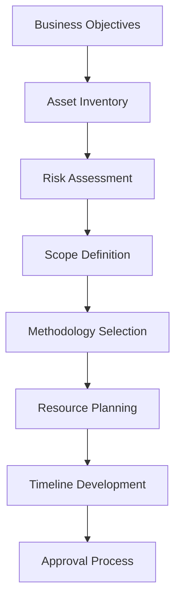

# Penetration Testing and Security Assessment Procedure - ISO 27001

## ArionComply Platform Metadata

```yaml
# Template Configuration
template_id: ISO27001-PENETRATION-TESTING-PROC-001
template_type: penetration_testing_security_assessment_procedure
template_version: 1.0
template_status: draft
created_date: {{CURRENT_DATE}}
last_modified: {{CURRENT_DATE}}
template_category: operational_procedure
compliance_framework: ISO27001:2022
template_owner: {{TEMPLATE_OWNER}}
approval_status: pending_review

# Platform Integration
platform_features:
  - automated_vulnerability_validation
  - penetration_testing_orchestration
  - risk_based_testing_prioritization
  - findings_correlation_analysis
  - remediation_tracking_integration
  - continuous_security_validation

# Dependencies
depends_on:
  - security_awareness_training_procedure
  - vulnerability_management_procedure
  - security_monitoring_logging_procedure
  - change_management_procedure
  - access_control_policy
  - supplier_relationship_management_policy

# Usage Context
applicable_controls:
  - A.14.2.8  # System security testing
  - A.12.6.1  # Management of technical vulnerabilities
  - A.18.2.3  # Technical compliance review
  - A.5.37    # Documented operating procedures
  - A.8.8     # Management of technical vulnerabilities
  - A.14.2.3  # Technical review of applications after operating system platform changes
```

---

## **Document Control Information**

| **Element** | **Details** | **Description** |
|-------------|-------------|-----------------|
| **Document ID** | {{TEMPLATE_ID}} | *Unique identifier for this penetration testing procedure* |
| **Document Title** | Penetration Testing and Security Assessment Procedure | *Detailed procedures for penetration testing and security assessments* |
| **ISO 27001 Reference** | A.14.2.8, A.12.6.1, A.18.2.3, A.5.37, A.8.8, A.14.2.3 | *Primary controls addressed by this procedure* |
| **Document Owner** | {{PROCEDURE_OWNER}} | *Person responsible for procedure maintenance* |
| **Approval Authority** | {{APPROVAL_AUTHORITY}} | *Authority responsible for procedure approval* |
| **Effective Date** | {{EFFECTIVE_DATE}} | *Date when procedure becomes effective* |
| **Review Frequency** | {{REVIEW_FREQUENCY}} | *How often procedure will be reviewed* |
| **Next Review Date** | {{NEXT_REVIEW_DATE}} | *Scheduled date for next procedure review* |
| **Classification Level** | {{DOCUMENT_CLASSIFICATION}} | *Classification level of this document* |

---

## **1. Procedure Foundation**

### **1.1 Understanding Penetration Testing and Security Assessment**

Think of penetration testing and security assessment like conducting comprehensive stress tests and safety inspections for a major infrastructure project. Just as engineers test bridges under extreme loads, inspect building foundations for structural integrity, and simulate earthquake conditions to validate safety systems - penetration testing systematically challenges an organization's security defenses through controlled, authorized attacks to identify vulnerabilities before malicious actors can exploit them.

**Real-World Analogy**: Consider how a bank tests its security systems:
- **Physical Security Testing**: Like hiring professional burglars to test vault security and access controls
- **System Stress Testing**: Like simulating bank runs and cyber attacks to test operational resilience
- **Process Validation**: Like testing emergency procedures and incident response capabilities
- **Human Factor Testing**: Like conducting social engineering tests on employees
- **Continuous Monitoring**: Like ongoing security assessments and threat landscape adaptation
- **Risk-Based Approach**: Like focusing testing efforts on the most critical assets and likely attack vectors

Penetration testing provides independent validation of security controls and reveals real-world attack paths that traditional vulnerability scanning might miss.

### **1.2 Procedure Purpose**

This procedure establishes detailed operational steps to:
- **Validate Security Controls**: Independently validate the effectiveness of security controls
- **Identify Attack Paths**: Discover real-world attack paths and exploitation chains
- **Assess Risk**: Quantify actual security risk through practical exploitation
- **Test Response Capabilities**: Validate incident detection and response capabilities
- **Ensure Compliance**: Meet regulatory and standard penetration testing requirements
- **Guide Remediation**: Provide actionable guidance for security improvement
- **Measure Progress**: Track security posture improvement over time
- **Support Certification**: Support security certification and accreditation processes

### **1.3 Procedure Scope**

This procedure applies to:
- **All Testing Types**: Network, application, wireless, social engineering, and physical testing
- **All Environments**: Production, pre-production, development, and cloud environments
- **All Perspectives**: External, internal, and hybrid testing approaches
- **All Methodologies**: Black box, white box, and gray box testing methodologies
- **All Systems**: In-scope systems, applications, and infrastructure components

---

## **2. Testing Framework and Methodology**

### **2.1 Testing Types and Approaches**

#### **2.1.1 Comprehensive Testing Matrix**
**Multi-Dimensional Testing Framework**:

| **Testing Type** | **Scope** | **Frequency** | **Methodology** |
|------------------|-----------|---------------|-----------------|
| **Network Penetration** | Infrastructure, services | Annual | PTES, OWASP |
| **Web Application** | Web apps, APIs | Quarterly | OWASP WSTG |
| **Mobile Application** | Mobile apps, devices | Bi-annual | OWASP MSTG |
| **Wireless Security** | WiFi, Bluetooth, cellular | Annual | NIST guidelines |
| **Social Engineering** | People, processes | Bi-annual | Custom methodology |
| **Physical Security** | Facilities, devices | Annual | Custom methodology |
| **Cloud Security** | Cloud services, configs | Quarterly | CSA guidelines |

#### **2.1.2 Testing Perspectives**
**Attack Vector Coverage**:
- **External Testing**: Internet-facing systems and services
- **Internal Testing**: Internal network and system security
- **Assumed Breach**: Post-compromise lateral movement testing
- **Insider Threat**: Privileged user abuse simulation
- **Supply Chain**: Third-party integration security testing
- **Red Team Exercises**: Advanced persistent threat simulation

### **2.2 Risk-Based Testing Approach**

#### **2.2.1 Asset-Based Prioritization**
**Risk-Driven Testing Priority**:

| **Asset Category** | **Business Impact** | **Testing Priority** | **Testing Depth** |
|-------------------|-------------------|---------------------|-------------------|
| **Mission Critical** | Severe | Priority 1 | Comprehensive |
| **Business Critical** | High | Priority 2 | Standard |
| **Important** | Medium | Priority 3 | Focused |
| **Supporting** | Low | Priority 4 | Basic |

#### **2.2.2 Threat-Based Testing**
**Threat Intelligence Integration**:
- **Current Threat Landscape**: Testing based on current threat intelligence
- **Industry-Specific Threats**: Threats targeting organizational industry
- **Attack Technique Simulation**: MITRE ATT&CK framework mapping
- **Threat Actor Emulation**: Specific threat actor technique emulation
- **Emerging Threats**: Testing for emerging attack vectors and techniques
- **Zero-Day Simulation**: Advanced exploitation technique testing

### **2.3 ArionComply Testing Intelligence**

#### **2.3.1 Intelligent Testing Orchestration**
**AI-Enhanced Testing Management**:
```yaml
testing_intelligence:
  risk_based_planning:
    - asset_criticality_analysis
    - threat_landscape_mapping
    - vulnerability_prioritization
    - attack_surface_analysis
  
  testing_optimization:
    - scope_optimization
    - methodology_selection
    - resource_allocation
    - timeline_optimization
  
  findings_correlation:
    - multi_test_correlation
    - vulnerability_validation
    - attack_path_reconstruction
    - risk_impact_analysis
```

#### **2.3.2 Continuous Security Validation**
**Ongoing Security Assessment**:
- **Automated Validation**: Continuous vulnerability validation through automated testing
- **Regression Testing**: Security regression testing for changes and updates
- **Threat Simulation**: Ongoing threat simulation and red team exercises
- **Control Validation**: Continuous security control effectiveness validation
- **Risk Monitoring**: Real-time security risk monitoring and assessment
- **Adaptive Testing**: Testing adaptation based on threat landscape changes

---

## **3. Testing Planning and Preparation**

### **3.1 Pre-Engagement Planning**

#### **3.1.1 Scope Definition Process**
**Comprehensive Scope Planning**:


#### **3.1.2 Scope Documentation**
**Detailed Scope Specification**:
- **In-Scope Systems**: Clearly defined systems, networks, and applications
- **Out-of-Scope Systems**: Explicitly excluded systems and components
- **Testing Boundaries**: Geographic, network, and logical boundaries
- **Permitted Activities**: Authorized testing activities and techniques
- **Prohibited Activities**: Explicitly forbidden activities and techniques
- **Success Criteria**: Clear success criteria and deliverable expectations
- **Emergency Procedures**: Emergency contact and escalation procedures

### **3.2 Legal and Authorization Framework**

#### **3.2.1 Authorization Process**
**Formal Testing Authorization**:
- **Executive Approval**: Senior management authorization and approval
- **Legal Review**: Legal counsel review and approval
- **Rules of Engagement**: Detailed rules of engagement documentation
- **Authorization Letters**: Formal written authorization documentation
- **Insurance Verification**: Professional liability insurance verification
- **Non-Disclosure Agreements**: Comprehensive confidentiality agreements
- **Emergency Contacts**: 24/7 emergency contact procedures

#### **3.2.2 Risk Management**
**Testing Risk Mitigation**:
- **Business Impact Assessment**: Potential business impact analysis
- **Technical Risk Assessment**: Technical risk assessment and mitigation
- **Backup and Recovery**: System backup and recovery procedures
- **Rollback Procedures**: Testing rollback and restoration procedures
- **Monitoring**: Enhanced monitoring during testing activities
- **Communication**: Real-time communication and status updates

### **3.3 Team and Resource Planning**

#### **3.3.1 Testing Team Structure**
**Comprehensive Team Framework**:

| **Role** | **Responsibilities** | **Qualifications** | **Certifications** |
|----------|---------------------|-------------------|-------------------|
| **Test Lead** | Overall test leadership | 5+ years experience | CISSP, CEH |
| **Network Tester** | Network penetration testing | Network security expertise | GPEN, OSCP |
| **App Tester** | Application security testing | Application security expertise | GWEB, OSWE |
| **Social Engineer** | Social engineering testing | Psychology/security background | Custom training |
| **Physical Tester** | Physical security testing | Physical security background | Custom training |

#### **3.3.2 Resource Requirements**
**Testing Resource Planning**:
- **Personnel Resources**: Required testing team size and expertise
- **Technology Resources**: Testing tools, hardware, and software
- **Time Resources**: Testing timeline and duration requirements
- **Financial Resources**: Testing budget and cost considerations
- **Facility Resources**: Testing facility and workspace requirements
- **Support Resources**: Administrative and logistical support needs

---

## **4. Testing Execution Framework**

### **4.1 Testing Methodology**

#### **4.1.1 Penetration Testing Execution Standard (PTES)**
**Systematic Testing Approach**:
1. **Pre-Engagement Interactions**: Scope definition and authorization
2. **Intelligence Gathering**: Information collection and reconnaissance
3. **Threat Modeling**: Threat analysis and attack planning
4. **Vulnerability Analysis**: Vulnerability identification and analysis
5. **Exploitation**: Controlled exploitation and access gaining
6. **Post-Exploitation**: Lateral movement and privilege escalation
7. **Reporting**: Comprehensive finding documentation and reporting

#### **4.1.2 Testing Phase Details**
**Detailed Phase Execution**:

| **Phase** | **Activities** | **Duration** | **Deliverables** |
|-----------|----------------|--------------|------------------|
| **Reconnaissance** | Information gathering, OSINT | 1-2 days | Intelligence report |
| **Scanning** | Network/service discovery | 1-2 days | Scan results |
| **Enumeration** | Service enumeration, fingerprinting | 1-2 days | Enumeration report |
| **Exploitation** | Vulnerability exploitation | 2-5 days | Exploitation evidence |
| **Post-Exploitation** | Lateral movement, escalation | 2-3 days | Access documentation |
| **Reporting** | Report writing, presentation | 2-3 days | Final report |

### **4.2 Testing Execution Controls**

#### **4.2.1 Safety and Control Measures**
**Testing Safety Framework**:
- **System Monitoring**: Continuous system health monitoring during testing
- **Impact Limitation**: Techniques to limit testing impact on operations
- **Data Protection**: Protection of sensitive data during testing
- **Service Availability**: Measures to maintain service availability
- **Backup Verification**: Backup system verification before testing
- **Rollback Procedures**: Immediate rollback procedures if needed
- **Communication Protocols**: Real-time communication with stakeholders

#### **4.2.2 Evidence Collection**
**Comprehensive Evidence Management**:
- **Screen Captures**: Detailed screen captures of exploitation steps
- **Command Logs**: Complete command and activity logging
- **Network Traffic**: Network traffic capture and analysis
- **System Artifacts**: System artifact collection and preservation
- **Timing Documentation**: Detailed timing and sequence documentation
- **Chain of Custody**: Digital evidence chain of custody maintenance

### **4.3 Specialized Testing Approaches**

#### **4.3.1 Application Security Testing**
**Web Application Testing Framework**:
- **Automated Scanning**: Automated web application vulnerability scanning
- **Manual Testing**: Manual security testing and validation
- **Business Logic Testing**: Business logic flaw identification
- **Authentication Testing**: Authentication and session management testing
- **Authorization Testing**: Access control and privilege testing
- **Input Validation**: Input validation and injection testing
- **API Security Testing**: API security and configuration testing

#### **4.3.2 Social Engineering Testing**
**Human Factor Testing**:
- **Phishing Campaigns**: Targeted phishing email campaigns
- **Vishing Attacks**: Voice-based social engineering attacks
- **Physical Social Engineering**: In-person social engineering attempts
- **Pretexting**: Detailed pretext development and execution
- **Baiting**: Physical and digital baiting attacks
- **Tailgating**: Physical access tailgating attempts
- **Dumpster Diving**: Information gathering through waste analysis

---

## **5. Testing Tools and Technology**

### **5.1 Testing Tool Framework**

#### **5.1.1 Comprehensive Tool Suite**
**Multi-Category Tool Selection**:

| **Tool Category** | **Primary Tools** | **Purpose** | **Licensing** |
|-------------------|------------------|-------------|---------------|
| **Network Scanning** | Nmap, Masscan | Network discovery | Open source |
| **Vulnerability Scanning** | Nessus, OpenVAS | Vulnerability identification | Commercial/Open |
| **Web App Testing** | Burp Suite, OWASP ZAP | Application security testing | Commercial/Open |
| **Exploitation** | Metasploit, Cobalt Strike | Vulnerability exploitation | Commercial |
| **Post-Exploitation** | PowerShell Empire, Covenant | Lateral movement, persistence | Open source |
| **Social Engineering** | SET, Gophish | Social engineering campaigns | Open source |

#### **5.1.2 Tool Selection Criteria**
**Strategic Tool Evaluation**:
- **Effectiveness**: Tool effectiveness and accuracy
- **Coverage**: Security testing coverage and scope
- **Usability**: Ease of use and learning curve
- **Integration**: Integration with existing tools and processes
- **Cost**: Total cost of ownership and licensing
- **Support**: Vendor support and community resources
- **Compliance**: Regulatory and standard compliance
- **Updates**: Regular updates and threat intelligence integration

### **5.2 Custom Tool Development**

#### **5.2.1 Specialized Testing Tools**
**Custom Tool Framework**:
- **Organization-Specific Tools**: Tools tailored to organizational environment
- **Industry-Specific Tools**: Tools designed for industry-specific testing
- **Integration Tools**: Tools for seamless workflow integration
- **Automation Tools**: Custom automation and orchestration tools
- **Reporting Tools**: Custom reporting and visualization tools
- **Validation Tools**: Custom validation and verification tools

#### **5.2.2 Tool Development Process**
**Systematic Tool Development**:
1. **Requirements Analysis**: Tool requirements and specification analysis
2. **Design and Architecture**: Tool design and architecture development
3. **Development**: Tool coding and development
4. **Testing**: Tool testing and validation
5. **Documentation**: Tool documentation and user guides
6. **Deployment**: Tool deployment and integration
7. **Maintenance**: Ongoing tool maintenance and updates

### **5.3 ArionComply Testing Platform Integration**

#### **5.3.1 Unified Testing Platform**
**Integrated Testing Environment**:
```yaml
testing_platform:
  tool_orchestration:
    - multi_tool_coordination
    - workflow_automation
    - result_aggregation
    - reporting_integration
  
  intelligence_integration:
    - threat_intelligence_feeds
    - vulnerability_databases
    - attack_technique_libraries
    - exploit_repositories
  
  collaboration_features:
    - team_collaboration
    - real_time_communication
    - knowledge_sharing
    - lesson_learned_integration
```

#### **5.3.2 Advanced Analytics Integration**
**AI-Enhanced Testing Analytics**:
- **Predictive Analysis**: Predictive vulnerability and risk analysis
- **Pattern Recognition**: Attack pattern and technique recognition
- **Correlation Analysis**: Multi-source finding correlation
- **Risk Scoring**: Advanced risk scoring and prioritization
- **Trend Analysis**: Security trend analysis and forecasting
- **Optimization**: Testing process optimization and improvement

---

## **6. Findings Analysis and Risk Assessment**

### **6.1 Vulnerability Classification**

#### **6.1.1 Finding Categorization Framework**
**Comprehensive Finding Classification**:

| **Category** | **Severity** | **CVSS Range** | **Business Impact** | **Remediation Timeline** |
|--------------|--------------|----------------|---------------------|-------------------------|
| **Critical** | Critical | 9.0-10.0 | Severe | Immediate |
| **High** | High | 7.0-8.9 | High | 30 days |
| **Medium** | Medium | 4.0-6.9 | Medium | 90 days |
| **Low** | Low | 0.1-3.9 | Low | 180 days |
| **Informational** | Info | N/A | Minimal | Best practice |

#### **6.1.2 Risk Assessment Framework**
**Multi-Factor Risk Analysis**:
- **Technical Impact**: Technical severity and exploitability
- **Business Impact**: Business process and operation impact
- **Data Impact**: Data confidentiality, integrity, and availability impact
- **Regulatory Impact**: Compliance and regulatory impact
- **Reputation Impact**: Organizational reputation impact
- **Financial Impact**: Direct and indirect financial impact

### **6.2 Exploitation Analysis**

#### **6.2.1 Attack Path Reconstruction**
**Comprehensive Attack Analysis**:
- **Initial Access**: Methods of initial system or network access
- **Persistence**: Techniques for maintaining persistent access
- **Privilege Escalation**: Methods for escalating user privileges
- **Lateral Movement**: Techniques for moving through the network
- **Data Exfiltration**: Methods for extracting sensitive data
- **Impact Assessment**: Potential impact of successful exploitation

#### **6.2.2 Proof of Concept Development**
**Exploitation Validation**:
- **Exploit Development**: Custom exploit development and testing
- **Proof of Concept**: Safe proof of concept demonstration
- **Impact Demonstration**: Business impact demonstration
- **Remediation Validation**: Remediation effectiveness validation
- **Documentation**: Detailed exploitation documentation
- **Knowledge Transfer**: Exploitation technique knowledge transfer

### **6.3 Compensating Control Analysis**

#### **6.3.1 Control Effectiveness Assessment**
**Security Control Evaluation**:
- **Detection Capability**: Control detection capability assessment
- **Prevention Capability**: Control prevention capability assessment
- **Response Capability**: Control response capability assessment
- **Recovery Capability**: Control recovery capability assessment
- **Monitoring Capability**: Control monitoring capability assessment
- **Alerting Capability**: Control alerting capability assessment

#### **6.3.2 Gap Analysis**
**Control Gap Identification**:
- **Coverage Gaps**: Security control coverage gaps
- **Implementation Gaps**: Control implementation deficiencies
- **Configuration Gaps**: Control configuration weaknesses
- **Monitoring Gaps**: Monitoring and detection gaps
- **Response Gaps**: Incident response capability gaps
- **Recovery Gaps**: Business recovery capability gaps

---

## **7. Reporting and Communication**

### **7.1 Report Structure and Content**

#### **7.1.1 Executive Report Framework**
**Strategic Executive Communication**:
- **Executive Summary**: High-level findings and business impact
- **Risk Assessment**: Overall risk posture and trend analysis
- **Business Impact**: Potential business impact and consequences
- **Recommendations**: Strategic recommendations and investments
- **Remediation Priority**: Risk-based remediation prioritization
- **Compliance Status**: Regulatory compliance status and gaps
- **Metrics**: Key security metrics and performance indicators

#### **7.1.2 Technical Report Framework**
**Detailed Technical Documentation**:
- **Methodology**: Testing methodology and approach documentation
- **Scope**: Detailed scope and boundary documentation
- **Findings**: Comprehensive technical finding documentation
- **Evidence**: Supporting evidence and proof of concept
- **Exploitation Steps**: Step-by-step exploitation documentation
- **Remediation**: Detailed remediation guidance and recommendations
- **Appendices**: Supporting technical documentation and references

### **7.2 Finding Documentation**

#### **7.2.1 Standardized Finding Format**
**Consistent Finding Documentation**:
- **Finding Title**: Clear and descriptive finding title
- **Severity Rating**: Risk-based severity classification
- **Description**: Detailed finding description and context
- **Business Impact**: Potential business impact and consequences
- **Technical Details**: Detailed technical finding information
- **Evidence**: Supporting evidence and proof of concept
- **Recommendations**: Specific remediation recommendations
- **References**: External references and additional information

#### **7.2.2 Visual Documentation**
**Enhanced Finding Presentation**:
- **Network Diagrams**: Visual network and system diagrams
- **Attack Flow Charts**: Visual attack path and flow documentation
- **Screenshots**: Detailed screenshot evidence and documentation
- **Code Samples**: Relevant code samples and examples
- **Configuration Examples**: Secure configuration examples
- **Timeline Graphics**: Attack timeline and sequence graphics

### **7.3 Stakeholder Communication**

#### **7.3.1 Multi-Audience Communication**
**Targeted Stakeholder Communication**:

| **Audience** | **Content Focus** | **Format** | **Timing** |
|--------------|-------------------|------------|------------|
| **Executive Leadership** | Business risk, strategic impact | Executive briefing | Immediate |
| **IT Management** | Technical findings, remediation | Technical report | 1 week |
| **Security Team** | Detailed findings, techniques | Detailed report | 1 week |
| **Development Team** | Application findings, fixes | Technical briefing | 2 weeks |
| **Operations Team** | Infrastructure findings, patches | Operations report | 2 weeks |

#### **7.3.2 Communication Coordination**
**Structured Communication Process**:
- **Initial Notification**: Immediate critical finding notification
- **Draft Report Review**: Stakeholder review of draft findings
- **Fact Verification**: Finding verification and validation process
- **Final Report Delivery**: Final report delivery and presentation
- **Remediation Planning**: Collaborative remediation planning
- **Follow-Up**: Ongoing remediation support and follow-up

---

## **8. Remediation and Validation**

### **8.1 Remediation Support**

#### **8.1.1 Remediation Guidance Framework**
**Comprehensive Remediation Support**:
- **Detailed Recommendations**: Specific, actionable remediation guidance
- **Implementation Guidance**: Step-by-step implementation instructions
- **Configuration Examples**: Secure configuration examples and templates
- **Testing Procedures**: Remediation testing and validation procedures
- **Risk Mitigation**: Alternative risk mitigation approaches
- **Compensating Controls**: Compensating control recommendations

#### **8.1.2 Remediation Prioritization**
**Risk-Based Remediation Planning**:
- **Critical Path Analysis**: Critical remediation path identification
- **Resource Requirements**: Remediation resource requirement estimation
- **Implementation Timeline**: Realistic remediation timeline development
- **Dependency Management**: Remediation dependency identification
- **Risk Acceptance**: Risk acceptance criteria and process
- **Progress Tracking**: Remediation progress tracking and reporting

### **8.2 Validation Testing**

#### **8.2.1 Remediation Validation Process**
**Systematic Validation Framework**:
1. **Remediation Review**: Review of implemented remediation measures
2. **Configuration Validation**: Validation of security configurations
3. **Functionality Testing**: Testing of system functionality post-remediation
4. **Security Testing**: Targeted security testing of remediated issues
5. **Regression Testing**: Testing for new issues introduced by remediation
6. **Documentation Update**: Update of security documentation
7. **Knowledge Transfer**: Remediation knowledge transfer and training

#### **8.2.2 Continuous Validation**
**Ongoing Security Validation**:
- **Automated Validation**: Automated remediation validation testing
- **Periodic Re-Testing**: Scheduled re-testing of remediated vulnerabilities
- **Change Validation**: Validation testing for system changes
- **Monitoring Integration**: Integration with security monitoring systems
- **Trend Analysis**: Long-term remediation effectiveness analysis
- **Process Improvement**: Remediation process improvement recommendations

### **8.3 ArionComply Remediation Integration**

#### **8.3.1 Integrated Remediation Management**
**Seamless Remediation Workflow**:
```yaml
remediation_integration:
  finding_management:
    - automated_finding_import
    - risk_prioritization
    - assignment_automation
    - progress_tracking
  
  validation_automation:
    - automated_retest_scheduling
    - validation_test_execution
    - result_correlation
    - closure_automation
  
  workflow_integration:
    - change_management_integration
    - vulnerability_management_sync
    - incident_response_coordination
    - compliance_tracking
```

#### **8.3.2 Remediation Analytics**
**Data-Driven Remediation Insights**:
- **Remediation Effectiveness**: Remediation effectiveness measurement
- **Time-to-Fix Analysis**: Remediation timeline analysis
- **Cost-Benefit Analysis**: Remediation cost-benefit analysis
- **Recurrence Analysis**: Vulnerability recurrence analysis
- **Process Optimization**: Remediation process optimization
- **Predictive Analysis**: Remediation success prediction

---

## **9. Continuous Testing and Improvement**

### **9.1 Continuous Testing Framework**

#### **9.1.1 Testing Frequency Matrix**
**Risk-Based Testing Schedule**:

| **System Category** | **Annual Testing** | **Change-Based** | **Continuous** |
|-------------------|-------------------|------------------|----------------|
| **Mission Critical** | Quarterly | All changes | Automated |
| **Business Critical** | Bi-annual | Major changes | Weekly |
| **Important** | Annual | Significant changes | Monthly |
| **Standard** | Bi-annual | Critical changes | Quarterly |

#### **9.1.2 Adaptive Testing Program**
**Dynamic Testing Adaptation**:
- **Threat Landscape Changes**: Testing adaptation for new threats
- **Technology Changes**: Testing updates for technology changes
- **Business Changes**: Testing adaptation for business changes
- **Regulatory Changes**: Testing updates for regulatory changes
- **Incident-Driven Testing**: Testing triggered by security incidents
- **Performance-Based Adaptation**: Testing adaptation based on results

### **9.2 Program Maturity and Evolution**

#### **9.2.1 Maturity Assessment**
**Testing Program Maturity Model**:

| **Maturity Level** | **Characteristics** | **Capabilities** | **Focus** |
|-------------------|-------------------|------------------|-----------|
| **Initial** | Ad-hoc testing | Basic vulnerability scanning | Compliance |
| **Developing** | Structured program | Regular penetration testing | Risk reduction |
| **Defined** | Integrated processes | Comprehensive testing | Process optimization |
| **Managed** | Metrics-driven | Continuous improvement | Strategic alignment |
| **Optimizing** | Innovation-focused | Predictive capabilities | Competitive advantage |

#### **9.2.2 Capability Development**
**Program Enhancement Framework**:
- **Skill Development**: Team skill development and training
- **Tool Enhancement**: Testing tool and technology enhancement
- **Process Improvement**: Testing process optimization and improvement
- **Methodology Evolution**: Testing methodology evolution and advancement
- **Technology Integration**: New technology integration and adoption
- **Industry Collaboration**: Industry collaboration and knowledge sharing

### **9.3 Innovation and Research**

#### **9.3.1 Emerging Technology Testing**
**Future-Focused Testing**:
- **Artificial Intelligence**: AI and machine learning security testing
- **Internet of Things**: IoT device and ecosystem testing
- **Cloud Native**: Container and serverless security testing
- **Blockchain**: Distributed ledger technology testing
- **Quantum Computing**: Post-quantum cryptography testing
- **5G Networks**: Next-generation network security testing

#### **9.3.2 Research and Development**
**Testing Innovation Framework**:
- **Research Partnerships**: Academic and industry research partnerships
- **Tool Development**: Custom tool development and innovation
- **Methodology Research**: Testing methodology research and development
- **Threat Research**: Emerging threat research and analysis
- **Technology Evaluation**: New technology evaluation and testing
- **Knowledge Sharing**: Research findings sharing and publication

---

## **10. Compliance and Quality Assurance**

### **10.1 Regulatory Compliance**

#### **10.1.1 Compliance Testing Requirements**
**Regulation-Specific Testing Standards**:

| **Regulation** | **Testing Requirements** | **Frequency** | **Documentation** |
|----------------|--------------------------|---------------|-------------------|
| **PCI DSS** | Annual penetration testing | Annual + changes | ASV scan reports |
| **HIPAA** | Security risk assessments | Regular | Risk assessment docs |
| **SOX** | IT general controls testing | Annual | Control testing reports |
| **FISMA** | Continuous monitoring | Continuous | Security assessment reports |
| **ISO 27001** | Security testing | Regular | Test reports and evidence |

#### **10.1.2 Compliance Documentation**
**Comprehensive Compliance Records**:
- **Testing Documentation**: Complete testing methodology and results
- **Evidence Collection**: Comprehensive evidence collection and preservation
- **Report Archives**: Long-term report archival and retention
- **Audit Support**: Testing audit support and documentation
- **Compliance Mapping**: Testing requirement mapping and coverage
- **Gap Analysis**: Compliance gap analysis and remediation

### **10.2 Quality Assurance Framework**

#### **10.2.1 Testing Quality Standards**
**Quality Assurance Framework**:
- **Methodology Standards**: Standardized testing methodology compliance
- **Documentation Standards**: Consistent documentation and reporting standards
- **Evidence Standards**: Evidence collection and preservation standards
- **Review Standards**: Peer review and quality assurance standards
- **Certification Standards**: Tester certification and competency standards
- **Improvement Standards**: Continuous improvement and lesson learned standards

#### **10.2.2 Quality Control Process**
**Systematic Quality Management**:
- **Peer Review**: Mandatory peer review of testing work
- **Technical Review**: Technical review of findings and evidence
- **Documentation Review**: Documentation quality and completeness review
- **Client Feedback**: Client feedback collection and integration
- **Process Audit**: Regular testing process audit and assessment
- **Continuous Improvement**: Quality-driven process improvement

### **10.3 Performance Metrics**

#### **10.3.1 Testing Performance KPIs**
**Key Performance Indicators**:

| **Metric** | **Definition** | **Target** | **Frequency** |
|------------|----------------|------------|---------------|
| **Finding Accuracy** | Percentage of valid findings | {{ACCURACY_TARGET}}% | Per test |
| **False Positive Rate** | Rate of invalid findings | <{{FALSE_POSITIVE_TARGET}}% | Per test |
| **Coverage Percentage** | Percentage of scope covered | {{COVERAGE_TARGET}}% | Per test |
| **Remediation Rate** | Percentage of findings remediated | {{REMEDIATION_TARGET}}% | Quarterly |
| **Time to Remediation** | Average time to fix findings | {{TIME_TO_FIX_TARGET}} days | Monthly |

#### **10.3.2 Program Effectiveness Metrics**
**Strategic Program Measurement**:
- **Risk Reduction**: Quantifiable risk reduction over time
- **Security Posture**: Overall security posture improvement
- **Incident Correlation**: Correlation with actual security incidents
- **Cost-Benefit**: Testing program cost-benefit analysis
- **Stakeholder Satisfaction**: Stakeholder satisfaction with testing program
- **Industry Benchmarking**: Performance comparison with industry standards

---

## **11. Implementation Checklist**

### **11.1 Pre-Implementation**
- [ ] **Program Planning**: Develop comprehensive penetration testing program plan
- [ ] **Resource Planning**: Plan testing resources, tools, and budget
- [ ] **Team Building**: Build internal testing team or select external providers
- [ ] **Policy Development**: Develop testing policies and procedures
- [ ] **Tool Selection**: Select and procure penetration testing tools

### **11.2 Implementation Phase**
- [ ] **Process Implementation**: Implement testing processes and workflows
- [ ] **Tool Deployment**: Deploy and configure testing tools and platforms
- [ ] **Team Training**: Train testing team on tools and methodologies
- [ ] **Pilot Testing**: Conduct pilot penetration tests and validation
- [ ] **Documentation**: Complete testing documentation and procedures

### **11.3 Post-Implementation**
- [ ] **Quality Assurance**: Implement testing quality assurance processes
- [ ] **Performance Monitoring**: Implement testing performance monitoring
- [ ] **Continuous Improvement**: Establish continuous improvement program
- [ ] **Compliance Verification**: Verify regulatory compliance requirements
- [ ] **Program Maturity**: Assess and improve program maturity

---

## **12. Related Documents**

### **12.1 Policy Dependencies**
- **Vulnerability Management Policy**: Integration with vulnerability management
- **Change Management Policy**: Testing for system changes
- **Access Control Policy**: Access control testing requirements
- **Incident Response Policy**: Integration with incident response

### **12.2 Technical Procedures**
- **Vulnerability Management Procedures**: Vulnerability testing integration
- **Security Monitoring Procedures**: Testing result integration
- **Change Management Procedures**: Change testing requirements
- **Incident Response Procedures**: Testing incident response

### **12.3 Testing Documentation**
- **Testing Methodologies**: Detailed testing methodology documentation
- **Tool Documentation**: Testing tool configuration and usage
- **Report Templates**: Standardized testing report templates
- **Evidence Standards**: Evidence collection and preservation standards

---

## **13. Appendices**

### **13.1 Testing Schedule Matrix**
| **Quarter** | **Network** | **Web Apps** | **Mobile** | **Social Eng** | **Physical** |
|-------------|-------------|--------------|------------|----------------|--------------|
| **Q1** | ✓ | ✓ | - | ✓ | - |
| **Q2** | - | ✓ | ✓ | - | ✓ |
| **Q3** | ✓ | ✓ | - | ✓ | - |
| **Q4** | - | ✓ | ✓ | - | ✓ |

### **13.2 Risk Scoring Matrix**
| **Technical Severity** | **Business Impact** | **Final Risk** | **Remediation** |
|------------------------|---------------------|----------------|-----------------|
| **Critical** | **High** | Critical | Immediate |
| **High** | **Medium** | High | 30 days |
| **Medium** | **Low** | Medium | 90 days |
| **Low** | **Minimal** | Low | 180 days |

### **13.3 Tool Comparison Matrix**
| **Tool** | **Category** | **Strength** | **Cost** | **Learning Curve** |
|----------|--------------|--------------|----------|-------------------|
| **Nmap** | Network Scanning | Comprehensive | Free | Medium |
| **Burp Suite** | Web Testing | User-friendly | Commercial | Low |
| **Metasploit** | Exploitation | Extensive exploits | Commercial | High |
| **OWASP ZAP** | Web Testing | Open source | Free | Medium |

---

**Document Status**: {{DOCUMENT_STATUS}}  
**Version**: {{VERSION_NUMBER}}  
**Last Updated**: {{LAST_UPDATED}}  
**Next Review**: {{NEXT_REVIEW_DATE}}  
**Owner**: {{DOCUMENT_OWNER}}  
**Approved By**: {{APPROVED_BY}}  
**Approval Date**: {{APPROVAL_DATE}}