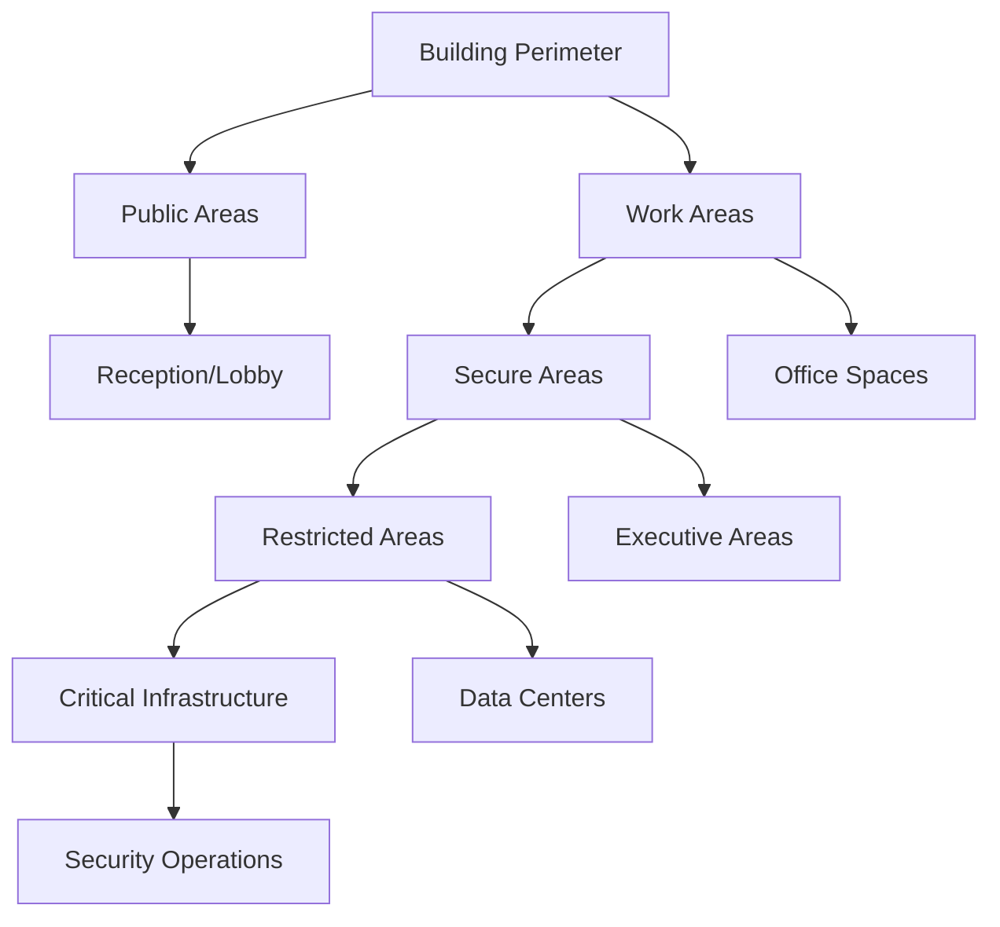

# Physical and Environmental Security Policy - ISO 27001

## ArionComply Platform Metadata

```yaml
# Template Configuration
template_id: ISO27001-PHYSICAL-SECURITY-001
template_type: physical_environmental_security_policy
template_version: 1.0
template_status: draft
created_date: {{CURRENT_DATE}}
last_modified: {{CURRENT_DATE}}
template_category: operational_policy
compliance_framework: ISO27001:2022
template_owner: {{TEMPLATE_OWNER}}
approval_status: pending_review

# Platform Integration
platform_features:
  - physical_access_monitoring
  - environmental_sensor_integration
  - facility_asset_tracking
  - incident_correlation
  - compliance_reporting
  - security_analytics

# Dependencies
depends_on:
  - access_control_policy
  - information_security_policy
  - risk_management_policy
  - incident_response_policy

# Usage Context
applicable_controls:
  - A.7.1   # Physical security perimeters
  - A.7.2   # Physical entry controls
  - A.7.3   # Protection against environmental threats
  - A.7.4   # Equipment maintenance
  - A.11.1  # Secure areas
  - A.11.2  # Equipment
```

---

## **Document Control Information**

| **Element** | **Details** | **Description** |
|-------------|-------------|-----------------|
| **Document ID** | {{TEMPLATE_ID}} | *Unique identifier for this physical security policy* |
| **Document Title** | Physical and Environmental Security Policy | *Policy for physical and environmental protection* |
| **ISO 27001 Reference** | A.7.1, A.7.2, A.7.3, A.7.4, A.11.1, A.11.2 | *Primary controls addressed by this policy* |
| **Document Owner** | {{POLICY_OWNER}} | *Person responsible for policy maintenance* |
| **Approval Authority** | {{APPROVAL_AUTHORITY}} | *Authority responsible for policy approval* |
| **Effective Date** | {{EFFECTIVE_DATE}} | *Date when policy becomes effective* |
| **Review Frequency** | {{REVIEW_FREQUENCY}} | *How often policy will be reviewed* |
| **Next Review Date** | {{NEXT_REVIEW_DATE}} | *Scheduled date for next policy review* |
| **Classification Level** | {{DOCUMENT_CLASSIFICATION}} | *Classification level of this document* |

---

## **1. Policy Foundation**

### **1.1 Understanding Physical and Environmental Security**

Think of physical and environmental security like protecting a medieval castle. Just as a castle has multiple layers of defense - outer walls, gates, inner courtyards, and the keep - modern physical security requires multiple layers of protection to safeguard information assets and the people who work with them.

**Real-World Analogy**: Consider a modern bank's security approach:
- **Perimeter Security**: Like the outer fence and lighting around the bank building
- **Access Control**: Like the security doors and guards that control who enters
- **Area Protection**: Like the vault with its specialized access controls and monitoring
- **Environmental Protection**: Like fire suppression systems and climate control that protect both people and assets
- **Equipment Security**: Like the specialized secure transport for ATMs and cash handling equipment

### **1.2 Policy Purpose**

This policy establishes a comprehensive framework to:
- **Protect Personnel**: Ensure the safety and security of all personnel
- **Safeguard Assets**: Protect information systems, equipment, and facilities
- **Prevent Unauthorized Access**: Control physical access to sensitive areas and systems
- **Mitigate Environmental Threats**: Protect against environmental hazards and disruptions
- **Ensure Business Continuity**: Maintain operations through physical security measures

### **1.3 Policy Scope**

This policy applies to:
- **All Facilities**: Offices, data centers, warehouses, and remote locations
- **All Personnel**: Employees, contractors, visitors, and service providers
- **All Assets**: Information systems, equipment, documents, and infrastructure
- **All Areas**: Public areas, work areas, secure areas, and restricted areas
- **All Environments**: On-premises, co-located, cloud, and hybrid environments

---

## **2. Physical Security Framework**

### **2.1 Security Zones and Classifications**

#### **2.1.1 Public Areas**
**Definition**: Areas accessible to the general public with minimal security restrictions.

**Characteristics**:
- **Access Control**: No special access controls required
- **Monitoring**: Basic security monitoring
- **Information Assets**: No sensitive information assets
- **Security Measures**: Standard building security

**Examples**:
- Public lobbies and reception areas
- Public restrooms and common areas
- Parking areas and walkways
- Public meeting rooms and conference areas

**Security Requirements**:
- **Perimeter Security**: Standard building perimeter security
- **Surveillance**: Basic CCTV monitoring
- **Access Control**: Standard building access during business hours
- **Information Protection**: No sensitive information visible or accessible

#### **2.1.2 Work Areas**
**Definition**: General work areas where routine business activities are conducted.

**Characteristics**:
- **Access Control**: Employee access controls required
- **Monitoring**: Standard workplace monitoring
- **Information Assets**: Internal and some confidential information
- **Security Measures**: Standard workplace security

**Examples**:
- Open office spaces and cubicles
- General meeting rooms and conference areas
- Employee break rooms and kitchens
- Standard office equipment areas

**Security Requirements**:
- **Access Control**: Employee badge access required
- **Surveillance**: Standard workplace CCTV
- **Clean Desk Policy**: Clear desk and clear screen policies
- **Equipment Security**: Standard equipment security measures

#### **2.1.3 Secure Areas**
**Definition**: Areas requiring enhanced security measures for sensitive operations.

**Characteristics**:
- **Access Control**: Role-based access controls with approval
- **Monitoring**: Enhanced security monitoring
- **Information Assets**: Confidential information and systems
- **Security Measures**: Enhanced security measures

**Examples**:
- Executive offices and boardrooms
- Financial processing areas
- Customer service areas with sensitive data
- Secure meeting rooms and collaboration spaces

**Security Requirements**:
- **Access Control**: Role-based access with manager approval
- **Surveillance**: Enhanced CCTV with access logging
- **Information Protection**: Confidential information handling procedures
- **Equipment Security**: Enhanced equipment security and monitoring

#### **2.1.4 Restricted Areas**
**Definition**: Highly secure areas requiring the highest level of protection.

**Characteristics**:
- **Access Control**: Multi-factor authentication and dual approval
- **Monitoring**: Comprehensive security monitoring
- **Information Assets**: Restricted information and critical systems
- **Security Measures**: Maximum security measures

**Examples**:
- Data centers and server rooms
- Network operations centers
- Security operations centers
- Research and development facilities

**Security Requirements**:
- **Access Control**: Multi-factor authentication with dual approval
- **Surveillance**: Comprehensive monitoring with real-time alerts
- **Information Protection**: Restricted information handling procedures
- **Equipment Security**: Maximum equipment security with tamper detection

### **2.2 Physical Security Perimeters**

#### **2.2.1 Perimeter Definition**
**Security Perimeter Components**:
- **Physical Barriers**: Walls, fences, gates, and natural barriers
- **Detection Systems**: Intrusion detection and monitoring systems
- **Access Points**: Controlled entry and exit points
- **Monitoring**: Surveillance and security personnel
- **Lighting**: Adequate lighting for security and safety

#### **2.2.2 Perimeter Security Measures**
**Primary Perimeter Security**:
- **Barriers**: Physical barriers appropriate to security zone
- **Access Control**: Controlled access points with authentication
- **Detection**: Intrusion detection systems
- **Surveillance**: CCTV monitoring of perimeter areas
- **Lighting**: Adequate lighting for security purposes

**Secondary Perimeter Security**:
- **Building Access**: Controlled building access points
- **Reception Control**: Manned reception and visitor control
- **Internal Barriers**: Internal physical barriers and zones
- **Elevator Control**: Controlled elevator access to secure floors
- **Stairwell Security**: Secured stairwells and emergency exits

---

## **3. Access Control Systems**

### **3.1 Physical Access Control**

#### **3.1.1 Access Control Methods**
**Authentication Methods**:

| **Method** | **Security Level** | **Use Cases** | **Advantages** |
|------------|-------------------|---------------|----------------|
| **Key Cards** | Medium | General access | Cost-effective, easy to manage |
| **PIN Codes** | Medium | Shared access | No physical token required |
| **Biometric** | High | Secure areas | Non-transferable, high security |
| **Multi-Factor** | Very High | Restricted areas | Highest security, multiple factors |
| **Escort Required** | Maximum | Critical areas | Human verification, maximum control |

#### **3.1.2 Access Control Zones**
**Zone-Based Access Control**:



#### **3.1.3 Visitor Management**
**Visitor Access Process**:
1. **Pre-Registration**: Advance visitor registration when possible
2. **Identity Verification**: Verification of visitor identity
3. **Authorization**: Confirmation of visit authorization
4. **Escort Assignment**: Assignment of appropriate escort
5. **Badge Issuance**: Temporary visitor badge issuance
6. **Area Restrictions**: Clear communication of area restrictions
7. **Departure Process**: Formal departure and badge return

**Visitor Categories**:
- **Business Visitors**: Customers, partners, vendors
- **Service Providers**: Maintenance, delivery, cleaning
- **Contractors**: Temporary workers and consultants
- **VIP Visitors**: Executives, auditors, inspectors
- **Emergency Personnel**: Fire, police, medical personnel

### **3.2 ArionComply Access Integration**

#### **3.2.1 Integrated Access Management**
**Platform Integration**:
```yaml
physical_access_system:
  access_control:
    - badge_readers
    - biometric_scanners
    - pin_keypads
    - mobile_credentials
  
  monitoring:
    - real_time_tracking
    - access_logging
    - tailgating_detection
    - security_alerts
  
  integration:
    - hr_systems
    - identity_management
    - incident_response
    - compliance_reporting
```

#### **3.2.2 Access Analytics**
**Advanced Analytics**:
- **Behavior Analysis**: Unusual access pattern detection
- **Tailgating Detection**: Automated tailgating detection
- **Occupancy Monitoring**: Real-time occupancy tracking
- **Compliance Reporting**: Automated compliance reporting
- **Incident Correlation**: Correlation with security incidents

---

## **4. Environmental Protection**

### **4.1 Environmental Threat Assessment**

#### **4.1.1 Natural Environmental Threats**
**Climate and Weather Threats**:
- **Temperature Extremes**: Extreme heat and cold conditions
- **Humidity**: High and low humidity conditions
- **Precipitation**: Rain, snow, and flooding
- **Wind**: High winds and storms
- **Seismic Activity**: Earthquakes and ground movement
- **Wildfire**: Fire threats from natural causes

#### **4.1.2 Man-Made Environmental Threats**
**Human-Caused Environmental Threats**:
- **Fire**: Accidental and intentional fires
- **Water Damage**: Plumbing failures and leaks
- **Power Outages**: Electrical system failures
- **Chemical Spills**: Hazardous material incidents
- **Structural Damage**: Building damage and collapse
- **Contamination**: Air and water contamination

### **4.2 Environmental Control Systems**

#### **4.2.1 Climate Control**
**Temperature and Humidity Control**:
- **HVAC Systems**: Heating, ventilation, and air conditioning
- **Temperature Monitoring**: Continuous temperature monitoring
- **Humidity Control**: Humidity regulation and monitoring
- **Air Quality**: Air filtration and quality monitoring
- **Redundancy**: Backup climate control systems
- **Alerts**: Real-time alerts for environmental conditions

**Environmental Specifications**:
| **Area Type** | **Temperature Range** | **Humidity Range** | **Air Changes/Hour** |
|---------------|----------------------|-------------------|---------------------|
| **Office Areas** | 68-76°F (20-24°C) | 40-60% RH | 4-6 |
| **Data Centers** | 64-80°F (18-27°C) | 40-60% RH | 10-15 |
| **Server Rooms** | 68-72°F (20-22°C) | 45-55% RH | 15-20 |
| **Storage Areas** | 60-80°F (15-27°C) | 30-70% RH | 2-4 |

#### **4.2.2 Fire Protection Systems**
**Fire Detection and Suppression**:
- **Smoke Detection**: Early warning smoke detection systems
- **Heat Detection**: Temperature-based fire detection
- **Flame Detection**: Optical flame detection systems
- **Suppression Systems**: Appropriate fire suppression systems
- **Evacuation Systems**: Emergency evacuation procedures
- **Fire Barriers**: Fire-resistant barriers and compartmentalization

**Fire Suppression Types**:
| **System Type** | **Application** | **Advantages** | **Considerations** |
|-----------------|----------------|----------------|-------------------|
| **Water Sprinkler** | General areas | Effective, cost-efficient | Water damage risk |
| **Dry Chemical** | Electrical areas | Electrical fire safe | Cleanup required |
| **Clean Agent** | Data centers | No residue, safe for equipment | Higher cost |
| **Foam Systems** | Flammable liquids | Effective on liquid fires | Cleanup required |

#### **4.2.3 Water Protection**
**Water Damage Prevention**:
- **Leak Detection**: Water leak detection systems
- **Flood Prevention**: Flood barriers and drainage systems
- **Pipe Protection**: Pipe insulation and protection
- **Sump Pumps**: Basement and low-area water removal
- **Water Shutoffs**: Emergency water shutoff systems
- **Moisture Monitoring**: Continuous moisture monitoring

### **4.3 Environmental Monitoring**

#### **4.3.1 Sensor Networks**
**Environmental Sensor Integration**:
```yaml
environmental_monitoring:
  sensors:
    - temperature_sensors
    - humidity_sensors
    - water_leak_detectors
    - smoke_detectors
    - air_quality_monitors
  
  monitoring:
    - real_time_data
    - threshold_alerts
    - trend_analysis
    - predictive_maintenance
  
  integration:
    - building_management_systems
    - security_systems
    - incident_response
    - compliance_reporting
```

#### **4.3.2 Monitoring and Alerting**
**Alert Management**:
- **Threshold Alerts**: Automatic alerts for environmental thresholds
- **Trend Alerts**: Alerts for concerning environmental trends
- **System Alerts**: Alerts for environmental system failures
- **Escalation**: Automatic escalation for critical alerts
- **Notification**: Multi-channel notification systems

---

## **5. Equipment Security**

### **5.1 Equipment Protection**

#### **5.1.1 Equipment Classification**
**Equipment Categories**:

| **Category** | **Examples** | **Security Level** | **Protection Requirements** |
|--------------|--------------|-------------------|---------------------------|
| **Critical Systems** | Servers, network equipment | High | Restricted access, monitoring |
| **User Equipment** | Desktops, laptops, printers | Medium | Standard workplace security |
| **Mobile Devices** | Smartphones, tablets | High | Encryption, remote wipe |
| **Peripherals** | Monitors, keyboards, mice | Low | Basic physical security |
| **Infrastructure** | UPS, generators, HVAC | Medium | Controlled access, monitoring |

#### **5.1.2 Equipment Placement**
**Secure Equipment Placement**:
- **Restricted Access**: Equipment in appropriately secured areas
- **Physical Barriers**: Physical barriers around critical equipment
- **Cable Management**: Secure cable routing and management
- **Mounting Security**: Secure mounting and anchoring
- **Visibility**: Equipment not visible from public areas

#### **5.1.3 Equipment Maintenance**
**Maintenance Security**:
- **Authorized Personnel**: Only authorized maintenance personnel
- **Escort Requirements**: Escort requirements for maintenance
- **Maintenance Logs**: Complete maintenance logging
- **Equipment Verification**: Verification after maintenance
- **Spare Parts**: Secure spare parts management

### **5.2 Asset Management**

#### **5.2.1 Asset Inventory**
**Equipment Inventory Management**:
- **Asset Tagging**: Unique asset identification tags
- **Inventory Database**: Comprehensive asset database
- **Location Tracking**: Real-time asset location tracking
- **Condition Monitoring**: Equipment condition monitoring
- **Lifecycle Management**: Complete equipment lifecycle management

#### **5.2.2 Asset Tracking**
**ArionComply Asset Integration**:
```yaml
asset_management:
  tracking:
    - rfid_tags
    - barcode_scanning
    - gps_tracking
    - manual_verification
  
  monitoring:
    - location_tracking
    - movement_detection
    - unauthorized_access
    - maintenance_schedules
  
  integration:
    - inventory_systems
    - maintenance_management
    - security_systems
    - compliance_reporting
```

---

## **6. Secure Areas Management**

### **6.1 Data Center Security**

#### **6.1.1 Data Center Physical Security**
**Multi-Layer Security**:
- **Perimeter Security**: Secured building perimeter with barriers
- **Building Access**: Controlled building access with reception
- **Floor Access**: Controlled floor access with elevators
- **Suite Access**: Controlled data center suite access
- **Cage/Room Access**: Individual cage or room access controls
- **Rack Access**: Individual rack access controls

#### **6.1.2 Data Center Environmental Controls**
**Environmental Protection**:
- **Climate Control**: Precise temperature and humidity control
- **Power Systems**: Redundant power with UPS and generators
- **Fire Suppression**: Clean agent fire suppression systems
- **Water Protection**: Comprehensive water leak detection
- **Air Quality**: Air filtration and quality monitoring
- **Seismic Protection**: Seismic bracing and protection

### **6.2 Office Security**

#### **6.2.1 Workplace Security**
**General Office Security**:
- **Access Control**: Employee access control systems
- **Visitor Management**: Comprehensive visitor management
- **Clean Desk Policy**: Clear desk and clear screen policies
- **Secure Storage**: Locked storage for sensitive materials
- **Meeting Room Security**: Secure meeting room management

#### **6.2.2 Executive Area Security**
**Enhanced Executive Security**:
- **Restricted Access**: Enhanced access controls
- **Privacy Protection**: Visual and audio privacy protection
- **Secure Communications**: Secure communication facilities
- **Document Security**: Enhanced document handling procedures
- **Meeting Security**: Secure meeting and conference facilities

### **6.3 Remote Location Security**

#### **6.3.1 Branch Office Security**
**Standardized Security**:
- **Security Standards**: Consistent security standards across locations
- **Local Security**: Local security personnel and procedures
- **Remote Monitoring**: Central monitoring of remote locations
- **Incident Response**: Local incident response capabilities
- **Compliance**: Consistent compliance across all locations

#### **6.3.2 Home Office Security**
**Remote Work Security**:
- **Equipment Security**: Secure equipment placement and protection
- **Network Security**: Secure network connectivity
- **Physical Security**: Basic physical security measures
- **Document Security**: Secure document handling procedures
- **Compliance**: Remote work compliance requirements

---

## **7. Incident Response and Emergency Procedures**

### **7.1 Security Incident Response**

#### **7.1.1 Physical Security Incidents**
**Incident Types**:
- **Unauthorized Access**: Attempts to gain unauthorized physical access
- **Theft**: Theft of equipment or information assets
- **Vandalism**: Damage to facilities or equipment
- **Suspicious Activity**: Unusual or concerning behavior
- **Security System Failure**: Failure of physical security systems

#### **7.1.2 Incident Response Process**
**Response Procedures**:
1. **Detection**: Immediate detection of security incidents
2. **Alert**: Immediate alert to security personnel
3. **Assessment**: Rapid assessment of incident severity
4. **Containment**: Immediate containment of incident
5. **Investigation**: Thorough investigation of incident
6. **Resolution**: Complete resolution and recovery
7. **Review**: Post-incident review and improvement

### **7.2 Emergency Procedures**

#### **7.2.1 Emergency Response**
**Emergency Types**:
- **Fire Emergency**: Fire and smoke emergencies
- **Medical Emergency**: Medical emergencies and injuries
- **Natural Disaster**: Earthquakes, floods, severe weather
- **Security Emergency**: Active threats and dangerous situations
- **Utility Emergency**: Power, water, or communication failures

#### **7.2.2 Evacuation Procedures**
**Evacuation Process**:
1. **Alert**: Emergency alert and notification systems
2. **Evacuation**: Orderly evacuation of affected areas
3. **Assembly**: Assembly at designated emergency areas
4. **Accountability**: Personnel accountability and headcount
5. **Communication**: Communication with emergency services
6. **Recovery**: Facility recovery and return procedures

### **7.3 Business Continuity**

#### **7.3.1 Facility Recovery**
**Recovery Planning**:
- **Damage Assessment**: Rapid facility damage assessment
- **Alternative Facilities**: Alternative facility arrangements
- **Equipment Recovery**: Equipment recovery and replacement
- **Data Recovery**: Data and system recovery procedures
- **Communication**: Stakeholder communication during recovery

#### **7.3.2 Continuity Operations**
**Continuity Procedures**:
- **Remote Work**: Remote work activation procedures
- **Alternative Sites**: Alternative site activation
- **Critical Operations**: Prioritized critical operations
- **Resource Allocation**: Emergency resource allocation
- **Performance Monitoring**: Continuity performance monitoring

---

## **8. Compliance and Regulatory Requirements**

### **8.1 Regulatory Compliance**

#### **8.1.1 Building Codes and Safety**
**Compliance Requirements**:
- **Building Codes**: Compliance with local building codes
- **Fire Safety**: Fire safety code compliance
- **Accessibility**: Accessibility compliance (ADA, etc.)
- **Occupational Safety**: OSHA and workplace safety compliance
- **Environmental**: Environmental protection compliance

#### **8.1.2 Industry Standards**
**Security Standards**:
- **ISO 27001**: Physical and environmental security controls
- **NIST Cybersecurity Framework**: Physical security controls
- **SOC 2**: Physical security controls and monitoring
- **PCI DSS**: Physical security for payment processing
- **HIPAA**: Physical security for healthcare information

### **8.2 Audit and Assessment**

#### **8.2.1 Security Assessments**
**Assessment Types**:
- **Physical Security Audit**: Comprehensive physical security assessment
- **Penetration Testing**: Physical penetration testing
- **Vulnerability Assessment**: Physical vulnerability assessment
- **Compliance Audit**: Regulatory compliance assessment
- **Risk Assessment**: Physical security risk assessment

#### **8.2.2 Monitoring and Metrics**
**Key Performance Indicators**:
- **Access Compliance**: {{ACCESS_COMPLIANCE_TARGET}}%
- **Incident Response Time**: {{INCIDENT_RESPONSE_TARGET}} minutes
- **Environmental Uptime**: {{ENVIRONMENTAL_UPTIME_TARGET}}%
- **Security System Availability**: {{SECURITY_SYSTEM_AVAILABILITY_TARGET}}%
- **Training Compliance**: {{TRAINING_COMPLIANCE_TARGET}}%

---

## **9. Training and Awareness**

### **9.1 Security Training Program**

#### **9.1.1 Role-Based Training**
**Training by Role**:
- **Security Personnel**: Advanced physical security training
- **Facility Managers**: Facility security management training
- **Employees**: General security awareness training
- **Contractors**: Contractor security requirements training
- **Visitors**: Visitor security briefing and orientation

#### **9.1.2 Training Topics**
**Core Training Areas**:
- **Physical Security Awareness**: Basic physical security concepts
- **Access Control**: Proper use of access control systems
- **Emergency Procedures**: Emergency response procedures
- **Incident Reporting**: Security incident reporting procedures
- **Environmental Safety**: Environmental safety and protection

### **9.2 Security Awareness**

#### **9.2.1 Awareness Programs**
**Awareness Activities**:
- **Security Briefings**: Regular security briefings and updates
- **Emergency Drills**: Regular emergency evacuation drills
- **Security Reminders**: Visual security reminders and posters
- **Newsletter Articles**: Security articles in company communications
- **Security Champions**: Employee security champion programs

#### **9.2.2 Competency Assessment**
**Assessment Methods**:
- **Knowledge Testing**: Regular security knowledge testing
- **Practical Exercises**: Hands-on security exercises
- **Emergency Drills**: Emergency response drill participation
- **Incident Simulation**: Security incident simulation exercises
- **Compliance Verification**: Regular compliance verification

---

## **10. Vendor and Service Provider Management**

### **10.1 Vendor Security Requirements**

#### **10.1.1 Service Provider Standards**
**Security Requirements**:
- **Background Checks**: Personnel background verification
- **Training Requirements**: Security training for service personnel
- **Access Controls**: Appropriate access controls for service providers
- **Supervision**: Supervision requirements for service providers
- **Incident Reporting**: Incident reporting requirements

#### **10.1.2 Contractor Management**
**Contractor Security**:
- **Security Clearance**: Appropriate security clearance levels
- **Escort Requirements**: Escort requirements for contractors
- **Area Restrictions**: Clear area access restrictions
- **Equipment Security**: Contractor equipment security requirements
- **Compliance**: Contractor compliance with security policies

### **10.2 Service Level Agreements**

#### **10.2.1 Security Service SLAs**
**Service Level Requirements**:
- **Response Time**: Security incident response time requirements
- **Availability**: Security system availability requirements
- **Maintenance**: Maintenance service level requirements
- **Reporting**: Security reporting requirements
- **Compliance**: Compliance verification requirements

#### **10.2.2 Performance Monitoring**
**Vendor Performance**:
- **Service Metrics**: Regular service performance metrics
- **Compliance Monitoring**: Ongoing compliance monitoring
- **Incident Response**: Vendor incident response performance
- **Quality Assurance**: Service quality assurance processes
- **Continuous Improvement**: Vendor performance improvement

---

## **11. Technology Integration**

### **11.1 Security System Integration**

#### **11.1.1 Integrated Security Platform**
**ArionComply Integration**:
```yaml
integrated_security:
  physical_systems:
    - access_control
    - video_surveillance
    - intrusion_detection
    - environmental_monitoring
  
  digital_integration:
    - identity_management
    - incident_response
    - compliance_reporting
    - analytics_platform
  
  automation:
    - threat_detection
    - response_automation
    - compliance_monitoring
    - reporting_automation
```

#### **11.1.2 Advanced Analytics**
**Security Analytics**:
- **Behavior Analysis**: Advanced behavior pattern analysis
- **Threat Detection**: Automated threat detection and alerting
- **Predictive Analytics**: Predictive maintenance and security analytics
- **Compliance Monitoring**: Automated compliance monitoring
- **Performance Optimization**: Security system performance optimization

### **11.2 Emerging Technologies**

#### **11.2.1 Advanced Security Technologies**
**Emerging Solutions**:
- **Biometric Systems**: Advanced biometric authentication
- **AI-Powered Analytics**: AI-powered security analytics
- **IoT Integration**: Internet of Things security integration
- **Mobile Credentials**: Mobile device-based credentials
- **Blockchain Security**: Blockchain-based security applications

#### **11.2.2 Smart Building Integration**
**Smart Building Features**:
- **Building Automation**: Integrated building automation systems
- **Energy Management**: Energy-efficient security systems
- **Space Management**: Intelligent space utilization
- **Predictive Maintenance**: Predictive maintenance capabilities
- **Occupancy Analytics**: Advanced occupancy analytics

---

## **12. Continuous Improvement**

### **12.1 Performance Monitoring**

#### **12.1.1 Security Metrics**
**Key Performance Indicators**:
- **Physical Security Effectiveness**: Measurement of security effectiveness
- **Incident Response Performance**: Response time and effectiveness
- **Environmental System Performance**: Environmental system reliability
- **Compliance Performance**: Regulatory compliance metrics
- **Cost Effectiveness**: Security cost-benefit analysis

#### **12.1.2 Improvement Process**
**Continuous Improvement**:
- **Regular Assessment**: Regular security assessment and review
- **Technology Updates**: Technology upgrade and modernization
- **Process Improvement**: Security process improvement initiatives
- **Training Enhancement**: Training program improvements
- **Stakeholder Feedback**: Stakeholder feedback and incorporation

### **12.2 Future Planning**

#### **12.2.1 Strategic Planning**
**Long-Term Planning**:
- **Technology Roadmap**: Physical security technology roadmap
- **Facility Planning**: Future facility security planning
- **Risk Assessment**: Future risk assessment and planning
- **Compliance Planning**: Future compliance requirement planning
- **Investment Planning**: Security investment planning

#### **12.2.2 Innovation Integration**
**Innovation Adoption**:
- **Emerging Technology**: Evaluation and adoption of emerging technologies
- **Industry Best Practices**: Adoption of industry best practices
- **Regulatory Changes**: Adaptation to regulatory changes
- **Threat Evolution**: Adaptation to evolving threats
- **Business Evolution**: Adaptation to business changes

---

## **13. Implementation Checklist**

### **13.1 Pre-Implementation**
- [ ] **Security Assessment**: Conduct comprehensive security assessment
- [ ] **Risk Analysis**: Perform detailed risk analysis
- [ ] **Requirements Definition**: Define security requirements
- [ ] **Budget Planning**: Develop security budget and planning
- [ ] **Vendor Selection**: Select security vendors and solutions

### **13.2 Implementation Phase**
- [ ] **System Installation**: Install physical security systems
- [ ] **Integration**: Integrate security systems with ArionComply
- [ ] **Testing**: Comprehensive system testing and validation
- [ ] **Training**: Deliver security training to personnel
- [ ] **Documentation**: Complete security documentation

### **13.3 Post-Implementation**
- [ ] **Monitoring Setup**: Establish security monitoring procedures
- [ ] **Compliance Verification**: Verify regulatory compliance
- [ ] **Performance Testing**: Test security system performance
- [ ] **Incident Response**: Establish incident response procedures
- [ ] **Continuous Improvement**: Implement improvement processes

---

## **14. Related Documents**

### **14.1 Policy Dependencies**
- **Access Control Policy**: Integration with physical access controls
- **Incident Response Policy**: Physical security incident response
- **Risk Management Policy**: Physical security risk management
- **Information Security Policy**: Overall security framework

### **14.2 Technical Standards**
- **Access Control Standards**: Physical access control standards
- **Environmental Standards**: Environmental protection standards
- **Surveillance Standards**: Video surveillance standards
- **Fire Safety Standards**: Fire protection and safety standards

### **14.3 Operational Procedures**
- **Emergency Procedures**: Emergency response procedures
- **Maintenance Procedures**: Security system maintenance procedures
- **Visitor Management Procedures**: Visitor access procedures
- **Incident Response Procedures**: Security incident response procedures

---

## **15. Appendices**

### **15.1 Security Zone Matrix**
| **Zone** | **Access Control** | **Monitoring** | **Environmental** | **Equipment** |
|----------|-------------------|----------------|-------------------|---------------|
| **Public** | Standard | Basic CCTV | Standard | Basic |
| **Work** | Badge access | Standard CCTV | Standard | Standard |
| **Secure** | Role-based | Enhanced CCTV | Enhanced | Enhanced |
| **Restricted** | Multi-factor | Comprehensive | Specialized | Maximum |

### **15.2 Environmental Specifications**
| **Parameter** | **Office** | **Data Center** | **Server Room** | **Storage** |
|---------------|------------|----------------|----------------|-------------|
| **Temperature** | 68-76°F | 64-80°F | 68-72°F | 60-80°F |
| **Humidity** | 40-60% | 40-60% | 45-55% | 30-70% |
| **Air Changes** | 4-6/hour | 10-15/hour | 15-20/hour | 2-4/hour |

### **15.3 Emergency Contact Information**
| **Emergency Type** | **Contact** | **Phone** | **Response Time** |
|-------------------|-------------|-----------|-------------------|
| **Fire** | Fire Department | 911 | 3-5 minutes |
| **Medical** | Emergency Medical | 911 | 5-8 minutes |
| **Police** | Local Police | 911 | 5-10 minutes |
| **Security** | Security Company | {{SECURITY_PHONE}} | 10-15 minutes |
| **Facilities** | Facility Manager | {{FACILITY_PHONE}} | 15-30 minutes |

---

**Document Status**: {{DOCUMENT_STATUS}}  
**Version**: {{VERSION_NUMBER}}  
**Last Updated**: {{LAST_UPDATED}}  
**Next Review**: {{NEXT_REVIEW_DATE}}  
**Owner**: {{DOCUMENT_OWNER}}  
**Approved By**: {{APPROVED_BY}}  
**Approval Date**: {{APPROVAL_DATE}}