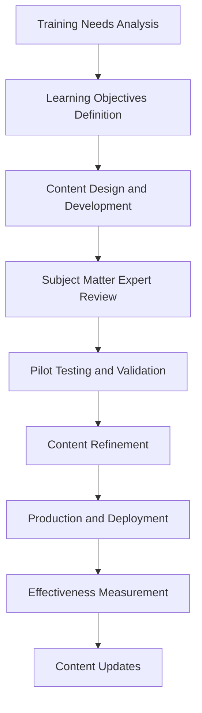

# Security Awareness and Training Procedure - ISO 27001

## ArionComply Platform Metadata

```yaml
# Template Configuration
template_id: ISO27001-SECURITY-TRAINING-PROC-001
template_type: security_awareness_training_procedure
template_version: 1.0
template_status: draft
created_date: {{CURRENT_DATE}}
last_modified: {{CURRENT_DATE}}
template_category: operational_procedure
compliance_framework: ISO27001:2022
template_owner: {{TEMPLATE_OWNER}}
approval_status: pending_review

# Platform Integration
platform_features:
  - personalized_learning_paths
  - adaptive_training_delivery
  - behavioral_change_tracking
  - phishing_simulation_integration
  - competency_assessment
  - training_analytics

# Dependencies
depends_on:
  - access_review_certification_procedure
  - human_resources_security_policy
  - information_security_incident_management_procedure
  - data_classification_policy
  - security_monitoring_logging_procedure
  - supplier_relationship_management_policy

# Usage Context
applicable_controls:
  - A.6.3   # Information security awareness, education and training
  - A.7.2.2 # Information security awareness
  - A.5.31  # Legal, statutory, regulatory and contractual requirements
  - A.16.1.2 # Reporting information security events
  - A.12.2.1 # Controls against malware
```

---

## **Document Control Information**

| **Element** | **Details** | **Description** |
|-------------|-------------|-----------------|
| **Document ID** | {{TEMPLATE_ID}} | *Unique identifier for this security training procedure* |
| **Document Title** | Security Awareness and Training Procedure | *Detailed procedures for security awareness and training operations* |
| **ISO 27001 Reference** | A.6.3, A.7.2.2, A.5.31, A.16.1.2, A.12.2.1 | *Primary controls addressed by this procedure* |
| **Document Owner** | {{PROCEDURE_OWNER}} | *Person responsible for procedure maintenance* |
| **Approval Authority** | {{APPROVAL_AUTHORITY}} | *Authority responsible for procedure approval* |
| **Effective Date** | {{EFFECTIVE_DATE}} | *Date when procedure becomes effective* |
| **Review Frequency** | {{REVIEW_FREQUENCY}} | *How often procedure will be reviewed* |
| **Next Review Date** | {{NEXT_REVIEW_DATE}} | *Scheduled date for next procedure review* |
| **Classification Level** | {{DOCUMENT_CLASSIFICATION}} | *Classification level of this document* |

---

## **1. Procedure Foundation**

### **1.1 Understanding Security Awareness and Training**

Think of security awareness and training like developing a community-wide public health and safety program. Just as a city implements comprehensive public education campaigns about health risks, emergency preparedness, and safety practices - while providing specialized training for healthcare workers, first responders, and safety officials - security awareness and training creates a security-conscious organizational culture through education, skill development, and behavioral change.

**Real-World Analogy**: Consider how a fire department educates a community about fire safety:
- **General Awareness**: Like public campaigns teaching everyone basic fire safety and evacuation procedures
- **Specialized Training**: Like comprehensive firefighter training for emergency responders
- **Regular Drills**: Like fire drills in schools and workplaces to practice safety procedures
- **Behavioral Change**: Like teaching children not to play with matches and adults to check smoke detectors
- **Continuous Education**: Like ongoing safety education as new risks and technologies emerge
- **Measurement**: Like tracking fire safety statistics and adjusting education programs accordingly

Security awareness and training transforms security policies into practical knowledge and secure behaviors.

### **1.2 Procedure Purpose**

This procedure establishes detailed operational steps to:
- **Build Security Culture**: Develop a strong organizational security culture and mindset
- **Educate Personnel**: Provide comprehensive security education for all personnel
- **Develop Skills**: Build practical security skills and competencies
- **Change Behavior**: Drive positive security behavior change across the organization
- **Maintain Awareness**: Keep security risks and practices top-of-mind
- **Measure Effectiveness**: Assess training effectiveness and behavioral impact
- **Ensure Compliance**: Meet regulatory and policy training requirements
- **Continuous Improvement**: Continuously improve training content and delivery

### **1.3 Procedure Scope**

This procedure applies to:
- **All Personnel**: Employees, contractors, temporary staff, and third-party users
- **All Training Types**: General awareness, role-specific training, and specialized security training
- **All Delivery Methods**: Online training, classroom instruction, simulations, and hands-on exercises
- **All Learning Levels**: Basic awareness through expert-level competency development
- **All Security Domains**: Technical security, physical security, and operational security

---

## **2. Training Program Framework**

### **2.1 Training Strategy and Objectives**

#### **2.1.1 Strategic Training Objectives**
**Comprehensive Training Goals**:
- **Awareness**: Develop security risk awareness and threat recognition
- **Knowledge**: Build foundational and advanced security knowledge
- **Skills**: Develop practical security skills and competencies
- **Behavior**: Drive secure behavior adoption and habit formation
- **Culture**: Foster a positive security culture and shared responsibility
- **Compliance**: Ensure regulatory and policy compliance
- **Resilience**: Build organizational security resilience and adaptability

#### **2.1.2 Training Philosophy**
**Learner-Centric Training Approach**:
- **Relevance**: Training content relevant to role and responsibilities
- **Engagement**: Interactive and engaging training experiences
- **Practicality**: Practical application and real-world scenarios
- **Personalization**: Personalized learning paths and experiences
- **Continuous Learning**: Ongoing learning and skill development
- **Measurement**: Data-driven training effectiveness measurement
- **Improvement**: Continuous training program improvement

### **2.2 Audience Segmentation**

#### **2.2.1 Role-Based Training Matrix**
**Targeted Training by Role**:

| **Audience** | **Training Focus** | **Frequency** | **Delivery Method** |
|--------------|-------------------|---------------|-------------------|
| **All Employees** | General security awareness | Annual + updates | Online + campaigns |
| **IT Staff** | Technical security practices | Quarterly | Mixed delivery |
| **Managers** | Security leadership, incident response | Bi-annual | Classroom + simulation |
| **Executives** | Security governance, risk management | Annual | Executive briefings |
| **Contractors** | Role-specific security requirements | Pre-engagement | Online + orientation |
| **High-Risk Roles** | Advanced threat awareness | Monthly | Specialized training |

#### **2.2.2 Risk-Based Segmentation**
**Training Intensity by Risk Level**:
- **High-Risk Personnel**: Enhanced training frequency and depth
- **Privileged Users**: Specialized privileged access training
- **Customer-Facing**: Social engineering and data protection focus
- **Remote Workers**: Remote work security and best practices
- **Third-Party Users**: Organizational security requirements and expectations
- **New Hires**: Comprehensive security onboarding and orientation

### **2.3 ArionComply Training Intelligence**

#### **2.3.1 Adaptive Learning Platform**
**AI-Enhanced Training Delivery**:
```yaml
adaptive_training:
  personalization_engine:
    - role_based_customization
    - skill_level_assessment
    - learning_style_adaptation
    - progress_based_advancement
  
  content_optimization:
    - dynamic_content_selection
    - difficulty_adjustment
    - engagement_optimization
    - relevance_scoring
  
  behavioral_analytics:
    - learning_pattern_analysis
    - engagement_tracking
    - retention_measurement
    - behavior_change_prediction
```

#### **2.3.2 Training Analytics and Intelligence**
**Data-Driven Training Optimization**:
- **Learning Analytics**: Comprehensive learning analytics and insights
- **Performance Prediction**: Predictive learning performance modeling
- **Content Effectiveness**: Training content effectiveness analysis
- **Engagement Optimization**: Learning engagement optimization
- **Retention Analysis**: Knowledge retention analysis and improvement
- **Behavioral Impact**: Training behavioral impact measurement

---

## **3. Training Content Development**

### **3.1 Content Framework**

#### **3.1.1 Core Content Categories**
**Comprehensive Security Training Content**:

| **Content Category** | **Topics Covered** | **Target Audience** | **Update Frequency** |
|---------------------|-------------------|-------------------|---------------------|
| **Security Fundamentals** | Basic security concepts, policies | All personnel | Annual |
| **Threat Awareness** | Current threats, attack methods | All personnel | Quarterly |
| **Data Protection** | Data handling, classification, privacy | All personnel | Bi-annual |
| **Incident Response** | Reporting, response procedures | All personnel | Annual |
| **Physical Security** | Facility security, device protection | All personnel | Annual |
| **Technical Security** | System security, secure coding | IT personnel | Quarterly |

#### **2.1.2 Content Development Process**
**Systematic Content Creation**:


### **3.2 Interactive and Engaging Content**

#### **3.2.1 Content Delivery Methods**
**Multi-Modal Training Delivery**:
- **Interactive Modules**: Engaging interactive online learning modules
- **Video Content**: Professional video content and demonstrations
- **Simulations**: Realistic security scenario simulations
- **Gamification**: Game-based learning and security challenges
- **Microlearning**: Bite-sized learning content and just-in-time training
- **Virtual Reality**: Immersive VR training experiences
- **Hands-On Labs**: Practical hands-on security exercises
- **Case Studies**: Real-world security incident case studies

#### **3.2.2 Content Personalization**
**Adaptive Content Framework**:
- **Role-Based Content**: Content customized by job role and responsibilities
- **Skill-Level Adaptation**: Content adapted to individual skill levels
- **Learning Path Personalization**: Personalized learning paths and progressions
- **Interest-Based Customization**: Content aligned with individual interests
- **Performance-Based Adaptation**: Content adapted based on learning performance
- **Behavioral Insights**: Content optimization based on behavioral analytics

### **3.3 Current Threat Integration**

#### **3.3.1 Threat Intelligence Integration**
**Real-Time Threat Awareness**:
- **Current Threat Landscape**: Up-to-date threat landscape information
- **Industry-Specific Threats**: Threats relevant to organizational industry
- **Attack Method Education**: Education on current attack methods and techniques
- **Case Study Updates**: Recent security incident case studies
- **Threat Actor Profiles**: Current threat actor tactics and motivations
- **Emerging Threats**: Education on emerging security threats and risks

#### **3.3.2 Dynamic Content Updates**
**Agile Content Management**:
- **Rapid Content Updates**: Rapid content updates for emerging threats
- **Automated Content Feeds**: Automated threat intelligence content integration
- **Expert Contributions**: Subject matter expert content contributions
- **Community Content**: User-generated content and knowledge sharing
- **Vendor Intelligence**: Security vendor threat intelligence integration
- **Research Integration**: Academic and industry research integration

---

## **4. Training Delivery and Implementation**

### **4.1 Multi-Modal Delivery Framework**

#### **4.1.1 Delivery Method Selection**
**Optimal Delivery Method Matrix**:

| **Training Type** | **Primary Method** | **Secondary Method** | **Assessment** |
|-------------------|-------------------|---------------------|----------------|
| **General Awareness** | Online modules | Email campaigns | Quiz |
| **Role-Specific** | Blended learning | Classroom sessions | Practical exercise |
| **Technical Skills** | Hands-on labs | Video tutorials | Project-based |
| **Incident Response** | Tabletop exercises | Simulations | Scenario response |
| **Compliance** | Online certification | Document review | Compliance test |

#### **4.1.2 Blended Learning Approach**
**Integrated Training Experience**:
- **Pre-Work**: Preparatory reading and self-assessment
- **Instructor-Led**: Classroom or virtual instructor-led sessions
- **Hands-On Practice**: Practical exercises and simulations
- **Peer Learning**: Collaborative learning and knowledge sharing
- **Assessment**: Competency assessment and validation
- **Reinforcement**: Follow-up activities and reinforcement
- **Application**: Real-world application and practice

### **4.2 Training Scheduling and Planning**

#### **4.2.1 Training Calendar Framework**
**Strategic Training Scheduling**:
- **Annual Planning**: Annual training calendar and planning
- **Quarterly Themes**: Quarterly security focus themes and campaigns
- **Monthly Sessions**: Monthly specialized training sessions
- **Event-Driven Training**: Training triggered by security events
- **Onboarding Integration**: New hire onboarding training integration
- **Role Change Training**: Training for role changes and promotions
- **Compliance Deadlines**: Training aligned with compliance deadlines

#### **4.2.2 Resource Planning**
**Training Resource Management**:
- **Instructor Resources**: Internal and external instructor resource planning
- **Facility Requirements**: Training facility and technology requirements
- **Technology Platforms**: Learning management system and technology needs
- **Budget Planning**: Training budget planning and allocation
- **Time Allocation**: Employee time allocation for training activities
- **Material Resources**: Training materials and resource requirements

### **4.3 Learning Management Integration**

#### **4.3.1 LMS Platform Features**
**Comprehensive Learning Management**:
- **User Management**: Comprehensive user and role management
- **Content Management**: Training content management and delivery
- **Progress Tracking**: Individual and group progress tracking
- **Assessment Management**: Training assessment and testing management
- **Reporting**: Comprehensive training reporting and analytics
- **Integration**: Integration with HR and other enterprise systems
- **Mobile Access**: Mobile learning access and functionality
- **Gamification**: Learning gamification and engagement features

#### **4.3.2 ArionComply LMS Integration**
**Intelligent Learning Platform**:
```yaml
lms_integration:
  adaptive_learning:
    - personalized_learning_paths
    - intelligent_content_recommendation
    - skill_gap_analysis
    - competency_mapping
  
  engagement_optimization:
    - learning_analytics
    - engagement_tracking
    - motivation_enhancement
    - social_learning_features
  
  compliance_management:
    - automated_compliance_tracking
    - certification_management
    - audit_trail_maintenance
    - regulatory_reporting
```

---

## **5. Phishing and Social Engineering Training**

### **5.1 Phishing Simulation Program**

#### **5.1.1 Simulation Framework**
**Comprehensive Phishing Training**:
- **Baseline Assessment**: Initial phishing susceptibility assessment
- **Progressive Campaigns**: Increasingly sophisticated phishing campaigns
- **Real-Time Education**: Just-in-time education for failed simulations
- **Success Recognition**: Recognition for successful threat identification
- **Targeted Training**: Additional training for high-risk individuals
- **Performance Tracking**: Individual and group performance tracking
- **Behavioral Change**: Long-term behavioral change measurement

#### **5.1.2 Campaign Design and Execution**
**Realistic Simulation Campaigns**:

| **Campaign Type** | **Sophistication** | **Frequency** | **Target Audience** |
|-------------------|-------------------|---------------|-------------------|
| **Basic Awareness** | Low | Monthly | All employees |
| **Targeted Attacks** | Medium | Quarterly | High-risk roles |
| **Advanced Persistent** | High | Bi-annual | Executive/IT staff |
| **Industry-Specific** | Variable | Quarterly | Role-specific |

### **5.2 Social Engineering Awareness**

#### **5.2.1 Attack Vector Education**
**Comprehensive Attack Awareness**:
- **Email-Based Attacks**: Phishing, spear phishing, and business email compromise
- **Phone-Based Attacks**: Vishing, pretexting, and social engineering calls
- **Physical Attacks**: Tailgating, shoulder surfing, and unauthorized access
- **Social Media Attacks**: Social media reconnaissance and manipulation
- **Combination Attacks**: Multi-vector attacks and advanced techniques
- **Emerging Techniques**: New and evolving social engineering methods

#### **5.2.2 Defense Strategy Training**
**Practical Defense Techniques**:
- **Verification Procedures**: Identity verification and authentication procedures
- **Reporting Mechanisms**: Suspicious activity reporting procedures
- **Decision Making**: Security decision-making frameworks and guidelines
- **Communication Security**: Secure communication practices and protocols
- **Information Sharing**: Safe information sharing guidelines and practices
- **Technology Tools**: Security technology tools and protective measures

### **5.3 Behavioral Change Measurement**

#### **5.3.1 Behavioral Metrics**
**Security Behavior Tracking**:
- **Phishing Click Rates**: Phishing simulation click rates and trends
- **Reporting Rates**: Suspicious email reporting rates and quality
- **Policy Compliance**: Security policy compliance behavior
- **Incident Participation**: Security incident reporting and participation
- **Training Engagement**: Training participation and engagement levels
- **Peer Influence**: Peer-to-peer security behavior influence

#### **5.3.2 Longitudinal Analysis**
**Long-Term Behavior Change**:
- **Trend Analysis**: Long-term security behavior trend analysis
- **Intervention Effectiveness**: Training intervention effectiveness measurement
- **Retention Analysis**: Security knowledge retention analysis
- **Behavioral Persistence**: Security behavior persistence and durability
- **Cultural Indicators**: Security culture indicators and measurement
- **Predictive Modeling**: Security behavior predictive modeling

---

## **6. Competency Assessment and Certification**

### **6.1 Competency Framework**

#### **6.1.1 Security Competency Model**
**Comprehensive Competency Matrix**:

| **Competency Level** | **Knowledge** | **Skills** | **Behavior** | **Assessment** |
|---------------------|---------------|------------|--------------|----------------|
| **Basic Awareness** | Security fundamentals | Recognition | Reporting | Quiz + simulation |
| **Functional** | Role-specific security | Application | Compliance | Practical exercise |
| **Advanced** | Deep technical knowledge | Problem-solving | Leadership | Project + peer review |
| **Expert** | Cutting-edge expertise | Innovation | Mentoring | Certification + portfolio |

#### **6.1.2 Role-Based Competencies**
**Competency by Job Function**:
- **General Employee**: Basic security awareness and incident reporting
- **IT Professional**: Technical security implementation and management
- **Manager**: Security leadership and decision-making
- **Security Specialist**: Advanced security analysis and implementation
- **Executive**: Security governance and strategic decision-making
- **Contractor**: Organizational security requirements and compliance

### **6.2 Assessment Methods**

#### **6.2.1 Multi-Method Assessment**
**Comprehensive Assessment Approach**:
- **Knowledge Tests**: Multiple-choice and scenario-based knowledge tests
- **Practical Exercises**: Hands-on security skill demonstrations
- **Simulation Performance**: Performance in realistic security simulations
- **Behavioral Observation**: Observable security behavior assessment
- **Peer Review**: Peer assessment and 360-degree feedback
- **Self-Assessment**: Individual self-assessment and reflection
- **Portfolio Review**: Work portfolio and project review
- **Certification Exams**: Industry standard certification examinations

#### **6.2.2 Adaptive Assessment**
**Intelligent Assessment Framework**:
- **Skill Level Detection**: Automated skill level detection and placement
- **Adaptive Testing**: Tests that adapt to individual performance
- **Competency Mapping**: Competency gap identification and mapping
- **Learning Path Recommendation**: Personalized learning path recommendations
- **Progress Tracking**: Detailed progress tracking and analytics
- **Predictive Assessment**: Predictive performance and success modeling

### **6.3 Certification and Recognition**

#### **6.3.1 Internal Certification Program**
**Organizational Security Certification**:
- **Security Awareness Certification**: Basic security awareness certification
- **Role-Specific Certification**: Job function specific security certification
- **Advanced Security Certification**: Advanced security competency certification
- **Security Leadership Certification**: Security leadership and management certification
- **Continuous Certification**: Ongoing certification maintenance and renewal
- **Specialty Certifications**: Specialized security domain certifications

#### **6.3.2 External Certification Support**
**Industry Certification Program**:
- **Certification Planning**: Individual certification planning and guidance
- **Training Support**: Certification-specific training and preparation
- **Exam Preparation**: Professional examination preparation and support
- **Cost Support**: Certification cost support and reimbursement
- **Continuing Education**: Continuing education and maintenance support
- **Career Development**: Certification-based career development planning

---

## **7. Training Effectiveness Measurement**

### **7.1 Measurement Framework**

#### **7.1.1 Kirkpatrick Model Implementation**
**Four-Level Training Evaluation**:

| **Level** | **Measurement Focus** | **Methods** | **Timing** |
|-----------|----------------------|-------------|------------|
| **Reaction** | Learner satisfaction | Surveys, feedback | Immediate |
| **Learning** | Knowledge acquisition | Tests, assessments | Post-training |
| **Behavior** | Behavior change | Observation, metrics | 3-6 months |
| **Results** | Business impact | Incident rates, compliance | 6-12 months |

#### **7.1.2 Key Performance Indicators**
**Training Effectiveness KPIs**:
- **Training Completion Rate**: Percentage of required training completed on time
- **Assessment Pass Rate**: Percentage of learners passing competency assessments
- **Knowledge Retention**: Knowledge retention rates over time
- **Behavior Change**: Measurable security behavior improvements
- **Incident Reduction**: Reduction in security incidents and violations
- **Compliance Improvement**: Improvement in security policy compliance
- **Engagement Scores**: Learner engagement and satisfaction scores
- **ROI Measurement**: Training return on investment calculation

### **7.2 Data Collection and Analysis**

#### **7.2.1 Multi-Source Data Collection**
**Comprehensive Data Gathering**:
- **Learning Analytics**: LMS and training platform analytics
- **Assessment Data**: Training assessment and test results
- **Behavioral Metrics**: Security behavior and compliance metrics
- **Incident Data**: Security incident and violation data
- **Survey Data**: Learner feedback and satisfaction surveys
- **Performance Data**: Job performance and productivity metrics
- **Business Metrics**: Business impact and outcome metrics
- **Peer Feedback**: Peer and supervisor feedback data

#### **7.2.2 Advanced Analytics**
**AI-Powered Training Analytics**:
- **Predictive Modeling**: Training success and behavior prediction
- **Pattern Recognition**: Learning pattern and preference identification
- **Correlation Analysis**: Training impact correlation analysis
- **Trend Analysis**: Long-term training effectiveness trends
- **Segmentation Analysis**: Learner segmentation and targeting
- **Optimization Recommendations**: Data-driven optimization recommendations

### **7.3 Continuous Improvement**

#### **7.3.1 Improvement Process**
**Systematic Enhancement Framework**:
1. **Data Analysis**: Comprehensive training data analysis
2. **Gap Identification**: Training effectiveness gap identification
3. **Root Cause Analysis**: Performance issue root cause analysis
4. **Improvement Planning**: Targeted improvement planning and design
5. **Implementation**: Improvement implementation and testing
6. **Effectiveness Measurement**: Improvement effectiveness measurement
7. **Standardization**: Successful improvement standardization
8. **Knowledge Sharing**: Best practice sharing and dissemination

#### **7.3.2 Innovation Integration**
**Training Innovation Adoption**:
- **Emerging Technologies**: New training technology evaluation and adoption
- **Best Practice Research**: Industry best practice research and integration
- **Vendor Collaboration**: Training vendor collaboration and innovation
- **Academic Partnerships**: Academic research and partnership integration
- **Peer Learning**: Industry peer learning and knowledge exchange
- **Experimental Programs**: Pilot programs and experimental approaches

---

## **8. Compliance and Regulatory Training**

### **8.1 Regulatory Training Requirements**

#### **8.1.1 Compliance Training Matrix**
**Regulation-Specific Training Requirements**:

| **Regulation** | **Training Requirements** | **Frequency** | **Documentation** |
|----------------|--------------------------|---------------|-------------------|
| **SOX** | Financial controls awareness | Annual | Completion certificates |
| **HIPAA** | Privacy and security training | Annual | Training records |
| **PCI DSS** | Payment security training | Annual | Compliance documentation |
| **GDPR** | Data protection training | Annual | Training logs |
| **Industry Standards** | Sector-specific requirements | Variable | Audit documentation |

#### **8.1.2 Compliance Integration**
**Regulatory Compliance Framework**:
- **Requirement Mapping**: Training requirement mapping and alignment
- **Content Alignment**: Training content regulatory compliance alignment
- **Documentation Standards**: Compliance documentation standards and requirements
- **Audit Preparation**: Training audit preparation and support
- **Record Keeping**: Compliance training record keeping and management
- **Reporting**: Regulatory training reporting and attestation

### **8.2 Audit and Documentation**

#### **8.2.1 Training Documentation**
**Comprehensive Record Keeping**:
- **Training Records**: Complete individual training completion records
- **Assessment Results**: Training assessment and test result documentation
- **Certification Status**: Individual certification status and maintenance
- **Compliance Status**: Regulatory compliance status and documentation
- **Exception Documentation**: Training exception and variance documentation
- **Audit Trail**: Complete training audit trail and history

#### **8.2.2 Audit Support**
**Training Audit Readiness**:
- **Documentation Repository**: Centralized training documentation repository
- **Evidence Collection**: Automated compliance evidence collection
- **Report Generation**: Automated training compliance report generation
- **Audit Response**: Structured training audit response and support
- **Finding Resolution**: Training audit finding resolution and tracking
- **Improvement Implementation**: Audit-driven training improvement implementation

### **8.3 ArionComply Compliance Integration**

#### **8.3.1 Automated Compliance Management**
**Intelligent Compliance Tracking**:
```yaml
compliance_automation:
  requirement_tracking:
    - regulatory_requirement_monitoring
    - training_mandate_mapping
    - deadline_management
    - exception_tracking
  
  documentation_automation:
    - automated_record_keeping
    - compliance_reporting
    - audit_trail_maintenance
    - certificate_management
  
  compliance_analytics:
    - compliance_dashboard
    - gap_analysis
    - risk_assessment
    - predictive_compliance
```

#### **8.3.2 Regulatory Intelligence**
**Proactive Compliance Management**:
- **Regulatory Monitoring**: Automated regulatory change monitoring
- **Impact Analysis**: Regulatory change impact analysis
- **Requirement Updates**: Training requirement updates and alignment
- **Compliance Forecasting**: Compliance trend analysis and forecasting
- **Risk Assessment**: Regulatory compliance risk assessment
- **Best Practice Integration**: Regulatory best practice integration

---

## **9. Security Culture Development**

### **9.1 Culture Assessment and Measurement**

#### **9.1.1 Security Culture Metrics**
**Culture Measurement Framework**:
- **Awareness Indicators**: Security awareness levels and understanding
- **Behavior Indicators**: Observable security behavior patterns
- **Attitude Indicators**: Security attitude and perception measures
- **Participation Indicators**: Security program participation and engagement
- **Reporting Indicators**: Security incident reporting and communication
- **Improvement Indicators**: Continuous security improvement participation
- **Leadership Indicators**: Security leadership and influence measures

#### **9.1.2 Culture Maturity Model**
**Security Culture Maturity Assessment**:

| **Maturity Level** | **Characteristics** | **Indicators** | **Development Focus** |
|-------------------|-------------------|----------------|----------------------|
| **Initial** | Ad-hoc security awareness | Low awareness | Basic education |
| **Developing** | Structured training programs | Moderate compliance | Skill building |
| **Defined** | Integrated security culture | Good participation | Behavior change |
| **Managed** | Security-conscious workforce | High engagement | Cultural integration |
| **Optimizing** | Self-improving security culture | Continuous improvement | Innovation leadership |

### **9.2 Culture Building Activities**

#### **9.2.1 Engagement Programs**
**Security Culture Initiatives**:
- **Security Champions**: Employee security champion programs
- **Awareness Campaigns**: Ongoing security awareness campaigns
- **Security Events**: Security-focused events and activities
- **Recognition Programs**: Security achievement recognition programs
- **Communication**: Regular security communication and messaging
- **Feedback**: Employee feedback and suggestion programs
- **Community Building**: Security community and networking opportunities

#### **9.2.2 Leadership Development**
**Security Leadership Program**:
- **Executive Engagement**: Executive security leadership and modeling
- **Manager Training**: Security leadership training for managers
- **Champion Development**: Security champion development and support
- **Mentoring**: Security mentoring and knowledge transfer programs
- **Succession Planning**: Security leadership succession planning
- **Performance Integration**: Security leadership performance integration

### **9.3 Behavioral Change Management**

#### **9.3.1 Change Strategy**
**Systematic Behavior Change**:
- **Baseline Assessment**: Current security behavior baseline assessment
- **Target Definition**: Target security behavior definition and goals
- **Intervention Design**: Behavior change intervention design and implementation
- **Reinforcement**: Positive behavior reinforcement and recognition
- **Monitoring**: Continuous behavior monitoring and measurement
- **Adjustment**: Behavior change strategy adjustment and optimization
- **Sustainability**: Long-term behavior change sustainability

#### **9.3.2 Motivation and Incentives**
**Behavior Motivation Framework**:
- **Intrinsic Motivation**: Internal motivation and personal responsibility
- **Recognition**: Achievement recognition and celebration
- **Incentives**: Performance incentives and rewards
- **Peer Influence**: Positive peer influence and social norms
- **Leadership Modeling**: Leadership behavior modeling and example
- **Communication**: Clear communication of expectations and benefits
- **Feedback**: Regular feedback and performance communication

---

## **10. Implementation Checklist**

### **10.1 Pre-Implementation**
- [ ] **Training Needs Analysis**: Complete comprehensive training needs assessment
- [ ] **Audience Analysis**: Analyze training audiences and requirements
- [ ] **Content Strategy**: Develop training content strategy and framework
- [ ] **Platform Selection**: Select learning management and delivery platforms
- [ ] **Resource Planning**: Plan training resources and budget

### **10.2 Implementation Phase**
- [ ] **Content Development**: Develop training content and materials
- [ ] **Platform Deployment**: Deploy learning management system and tools
- [ ] **Pilot Program**: Conduct training pilot program and validation
- [ ] **Instructor Training**: Train internal training staff and instructors
- [ ] **Program Launch**: Launch comprehensive training program

### **10.3 Post-Implementation**
- [ ] **Effectiveness Measurement**: Implement training effectiveness measurement
- [ ] **Continuous Monitoring**: Establish continuous program monitoring
- [ ] **Culture Assessment**: Conduct security culture assessment
- [ ] **Improvement Process**: Establish continuous improvement process
- [ ] **Compliance Verification**: Verify regulatory compliance requirements

---

## **11. Related Documents**

### **11.1 Policy Dependencies**
- **Human Resources Security Policy**: Personnel security and training requirements
- **Information Security Policy**: Overall security framework and expectations
- **Data Classification Policy**: Data protection training requirements
- **Access Control Policy**: Access control training and awareness

### **11.2 Operational Procedures**
- **Incident Response Procedures**: Security incident response training
- **Business Continuity Procedures**: Business continuity training
- **Change Management Procedures**: Change management training
- **Access Review Procedures**: Access management training

### **11.3 Training Materials**
- **Training Content Library**: Comprehensive training content repository
- **Assessment Tools**: Training assessment and testing tools
- **Simulation Platforms**: Security simulation and exercise platforms
- **Communication Templates**: Training communication templates

---

## **12. Appendices**

### **12.1 Training Schedule Matrix**
| **Audience** | **Q1** | **Q2** | **Q3** | **Q4** |
|--------------|--------|--------|--------|--------|
| **All Employees** | General Awareness | Phishing Campaign | Data Protection | Year-end Review |
| **IT Staff** | Technical Security | Incident Response | Vulnerability Mgmt | Advanced Threats |
| **Managers** | Security Leadership | Budget & Risk | Team Training | Performance Review |
| **Executives** | Governance | Strategic Planning | Compliance Review | Board Reporting |

### **12.2 Competency Assessment Matrix**
| **Role** | **Basic** | **Functional** | **Advanced** | **Expert** |
|----------|-----------|----------------|--------------|------------|
| **General Employee** | Awareness Quiz | Simulation | N/A | N/A |
| **IT Professional** | Technical Test | Hands-on Lab | Project Review | Certification |
| **Manager** | Leadership Assessment | Team Exercise | Strategic Planning | Peer Review |
| **Security Specialist** | Advanced Test | Practical Exercise | Research Project | Industry Recognition |

### **12.3 Training Effectiveness Metrics**
| **Metric** | **Target** | **Measurement** | **Frequency** |
|------------|------------|-----------------|---------------|
| **Completion Rate** | {{COMPLETION_TARGET}}% | LMS tracking | Monthly |
| **Pass Rate** | {{PASS_RATE_TARGET}}% | Assessment results | Monthly |
| **Satisfaction** | {{SATISFACTION_TARGET}}/5 | Survey feedback | Quarterly |
| **Behavior Change** | {{BEHAVIOR_TARGET}}% improvement | Security metrics | Quarterly |

---

**Document Status**: {{DOCUMENT_STATUS}}  
**Version**: {{VERSION_NUMBER}}  
**Last Updated**: {{LAST_UPDATED}}  
**Next Review**: {{NEXT_REVIEW_DATE}}  
**Owner**: {{DOCUMENT_OWNER}}  
**Approved By**: {{APPROVED_BY}}  
**Approval Date**: {{APPROVAL_DATE}}