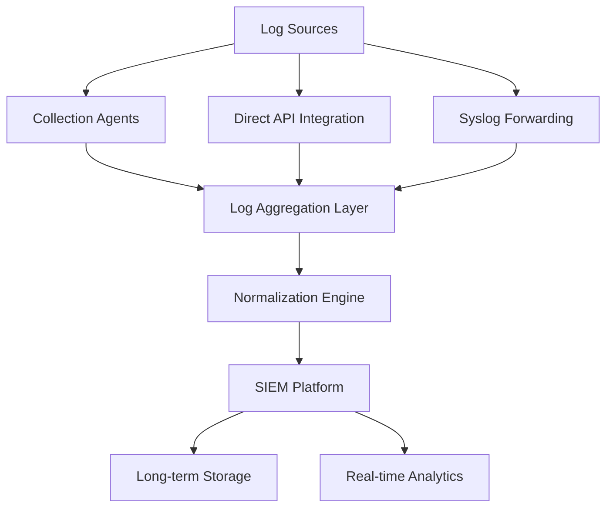
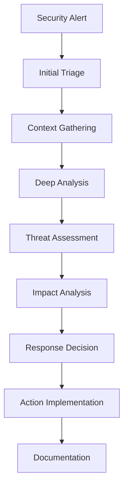

# Security Monitoring and Logging Procedure - ISO 27001

## ArionComply Platform Metadata

```yaml
# Template Configuration
template_id: ISO27001-SECURITY-MONITORING-PROC-001
template_type: security_monitoring_logging_procedure
template_version: 1.0
template_status: draft
created_date: {{CURRENT_DATE}}
last_modified: {{CURRENT_DATE}}
template_category: operational_procedure
compliance_framework: ISO27001:2022
template_owner: {{TEMPLATE_OWNER}}
approval_status: pending_review

# Platform Integration
platform_features:
  - unified_security_monitoring
  - intelligent_threat_detection
  - automated_incident_correlation
  - behavioral_analytics
  - compliance_reporting
  - predictive_security_analytics

# Dependencies
depends_on:
  - data_backup_recovery_procedure
  - information_security_incident_management_procedure
  - vulnerability_management_procedure
  - access_control_policy
  - communications_security_policy
  - data_classification_policy

# Usage Context
applicable_controls:
  - A.12.4.1  # Event logging
  - A.12.4.2  # Protection of log information
  - A.12.4.3  # Administrator and operator logs
  - A.12.4.4  # Clock synchronization
  - A.16.1.2  # Reporting information security events
  - A.16.1.7  # Collection of evidence
  - A.18.1.3  # Protection of records
```

---

## **Document Control Information**

| **Element** | **Details** | **Description** |
|-------------|-------------|-----------------|
| **Document ID** | {{TEMPLATE_ID}} | *Unique identifier for this security monitoring procedure* |
| **Document Title** | Security Monitoring and Logging Procedure | *Detailed procedures for security monitoring and logging operations* |
| **ISO 27001 Reference** | A.12.4.1-A.12.4.4, A.16.1.2, A.16.1.7, A.18.1.3 | *Primary controls addressed by this procedure* |
| **Document Owner** | {{PROCEDURE_OWNER}} | *Person responsible for procedure maintenance* |
| **Approval Authority** | {{APPROVAL_AUTHORITY}} | *Authority responsible for procedure approval* |
| **Effective Date** | {{EFFECTIVE_DATE}} | *Date when procedure becomes effective* |
| **Review Frequency** | {{REVIEW_FREQUENCY}} | *How often procedure will be reviewed* |
| **Next Review Date** | {{NEXT_REVIEW_DATE}} | *Scheduled date for next procedure review* |
| **Classification Level** | {{DOCUMENT_CLASSIFICATION}} | *Classification level of this document* |

---

## **1. Procedure Foundation**

### **1.1 Understanding Security Monitoring and Logging**

Think of security monitoring and logging like operating a sophisticated surveillance and intelligence system for a major metropolitan area. Just as a city's security operations center monitors thousands of cameras, sensors, and communication channels to detect threats, coordinate responses, and maintain detailed records for investigations - security monitoring provides comprehensive visibility into organizational systems, networks, and user activities to detect, respond to, and investigate security events.

**Real-World Analogy**: Consider how a modern airport security system operates:
- **Comprehensive Surveillance**: Like having cameras, metal detectors, and sensors monitoring every area
- **Real-Time Analysis**: Like security analysts watching for suspicious behavior and coordinating responses
- **Automated Detection**: Like AI systems that automatically flag unusual patterns or prohibited items
- **Incident Correlation**: Like connecting multiple security events to identify coordinated threats
- **Evidence Collection**: Like maintaining detailed records for investigations and legal proceedings
- **Continuous Improvement**: Like analyzing past incidents to improve detection and response capabilities

Security monitoring and logging provides the eyes, ears, and memory of an organization's security posture.

### **1.2 Procedure Purpose**

This procedure establishes detailed operational steps to:
- **Monitor Security Events**: Continuously monitor systems and networks for security events
- **Detect Threats**: Identify potential security threats and anomalous activities
- **Collect Evidence**: Gather and preserve digital evidence for investigations
- **Ensure Compliance**: Meet regulatory logging and monitoring requirements
- **Support Investigations**: Provide comprehensive audit trails for incident investigations
- **Enable Response**: Support rapid incident response and threat mitigation
- **Maintain Visibility**: Provide continuous security visibility and situational awareness
- **Drive Improvement**: Support security program improvement through analytics

### **1.3 Procedure Scope**

This procedure applies to:
- **All Systems**: Servers, workstations, network devices, applications, and cloud services
- **All Environments**: Production, development, testing, and staging environments
- **All Event Types**: Security events, system events, and user activities
- **All Locations**: On-premises, cloud, hybrid, and remote environments
- **All Personnel**: Security analysts, system administrators, and incident responders

---

## **2. Logging Framework**

### **2.1 Log Source Classification**

#### **2.1.1 Comprehensive Log Source Matrix**
**Enterprise Log Source Coverage**:

| **Source Category** | **Log Types** | **Collection Method** | **Retention Period** |
|-------------------|---------------|----------------------|---------------------|
| **Network Infrastructure** | Firewall, router, switch logs | Syslog, SNMP | 1 year |
| **Security Systems** | IDS/IPS, antivirus, DLP | API, agent-based | 2 years |
| **Operating Systems** | Windows, Linux, Unix logs | Agent, WMI | 1 year |
| **Applications** | Web, database, custom apps | API, file monitoring | 1 year |
| **Cloud Services** | AWS, Azure, GCP logs | API integration | 1 year |
| **Authentication** | Directory, SSO, VPN logs | API, LDAP | 2 years |

#### **2.1.2 Critical Event Categories**
**High-Priority Event Classification**:
- **Authentication Events**: Login attempts, authentication failures, privilege escalation
- **Access Events**: File access, database queries, system access
- **Network Events**: Connection attempts, data transfers, protocol anomalies
- **System Events**: Configuration changes, service starts/stops, errors
- **Security Events**: Malware detection, intrusion attempts, policy violations
- **Administrative Events**: Administrative actions, configuration changes, user management

### **2.2 Log Collection Strategy**

#### **2.2.1 Collection Architecture**
**Centralized Log Collection Framework**:


#### **2.2.2 Collection Methods**
**Multi-Method Log Collection**:
- **Agent-Based**: Deployed agents on systems for comprehensive log collection
- **Agentless**: Network-based collection for devices without agent support
- **API Integration**: Direct API integration with cloud services and applications
- **Syslog Forwarding**: Standard syslog protocol for network devices
- **File Monitoring**: Direct file monitoring for custom applications
- **Database Integration**: Direct database integration for audit logs

### **2.3 ArionComply Logging Integration**

#### **2.3.1 Intelligent Log Management**
**AI-Enhanced Log Collection**:
```yaml
intelligent_logging:
  adaptive_collection:
    - dynamic_source_discovery
    - intelligent_parsing
    - automatic_normalization
    - context_enrichment
  
  quality_assurance:
    - completeness_verification
    - integrity_validation
    - timeline_accuracy
    - correlation_readiness
  
  optimization:
    - bandwidth_optimization
    - storage_efficiency
    - parsing_performance
    - real_time_processing
```

#### **2.3.2 Advanced Log Analytics**
**Machine Learning Log Analysis**:
- **Anomaly Detection**: ML-powered anomaly detection in log patterns
- **Pattern Recognition**: Automated pattern recognition and classification
- **Trend Analysis**: Predictive trend analysis and forecasting
- **Correlation Engine**: Advanced multi-source event correlation
- **Threat Intelligence**: Integration with threat intelligence feeds
- **Behavioral Analysis**: User and entity behavior analysis

---

## **3. Security Monitoring Operations**

### **3.1 Security Operations Center (SOC)**

#### **3.1.1 SOC Structure and Roles**
**24/7 Security Operations Framework**:

| **Role** | **Responsibilities** | **Shift Coverage** | **Escalation Authority** |
|----------|---------------------|-------------------|-------------------------|
| **SOC Analyst Level 1** | Event triage, initial investigation | 24/7 | Level 2 escalation |
| **SOC Analyst Level 2** | Deep investigation, threat hunting | 24/7 | Level 3 escalation |
| **SOC Analyst Level 3** | Complex analysis, tool development | Business hours | Management escalation |
| **SOC Manager** | Operations management, coordination | Business hours | Executive escalation |
| **Threat Intelligence** | Threat research, indicator development | Business hours | SOC integration |

#### **3.1.2 SOC Processes**
**Standardized SOC Operations**:
1. **Event Monitoring**: Continuous security event monitoring
2. **Alert Triage**: Initial alert assessment and prioritization
3. **Investigation**: Detailed security event investigation
4. **Incident Declaration**: Incident classification and declaration
5. **Response Coordination**: Incident response coordination
6. **Documentation**: Complete investigation documentation
7. **Lessons Learned**: Continuous improvement and learning

### **3.2 Threat Detection Framework**

#### **3.2.1 Detection Methodologies**
**Multi-Layered Threat Detection**:
- **Signature-Based Detection**: Known threat pattern detection
- **Anomaly-Based Detection**: Behavioral anomaly detection
- **Machine Learning Detection**: AI-powered threat detection
- **Threat Intelligence**: External threat intelligence integration
- **User Behavior Analytics**: User activity pattern analysis
- **Network Traffic Analysis**: Network communication pattern analysis

#### **3.2.2 Detection Rules and Alerts**
**Intelligent Alert Management**:

| **Alert Category** | **Detection Method** | **Priority Level** | **Response Time** |
|-------------------|---------------------|-------------------|-------------------|
| **Critical Threats** | ML + signatures | P1 - Critical | 15 minutes |
| **Security Violations** | Rule-based | P2 - High | 1 hour |
| **Anomalous Behavior** | Behavioral analytics | P3 - Medium | 4 hours |
| **Policy Violations** | Compliance rules | P4 - Low | 24 hours |

### **3.3 Event Correlation and Analysis**

#### **3.3.1 Correlation Engine**
**Advanced Event Correlation**:
- **Temporal Correlation**: Time-based event correlation and sequencing
- **Spatial Correlation**: Geographic and network-based correlation
- **Causal Correlation**: Cause-and-effect relationship analysis
- **Statistical Correlation**: Statistical pattern and trend correlation
- **Threat Intelligence Correlation**: External threat data correlation
- **Behavioral Correlation**: User and entity behavior correlation

#### **3.3.2 Analysis Workflows**
**Systematic Analysis Process**:


### **3.4 ArionComply Monitoring Intelligence**

#### **3.4.1 Unified Security Analytics**
**Integrated Monitoring Platform**:
```yaml
security_analytics:
  unified_monitoring:
    - multi_source_integration
    - real_time_correlation
    - advanced_visualization
    - collaborative_investigation
  
  threat_detection:
    - ml_powered_detection
    - behavioral_analytics
    - threat_intelligence_integration
    - automated_response
  
  investigation_support:
    - forensic_timeline_reconstruction
    - evidence_collection_automation
    - case_management_integration
    - reporting_automation
```

#### **3.4.2 Predictive Security Analytics**
**AI-Powered Security Intelligence**:
- **Threat Prediction**: Predictive threat modeling and forecasting
- **Attack Path Analysis**: Potential attack path identification
- **Risk Scoring**: Dynamic risk scoring and assessment
- **Trend Forecasting**: Security trend analysis and prediction
- **Capacity Planning**: Security operations capacity planning
- **Resource Optimization**: Security resource allocation optimization

---

## **4. Incident Detection and Response Integration**

### **4.1 Detection-Response Integration**

#### **4.1.1 Seamless Integration Framework**
**Monitoring-Response Coordination**:
- **Alert-to-Incident Workflow**: Automated alert-to-incident escalation
- **Evidence Preservation**: Automatic evidence collection and preservation
- **Response Team Notification**: Intelligent response team activation
- **Investigation Support**: Comprehensive investigation support tools
- **Recovery Coordination**: Recovery process monitoring and support
- **Lesson Integration**: Lessons learned integration and improvement

#### **4.1.2 Escalation Triggers**
**Automated Escalation Framework**:

| **Trigger Type** | **Criteria** | **Escalation Level** | **Response Time** |
|------------------|--------------|---------------------|-------------------|
| **Critical Alert** | Severity + confidence | Immediate SOC manager | 5 minutes |
| **Multiple Alerts** | Volume threshold | Senior analyst | 15 minutes |
| **High-Value Target** | Asset criticality | Management | 30 minutes |
| **Compliance Event** | Regulatory impact | Compliance team | 1 hour |

### **4.2 Evidence Collection and Preservation**

#### **4.2.1 Digital Evidence Framework**
**Comprehensive Evidence Management**:
- **Automatic Collection**: Automated evidence collection triggers
- **Chain of Custody**: Digital chain of custody maintenance
- **Evidence Integrity**: Cryptographic evidence integrity protection
- **Legal Admissibility**: Legal admissibility standards compliance
- **Long-term Preservation**: Long-term evidence preservation
- **Access Control**: Controlled evidence access and audit trail

#### **4.2.2 Forensic Integration**
**Investigation Support Tools**:
- **Timeline Reconstruction**: Automated timeline reconstruction
- **Artifact Analysis**: Digital artifact analysis and correlation
- **Memory Analysis**: System memory capture and analysis
- **Network Analysis**: Network traffic capture and analysis
- **File Analysis**: File system and content analysis
- **Malware Analysis**: Malware reverse engineering and analysis

### **4.3 Threat Intelligence Integration**

#### **4.3.1 Intelligence Sources**
**Multi-Source Threat Intelligence**:
- **Commercial Feeds**: Commercial threat intelligence providers
- **Open Source Intelligence**: OSINT and public threat data
- **Government Sources**: Government threat intelligence sharing
- **Industry Sources**: Industry-specific threat intelligence
- **Internal Intelligence**: Organizational threat intelligence
- **Community Sources**: Security community threat sharing

#### **4.3.2 Intelligence Processing**
**Intelligent Threat Processing**:
- **Indicator Extraction**: Automated indicator of compromise extraction
- **Context Enrichment**: Threat context and attribution enrichment
- **Relevance Scoring**: Organizational relevance scoring
- **Actionable Intelligence**: Conversion to actionable security controls
- **Intelligence Sharing**: Threat intelligence sharing and collaboration
- **Feedback Loop**: Intelligence effectiveness feedback and improvement

---

## **5. Compliance and Audit Logging**

### **5.1 Regulatory Logging Requirements**

#### **5.1.1 Compliance-Driven Logging**
**Regulation-Specific Logging Requirements**:

| **Regulation** | **Required Events** | **Retention Period** | **Special Requirements** |
|----------------|-------------------|---------------------|-------------------------|
| **SOX** | Financial system access | 7 years | Immutable storage |
| **HIPAA** | PHI access and modifications | 6 years | Access control logging |
| **PCI DSS** | Payment system activities | 1 year | Daily log review |
| **GDPR** | Personal data processing | 3 years | Data subject access |
| **FISMA** | Government system access | 3 years | Continuous monitoring |

#### **5.1.2 Audit Trail Requirements**
**Comprehensive Audit Logging**:
- **User Authentication**: All authentication attempts and results
- **Privileged Access**: All privileged user activities
- **Data Access**: All access to sensitive data and systems
- **Configuration Changes**: All system and security configuration changes
- **Administrative Actions**: All administrative and management actions
- **Security Events**: All security-related events and responses

### **5.2 Log Integrity and Protection**

#### **5.2.1 Log Security Framework**
**Comprehensive Log Protection**:
- **Access Control**: Role-based log access control and restrictions
- **Encryption**: Log encryption at rest and in transit
- **Integrity Protection**: Cryptographic log integrity protection
- **Backup and Recovery**: Secure log backup and recovery procedures
- **Retention Management**: Automated log retention and disposal
- **Audit Trail**: Comprehensive log access audit trail

#### **5.2.2 Tamper Detection**
**Log Integrity Assurance**:
- **Digital Signatures**: Cryptographic log signing and verification
- **Hash Verification**: Log content hash verification
- **Immutable Storage**: Write-once log storage systems
- **Change Detection**: Automated log modification detection
- **Integrity Alerts**: Real-time log integrity violation alerts
- **Forensic Preservation**: Forensic-grade log preservation

### **5.3 ArionComply Compliance Integration**

#### **5.3.1 Automated Compliance Monitoring**
**Intelligent Compliance Management**:
```yaml
compliance_monitoring:
  regulatory_alignment:
    - requirement_mapping
    - automated_collection
    - compliance_verification
    - gap_detection
  
  audit_preparation:
    - automated_reporting
    - evidence_compilation
    - timeline_reconstruction
    - compliance_attestation
  
  continuous_compliance:
    - real_time_monitoring
    - compliance_dashboards
    - exception_management
    - improvement_tracking
```

#### **5.3.2 Audit Support Automation**
**Automated Audit Assistance**:
- **Report Generation**: Automated compliance report generation
- **Evidence Collection**: Automated audit evidence collection
- **Query Response**: Automated auditor query response
- **Timeline Generation**: Automated event timeline generation
- **Exception Analysis**: Automated compliance exception analysis
- **Recommendation Engine**: Automated compliance improvement recommendations

---

## **6. Log Analysis and Investigation**

### **6.1 Investigation Methodology**

#### **6.1.1 Systematic Investigation Process**
**Structured Investigation Framework**:
1. **Initial Assessment**: Rapid initial event assessment
2. **Scope Determination**: Investigation scope and boundary definition
3. **Evidence Collection**: Comprehensive evidence gathering
4. **Timeline Construction**: Event timeline reconstruction
5. **Root Cause Analysis**: Root cause identification and analysis
6. **Impact Assessment**: Business and technical impact assessment
7. **Reporting**: Investigation findings and recommendations
8. **Lesson Integration**: Lessons learned and improvement implementation

#### **6.1.2 Investigation Tools and Techniques**
**Advanced Investigation Capabilities**:
- **Log Search and Filtering**: Advanced log search and filtering capabilities
- **Pattern Analysis**: Automated pattern recognition and analysis
- **Correlation Analysis**: Multi-source event correlation
- **Visualization Tools**: Interactive investigation visualization
- **Timeline Analysis**: Comprehensive timeline analysis tools
- **Statistical Analysis**: Statistical pattern and anomaly analysis

### **6.2 Advanced Analytics**

#### **6.2.1 Machine Learning Analytics**
**AI-Powered Log Analysis**:
- **Anomaly Detection**: Unsupervised anomaly detection in log data
- **Classification**: Automated event classification and categorization
- **Clustering**: Event clustering and pattern identification
- **Prediction**: Predictive analytics for security events
- **Natural Language Processing**: Log content analysis and understanding
- **Deep Learning**: Advanced deep learning threat detection

#### **6.2.2 Behavioral Analytics**
**User and Entity Behavior Analysis**:
- **Baseline Establishment**: Normal behavior baseline establishment
- **Deviation Detection**: Behavioral deviation detection and analysis
- **Risk Scoring**: Dynamic user and entity risk scoring
- **Peer Analysis**: Peer group behavior comparison
- **Trend Analysis**: Long-term behavioral trend analysis
- **Contextual Analysis**: Behavior context and situational analysis

### **6.3 Threat Hunting**

#### **6.3.1 Proactive Threat Hunting**
**Systematic Threat Hunting Framework**:
- **Hypothesis Development**: Threat hunting hypothesis development
- **Data Collection**: Targeted threat hunting data collection
- **Analysis Execution**: Systematic analysis and investigation
- **IOC Development**: Indicator of compromise development
- **Tool Enhancement**: Detection tool and rule enhancement
- **Knowledge Sharing**: Threat hunting knowledge sharing

#### **6.3.2 Hunting Techniques**
**Advanced Hunting Methodologies**:
- **Signature Hunting**: Known threat signature hunting
- **Behavioral Hunting**: Suspicious behavior pattern hunting
- **Anomaly Hunting**: Statistical anomaly and outlier hunting
- **Intelligence Hunting**: Threat intelligence-driven hunting
- **Hypothesis Hunting**: Hypothesis-driven threat hunting
- **Stack Ranking**: Asset risk-based hunting prioritization

---

## **7. Performance and Capacity Management**

### **7.1 Performance Monitoring**

#### **7.1.1 System Performance Metrics**
**Monitoring System Performance**:

| **Metric Category** | **Key Metrics** | **Target Performance** | **Alert Threshold** |
|--------------------|-----------------|----------------------|-------------------|
| **Log Ingestion** | Events per second | {{LOG_INGESTION_TARGET}} EPS | >{{LOG_INGESTION_ALERT}} EPS |
| **Search Performance** | Query response time | <{{SEARCH_RESPONSE_TARGET}} seconds | >{{SEARCH_RESPONSE_ALERT}} seconds |
| **Storage Utilization** | Storage capacity used | <{{STORAGE_UTIL_TARGET}}% | >{{STORAGE_UTIL_ALERT}}% |
| **Alert Processing** | Alert generation time | <{{ALERT_PROCESS_TARGET}} seconds | >{{ALERT_PROCESS_ALERT}} seconds |

#### **7.1.2 Operational Metrics**
**SOC Operational Performance**:
- **Mean Time to Detection (MTTD)**: Average time to detect security events
- **Mean Time to Response (MTTR)**: Average time to respond to security incidents
- **False Positive Rate**: Percentage of false positive security alerts
- **Investigation Efficiency**: Time to complete security investigations
- **Alert Closure Rate**: Percentage of alerts closed within SLA
- **Analyst Productivity**: Number of alerts processed per analyst

### **7.2 Capacity Planning**

#### **7.2.1 Capacity Forecasting**
**Predictive Capacity Management**:
- **Log Volume Growth**: Historical log volume growth analysis
- **Storage Requirements**: Storage capacity requirement forecasting
- **Processing Capacity**: Analysis and correlation capacity planning
- **Network Bandwidth**: Log transmission bandwidth planning
- **Analyst Workload**: SOC analyst workload capacity planning
- **Infrastructure Scaling**: Infrastructure scaling requirement planning

#### **7.2.2 Resource Optimization**
**Efficiency Optimization Framework**:
- **Data Lifecycle Management**: Automated log data lifecycle management
- **Storage Tiering**: Intelligent log storage tiering
- **Processing Optimization**: Log processing and analysis optimization
- **Query Optimization**: Search and query performance optimization
- **Alert Tuning**: Alert threshold tuning and optimization
- **Workflow Automation**: Investigation workflow automation

### **7.3 ArionComply Performance Analytics**

#### **7.3.1 Intelligent Performance Management**
**AI-Enhanced Performance Optimization**:
```yaml
performance_analytics:
  predictive_scaling:
    - capacity_forecasting
    - demand_prediction
    - resource_optimization
    - cost_optimization
  
  performance_optimization:
    - query_optimization
    - indexing_optimization
    - processing_acceleration
    - storage_optimization
  
  operational_intelligence:
    - workflow_optimization
    - analyst_productivity
    - alert_optimization
    - investigation_efficiency
```

#### **7.3.2 Cost Optimization**
**Intelligent Cost Management**:
- **Resource Utilization**: Real-time resource utilization optimization
- **Storage Optimization**: Intelligent storage cost optimization
- **Processing Efficiency**: Processing cost efficiency optimization
- **License Optimization**: Software license utilization optimization
- **Cloud Cost Management**: Cloud service cost optimization
- **ROI Analysis**: Security monitoring return on investment analysis

---

## **8. Integration and Automation**

### **8.1 SIEM Integration**

#### **8.1.1 Comprehensive SIEM Framework**
**Enterprise SIEM Architecture**:
- **Log Collection**: Centralized log collection and normalization
- **Event Correlation**: Advanced multi-source event correlation
- **Threat Detection**: Intelligent threat detection and analysis
- **Incident Management**: Integrated incident management workflow
- **Reporting**: Comprehensive security reporting and dashboards
- **Compliance**: Automated compliance monitoring and reporting

#### **8.1.2 SIEM Optimization**
**SIEM Performance Enhancement**:
- **Rule Optimization**: Detection rule optimization and tuning
- **Correlation Efficiency**: Event correlation efficiency improvement
- **Search Optimization**: Log search and query optimization
- **Dashboard Performance**: Reporting and dashboard optimization
- **Integration Efficiency**: External system integration optimization
- **Maintenance Automation**: Automated SIEM maintenance and optimization

### **8.2 Security Orchestration and Automation**

#### **8.2.1 SOAR Integration**
**Security Orchestration Framework**:
- **Playbook Automation**: Automated security response playbooks
- **Tool Integration**: Security tool integration and orchestration
- **Workflow Automation**: Investigation workflow automation
- **Response Automation**: Automated threat response and mitigation
- **Communication Automation**: Automated stakeholder communication
- **Documentation Automation**: Automated investigation documentation

#### **8.2.2 Automation Use Cases**
**Security Automation Applications**:
- **Alert Enrichment**: Automated alert context enrichment
- **Threat Intelligence**: Automated threat intelligence integration
- **Incident Creation**: Automated incident creation and classification
- **Evidence Collection**: Automated digital evidence collection
- **Response Actions**: Automated containment and mitigation actions
- **Reporting**: Automated investigation and compliance reporting

### **8.3 Third-Party Integrations**

#### **8.3.1 Security Ecosystem Integration**
**Comprehensive Security Integration**:
- **Endpoint Security**: EDR and antivirus integration
- **Network Security**: Firewall and IPS integration
- **Cloud Security**: Cloud security service integration
- **Identity Security**: IAM and authentication system integration
- **Vulnerability Management**: Vulnerability scanner integration
- **Threat Intelligence**: External threat intelligence integration

#### **8.3.2 Business System Integration**
**Enterprise System Integration**:
- **IT Service Management**: ITSM platform integration
- **Change Management**: Change management system integration
- **Asset Management**: Asset inventory system integration
- **Risk Management**: Risk management platform integration
- **Compliance Management**: GRC platform integration
- **Business Intelligence**: BI and analytics platform integration

---

## **9. Training and Skills Development**

### **9.1 SOC Training Program**

#### **9.1.1 Role-Based Training**
**Comprehensive SOC Training Framework**:

| **Role** | **Core Skills** | **Training Duration** | **Certification Requirements** |
|----------|-----------------|----------------------|--------------------------------|
| **Level 1 Analyst** | Event triage, tool operation | 3 months | CompTIA Security+ |
| **Level 2 Analyst** | Investigation, threat hunting | 6 months | GCIH or CySA+ |
| **Level 3 Analyst** | Advanced analysis, tool development | 12 months | GNFA or GCFA |
| **SOC Manager** | Operations management, strategic planning | 18 months | CISSP or CISM |

#### **9.1.2 Continuous Education**
**Ongoing Skills Development**:
- **Threat Landscape Updates**: Regular threat landscape training
- **Tool Training**: New security tool training and certification
- **Investigation Techniques**: Advanced investigation methodology training
- **Industry Conferences**: Security conference and workshop attendance
- **Peer Learning**: Cross-team knowledge sharing and collaboration
- **Vendor Training**: Security vendor-specific training programs

### **9.2 Skills Assessment and Development**

#### **9.2.1 Competency Framework**
**SOC Analyst Competency Model**:
- **Technical Skills**: Security tool proficiency and technical analysis
- **Analytical Skills**: Investigation and problem-solving capabilities
- **Communication Skills**: Report writing and stakeholder communication
- **Process Knowledge**: Security process and procedure understanding
- **Domain Expertise**: Industry and threat landscape knowledge
- **Continuous Learning**: Commitment to ongoing skills development

#### **9.2.2 Performance Management**
**Skills Development Process**:
- **Skills Assessment**: Regular technical and analytical skills assessment
- **Gap Analysis**: Skill gap identification and development planning
- **Training Planning**: Individualized training and development planning
- **Mentoring**: Senior analyst mentoring and knowledge transfer
- **Performance Monitoring**: Ongoing performance monitoring and feedback
- **Career Development**: Career progression planning and support

### **9.3 Knowledge Management**

#### **9.3.1 Knowledge Capture**
**Organizational Learning Framework**:
- **Investigation Documentation**: Comprehensive investigation documentation
- **Playbook Development**: Security playbook development and maintenance
- **Lesson Learned**: Systematic lessons learned capture and sharing
- **Best Practices**: Security best practice documentation and sharing
- **Tool Documentation**: Security tool configuration and usage documentation
- **Threat Intelligence**: Internal threat intelligence development and sharing

#### **9.3.2 Knowledge Sharing**
**Collaborative Learning Environment**:
- **Knowledge Base**: Centralized security knowledge base
- **Community Forums**: Internal security community and discussion forums
- **Training Materials**: Comprehensive training material development
- **Documentation Standards**: Standardized documentation and reporting
- **Cross-Training**: Cross-functional training and knowledge sharing
- **External Collaboration**: Industry security community participation

---

## **10. Implementation Checklist**

### **10.1 Pre-Implementation**
- [ ] **Log Source Inventory**: Complete inventory of all log sources
- [ ] **Infrastructure Planning**: Plan monitoring infrastructure and architecture
- [ ] **Tool Selection**: Select SIEM and monitoring tools
- [ ] **Team Formation**: Form security operations center team
- [ ] **Process Design**: Design monitoring and investigation processes

### **10.2 Implementation Phase**
- [ ] **Infrastructure Deployment**: Deploy monitoring infrastructure
- [ ] **Tool Configuration**: Configure SIEM and security tools
- [ ] **Log Source Integration**: Integrate all identified log sources
- [ ] **Detection Rule Development**: Develop and tune detection rules
- [ ] **Team Training**: Train SOC team and investigators

### **10.3 Post-Implementation**
- [ ] **Performance Validation**: Validate monitoring performance and coverage
- [ ] **Detection Testing**: Test threat detection and response capabilities
- [ ] **Process Optimization**: Optimize monitoring and investigation processes
- [ ] **Continuous Improvement**: Establish continuous improvement program
- [ ] **Compliance Verification**: Verify regulatory compliance requirements

---

## **11. Related Documents**

### **11.1 Policy Dependencies**
- **Incident Response Policy**: Security incident response integration
- **Access Control Policy**: Access control monitoring requirements
- **Data Classification Policy**: Data-driven monitoring requirements
- **Communications Security Policy**: Network monitoring integration

### **11.2 Technical Procedures**
- **Incident Investigation Procedures**: Detailed investigation procedures
- **Evidence Handling Procedures**: Digital evidence procedures
- **Threat Hunting Procedures**: Proactive threat hunting procedures
- **Tool Configuration Procedures**: SIEM and tool configuration procedures

### **11.3 Operational Documentation**
- **SOC Operating Procedures**: SOC operational procedures
- **Investigation Playbooks**: Investigation and response playbooks
- **Alert Response Procedures**: Alert triage and response procedures
- **Reporting Templates**: Security reporting templates

---

## **12. Appendices**

### **12.1 Log Source Matrix**
| **Source Type** | **Critical Events** | **Collection Method** | **Retention** |
|-----------------|-------------------|----------------------|---------------|
| **Domain Controllers** | Authentication events | WinLogBeat | 2 years |
| **Firewalls** | Connection events | Syslog | 1 year |
| **Web Servers** | Access logs | FileBeat | 1 year |
| **Databases** | Query logs | API/Agent | 2 years |

### **12.2 Alert Priority Matrix**
| **Event Type** | **Severity** | **Response Time** | **Escalation** |
|----------------|--------------|-------------------|----------------|
| **Malware Detection** | Critical | 15 minutes | Immediate |
| **Failed Authentication** | High | 1 hour | Level 2 |
| **Policy Violation** | Medium | 4 hours | Business hours |
| **Informational** | Low | 24 hours | Next day |

### **12.3 Compliance Requirements Matrix**
| **Regulation** | **Events Required** | **Retention** | **Review Frequency** |
|----------------|-------------------|---------------|---------------------|
| **PCI DSS** | Payment system access | 1 year | Daily |
| **HIPAA** | PHI access | 6 years | Weekly |
| **SOX** | Financial system access | 7 years | Monthly |
| **GDPR** | Personal data processing | 3 years | Continuous |

---

**Document Status**: {{DOCUMENT_STATUS}}  
**Version**: {{VERSION_NUMBER}}  
**Last Updated**: {{LAST_UPDATED}}  
**Next Review**: {{NEXT_REVIEW_DATE}}  
**Owner**: {{DOCUMENT_OWNER}}  
**Approved By**: {{APPROVED_BY}}  
**Approval Date**: {{APPROVAL_DATE}}