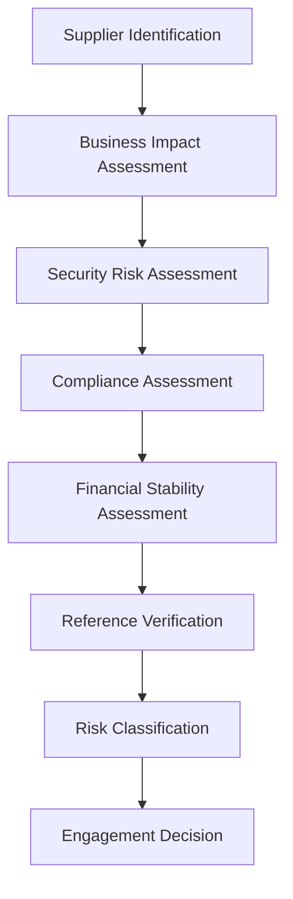
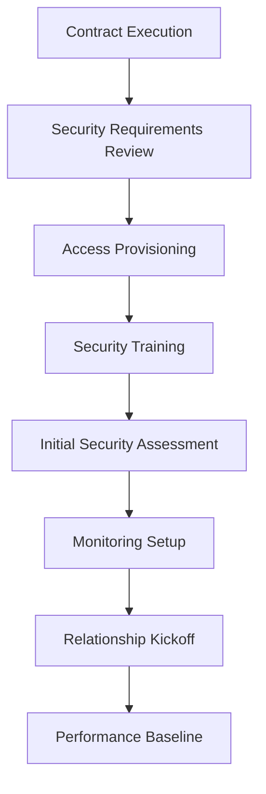
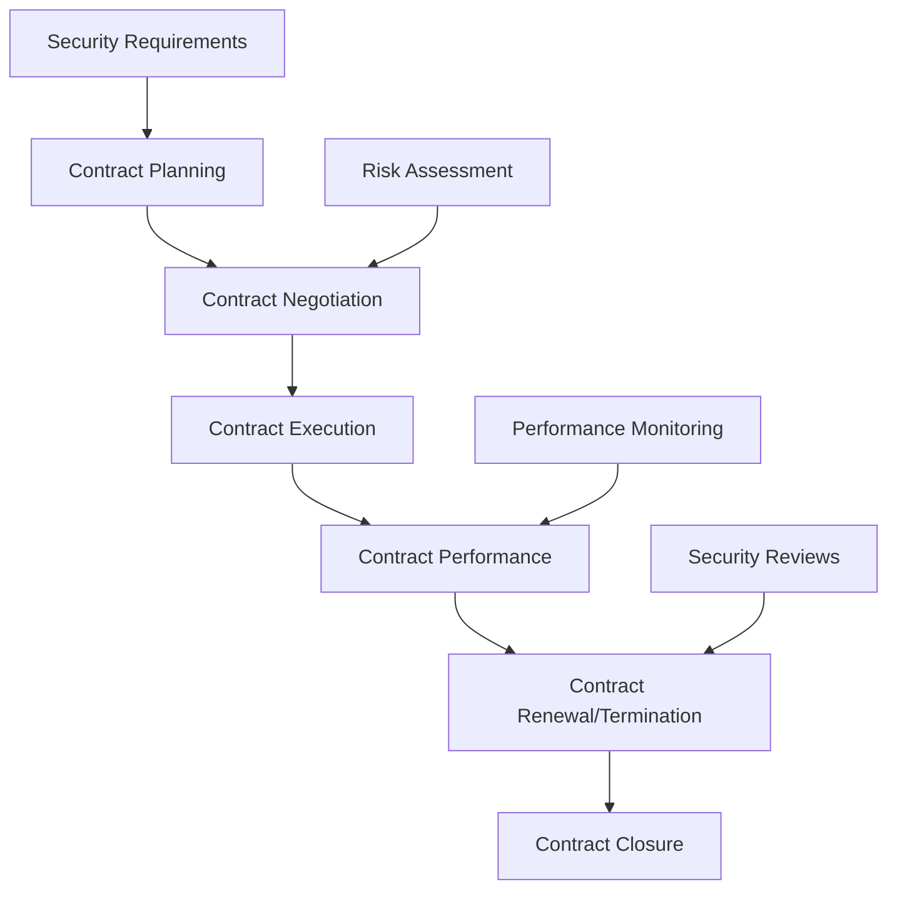
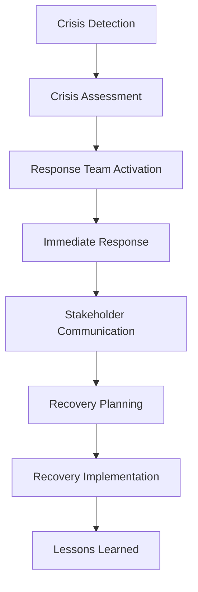

# Supplier Relationship Management Policy - ISO 27001

## ArionComply Platform Metadata

```yaml
# Template Configuration
template_id: ISO27001-SUPPLIER-MGMT-001
template_type: supplier_relationship_management_policy
template_version: 1.0
template_status: draft
created_date: {{CURRENT_DATE}}
last_modified: {{CURRENT_DATE}}
template_category: operational_policy
compliance_framework: ISO27001:2022
template_owner: {{TEMPLATE_OWNER}}
approval_status: pending_review

# Platform Integration
platform_features:
  - supplier_risk_assessment
  - contract_lifecycle_management
  - performance_monitoring
  - compliance_tracking
  - incident_management
  - continuous_monitoring

# Dependencies
depends_on:
  - system_acquisition_development_maintenance_policy
  - risk_management_policy
  - access_control_policy
  - data_classification_policy
  - incident_response_policy
  - business_continuity_policy

# Usage Context
applicable_controls:
  - A.15.1  # Information security in supplier relationships
  - A.15.2  # Supplier service delivery management
  - A.5.19  # Information security in supplier relationships
  - A.5.20  # Addressing information security within supplier agreements
  - A.5.21  # Managing information security in the ICT supply chain
  - A.5.22  # Monitoring, review and change management of supplier services
  - A.5.23  # Information security for use of cloud services
```

---

## **Document Control Information**

| **Element** | **Details** | **Description** |
|-------------|-------------|-----------------|
| **Document ID** | {{TEMPLATE_ID}} | *Unique identifier for this supplier management policy* |
| **Document Title** | Supplier Relationship Management Policy | *Policy for managing supplier relationships and third-party risks* |
| **ISO 27001 Reference** | A.15.1, A.15.2, A.5.19-A.5.23 | *Primary controls addressed by this policy* |
| **Document Owner** | {{POLICY_OWNER}} | *Person responsible for policy maintenance* |
| **Approval Authority** | {{APPROVAL_AUTHORITY}} | *Authority responsible for policy approval* |
| **Effective Date** | {{EFFECTIVE_DATE}} | *Date when policy becomes effective* |
| **Review Frequency** | {{REVIEW_FREQUENCY}} | *How often policy will be reviewed* |
| **Next Review Date** | {{NEXT_REVIEW_DATE}} | *Scheduled date for next policy review* |
| **Classification Level** | {{DOCUMENT_CLASSIFICATION}} | *Classification level of this document* |

---

## **1. Policy Foundation**

### **1.1 Understanding Supplier Relationship Management**

Think of supplier relationship management like managing a complex ecosystem of business partnerships. Just as a city depends on multiple utility providers, transportation systems, and service providers - each requiring different levels of trust, monitoring, and control - organizations must carefully manage their network of suppliers to ensure security, quality, and business continuity.

**Real-World Analogy**: Consider how a hospital manages its critical suppliers:
- **Life-Critical Suppliers**: Like medical equipment vendors (requires highest oversight and immediate response)
- **Operational Suppliers**: Like IT service providers (requires regular monitoring and performance reviews)
- **Administrative Suppliers**: Like office supply vendors (requires basic contract management)
- **Emergency Suppliers**: Like backup power providers (requires special continuity planning)
- **Specialized Suppliers**: Like pharmaceutical companies (requires strict regulatory compliance)

Each supplier category requires different management approaches, risk assessments, and security controls based on their criticality to patient care and hospital operations.

### **1.2 Policy Purpose**

This policy establishes a comprehensive framework to:
- **Manage Third-Party Risk**: Identify, assess, and mitigate risks from supplier relationships
- **Ensure Security**: Maintain security standards across the supplier ecosystem
- **Enable Business Continuity**: Ensure supplier relationships support business continuity
- **Maintain Compliance**: Ensure suppliers meet regulatory and contractual requirements
- **Optimize Value**: Maximize value and performance from supplier relationships

### **1.3 Policy Scope**

This policy applies to:
- **All Suppliers**: Vendors, contractors, service providers, and business partners
- **All Services**: Technology services, business services, and support services
- **All Data**: Information shared with or processed by suppliers
- **All Environments**: On-premises, cloud, hybrid, and remote services
- **All Lifecycle Phases**: Supplier selection, onboarding, management, and termination

---

## **2. Supplier Classification and Risk Assessment**

### **2.1 Supplier Classification Framework**

#### **2.1.1 Supplier Categories**
**Risk-Based Supplier Classification**:

| **Category** | **Risk Level** | **Business Impact** | **Security Requirements** |
|--------------|----------------|---------------------|---------------------------|
| **Critical** | Very High | Business-critical services | Maximum security controls |
| **Important** | High | Significant business impact | Enhanced security controls |
| **Standard** | Medium | Moderate business impact | Standard security controls |
| **Low-Risk** | Low | Minimal business impact | Basic security controls |

#### **2.1.2 Supplier Type Classifications**
**Supplier Types and Requirements**:

**Technology Suppliers**:
- **Cloud Service Providers**: Infrastructure, platform, and software services
- **Software Vendors**: Application software and licensing
- **Hardware Vendors**: Equipment and infrastructure providers
- **IT Service Providers**: Managed services and support
- **Security Service Providers**: Security tools and services

**Business Service Suppliers**:
- **Professional Services**: Consulting, legal, accounting
- **Outsourced Functions**: Customer service, HR, finance
- **Facilities Management**: Building, maintenance, cleaning
- **Logistics Providers**: Shipping, warehousing, distribution
- **Marketing Services**: Advertising, public relations, events

### **2.2 Supplier Risk Assessment Process**

#### **2.2.1 Initial Risk Assessment**
**Pre-Engagement Risk Evaluation**:


#### **2.2.2 Risk Assessment Criteria**
**Risk Evaluation Matrix**:

| **Risk Factor** | **High Risk** | **Medium Risk** | **Low Risk** |
|-----------------|---------------|-----------------|--------------|
| **Data Access** | Restricted/Confidential | Internal | Public |
| **System Access** | Production systems | Non-production | No access |
| **Business Criticality** | Mission-critical | Important | Supporting |
| **Financial Impact** | >$1M annually | $100K-$1M | <$100K |
| **Regulatory Scope** | Highly regulated | Some regulation | No regulation |

#### **2.2.3 Due Diligence Process**
**Comprehensive Due Diligence Framework**:
- **Security Assessment**: Security controls and practices evaluation
- **Compliance Verification**: Regulatory compliance verification
- **Financial Assessment**: Financial stability and viability
- **Operational Assessment**: Operational capabilities and capacity
- **Reference Checks**: Customer references and case studies
- **Site Visits**: Physical security and operational reviews
- **Certification Verification**: Industry certifications and standards

### **2.3 ArionComply Risk Assessment Integration**

#### **2.3.1 Automated Risk Scoring**
**Risk Assessment Platform**:
```yaml
supplier_risk_assessment:
  assessment_criteria:
    - data_sensitivity_level
    - system_access_level
    - business_criticality
    - financial_impact
    - regulatory_requirements
  
  automated_scoring:
    - risk_score_calculation
    - risk_level_assignment
    - control_recommendations
    - monitoring_requirements
  
  continuous_monitoring:
    - real_time_risk_updates
    - threat_intelligence
    - compliance_monitoring
    - performance_tracking
```

#### **2.3.2 Risk Intelligence Integration**
**Threat Intelligence and Monitoring**:
- **Threat Intelligence**: Real-time threat intelligence feeds
- **Breach Monitoring**: Supplier breach and incident monitoring
- **Financial Monitoring**: Supplier financial health monitoring
- **Reputation Monitoring**: Supplier reputation and news monitoring
- **Compliance Monitoring**: Regulatory compliance status monitoring

---

## **3. Supplier Selection and Onboarding**

### **3.1 Supplier Selection Process**

#### **3.1.1 Selection Criteria**
**Multi-Factor Selection Framework**:
- **Security Capabilities**: Security controls and certifications
- **Compliance Status**: Regulatory compliance and standards
- **Technical Capabilities**: Technical skills and infrastructure
- **Financial Stability**: Financial health and sustainability
- **Cultural Fit**: Alignment with organizational values
- **Innovation Capacity**: Ability to support future needs

#### **3.1.2 Evaluation Process**
**Structured Evaluation Methodology**:
1. **Requirements Definition**: Clear requirements and evaluation criteria
2. **Supplier Identification**: Market research and supplier identification
3. **Initial Screening**: Basic qualification screening
4. **Detailed Evaluation**: Comprehensive evaluation process
5. **Security Assessment**: Detailed security assessment
6. **Reference Verification**: Customer reference checks
7. **Final Selection**: Selection decision and approval

### **3.2 Supplier Onboarding**

#### **3.2.1 Onboarding Process**
**Comprehensive Onboarding Framework**:


#### **3.2.2 Onboarding Requirements**
**Security Onboarding Checklist**:
- **Contract Security**: Security terms and conditions
- **Access Management**: Account creation and access provisioning
- **Security Training**: Supplier personnel security training
- **Documentation**: Security policies and procedures provision
- **Contact Information**: Emergency and escalation contacts
- **Monitoring Setup**: Performance and security monitoring
- **Compliance Verification**: Initial compliance verification

### **3.3 Contract Management**

#### **3.3.1 Security Contract Requirements**
**Essential Security Clauses**:
- **Data Protection**: Data handling and protection requirements
- **Access Controls**: System and data access controls
- **Incident Response**: Security incident response requirements
- **Audit Rights**: Right to audit and assess supplier
- **Compliance**: Regulatory compliance requirements
- **Termination**: Secure termination and data return
- **Liability**: Security liability and indemnification
- **Business Continuity**: Business continuity requirements

#### **3.3.2 Service Level Agreements**
**Security SLA Framework**:

| **SLA Category** | **Measurement** | **Target** | **Consequence** |
|------------------|-----------------|------------|-----------------|
| **Security Incidents** | Response time | {{SECURITY_INCIDENT_SLA}} hours | Service credits |
| **Vulnerability Remediation** | Remediation time | {{VULNERABILITY_SLA}} days | Escalation |
| **Compliance Reporting** | Report delivery | Monthly | Penalty |
| **Security Training** | Training completion | 100% annually | Contract review |
| **Access Review** | Review completion | Quarterly | Access suspension |

---

## **4. Ongoing Supplier Management**

### **4.1 Performance Monitoring**

#### **4.1.1 Performance Metrics Framework**
**Key Performance Indicators**:
- **Security Performance**: Security incident rates, response times
- **Compliance Performance**: Compliance audit results, certification status
- **Operational Performance**: Service availability, quality metrics
- **Financial Performance**: Cost management, value delivery
- **Innovation Performance**: Technology advancement, improvement initiatives

#### **4.1.2 Monitoring and Reporting**
**Continuous Monitoring Framework**:
```yaml
supplier_monitoring:
  security_monitoring:
    - incident_tracking
    - vulnerability_management
    - compliance_status
    - access_monitoring
  
  performance_monitoring:
    - service_level_tracking
    - quality_metrics
    - customer_satisfaction
    - cost_analysis
  
  risk_monitoring:
    - risk_score_updates
    - threat_intelligence
    - financial_monitoring
    - reputation_monitoring
```

### **4.2 Regular Reviews and Assessments**

#### **4.2.1 Review Schedule**
**Structured Review Framework**:

| **Review Type** | **Frequency** | **Participants** | **Focus Areas** |
|-----------------|---------------|------------------|-----------------|
| **Operational Review** | Monthly | Service managers | Performance, issues |
| **Security Review** | Quarterly | Security team | Security, compliance |
| **Business Review** | Quarterly | Business owners | Strategy, value |
| **Executive Review** | Annually | Senior management | Relationship, strategy |
| **Contract Review** | Annually | Legal, procurement | Terms, renewal |

#### **4.2.2 Assessment Activities**
**Ongoing Assessment Framework**:
- **Security Assessments**: Regular security posture assessments
- **Compliance Audits**: Regulatory compliance audits
- **Penetration Testing**: Security testing of supplier systems
- **Business Continuity Testing**: Continuity plan testing
- **Performance Reviews**: Service performance evaluations

### **4.3 Relationship Management**

#### **4.3.1 Relationship Governance**
**Governance Structure**:
- **Executive Sponsor**: Senior executive relationship owner
- **Relationship Manager**: Day-to-day relationship management
- **Technical Lead**: Technical relationship coordination
- **Security Contact**: Security-specific coordination
- **Compliance Contact**: Compliance and audit coordination

#### **4.3.2 Communication Framework**
**Structured Communication**:
- **Regular Meetings**: Scheduled operational and strategic meetings
- **Escalation Procedures**: Clear escalation paths and procedures
- **Reporting**: Regular performance and security reporting
- **Issue Management**: Structured issue identification and resolution
- **Feedback Mechanisms**: Continuous improvement feedback

---

## **5. Information Security in Supplier Relationships**

### **5.1 Data Protection Requirements**

#### **5.1.1 Data Classification and Handling**
**Data Protection by Classification**:

| **Data Classification** | **Supplier Access** | **Protection Requirements** | **Monitoring** |
|------------------------|--------------------|-----------------------------|----------------|
| **Public** | Unrestricted | Standard handling | Basic monitoring |
| **Internal** | Controlled | Need-to-know basis | Standard monitoring |
| **Confidential** | Restricted | Enhanced protection | Enhanced monitoring |
| **Restricted** | Very restricted | Maximum protection | Comprehensive monitoring |

#### **5.1.2 Data Processing Requirements**
**Data Processing Controls**:
- **Data Minimization**: Process only necessary data
- **Purpose Limitation**: Use data only for specified purposes
- **Retention Limits**: Retain data only as long as necessary
- **Secure Processing**: Use secure processing methods
- **Data Subject Rights**: Support data subject rights
- **Cross-Border Transfer**: Comply with data transfer requirements

### **5.2 Access Control Management**

#### **5.2.1 Supplier Access Framework**
**Access Control Requirements**:
- **Identity Management**: Unique identity for each supplier user
- **Multi-Factor Authentication**: MFA for all system access
- **Least Privilege**: Minimum necessary access rights
- **Regular Reviews**: Regular access reviews and certifications
- **Termination Procedures**: Immediate access termination procedures

#### **5.2.2 Privileged Access Management**
**Enhanced Access Controls**:
- **Privileged Account Management**: Special controls for privileged accounts
- **Session Management**: Privileged session monitoring and recording
- **Just-in-Time Access**: Temporary privileged access
- **Break-Glass Procedures**: Emergency access procedures
- **Approval Workflows**: Multi-level approval for privileged access

### **5.3 Security Monitoring and Incident Management**

#### **5.3.1 Security Monitoring**
**Comprehensive Monitoring Framework**:
- **Access Monitoring**: Real-time access monitoring and logging
- **Activity Monitoring**: User and system activity monitoring
- **Data Monitoring**: Data access and transfer monitoring
- **Network Monitoring**: Network traffic and security monitoring
- **Anomaly Detection**: Behavioral anomaly detection

#### **5.3.2 Incident Response Coordination**
**Joint Incident Response**:
- **Incident Notification**: Immediate incident notification requirements
- **Joint Response**: Coordinated incident response procedures
- **Evidence Preservation**: Forensic evidence preservation
- **Communication**: Stakeholder communication coordination
- **Lessons Learned**: Joint post-incident review and improvement

---

## **6. Cloud Service Provider Management**

### **6.1 Cloud Security Framework**

#### **6.1.1 Cloud Service Models**
**Security by Service Model**:

| **Service Model** | **Responsibility** | **Security Controls** | **Monitoring** |
|-------------------|-------------------|----------------------|----------------|
| **SaaS** | Shared | Application security | User activity |
| **PaaS** | Shared | Platform security | Application logs |
| **IaaS** | Customer | Infrastructure security | System logs |
| **Containers** | Shared | Container security | Runtime monitoring |

#### **6.1.2 Cloud Security Requirements**
**Essential Cloud Security Controls**:
- **Data Encryption**: Encryption at rest and in transit
- **Key Management**: Customer-controlled key management
- **Network Security**: Virtual network segmentation and controls
- **Identity Management**: Integrated identity and access management
- **Compliance**: Regulatory compliance certifications
- **Audit Logging**: Comprehensive audit logging and monitoring

### **6.2 Multi-Cloud Management**

#### **6.2.1 Multi-Cloud Strategy**
**Multi-Cloud Security Framework**:
- **Consistent Policies**: Uniform security policies across clouds
- **Centralized Management**: Centralized security management
- **Cross-Cloud Monitoring**: Unified monitoring across clouds
- **Data Portability**: Secure data migration capabilities
- **Vendor Lock-in Prevention**: Avoid vendor lock-in strategies

#### **6.2.2 Cloud Vendor Management**
**Cloud Vendor Oversight**:
- **Due Diligence**: Comprehensive cloud vendor assessment
- **Contract Management**: Cloud-specific contract terms
- **Performance Monitoring**: Cloud service performance monitoring
- **Security Assessment**: Regular cloud security assessments
- **Exit Planning**: Cloud exit and data migration planning

### **6.3 ArionComply Cloud Integration**

#### **6.3.1 Cloud Security Automation**
**Automated Cloud Security**:
```yaml
cloud_security_automation:
  compliance_monitoring:
    - configuration_compliance
    - policy_enforcement
    - vulnerability_scanning
    - access_monitoring
  
  security_orchestration:
    - incident_response
    - threat_detection
    - automated_remediation
    - compliance_reporting
  
  governance:
    - cost_optimization
    - resource_management
    - policy_compliance
    - risk_assessment
```

#### **6.3.2 Cloud Security Analytics**
**Advanced Cloud Analytics**:
- **Usage Analytics**: Cloud resource usage analytics
- **Security Analytics**: Cloud security event analytics
- **Cost Analytics**: Cloud cost and optimization analytics
- **Performance Analytics**: Cloud performance analytics
- **Compliance Analytics**: Cloud compliance analytics

---

## **7. Supply Chain Security**

### **7.1 Supply Chain Risk Management**

#### **7.1.1 Supply Chain Mapping**
**Supply Chain Visibility**:
- **Tier 1 Suppliers**: Direct suppliers and service providers
- **Tier 2 Suppliers**: Sub-contractors and partners
- **Tier 3+ Suppliers**: Extended supply chain partners
- **Critical Dependencies**: Critical supply chain dependencies
- **Single Points of Failure**: Supply chain vulnerabilities

#### **7.1.2 Supply Chain Security Controls**
**End-to-End Security Framework**:
- **Supplier Vetting**: Multi-tier supplier security assessment
- **Contract Flow-Down**: Security requirements flow-down
- **Monitoring**: Supply chain security monitoring
- **Incident Response**: Supply chain incident response
- **Business Continuity**: Supply chain continuity planning

### **7.2 Software Supply Chain Security**

#### **7.2.1 Software Component Management**
**Software Supply Chain Controls**:
- **Component Inventory**: Complete software component inventory
- **Vulnerability Management**: Software component vulnerability management
- **License Compliance**: Software license compliance management
- **Update Management**: Software component update management
- **Integrity Verification**: Software component integrity verification

#### **7.2.2 DevSecOps Integration**
**Secure Software Supply Chain**:
- **Secure Development**: Secure software development practices
- **Code Signing**: Software code signing and verification
- **Artifact Security**: Build artifact security and integrity
- **Pipeline Security**: CI/CD pipeline security
- **Deployment Security**: Secure deployment and distribution

### **7.3 Hardware Supply Chain Security**

#### **7.3.1 Hardware Security Requirements**
**Hardware Supply Chain Controls**:
- **Trusted Suppliers**: Use of trusted hardware suppliers
- **Chain of Custody**: Secure hardware chain of custody
- **Tamper Detection**: Hardware tamper detection and prevention
- **Firmware Security**: Secure firmware and BIOS management
- **Asset Tracking**: Hardware asset tracking and management

#### **7.3.2 Critical Infrastructure Protection**
**Infrastructure Security Framework**:
- **Physical Security**: Hardware physical security controls
- **Logical Security**: Hardware logical security controls
- **Environmental Security**: Hardware environmental protection
- **Maintenance Security**: Secure hardware maintenance procedures
- **Disposal Security**: Secure hardware disposal procedures

---

## **8. Supplier Performance and Continuous Improvement**

### **8.1 Performance Management Framework**

#### **8.1.1 Balanced Scorecard Approach**
**Supplier Performance Dimensions**:
- **Security Performance**: Security incident rates, compliance scores
- **Operational Performance**: Service levels, availability, quality
- **Financial Performance**: Cost efficiency, value delivery
- **Innovation Performance**: Technology advancement, process improvement
- **Relationship Performance**: Communication, collaboration, responsiveness

#### **8.1.2 Performance Metrics and KPIs**
**Key Performance Indicators**:

| **Category** | **Metric** | **Target** | **Measurement** |
|--------------|------------|------------|-----------------|
| **Security** | Security incidents | {{SECURITY_INCIDENT_TARGET}} per month | Monthly |
| **Compliance** | Compliance score | {{COMPLIANCE_SCORE_TARGET}}% | Quarterly |
| **Service** | Availability | {{AVAILABILITY_TARGET}}% | Monthly |
| **Quality** | Defect rate | {{DEFECT_RATE_TARGET}}% | Monthly |
| **Cost** | Cost savings | {{COST_SAVINGS_TARGET}}% annually | Quarterly |

### **8.2 Continuous Improvement**

#### **8.2.1 Improvement Process**
**Structured Improvement Framework**:
1. **Performance Analysis**: Regular performance data analysis
2. **Gap Identification**: Performance gap identification
3. **Root Cause Analysis**: Root cause analysis of issues
4. **Improvement Planning**: Improvement initiative planning
5. **Implementation**: Improvement implementation
6. **Monitoring**: Improvement effectiveness monitoring
7. **Standardization**: Successful improvement standardization

#### **8.2.2 Innovation Management**
**Supplier Innovation Framework**:
- **Innovation Identification**: Identify innovation opportunities
- **Innovation Assessment**: Assess innovation potential and risks
- **Pilot Programs**: Implement controlled innovation pilots
- **Performance Evaluation**: Evaluate innovation performance
- **Scaling**: Scale successful innovations

### **8.3 Benchmarking and Best Practices**

#### **8.3.1 Industry Benchmarking**
**Comparative Performance Analysis**:
- **Industry Standards**: Compare against industry standards
- **Peer Comparison**: Compare with peer organizations
- **Best Practice Research**: Research industry best practices
- **Maturity Assessment**: Assess supplier relationship maturity
- **Gap Analysis**: Identify performance and practice gaps

#### **8.3.2 Best Practice Implementation**
**Best Practice Adoption**:
- **Practice Identification**: Identify applicable best practices
- **Adaptation**: Adapt practices to organizational context
- **Implementation Planning**: Plan best practice implementation
- **Training**: Train teams on new practices
- **Monitoring**: Monitor best practice effectiveness

---

## **9. Supplier Lifecycle Management**

### **9.1 Contract Lifecycle Management**

#### **9.1.1 Contract Phases**
**Contract Management Lifecycle**:


#### **9.1.2 Contract Management Activities**
**Lifecycle Management Activities**:
- **Planning**: Requirements definition and vendor selection
- **Negotiation**: Terms negotiation and risk mitigation
- **Execution**: Contract signing and relationship establishment
- **Performance**: Performance monitoring and relationship management
- **Renewal**: Performance review and renewal decision
- **Termination**: Secure termination and knowledge transfer

### **9.2 Relationship Lifecycle**

#### **9.2.1 Relationship Phases**
**Supplier Relationship Evolution**:
- **Transactional**: Basic service delivery relationship
- **Operational**: Integrated operational collaboration
- **Strategic**: Strategic partnership and innovation
- **Transformational**: Business transformation partnership

#### **9.2.2 Relationship Development**
**Relationship Maturity Framework**:
- **Trust Building**: Establish trust and credibility
- **Performance Delivery**: Consistent performance delivery
- **Value Creation**: Joint value creation initiatives
- **Innovation**: Collaborative innovation and improvement
- **Strategic Alignment**: Strategic business alignment

### **9.3 Supplier Termination and Transition**

#### **9.3.1 Termination Planning**
**Secure Termination Process**:
- **Termination Trigger**: Identify termination criteria and triggers
- **Impact Assessment**: Assess termination impact and risks
- **Transition Planning**: Plan secure service transition
- **Data Management**: Secure data return and destruction
- **Knowledge Transfer**: Complete knowledge transfer
- **Relationship Closure**: Formal relationship closure

#### **9.3.2 Business Continuity**
**Continuity During Transition**:
- **Service Continuity**: Maintain service continuity during transition
- **Risk Mitigation**: Mitigate transition risks
- **Alternative Suppliers**: Activate alternative suppliers
- **Performance Monitoring**: Monitor transition performance
- **Lessons Learned**: Capture transition lessons learned

---

## **10. Compliance and Regulatory Management**

### **10.1 Regulatory Compliance Framework**

#### **10.1.1 Compliance Requirements**
**Multi-Regulatory Compliance**:
- **Data Protection**: GDPR, CCPA, PIPEDA compliance
- **Financial Services**: SOX, PCI DSS, banking regulations
- **Healthcare**: HIPAA, FDA, medical device regulations
- **Government**: FedRAMP, FISMA, export controls
- **Industry**: Industry-specific regulatory requirements

#### **10.1.2 Compliance Management Process**
**Compliance Lifecycle Management**:
- **Requirement Identification**: Identify applicable regulations
- **Gap Assessment**: Assess compliance gaps
- **Remediation Planning**: Plan compliance remediation
- **Implementation**: Implement compliance controls
- **Monitoring**: Continuous compliance monitoring
- **Reporting**: Compliance reporting and attestation

### **10.2 Audit and Assessment**

#### **10.2.1 Audit Framework**
**Multi-Level Audit Approach**:
- **Self-Assessment**: Supplier self-assessment questionnaires
- **Third-Party Assessment**: Independent third-party assessments
- **Customer Audit**: Direct customer audit rights
- **Regulatory Audit**: Regulatory compliance audits
- **Continuous Monitoring**: Ongoing compliance monitoring

#### **10.2.2 Assessment Standards**
**Industry Assessment Standards**:
- **SOC 2**: Service organization control reports
- **ISO 27001**: Information security management certification
- **PCI DSS**: Payment card industry data security standard
- **FedRAMP**: Federal risk and authorization management program
- **Cloud Security Alliance**: Cloud security alliance certification

### **10.3 Legal and Contractual Compliance**

#### **10.3.1 Legal Requirements**
**Legal Compliance Framework**:
- **Contract Compliance**: Adherence to contractual obligations
- **Regulatory Compliance**: Compliance with applicable laws
- **Intellectual Property**: IP protection and compliance
- **Privacy Laws**: Data privacy law compliance
- **Employment Laws**: Supplier employment law compliance

#### **10.3.2 Dispute Resolution**
**Conflict Management Framework**:
- **Early Warning**: Early identification of potential issues
- **Collaborative Resolution**: Collaborative problem solving
- **Escalation**: Structured escalation procedures
- **Mediation**: Third-party mediation services
- **Legal Action**: Legal action as last resort

---

## **11. Technology and Innovation Management**

### **11.1 Technology Evaluation**

#### **11.1.1 Technology Assessment Framework**
**Supplier Technology Evaluation**:
- **Technical Capabilities**: Assess technical capabilities and capacity
- **Security Architecture**: Evaluate security architecture and controls
- **Scalability**: Assess scalability and performance capabilities
- **Innovation**: Evaluate innovation capacity and roadmap
- **Integration**: Assess integration capabilities and standards

#### **11.1.2 Emerging Technology Management**
**Innovation Partnership Framework**:
- **Technology Roadmap**: Collaborative technology roadmap development
- **Pilot Programs**: Joint technology pilot programs
- **Risk Assessment**: Emerging technology risk assessment
- **Implementation Planning**: Technology implementation planning
- **Performance Monitoring**: Technology performance monitoring

### **11.2 Digital Transformation**

#### **11.2.1 Digital Strategy Alignment**
**Digital Transformation Partnership**:
- **Strategy Alignment**: Align supplier capabilities with digital strategy
- **Technology Integration**: Integrate supplier technologies
- **Process Transformation**: Transform business processes
- **Cultural Change**: Support organizational cultural change
- **Performance Measurement**: Measure transformation success

#### **11.2.2 Automation and AI**
**Automation Partnership Framework**:
- **Process Automation**: Automate routine processes
- **AI Integration**: Integrate artificial intelligence capabilities
- **Data Analytics**: Leverage supplier data analytics capabilities
- **Predictive Analytics**: Implement predictive analytics
- **Decision Automation**: Automate decision-making processes

### **11.3 ArionComply Innovation Platform**

#### **11.3.1 Innovation Management**
**Innovation Platform Integration**:
```yaml
innovation_management:
  technology_scouting:
    - emerging_technology_monitoring
    - supplier_capability_assessment
    - innovation_opportunity_identification
    - technology_roadmap_alignment
  
  pilot_management:
    - pilot_program_management
    - risk_assessment
    - performance_monitoring
    - scalability_assessment
  
  innovation_metrics:
    - innovation_pipeline
    - pilot_success_rates
    - time_to_market
    - value_realization
```

#### **11.3.2 Technology Intelligence**
**Market Intelligence Framework**:
- **Market Research**: Continuous market research and analysis
- **Competitive Intelligence**: Supplier competitive intelligence
- **Technology Trends**: Technology trend analysis and forecasting
- **Supplier Intelligence**: Supplier capability and performance intelligence
- **Risk Intelligence**: Supplier risk and threat intelligence

---

## **12. Crisis Management and Business Continuity**

### **12.1 Crisis Management Framework**

#### **12.1.1 Crisis Types and Response**
**Supplier Crisis Categories**:
- **Security Incidents**: Data breaches, cyber attacks
- **Operational Failures**: Service outages, performance failures
- **Financial Distress**: Financial instability, bankruptcy
- **Natural Disasters**: Weather, earthquakes, pandemics
- **Regulatory Issues**: Compliance violations, legal issues

#### **12.1.2 Crisis Response Process**
**Crisis Management Workflow**:


### **12.2 Business Continuity Planning**

#### **12.2.1 Continuity Requirements**
**Supplier Continuity Framework**:
- **Service Continuity**: Maintain critical service delivery
- **Data Continuity**: Ensure data availability and integrity
- **Communication Continuity**: Maintain communication channels
- **Recovery Capabilities**: Implement recovery procedures
- **Alternative Solutions**: Activate alternative solutions

#### **12.2.2 Supplier Resilience**
**Resilience Building Framework**:
- **Redundancy**: Implement supplier redundancy
- **Diversification**: Diversify supplier portfolio
- **Backup Plans**: Develop supplier backup plans
- **Recovery Testing**: Regular recovery testing
- **Continuous Improvement**: Continuous resilience improvement

### **12.3 Pandemic and Remote Work Management**

#### **12.3.1 Pandemic Response**
**Pandemic Management Framework**:
- **Remote Work Enablement**: Support supplier remote work
- **Health and Safety**: Ensure health and safety compliance
- **Service Adaptation**: Adapt service delivery models
- **Communication Enhancement**: Enhance communication channels
- **Performance Monitoring**: Monitor pandemic performance impact

#### **12.3.2 Long-term Adaptation**
**Adaptive Management Framework**:
- **Flexible Service Models**: Implement flexible service models
- **Remote Collaboration**: Enhance remote collaboration capabilities
- **Digital Transformation**: Accelerate digital transformation
- **Resilience Building**: Build long-term resilience capabilities
- **Lessons Integration**: Integrate pandemic lessons learned

---

## **13. Implementation Checklist**

### **13.1 Pre-Implementation**
- [ ] **Current State Assessment**: Assess current supplier management practices
- [ ] **Gap Analysis**: Identify gaps and improvement opportunities
- [ ] **Resource Planning**: Plan necessary resources and budget
- [ ] **Tool Selection**: Select supplier management tools and platforms
- [ ] **Training Planning**: Plan supplier management training

### **13.2 Implementation Phase**
- [ ] **Process Implementation**: Implement supplier management processes
- [ ] **System Deployment**: Deploy supplier management systems
- [ ] **Supplier Assessment**: Conduct initial supplier assessments
- [ ] **Contract Review**: Review and update supplier contracts
- [ ] **Training Delivery**: Deliver supplier management training

### **13.3 Post-Implementation**
- [ ] **Monitoring Activation**: Activate supplier monitoring
- [ ] **Performance Measurement**: Implement performance measurement
- [ ] **Compliance Verification**: Verify regulatory compliance
- [ ] **Continuous Improvement**: Establish improvement processes
- [ ] **Regular Reviews**: Establish regular review processes

---

## **14. Related Documents**

### **14.1 Policy Dependencies**
- **System Acquisition, Development and Maintenance Policy**: Technology supplier management
- **Risk Management Policy**: Supplier risk assessment and treatment
- **Access Control Policy**: Supplier access management
- **Data Classification Policy**: Data protection in supplier relationships
- **Incident Response Policy**: Supplier incident response coordination

### **14.2 Technical Standards**
- **Supplier Security Standards**: Technical security requirements for suppliers
- **Cloud Security Standards**: Cloud service provider security standards
- **Integration Standards**: Supplier system integration standards
- **Monitoring Standards**: Supplier monitoring and reporting standards

### **14.3 Operational Procedures**
- **Supplier Onboarding Procedures**: Detailed onboarding procedures
- **Performance Review Procedures**: Supplier performance review procedures
- **Incident Response Procedures**: Supplier incident response procedures
- **Contract Management Procedures**: Contract lifecycle management procedures

---

## **15. Appendices**

### **15.1 Supplier Risk Matrix**
| **Risk Factor** | **Critical** | **Important** | **Standard** | **Low-Risk** |
|-----------------|--------------|---------------|--------------|--------------|
| **Data Access** | Restricted | Confidential | Internal | Public |
| **System Access** | Production | Non-production | Limited | None |
| **Business Impact** | Mission-critical | High | Medium | Low |
| **Financial Impact** | >$5M | $1M-$5M | $100K-$1M | <$100K |

### **15.2 Supplier Performance Dashboard**
| **Metric** | **Target** | **Current** | **Trend** | **Action** |
|------------|------------|-------------|-----------|------------|
| **Security Score** | {{SECURITY_SCORE_TARGET}}% | {{CURRENT_SECURITY_SCORE}}% | {{SECURITY_TREND}} | {{SECURITY_ACTION}} |
| **Compliance Score** | {{COMPLIANCE_SCORE_TARGET}}% | {{CURRENT_COMPLIANCE_SCORE}}% | {{COMPLIANCE_TREND}} | {{COMPLIANCE_ACTION}} |
| **Service Availability** | {{AVAILABILITY_TARGET}}% | {{CURRENT_AVAILABILITY}}% | {{AVAILABILITY_TREND}} | {{AVAILABILITY_ACTION}} |
| **Cost Performance** | {{COST_TARGET}}% | {{CURRENT_COST}}% | {{COST_TREND}} | {{COST_ACTION}} |

### **15.3 Supplier Contact Matrix**
| **Role** | **Contact** | **Phone** | **Email** | **Escalation** |
|----------|-------------|-----------|-----------|----------------|
| **Account Manager** | {{ACCOUNT_MANAGER}} | {{AM_PHONE}} | {{AM_EMAIL}} | Level 1 |
| **Technical Lead** | {{TECH_LEAD}} | {{TL_PHONE}} | {{TL_EMAIL}} | Level 2 |
| **Security Contact** | {{SECURITY_CONTACT}} | {{SC_PHONE}} | {{SC_EMAIL}} | Level 2 |
| **Executive Sponsor** | {{EXEC_SPONSOR}} | {{ES_PHONE}} | {{ES_EMAIL}} | Level 3 |

---

**Document Status**: {{DOCUMENT_STATUS}}  
**Version**: {{VERSION_NUMBER}}  
**Last Updated**: {{LAST_UPDATED}}  
**Next Review**: {{NEXT_REVIEW_DATE}}  
**Owner**: {{DOCUMENT_OWNER}}  
**Approved By**: {{APPROVED_BY}}  
**Approval Date**: {{APPROVAL_DATE}}