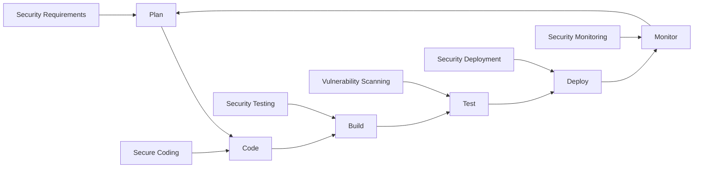
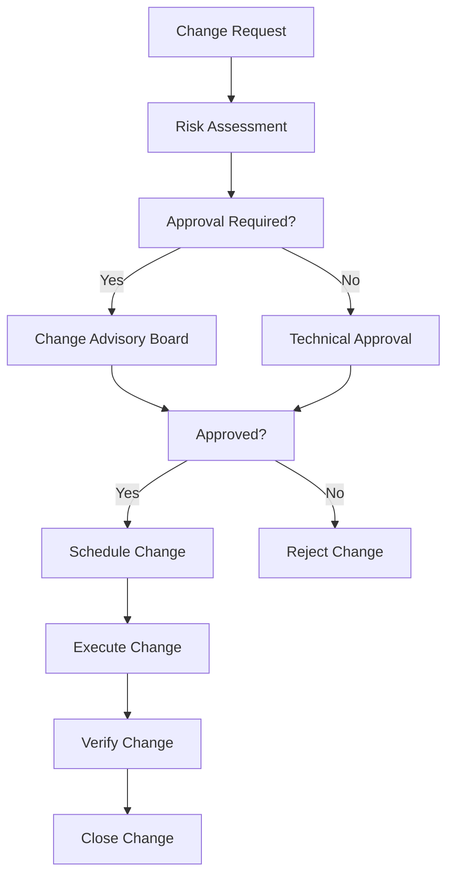
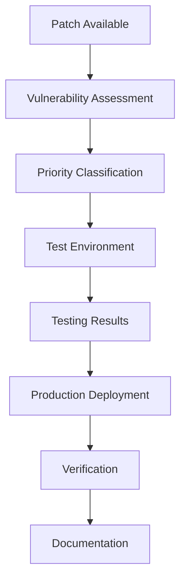

# System Acquisition, Development and Maintenance Policy - ISO 27001

## ArionComply Platform Metadata

```yaml
# Template Configuration
template_id: ISO27001-SYSTEM-DEVELOPMENT-001
template_type: system_acquisition_development_maintenance_policy
template_version: 1.0
template_status: draft
created_date: {{CURRENT_DATE}}
last_modified: {{CURRENT_DATE}}
template_category: technical_policy
compliance_framework: ISO27001:2022
template_owner: {{TEMPLATE_OWNER}}
approval_status: pending_review

# Platform Integration
platform_features:
  - secure_development_lifecycle
  - vulnerability_management
  - code_analysis_integration
  - compliance_automation
  - deployment_security
  - maintenance_tracking

# Dependencies
depends_on:
  - communications_security_policy
  - cryptographic_controls_policy
  - access_control_policy
  - data_classification_policy
  - risk_management_policy
  - change_management_policy

# Usage Context
applicable_controls:
  - A.14.1  # Security requirements of information systems
  - A.14.2  # Security in development and support processes
  - A.14.3  # Test data
  - A.8.25  # Secure development lifecycle
  - A.8.26  # Application security requirements
  - A.8.27  # Secure system architecture and engineering principles
  - A.8.28  # Secure coding
  - A.8.29  # Security testing in development and acceptance
  - A.8.30  # Outsourced development
  - A.8.31  # Separation of development, testing and operational environments
  - A.8.32  # Change management
  - A.8.33  # Information for testing
  - A.8.34  # Protection of systems during audit testing
```

---

## **Document Control Information**

| **Element** | **Details** | **Description** |
|-------------|-------------|-----------------|
| **Document ID** | {{TEMPLATE_ID}} | *Unique identifier for this system development policy* |
| **Document Title** | System Acquisition, Development and Maintenance Policy | *Policy for secure system lifecycle management* |
| **ISO 27001 Reference** | A.14.1-A.14.3, A.8.25-A.8.34 | *Primary controls addressed by this policy* |
| **Document Owner** | {{POLICY_OWNER}} | *Person responsible for policy maintenance* |
| **Approval Authority** | {{APPROVAL_AUTHORITY}} | *Authority responsible for policy approval* |
| **Effective Date** | {{EFFECTIVE_DATE}} | *Date when policy becomes effective* |
| **Review Frequency** | {{REVIEW_FREQUENCY}} | *How often policy will be reviewed* |
| **Next Review Date** | {{NEXT_REVIEW_DATE}} | *Scheduled date for next policy review* |
| **Classification Level** | {{DOCUMENT_CLASSIFICATION}} | *Classification level of this document* |

---

## **1. Policy Foundation**

### **1.1 Understanding Secure System Development**

Think of secure system development like constructing a modern skyscraper. Just as architects must consider structural integrity, fire safety, security systems, and building codes from the very beginning - not as afterthoughts - secure system development requires integrating security considerations throughout the entire lifecycle, from initial planning through ongoing maintenance.

**Real-World Analogy**: Consider building a high-security government facility:
- **Requirements Planning**: Like determining security clearance levels and access requirements before design
- **Secure Architecture**: Like designing compartmentalized spaces with appropriate security controls
- **Construction Standards**: Like using approved materials and following security construction standards
- **Testing and Validation**: Like conducting security tests before occupancy
- **Ongoing Maintenance**: Like regular security system maintenance and updates
- **Change Management**: Like controlled modifications that maintain security integrity

### **1.2 Policy Purpose**

This policy establishes a comprehensive framework to:
- **Secure Development**: Integrate security throughout the system development lifecycle
- **Risk Management**: Identify and mitigate security risks in systems
- **Compliance**: Ensure systems meet regulatory and security requirements
- **Quality Assurance**: Maintain security quality throughout system lifecycle
- **Continuous Improvement**: Continuously improve security practices and capabilities

### **1.3 Policy Scope**

This policy applies to:
- **All Systems**: Applications, infrastructure, platforms, and services
- **All Phases**: Requirements, design, development, testing, deployment, and maintenance
- **All Environments**: Development, testing, staging, and production environments
- **All Personnel**: Developers, architects, testers, administrators, and stakeholders
- **All Approaches**: Internal development, outsourced development, and acquired systems

---

## **2. Secure Development Lifecycle Framework**

### **2.1 Development Methodology Integration**

#### **2.1.1 Agile Security Integration**
**Security in Agile Development**:
Think of security in Agile like having a security expert as a permanent team member who participates in every sprint, rather than a security audit at the end of the project.

**Agile Security Practices**:
- **Security User Stories**: Security requirements as user stories
- **Security Sprints**: Dedicated security-focused sprints
- **Security Reviews**: Security reviews in each sprint
- **Continuous Security**: Security testing throughout development
- **Security Retrospectives**: Security lessons learned in retrospectives

#### **2.1.2 DevSecOps Integration**
**DevSecOps Framework**:


#### **2.1.3 Waterfall Security Gates**
**Security Gates in Waterfall**:
| **Phase** | **Security Activities** | **Deliverables** | **Gate Criteria** |
|-----------|-------------------------|------------------|-------------------|
| **Requirements** | Security requirements analysis | Security requirements document | Security requirements approved |
| **Design** | Security architecture design | Security architecture document | Security design approved |
| **Development** | Secure coding practices | Secure code | Code security review passed |
| **Testing** | Security testing | Security test results | Security tests passed |
| **Deployment** | Security deployment | Security deployment checklist | Security deployment approved |

### **2.2 Security Requirements Management**

#### **2.2.1 Requirements Classification**
**Security Requirements by System Type**:

| **System Type** | **Security Level** | **Requirements** | **Compliance** |
|-----------------|-------------------|------------------|----------------|
| **Public Systems** | Standard | Basic security controls | Industry standards |
| **Internal Systems** | Enhanced | Standard security controls | Internal policies |
| **Confidential Systems** | High | Enhanced security controls | Regulatory requirements |
| **Restricted Systems** | Maximum | Maximum security controls | All applicable standards |

#### **2.2.2 Requirements Traceability**
**Requirements Traceability Matrix**:
```yaml
requirements_traceability:
  business_requirements:
    - functional_requirements
    - non_functional_requirements
    - security_requirements
    - compliance_requirements
  
  technical_requirements:
    - system_architecture
    - security_architecture
    - integration_requirements
    - performance_requirements
  
  implementation:
    - design_documents
    - code_implementation
    - test_cases
    - deployment_procedures
```

---

## **3. Secure Architecture and Design**

### **3.1 Security Architecture Principles**

#### **3.1.1 Core Security Principles**
**Fundamental Security Principles**:
- **Defense in Depth**: Multiple layers of security controls
- **Least Privilege**: Minimum necessary access rights
- **Fail Secure**: Systems fail to a secure state
- **Separation of Duties**: Critical functions require multiple people
- **Security by Design**: Security built into system architecture

#### **3.1.2 Security Architecture Patterns**
**Common Security Patterns**:

| **Pattern** | **Description** | **Use Case** | **Benefits** |
|-------------|-----------------|--------------|--------------|
| **Zero Trust** | Never trust, always verify | Network security | Reduced attack surface |
| **Microservices** | Decomposed, independent services | Application architecture | Isolation, scalability |
| **API Gateway** | Centralized API management | Service integration | Security, monitoring |
| **Circuit Breaker** | Fault tolerance pattern | System resilience | Availability, stability |

### **3.2 Threat Modeling**

#### **3.2.1 Threat Modeling Process**
**Structured Threat Analysis**:
1. **System Decomposition**: Break down system into components
2. **Threat Identification**: Identify potential threats
3. **Vulnerability Assessment**: Assess system vulnerabilities
4. **Risk Analysis**: Analyze threat and vulnerability risks
5. **Mitigation Planning**: Plan security mitigations
6. **Validation**: Validate mitigation effectiveness

#### **3.2.2 Threat Modeling Methodologies**
**Threat Modeling Approaches**:
- **STRIDE**: Spoofing, Tampering, Repudiation, Information Disclosure, Denial of Service, Elevation of Privilege
- **PASTA**: Process for Attack Simulation and Threat Analysis
- **OCTAVE**: Operationally Critical Threat, Asset, and Vulnerability Evaluation
- **TRIKE**: Risk-based threat modeling methodology
- **VAST**: Visual, Agile, and Simple Threat modeling

### **3.3 Security Design Patterns**

#### **3.3.1 Authentication and Authorization**
**Identity and Access Patterns**:
- **Single Sign-On**: Centralized authentication
- **Multi-Factor Authentication**: Multiple authentication factors
- **Role-Based Access Control**: Permission based on roles
- **Attribute-Based Access Control**: Permission based on attributes
- **OAuth 2.0/OpenID Connect**: Modern authorization frameworks

#### **3.3.2 Data Protection Patterns**
**Data Security Patterns**:
- **Encryption at Rest**: Data encryption when stored
- **Encryption in Transit**: Data encryption during transmission
- **Tokenization**: Sensitive data tokenization
- **Data Masking**: Sensitive data masking
- **Key Management**: Centralized key management

---

## **4. Secure Development Practices**

### **4.1 Secure Coding Standards**

#### **4.1.1 Coding Standards by Language**
**Language-Specific Security Standards**:

| **Language** | **Security Framework** | **Key Practices** | **Vulnerability Focus** |
|--------------|------------------------|-------------------|------------------------|
| **Java** | OWASP Java | Input validation, crypto | Injection, XSS |
| **C#/.NET** | Microsoft SDL | Secure APIs, validation | Buffer overflow, injection |
| **JavaScript** | Node.js Security | Input sanitization, CSP | XSS, injection |
| **Python** | Python Security | Input validation, crypto | Injection, deserialization |
| **Go** | Go Security | Safe concurrency, crypto | Race conditions, injection |

#### **4.1.2 Code Review Process**
**Secure Code Review Framework**:
```yaml
code_review_process:
  automated_review:
    - static_analysis_tools
    - dependency_scanning
    - secret_detection
    - code_quality_metrics
  
  manual_review:
    - peer_code_review
    - security_focused_review
    - architecture_review
    - compliance_review
  
  review_criteria:
    - security_best_practices
    - coding_standards
    - performance_requirements
    - maintainability
```

### **4.2 Static and Dynamic Analysis**

#### **4.2.1 Static Application Security Testing (SAST)**
**SAST Implementation**:
- **Code Analysis**: Automated source code analysis
- **Vulnerability Detection**: Security vulnerability identification
- **Compliance Checking**: Coding standard compliance
- **Trend Analysis**: Security trend analysis over time
- **Integration**: IDE and CI/CD integration

#### **4.2.2 Dynamic Application Security Testing (DAST)**
**DAST Implementation**:
- **Runtime Testing**: Security testing during runtime
- **Penetration Testing**: Automated penetration testing
- **Vulnerability Assessment**: Runtime vulnerability assessment
- **Performance Testing**: Security performance testing
- **Environment Testing**: Testing across environments

### **4.3 Dependency Management**

#### **4.3.1 Third-Party Component Security**
**Dependency Security Framework**:
- **Vulnerability Scanning**: Continuous dependency vulnerability scanning
- **License Compliance**: Open source license compliance
- **Component Inventory**: Complete component inventory
- **Update Management**: Systematic component updates
- **Risk Assessment**: Third-party component risk assessment

#### **4.3.2 Software Composition Analysis (SCA)**
**SCA Implementation**:
```yaml
software_composition_analysis:
  scanning:
    - dependency_scanning
    - vulnerability_detection
    - license_scanning
    - policy_enforcement
  
  monitoring:
    - continuous_monitoring
    - real_time_alerts
    - trend_analysis
    - compliance_reporting
  
  remediation:
    - automated_updates
    - risk_prioritization
    - remediation_guidance
    - compliance_tracking
```

---

## **5. Security Testing Framework**

### **5.1 Security Testing Types**

#### **5.1.1 Functional Security Testing**
**Security Test Categories**:
- **Authentication Testing**: Login, session management, password policies
- **Authorization Testing**: Access control, privilege escalation
- **Input Validation Testing**: Injection attacks, data validation
- **Session Management Testing**: Session handling, timeout
- **Cryptography Testing**: Encryption, key management

#### **5.1.2 Non-Functional Security Testing**
**Performance and Resilience Testing**:
- **Load Testing**: System behavior under load
- **Stress Testing**: System behavior under stress
- **Denial of Service Testing**: DoS resilience testing
- **Fault Injection Testing**: Error handling testing
- **Recovery Testing**: System recovery testing

### **5.2 Test Environment Management**

#### **5.2.1 Environment Separation**
**Environment Security Framework**:

| **Environment** | **Purpose** | **Security Level** | **Data Type** |
|-----------------|-------------|-------------------|---------------|
| **Development** | Code development | Low | Synthetic data |
| **Testing** | Quality assurance | Medium | Masked data |
| **Staging** | Pre-production | High | Masked production data |
| **Production** | Live system | Maximum | Live data |

#### **5.2.2 Test Data Management**
**Secure Test Data Practices**:
- **Data Masking**: Sensitive data masking for testing
- **Synthetic Data**: Artificial data generation
- **Data Subsetting**: Reduced data sets for testing
- **Data Refresh**: Regular test data refresh
- **Data Disposal**: Secure test data disposal

### **5.3 ArionComply Testing Integration**

#### **5.3.1 Automated Security Testing**
**Testing Platform Integration**:
```yaml
automated_testing:
  security_testing:
    - sast_integration
    - dast_integration
    - iast_integration
    - dependency_scanning
  
  compliance_testing:
    - policy_compliance
    - regulatory_compliance
    - standard_compliance
    - configuration_compliance
  
  reporting:
    - test_results_aggregation
    - vulnerability_reporting
    - compliance_reporting
    - trend_analysis
```

#### **5.3.2 Continuous Security Testing**
**CI/CD Security Integration**:
- **Pipeline Integration**: Security testing in CI/CD pipelines
- **Automated Gates**: Security gates in deployment pipeline
- **Continuous Monitoring**: Continuous security monitoring
- **Feedback Loops**: Rapid security feedback to developers
- **Compliance Automation**: Automated compliance verification

---

## **6. System Acquisition and Outsourcing**

### **6.1 Vendor Security Assessment**

#### **6.1.1 Vendor Security Evaluation**
**Vendor Assessment Framework**:
- **Security Questionnaires**: Comprehensive security questionnaires
- **Security Audits**: Third-party security audits
- **Penetration Testing**: Vendor system penetration testing
- **Compliance Verification**: Regulatory compliance verification
- **Reference Checks**: Security reference checks

#### **6.1.2 Vendor Risk Classification**
**Risk-Based Vendor Management**:

| **Risk Level** | **Assessment Requirements** | **Monitoring** | **Contract Terms** |
|----------------|----------------------------|----------------|-------------------|
| **Low Risk** | Basic security questionnaire | Annual review | Standard terms |
| **Medium Risk** | Detailed assessment | Quarterly review | Enhanced terms |
| **High Risk** | Comprehensive audit | Monthly review | Strict terms |
| **Critical Risk** | Full security audit | Continuous monitoring | Maximum terms |

### **6.2 Outsourced Development Security**

#### **6.2.1 Outsourcing Security Requirements**
**Outsourcing Security Framework**:
- **Security Requirements**: Detailed security requirements
- **Development Standards**: Secure development standards
- **Testing Requirements**: Security testing requirements
- **Delivery Requirements**: Secure delivery requirements
- **Maintenance Requirements**: Ongoing security maintenance

#### **6.2.2 Outsourcing Quality Assurance**
**Quality Control Framework**:
- **Code Reviews**: Regular code review requirements
- **Security Testing**: Independent security testing
- **Compliance Verification**: Compliance verification
- **Documentation Review**: Security documentation review
- **Acceptance Testing**: Security acceptance testing

### **6.3 Cloud Service Security**

#### **6.3.1 Cloud Security Assessment**
**Cloud Provider Evaluation**:
- **Security Certifications**: Cloud security certifications
- **Compliance Standards**: Regulatory compliance standards
- **Data Protection**: Data protection capabilities
- **Incident Response**: Cloud incident response
- **Business Continuity**: Cloud business continuity

#### **6.3.2 Cloud Security Controls**
**Cloud Security Implementation**:
```yaml
cloud_security_controls:
  identity_management:
    - single_sign_on
    - multi_factor_authentication
    - privileged_access_management
    - identity_governance
  
  data_protection:
    - encryption_at_rest
    - encryption_in_transit
    - key_management
    - data_loss_prevention
  
  network_security:
    - network_segmentation
    - firewall_rules
    - intrusion_detection
    - ddos_protection
```

---

## **7. Change Management and Configuration**

### **7.1 Change Management Process**

#### **7.1.1 Change Classification**
**Change Risk Assessment**:

| **Change Type** | **Risk Level** | **Approval Required** | **Testing Required** |
|-----------------|----------------|----------------------|---------------------|
| **Emergency** | High | Emergency board | Post-implementation |
| **Standard** | Medium | Change manager | Standard testing |
| **Normal** | Low | Technical lead | Unit testing |
| **Pre-approved** | Very Low | Automated | Automated testing |

#### **7.1.2 Change Management Workflow**
**Change Process Framework**:


### **7.2 Configuration Management**

#### **7.2.1 Configuration Baseline**
**Configuration Management Framework**:
- **Baseline Configuration**: Secure baseline configurations
- **Configuration Standards**: Configuration security standards
- **Configuration Monitoring**: Continuous configuration monitoring
- **Configuration Drift**: Configuration drift detection
- **Configuration Remediation**: Automated configuration remediation

#### **7.2.2 Infrastructure as Code**
**IaC Security Framework**:
- **Code Review**: Infrastructure code review
- **Security Scanning**: Infrastructure security scanning
- **Compliance Checking**: Configuration compliance checking
- **Version Control**: Infrastructure version control
- **Automated Deployment**: Secure automated deployment

---

## **8. Production Security and Monitoring**

### **8.1 Production Security Controls**

#### **8.1.1 Runtime Security**
**Runtime Protection Framework**:
- **Application Security**: Runtime application protection
- **Infrastructure Security**: Runtime infrastructure protection
- **Network Security**: Runtime network protection
- **Data Security**: Runtime data protection
- **User Activity**: Runtime user activity monitoring

#### **8.1.2 Security Monitoring**
**Continuous Security Monitoring**:
```yaml
security_monitoring:
  application_monitoring:
    - performance_monitoring
    - error_monitoring
    - security_event_monitoring
    - user_behavior_monitoring
  
  infrastructure_monitoring:
    - system_monitoring
    - network_monitoring
    - security_monitoring
    - compliance_monitoring
  
  threat_detection:
    - anomaly_detection
    - signature_based_detection
    - behavior_analysis
    - threat_intelligence
```

### **8.2 Incident Response**

#### **8.2.1 Security Incident Classification**
**Incident Types and Response**:
- **Security Vulnerabilities**: Newly discovered vulnerabilities
- **Security Breaches**: Successful security attacks
- **System Compromises**: Compromised systems or accounts
- **Data Breaches**: Unauthorized data access or theft
- **Service Disruptions**: Security-related service disruptions

#### **8.2.2 Emergency Response Procedures**
**Emergency Response Framework**:
1. **Detection**: Immediate threat detection and alerting
2. **Analysis**: Rapid incident analysis and classification
3. **Containment**: Immediate threat containment
4. **Investigation**: Detailed forensic investigation
5. **Recovery**: System recovery and restoration
6. **Lessons Learned**: Post-incident improvement

---

## **9. Maintenance and Support**

### **9.1 System Maintenance**

#### **9.1.1 Maintenance Categories**
**Maintenance Types**:
- **Preventive Maintenance**: Scheduled maintenance activities
- **Corrective Maintenance**: Bug fixes and issue resolution
- **Adaptive Maintenance**: Changes for new requirements
- **Perfective Maintenance**: Performance and security improvements
- **Emergency Maintenance**: Critical security updates

#### **9.1.2 Maintenance Security**
**Secure Maintenance Framework**:
- **Access Control**: Controlled maintenance access
- **Change Management**: Maintenance change management
- **Testing**: Maintenance testing requirements
- **Documentation**: Maintenance documentation
- **Approval**: Maintenance approval processes

### **9.2 Patch Management**

#### **9.2.1 Patch Classification**
**Patch Priority Framework**:

| **Priority** | **Timeframe** | **Criteria** | **Approval** |
|--------------|---------------|--------------|--------------|
| **Critical** | 24 hours | Active exploits | Emergency |
| **High** | 7 days | High CVSS score | Expedited |
| **Medium** | 30 days | Medium CVSS score | Standard |
| **Low** | 90 days | Low CVSS score | Normal |

#### **9.2.2 Patch Management Process**
**Patch Management Workflow**:


### **9.3 Vulnerability Management**

#### **9.3.1 Vulnerability Lifecycle**
**Vulnerability Management Process**:
1. **Discovery**: Vulnerability identification and discovery
2. **Assessment**: Vulnerability risk assessment
3. **Prioritization**: Risk-based vulnerability prioritization
4. **Remediation**: Vulnerability remediation planning
5. **Implementation**: Remediation implementation
6. **Verification**: Remediation verification
7. **Reporting**: Vulnerability reporting and tracking

#### **9.3.2 ArionComply Vulnerability Integration**
**Vulnerability Management Platform**:
```yaml
vulnerability_management:
  discovery:
    - automated_scanning
    - manual_testing
    - threat_intelligence
    - vendor_notifications
  
  assessment:
    - risk_scoring
    - impact_analysis
    - exploitability_assessment
    - business_impact
  
  remediation:
    - remediation_planning
    - patch_management
    - configuration_changes
    - compensating_controls
```

---

## **10. Compliance and Governance**

### **10.1 Regulatory Compliance**

#### **10.1.1 Compliance Requirements**
**Regulatory Compliance Framework**:
- **Data Protection**: GDPR, CCPA, HIPAA compliance
- **Financial Services**: PCI DSS, SOX compliance
- **Industry Standards**: ISO 27001, NIST compliance
- **Government Requirements**: FedRAMP, FISMA compliance
- **International Standards**: Common Criteria, FIPS compliance

#### **10.1.2 Compliance Monitoring**
**Continuous Compliance Monitoring**:
- **Automated Compliance**: Automated compliance checking
- **Manual Reviews**: Regular compliance reviews
- **Audit Preparation**: Compliance audit preparation
- **Remediation Tracking**: Compliance remediation tracking
- **Reporting**: Compliance reporting and metrics

### **10.2 Governance Framework**

#### **10.2.1 Security Governance**
**Governance Structure**:
- **Security Committee**: Executive security oversight
- **Architecture Review Board**: Technical security review
- **Change Advisory Board**: Change security review
- **Security Champions**: Development security champions
- **Compliance Office**: Regulatory compliance oversight

#### **10.2.2 Metrics and Reporting**
**Security Metrics Framework**:
| **Metric** | **Target** | **Frequency** | **Owner** |
|------------|------------|---------------|-----------|
| **Vulnerability Remediation** | {{VULN_REMEDIATION_TARGET}} days | Weekly | Security Team |
| **Security Test Coverage** | {{SECURITY_TEST_COVERAGE_TARGET}}% | Monthly | QA Team |
| **Patch Compliance** | {{PATCH_COMPLIANCE_TARGET}}% | Monthly | Operations Team |
| **Code Security Score** | {{CODE_SECURITY_SCORE_TARGET}}/10 | Monthly | Development Team |

---

## **11. Training and Awareness**

### **11.1 Security Training Program**

#### **11.1.1 Role-Based Training**
**Training by Role**:
- **Developers**: Secure coding practices and security testing
- **Architects**: Security architecture and threat modeling
- **Testers**: Security testing methodologies and tools
- **Operations**: Security operations and incident response
- **Management**: Security governance and risk management

#### **11.1.2 Training Content**
**Core Training Areas**:
- **Secure Development**: Secure development lifecycle practices
- **Threat Modeling**: Threat modeling methodologies
- **Security Testing**: Security testing techniques and tools
- **Incident Response**: Security incident response procedures
- **Compliance**: Regulatory compliance requirements

### **11.2 Security Awareness**

#### **11.2.1 Awareness Programs**
**Awareness Activities**:
- **Security Champions**: Developer security champion program
- **Security Guilds**: Cross-functional security communities
- **Lunch and Learn**: Security topics lunch sessions
- **Security Challenges**: Hands-on security challenges
- **Conference Participation**: Security conference attendance

#### **11.2.2 Competency Assessment**
**Assessment Methods**:
- **Certification Programs**: Professional security certifications
- **Hands-on Assessments**: Practical security assessments
- **Code Reviews**: Security-focused code reviews
- **Capture the Flag**: Security CTF competitions
- **Peer Reviews**: Peer security assessments

---

## **12. Emerging Technologies and Innovation**

### **12.1 Emerging Security Technologies**

#### **12.1.1 AI/ML Security**
**AI Security Framework**:
- **Model Security**: Machine learning model security
- **Data Security**: Training data security
- **Adversarial Attacks**: Adversarial attack protection
- **Explainable AI**: AI decision transparency
- **Bias Prevention**: AI bias detection and prevention

#### **12.1.2 Container and Serverless Security**
**Modern Architecture Security**:
- **Container Security**: Container image and runtime security
- **Kubernetes Security**: Kubernetes cluster security
- **Serverless Security**: Function-as-a-Service security
- **Microservices Security**: Microservices architecture security
- **Service Mesh Security**: Service mesh security controls

### **12.2 Innovation Management**

#### **12.2.1 Technology Evaluation**
**Innovation Assessment Framework**:
- **Security Assessment**: Technology security assessment
- **Risk Assessment**: Innovation risk assessment
- **Pilot Programs**: Controlled technology pilots
- **Performance Evaluation**: Technology performance evaluation
- **Adoption Planning**: Technology adoption planning

#### **12.2.2 Future Planning**
**Technology Roadmap**:
- **Emerging Threats**: Future threat landscape
- **Technology Evolution**: Technology evolution planning
- **Skill Development**: Future skill requirements
- **Infrastructure Planning**: Future infrastructure needs
- **Investment Planning**: Security investment planning

---

## **13. Implementation Checklist**

### **13.1 Pre-Implementation**
- [ ] **Current State Assessment**: Assess current development practices
- [ ] **Gap Analysis**: Identify security gaps and requirements
- [ ] **Resource Planning**: Plan necessary resources and budget
- [ ] **Tool Selection**: Select security tools and platforms
- [ ] **Training Planning**: Plan security training programs

### **13.2 Implementation Phase**
- [ ] **Process Implementation**: Implement secure development processes
- [ ] **Tool Deployment**: Deploy security tools and platforms
- [ ] **Training Delivery**: Deliver security training programs
- [ ] **Policy Deployment**: Deploy security policies and procedures
- [ ] **Monitoring Setup**: Implement security monitoring

### **13.3 Post-Implementation**
- [ ] **Compliance Verification**: Verify regulatory compliance
- [ ] **Performance Monitoring**: Monitor security performance
- [ ] **Continuous Improvement**: Implement improvement processes
- [ ] **Stakeholder Communication**: Communicate security status
- [ ] **Regular Reviews**: Establish regular review processes

---

## **14. Related Documents**

### **14.1 Policy Dependencies**
- **Communications Security Policy**: Network and communication security
- **Cryptographic Controls Policy**: Encryption and key management
- **Access Control Policy**: System access controls
- **Data Classification Policy**: Data protection requirements
- **Risk Management Policy**: Risk assessment and treatment

### **14.2 Technical Standards**
- **Secure Coding Standards**: Language-specific coding standards
- **Security Testing Standards**: Security testing methodologies
- **Architecture Standards**: Security architecture standards
- **Deployment Standards**: Secure deployment standards

### **14.3 Operational Procedures**
- **Change Management Procedures**: System change procedures
- **Incident Response Procedures**: Security incident response
- **Vulnerability Management Procedures**: Vulnerability handling
- **Patch Management Procedures**: System patching procedures

---

## **15. Appendices**

### **15.1 Security Testing Matrix**
| **Test Type** | **Frequency** | **Tools** | **Responsibility** |
|---------------|---------------|-----------|-------------------|
| **SAST** | Every commit | SonarQube, Checkmarx | Development Team |
| **DAST** | Every build | OWASP ZAP, Burp Suite | QA Team |
| **IAST** | Runtime | Contrast, Veracode | Operations Team |
| **SCA** | Daily | Snyk, WhiteSource | Security Team |

### **15.2 Vulnerability Severity Matrix**
| **Severity** | **CVSS Score** | **Response Time** | **Remediation Time** |
|--------------|----------------|-------------------|----------------------|
| **Critical** | 9.0-10.0 | 2 hours | 24 hours |
| **High** | 7.0-8.9 | 4 hours | 7 days |
| **Medium** | 4.0-6.9 | 8 hours | 30 days |
| **Low** | 0.1-3.9 | 24 hours | 90 days |

### **15.3 Development Environment Matrix**
| **Environment** | **Security Level** | **Data Type** | **Access Control** |
|-----------------|-------------------|---------------|-------------------|
| **Development** | Low | Synthetic | Developer access |
| **Testing** | Medium | Masked | Tester access |
| **Staging** | High | Masked production | Limited access |
| **Production** | Maximum | Live data | Restricted access |

---

**Document Status**: {{DOCUMENT_STATUS}}  
**Version**: {{VERSION_NUMBER}}  
**Last Updated**: {{LAST_UPDATED}}  
**Next Review**: {{NEXT_REVIEW_DATE}}  
**Owner**: {{DOCUMENT_OWNER}}  
**Approved By**: {{APPROVED_BY}}  
**Approval Date**: {{APPROVAL_DATE}}