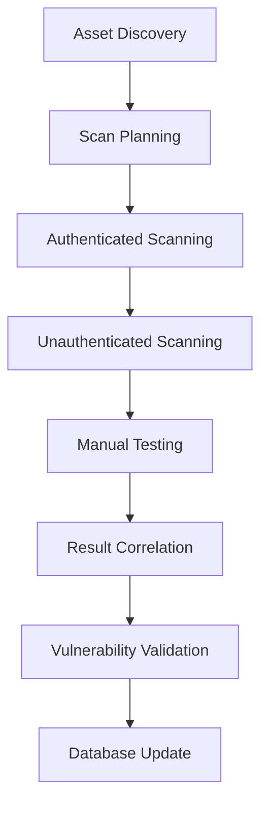
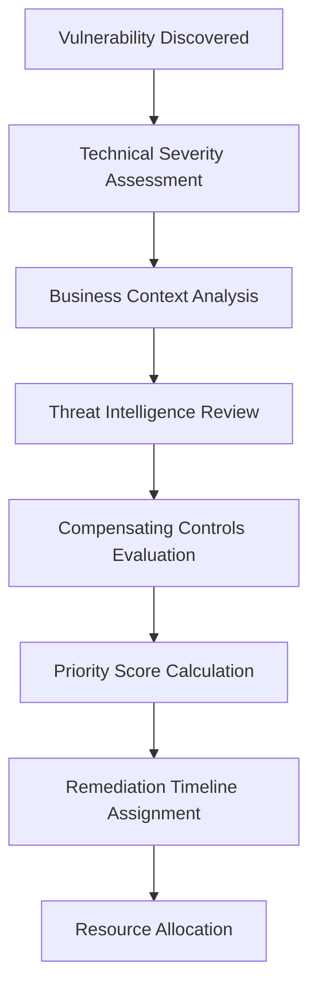
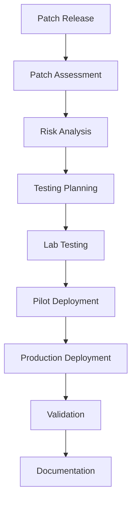
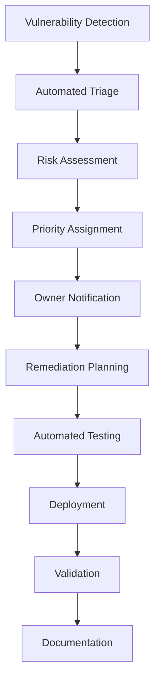

# Vulnerability Management Procedure - ISO 27001

## ArionComply Platform Metadata

```yaml
# Template Configuration
template_id: ISO27001-VULN-MGMT-PROC-001
template_type: vulnerability_management_procedure
template_version: 1.0
template_status: draft
created_date: {{CURRENT_DATE}}
last_modified: {{CURRENT_DATE}}
template_category: operational_procedure
compliance_framework: ISO27001:2022
template_owner: {{TEMPLATE_OWNER}}
approval_status: pending_review

# Platform Integration
platform_features:
  - automated_vulnerability_scanning
  - risk_based_prioritization
  - patch_management_automation
  - compliance_tracking
  - threat_intelligence_integration
  - remediation_orchestration

# Dependencies
depends_on:
  - information_security_incident_management_procedure
  - system_acquisition_development_maintenance_policy
  - risk_management_policy
  - change_management_policy
  - supplier_relationship_management_policy
  - communications_security_policy

# Usage Context
applicable_controls:
  - A.12.6.1  # Management of technical vulnerabilities
  - A.8.8     # Management of technical vulnerabilities
  - A.14.2.3  # Technical review of applications after operating system platform changes
  - A.12.1.3  # Capacity management
  - A.12.2.1  # Controls against malware
```

---

## **Document Control Information**

| **Element** | **Details** | **Description** |
|-------------|-------------|-----------------|
| **Document ID** | {{TEMPLATE_ID}} | *Unique identifier for this vulnerability management procedure* |
| **Document Title** | Vulnerability Management Procedure | *Detailed procedures for managing technical vulnerabilities* |
| **ISO 27001 Reference** | A.12.6.1, A.8.8, A.14.2.3 | *Primary controls addressed by this procedure* |
| **Document Owner** | {{PROCEDURE_OWNER}} | *Person responsible for procedure maintenance* |
| **Approval Authority** | {{APPROVAL_AUTHORITY}} | *Authority responsible for procedure approval* |
| **Effective Date** | {{EFFECTIVE_DATE}} | *Date when procedure becomes effective* |
| **Review Frequency** | {{REVIEW_FREQUENCY}} | *How often procedure will be reviewed* |
| **Next Review Date** | {{NEXT_REVIEW_DATE}} | *Scheduled date for next procedure review* |
| **Classification Level** | {{DOCUMENT_CLASSIFICATION}} | *Classification level of this document* |

---

## **1. Procedure Foundation**

### **1.1 Understanding Vulnerability Management**

Think of vulnerability management like maintaining the immune system of a large organization. Just as a hospital continuously monitors patients for health issues, identifies symptoms early, prioritizes treatment based on severity, and implements preventive measures - vulnerability management requires systematic identification, assessment, prioritization, and remediation of security weaknesses before they can be exploited by threats.

**Real-World Analogy**: Consider how a city manages infrastructure maintenance:
- **Regular Inspections**: Like routine bridge inspections to identify structural weaknesses
- **Risk Assessment**: Like prioritizing repairs based on traffic volume and safety risk
- **Emergency Response**: Like immediate action for critical infrastructure failures
- **Preventive Maintenance**: Like scheduled maintenance to prevent future problems
- **Resource Management**: Like allocating limited maintenance budgets to highest-risk areas
- **Continuous Monitoring**: Like ongoing monitoring systems for early problem detection

Vulnerability management follows similar principles - continuous scanning, risk-based prioritization, timely remediation, and proactive prevention.

### **1.2 Procedure Purpose**

This procedure establishes detailed operational steps to:
- **Identify Vulnerabilities**: Systematically discover security vulnerabilities across all systems
- **Assess Risk**: Evaluate vulnerability risk based on business context and threat landscape
- **Prioritize Remediation**: Prioritize remediation efforts based on risk and business impact
- **Execute Remediation**: Implement appropriate remediation measures efficiently
- **Track Progress**: Monitor remediation progress and effectiveness
- **Ensure Compliance**: Maintain compliance with security policies and regulatory requirements
- **Continuous Improvement**: Continuously improve vulnerability management capabilities

### **1.3 Procedure Scope**

This procedure applies to:
- **All Systems**: Servers, workstations, network devices, applications, and cloud services
- **All Environments**: Production, development, testing, and staging environments
- **All Vulnerability Types**: Software, configuration, design, and operational vulnerabilities
- **All Lifecycle Phases**: From vulnerability discovery through verified remediation
- **All Personnel**: Security teams, IT operations, development teams, and system owners

---

## **2. Vulnerability Discovery and Identification**

### **2.1 Vulnerability Discovery Methods**

#### **2.1.1 Automated Scanning**
**Comprehensive Scanning Framework**:

| **Scan Type** | **Frequency** | **Coverage** | **Tools** |
|---------------|---------------|--------------|-----------|
| **Infrastructure** | Weekly | Servers, network devices | Network scanners |
| **Application** | Bi-weekly | Web applications, APIs | DAST scanners |
| **Code** | Every commit | Source code | SAST scanners |
| **Container** | Every build | Container images | Container scanners |
| **Cloud** | Daily | Cloud configurations | Cloud security scanners |

#### **2.1.2 Scanning Methodology**
**Systematic Scanning Approach**:


#### **2.1.3 Discovery Sources**
**Multi-Source Vulnerability Discovery**:
- **Automated Scanners**: Network, application, and configuration scanners
- **Threat Intelligence**: External threat intelligence feeds
- **Vendor Advisories**: Security advisories from software vendors
- **Security Research**: Public security research and disclosures
- **Penetration Testing**: Manual penetration testing discoveries
- **Bug Bounty Programs**: External security researcher findings
- **Internal Research**: Internal security research and testing
- **Audit Findings**: Internal and external audit discoveries

### **2.2 Asset Discovery and Inventory**

#### **2.2.1 Asset Identification**
**Comprehensive Asset Discovery**:
- **Network Scanning**: Automated network discovery and port scanning
- **Cloud Discovery**: Cloud service and resource discovery
- **Application Discovery**: Web application and API discovery
- **Database Discovery**: Database and data store discovery
- **Service Discovery**: Running service and daemon discovery
- **Certificate Discovery**: SSL/TLS certificate discovery
- **Domain Discovery**: DNS and subdomain discovery
- **Mobile Application Discovery**: Mobile app and device discovery

#### **2.2.2 Asset Classification**
**Risk-Based Asset Classification**:

| **Asset Category** | **Business Criticality** | **Data Sensitivity** | **Exposure Level** |
|-------------------|-------------------------|---------------------|-------------------|
| **Critical Systems** | Mission-critical | Restricted/Confidential | High exposure |
| **Important Systems** | Business-important | Confidential/Internal | Medium exposure |
| **Standard Systems** | Standard operations | Internal/Public | Low exposure |
| **Development Systems** | Non-production | Test data | Isolated |

### **2.3 ArionComply Discovery Integration**

#### **2.3.1 Unified Asset Discovery**
**Integrated Discovery Platform**:
```yaml
asset_discovery:
  discovery_methods:
    - network_scanning
    - cloud_api_integration
    - agent_based_discovery
    - passive_monitoring
    - manual_registration
  
  asset_classification:
    - criticality_assessment
    - data_classification
    - exposure_analysis
    - owner_identification
  
  inventory_management:
    - automated_updates
    - change_detection
    - lifecycle_tracking
    - compliance_mapping
```

#### **2.3.2 Continuous Discovery**
**Real-Time Asset Monitoring**:
- **Change Detection**: Real-time detection of asset changes
- **New Asset Alerts**: Automated alerts for new assets
- **Asset Drift**: Detection of configuration drift
- **Ownership Tracking**: Automated asset ownership tracking
- **Dependency Mapping**: Asset dependency and relationship mapping

---

## **3. Vulnerability Assessment and Scoring**

### **3.1 Vulnerability Assessment Framework**

#### **3.1.1 Multi-Factor Risk Assessment**
**Comprehensive Risk Evaluation**:
- **Technical Severity**: CVSS base score and technical impact
- **Business Context**: Business criticality and data sensitivity
- **Threat Landscape**: Active threats and exploit availability
- **Compensating Controls**: Existing security controls and mitigations
- **Environmental Factors**: Network exposure and access controls
- **Compliance Impact**: Regulatory and policy compliance impact

#### **3.1.2 CVSS Integration**
**Common Vulnerability Scoring System**:

| **CVSS Score** | **Severity Level** | **Response Time** | **Priority** |
|----------------|-------------------|-------------------|--------------|
| **9.0-10.0** | Critical | 24 hours | P1 |
| **7.0-8.9** | High | 7 days | P2 |
| **4.0-6.9** | Medium | 30 days | P3 |
| **0.1-3.9** | Low | 90 days | P4 |

### **3.2 Business Context Assessment**

#### **3.2.1 Business Impact Analysis**
**Contextual Risk Factors**:
- **Asset Criticality**: Business criticality of affected assets
- **Data Classification**: Sensitivity of data processed or stored
- **Service Impact**: Impact on customer-facing services
- **Compliance Requirements**: Regulatory compliance implications
- **Business Process Impact**: Impact on critical business processes
- **Customer Impact**: Potential impact on customers
- **Revenue Impact**: Potential financial impact

#### **3.2.2 Environmental Risk Factors**
**Exposure and Accessibility**:
- **Network Exposure**: Internet-facing vs. internal systems
- **Access Controls**: Authentication and authorization requirements
- **Network Segmentation**: Network isolation and segmentation
- **Monitoring Coverage**: Security monitoring and detection coverage
- **Compensating Controls**: Additional security controls in place
- **Physical Security**: Physical access controls and restrictions

### **3.3 ArionComply Risk Scoring**

#### **3.3.1 Advanced Risk Calculation**
**AI-Enhanced Risk Assessment**:
```yaml
risk_scoring_engine:
  base_scoring:
    - cvss_score_integration
    - vendor_severity_ratings
    - exploit_maturity_assessment
    - attack_vector_analysis
  
  contextual_factors:
    - asset_criticality_score
    - data_sensitivity_score
    - exposure_level_assessment
    - compensating_controls_evaluation
  
  threat_intelligence:
    - active_exploitation_status
    - threat_actor_capabilities
    - weaponization_timeline
    - industry_targeting_trends
  
  business_impact:
    - service_availability_impact
    - data_confidentiality_impact
    - compliance_violation_risk
    - financial_impact_assessment
```

#### **3.3.2 Dynamic Risk Adjustment**
**Real-Time Risk Recalculation**:
- **Threat Intelligence Updates**: Real-time threat intelligence integration
- **Exploit Availability**: Monitoring for public exploit releases
- **Attack Campaigns**: Detection of active attack campaigns
- **Environmental Changes**: Asset and configuration changes
- **Control Effectiveness**: Security control effectiveness measurement
- **Business Context Changes**: Business priority and context updates

---

## **4. Vulnerability Prioritization**

### **4.1 Prioritization Framework**

#### **4.1.1 Multi-Dimensional Prioritization**
**Prioritization Decision Matrix**:



#### **4.1.2 Priority Categories**
**Remediation Priority Framework**:

| **Priority** | **Criteria** | **Timeline** | **Resources** |
|--------------|--------------|--------------|---------------|
| **P0 - Emergency** | Active exploitation, critical assets | Immediate | All available |
| **P1 - Critical** | High severity, business-critical | 24-72 hours | Priority allocation |
| **P2 - High** | Medium-high severity, important assets | 1-2 weeks | Standard allocation |
| **P3 - Medium** | Medium severity, standard assets | 1 month | Normal allocation |
| **P4 - Low** | Low severity, non-critical assets | 3 months | As available |

### **4.2 Business-Driven Prioritization**

#### **4.2.1 Business Alignment**
**Business Priority Integration**:
- **Strategic Projects**: Alignment with strategic business projects
- **Compliance Deadlines**: Regulatory compliance deadlines
- **Customer Commitments**: Customer security commitments
- **Revenue Protection**: Revenue-generating system protection
- **Cost Optimization**: Cost-effective remediation approaches
- **Resource Availability**: Available remediation resources

#### **4.2.2 Risk Tolerance**
**Organizational Risk Appetite**:
- **Risk Tolerance Levels**: Defined organizational risk tolerance
- **Acceptable Risk**: Criteria for accepting residual risk
- **Risk Transfer**: Options for risk transfer or insurance
- **Compensating Controls**: Alternative risk mitigation measures
- **Business Justification**: Business justification for risk decisions
- **Executive Approval**: Executive approval for risk acceptance

### **4.3 Threat Intelligence Integration**

#### **4.3.1 Threat-Informed Prioritization**
**Intelligence-Driven Decision Making**:
- **Active Threats**: Currently active threat campaigns
- **Exploit Availability**: Public exploit code availability
- **Attack Trends**: Industry and sector attack trends
- **Threat Actor Targeting**: Threat actor targeting patterns
- **Weaponization Timeline**: Expected exploit weaponization timeline
- **Campaign Intelligence**: Specific campaign intelligence

#### **4.3.2 Predictive Analytics**
**Future Risk Assessment**:
- **Exploit Prediction**: Predictive modeling for exploit development
- **Attack Surface Analysis**: Attack surface expansion analysis
- **Vulnerability Chaining**: Vulnerability exploitation chaining
- **Time-to-Exploit**: Estimated time until exploitation
- **Impact Modeling**: Potential impact modeling and simulation
- **Resource Planning**: Predictive resource requirement planning

---

## **5. Remediation Planning and Execution**

### **5.1 Remediation Strategy Development**

#### **5.1.1 Remediation Options**
**Remediation Approach Matrix**:

| **Remediation Type** | **Effectiveness** | **Implementation Time** | **Business Impact** |
|---------------------|------------------|------------------------|-------------------|
| **Patching** | High | Hours to days | Low to medium |
| **Configuration Change** | Medium to high | Minutes to hours | Low |
| **Compensating Controls** | Medium | Hours to days | Low to medium |
| **System Replacement** | High | Weeks to months | High |
| **Service Decommission** | High | Days to weeks | High |
| **Risk Acceptance** | None | Immediate | None |

#### **5.1.2 Remediation Planning Process**
**Systematic Remediation Planning**:
1. **Vulnerability Analysis**: Detailed vulnerability analysis and impact assessment
2. **Solution Research**: Research available remediation solutions
3. **Impact Assessment**: Assess remediation impact on systems and business
4. **Testing Strategy**: Develop testing and validation strategy
5. **Implementation Planning**: Plan implementation timeline and resources
6. **Rollback Planning**: Develop rollback and recovery procedures
7. **Communication Planning**: Plan stakeholder communication
8. **Success Criteria**: Define success criteria and validation methods

### **5.2 Patch Management**

#### **5.2.1 Patch Management Process**
**Systematic Patch Management**:


#### **5.2.2 Patch Classification**
**Risk-Based Patch Prioritization**:

| **Patch Type** | **Testing Required** | **Deployment Timeline** | **Approval Level** |
|----------------|---------------------|------------------------|-------------------|
| **Critical Security** | Limited testing | 24-72 hours | Security team |
| **Important Security** | Standard testing | 1-2 weeks | Change board |
| **Standard Security** | Full testing | 2-4 weeks | Change board |
| **Feature Updates** | Comprehensive testing | Planned cycles | Business owner |

### **5.3 Compensating Controls**

#### **5.3.1 Control Selection**
**Compensating Control Framework**:
- **Network Controls**: Firewall rules, network segmentation
- **Access Controls**: Authentication, authorization restrictions
- **Monitoring Controls**: Enhanced logging and monitoring
- **Process Controls**: Manual procedures and reviews
- **Technical Controls**: Intrusion prevention, application controls
- **Administrative Controls**: Policy and procedure controls

#### **5.3.2 Control Effectiveness**
**Compensating Control Validation**:
- **Effectiveness Assessment**: Evaluate control effectiveness
- **Coverage Analysis**: Assess vulnerability coverage
- **Performance Impact**: Measure performance impact
- **Maintenance Requirements**: Ongoing maintenance needs
- **Compliance Alignment**: Regulatory compliance alignment
- **Cost-Benefit Analysis**: Cost versus risk reduction analysis

### **5.4 ArionComply Remediation Orchestration**

#### **5.4.1 Automated Remediation**
**Orchestrated Remediation Platform**:
```yaml
remediation_orchestration:
  automated_patching:
    - patch_testing_automation
    - staged_deployment
    - rollback_automation
    - validation_testing
  
  configuration_management:
    - automated_configuration_fixes
    - compliance_remediation
    - security_hardening
    - drift_correction
  
  workflow_automation:
    - approval_workflows
    - testing_pipelines
    - deployment_orchestration
    - validation_automation
```

#### **5.4.2 Remediation Analytics**
**Intelligent Remediation Insights**:
- **Remediation Effectiveness**: Measure remediation success rates
- **Time-to-Fix Analysis**: Analyze remediation timeline performance
- **Resource Optimization**: Optimize remediation resource allocation
- **Failure Analysis**: Analyze remediation failures and improvements
- **Predictive Planning**: Predict future remediation requirements
- **Cost Analysis**: Analyze remediation costs and ROI

---

## **6. Testing and Validation**

### **6.1 Pre-Deployment Testing**

#### **6.1.1 Testing Framework**
**Comprehensive Testing Strategy**:
- **Functional Testing**: Verify system functionality after remediation
- **Performance Testing**: Test system performance impact
- **Security Testing**: Validate security improvement
- **Integration Testing**: Test integration with other systems
- **User Acceptance Testing**: Business user validation
- **Regression Testing**: Ensure no new issues introduced

#### **6.1.2 Testing Environments**
**Multi-Environment Testing Strategy**:

| **Environment** | **Purpose** | **Testing Scope** | **Duration** |
|-----------------|-------------|------------------|--------------|
| **Lab** | Initial testing | Basic functionality | 1-2 days |
| **Development** | Integration testing | System integration | 2-3 days |
| **Staging** | Pre-production testing | Full system testing | 3-5 days |
| **Pilot Production** | Limited production | Real-world validation | 1-2 weeks |

### **6.2 Deployment Validation**

#### **6.2.1 Validation Process**
**Post-Deployment Validation**:
1. **Deployment Verification**: Confirm successful deployment
2. **Functionality Testing**: Test critical functionality
3. **Security Validation**: Validate vulnerability remediation
4. **Performance Monitoring**: Monitor system performance
5. **Error Monitoring**: Monitor for errors or issues
6. **User Feedback**: Collect user feedback and reports
7. **Rollback Assessment**: Evaluate need for rollback
8. **Success Confirmation**: Confirm remediation success

#### **6.2.2 Remediation Verification**
**Vulnerability Fix Validation**:
- **Scan Verification**: Re-scan to confirm vulnerability resolution
- **Manual Testing**: Manual testing of specific vulnerabilities
- **Penetration Testing**: Targeted penetration testing
- **Code Review**: Security code review for code fixes
- **Configuration Review**: Security configuration review
- **Third-Party Validation**: Independent security assessment

### **6.3 Continuous Monitoring**

#### **6.3.1 Post-Remediation Monitoring**
**Ongoing Monitoring Framework**:
- **Performance Monitoring**: Continuous performance monitoring
- **Security Monitoring**: Enhanced security monitoring
- **Error Monitoring**: Application and system error monitoring
- **User Experience Monitoring**: User experience and satisfaction
- **Compliance Monitoring**: Regulatory compliance monitoring
- **Trend Analysis**: Long-term trend analysis and reporting

#### **6.3.2 Effectiveness Measurement**
**Remediation Success Metrics**:
- **Vulnerability Closure Rate**: Percentage of vulnerabilities successfully remediated
- **Recurrence Rate**: Rate of vulnerability reoccurrence
- **Time-to-Fix**: Average time from discovery to remediation
- **First-Time Fix Rate**: Percentage of vulnerabilities fixed on first attempt
- **Rollback Rate**: Percentage of remediations requiring rollback
- **Customer Satisfaction**: Stakeholder satisfaction with remediation

---

## **7. Reporting and Communication**

### **7.1 Stakeholder Communication**

#### **7.1.1 Communication Framework**
**Multi-Stakeholder Communication Strategy**:

| **Stakeholder** | **Information Needs** | **Frequency** | **Format** |
|-----------------|----------------------|---------------|------------|
| **Executive Leadership** | Risk summary, trends | Monthly | Dashboard |
| **IT Management** | Operational metrics | Weekly | Report |
| **Security Team** | Technical details | Daily | Alert/Report |
| **System Owners** | Asset-specific status | As needed | Notification |
| **Compliance** | Regulatory metrics | Quarterly | Formal report |

#### **7.1.2 Communication Templates**
**Standardized Communication**:
- **Executive Dashboard**: High-level risk and trend summary
- **Operational Report**: Detailed operational metrics and status
- **Critical Alert**: Urgent vulnerability notifications
- **Remediation Notice**: Planned remediation notifications
- **Status Update**: Regular progress and status updates
- **Completion Report**: Remediation completion confirmations

### **7.2 Metrics and KPIs**

#### **7.2.1 Performance Metrics**
**Key Performance Indicators**:

| **Metric** | **Definition** | **Target** | **Frequency** |
|------------|----------------|------------|---------------|
| **Mean Time to Detect (MTTD)** | Average time to discover vulnerabilities | {{MTTD_TARGET}} days | Monthly |
| **Mean Time to Resolve (MTTR)** | Average time to remediate vulnerabilities | {{MTTR_TARGET}} days | Monthly |
| **Vulnerability Backlog** | Number of open vulnerabilities | {{BACKLOG_TARGET}} | Weekly |
| **Critical Exposure Time** | Time critical vulnerabilities remain open | {{EXPOSURE_TARGET}} hours | Daily |
| **Remediation Success Rate** | Percentage of successful remediations | {{SUCCESS_TARGET}}% | Monthly |

#### **7.2.2 Risk Metrics**
**Risk-Based Measurements**:
- **Risk Exposure Score**: Aggregate organizational risk exposure
- **Risk Reduction Rate**: Rate of risk reduction over time
- **High-Risk Asset Coverage**: Percentage of high-risk assets scanned
- **Compliance Coverage**: Percentage of compliance requirements met
- **Threat Landscape Alignment**: Alignment with current threat landscape
- **Cost per Vulnerability**: Average cost to remediate vulnerabilities

### **7.3 Regulatory Reporting**

#### **7.3.1 Compliance Reporting**
**Regulatory Compliance Framework**:
- **SOX Compliance**: Financial system vulnerability reporting
- **PCI DSS Compliance**: Payment system vulnerability management
- **HIPAA Compliance**: Healthcare system security reporting
- **ISO 27001 Compliance**: Information security management reporting
- **Industry Standards**: Industry-specific security standards

#### **7.3.2 Audit Support**
**Audit Documentation and Support**:
- **Process Documentation**: Documented vulnerability management processes
- **Evidence Collection**: Vulnerability management evidence collection
- **Metrics Documentation**: Historical metrics and trend documentation
- **Control Effectiveness**: Evidence of control effectiveness
- **Continuous Improvement**: Documentation of process improvements
- **Compliance Attestation**: Formal compliance attestations

---

## **8. Tool Integration and Automation**

### **8.1 Tool Ecosystem**

#### **8.1.1 Core Tool Categories**
**Vulnerability Management Tool Stack**:
- **Vulnerability Scanners**: Network, application, and infrastructure scanners
- **Patch Management Tools**: Automated patch deployment and management
- **Asset Discovery Tools**: Network and cloud asset discovery
- **Configuration Management**: System configuration management
- **Threat Intelligence Platforms**: External threat intelligence integration
- **SIEM Integration**: Security information and event management
- **Ticketing Systems**: Work management and tracking systems
- **Reporting Tools**: Metrics and reporting platforms

#### **8.1.2 Integration Requirements**
**Tool Integration Standards**:
- **API Integration**: Standardized API connectivity
- **Data Normalization**: Consistent data formats and schemas
- **Workflow Integration**: Seamless workflow automation
- **Single Sign-On**: Unified authentication and access
- **Centralized Configuration**: Unified tool configuration management
- **Performance Monitoring**: Integrated tool performance monitoring

### **8.2 Automation Framework**

#### **8.2.1 Workflow Automation**
**Automated Vulnerability Management Workflows**:


#### **8.2.2 Automation Capabilities**
**Intelligent Automation Features**:
- **Automated Scanning**: Scheduled and event-driven scanning
- **Risk Calculation**: Automated risk scoring and prioritization
- **Remediation Recommendations**: AI-powered remediation suggestions
- **Patch Deployment**: Automated patch testing and deployment
- **Configuration Fixes**: Automated configuration remediation
- **Validation Testing**: Automated remediation validation
- **Reporting**: Automated metrics and report generation
- **Escalation**: Automated escalation and notification

### **8.3 ArionComply Platform Integration**

#### **8.3.1 Unified Vulnerability Management**
**Comprehensive Platform Integration**:
```yaml
unified_platform:
  vulnerability_lifecycle:
    - discovery_automation
    - assessment_intelligence
    - prioritization_optimization
    - remediation_orchestration
    - validation_automation
    - reporting_intelligence
  
  integration_ecosystem:
    - scanner_integrations
    - patch_management_integration
    - asset_management_integration
    - threat_intelligence_integration
    - workflow_automation
    - analytics_platform
```

#### **8.3.2 Advanced Analytics**
**AI-Powered Vulnerability Intelligence**:
- **Predictive Analytics**: Vulnerability trend prediction and forecasting
- **Risk Modeling**: Advanced risk modeling and simulation
- **Remediation Optimization**: AI-optimized remediation planning
- **Resource Planning**: Predictive resource requirement planning
- **Threat Correlation**: Vulnerability and threat intelligence correlation
- **Performance Optimization**: Continuous process optimization

---

## **9. Exception and Risk Acceptance**

### **9.1 Exception Management**

#### **9.1.1 Exception Framework**
**Risk-Based Exception Process**:
- **Exception Criteria**: Clearly defined exception criteria
- **Business Justification**: Required business justification
- **Risk Assessment**: Comprehensive risk assessment
- **Compensating Controls**: Alternative risk mitigation measures
- **Approval Authority**: Appropriate approval authority levels
- **Time Limits**: Defined exception time limits
- **Review Process**: Regular exception review and renewal

#### **9.1.2 Exception Categories**
**Exception Type Classification**:

| **Exception Type** | **Criteria** | **Approval Required** | **Duration** |
|-------------------|--------------|----------------------|--------------|
| **Technical Limitations** | System constraints prevent remediation | Technical authority | 6 months |
| **Business Requirements** | Business needs override security | Business owner | 3 months |
| **Cost Constraints** | Remediation cost exceeds risk | Executive management | 12 months |
| **Legacy Systems** | End-of-life system limitations | Risk committee | System lifetime |

### **9.2 Risk Acceptance Process**

#### **9.2.1 Risk Acceptance Framework**
**Formal Risk Acceptance Process**:
1. **Risk Assessment**: Comprehensive risk assessment and analysis
2. **Alternative Analysis**: Analysis of alternative risk mitigation options
3. **Business Impact**: Assessment of business impact and requirements
4. **Stakeholder Consultation**: Consultation with relevant stakeholders
5. **Approval Process**: Formal approval by appropriate authority
6. **Documentation**: Complete documentation of decision rationale
7. **Monitoring**: Ongoing monitoring of accepted risks
8. **Review Schedule**: Regular review and reassessment

#### **9.2.2 Acceptance Criteria**
**Risk Acceptance Standards**:
- **Risk Tolerance**: Within organizational risk tolerance levels
- **Business Justification**: Clear business justification provided
- **Compensating Controls**: Adequate compensating controls in place
- **Monitoring**: Appropriate monitoring and detection capabilities
- **Review Schedule**: Regular review and reassessment schedule
- **Exit Strategy**: Clear exit strategy and timeline

### **9.3 Compensating Control Management**

#### **9.3.1 Control Implementation**
**Compensating Control Framework**:
- **Control Selection**: Selection of appropriate compensating controls
- **Implementation**: Proper implementation and configuration
- **Testing**: Testing and validation of control effectiveness
- **Monitoring**: Continuous monitoring of control performance
- **Maintenance**: Regular maintenance and updates
- **Documentation**: Complete documentation of controls

#### **9.3.2 Control Effectiveness**
**Ongoing Control Validation**:
- **Effectiveness Testing**: Regular testing of control effectiveness
- **Performance Monitoring**: Continuous performance monitoring
- **Gap Analysis**: Regular gap analysis and assessment
- **Improvement Planning**: Continuous improvement planning
- **Cost-Benefit Analysis**: Regular cost-benefit analysis
- **Compliance Verification**: Regulatory compliance verification

---

## **10. Continuous Improvement**

### **10.1 Performance Analysis**

#### **10.1.1 Metrics Analysis**
**Performance Measurement Framework**:
- **Trend Analysis**: Long-term trend analysis and interpretation
- **Benchmark Comparison**: Comparison with industry benchmarks
- **Root Cause Analysis**: Analysis of performance gaps and issues
- **Efficiency Analysis**: Process efficiency and optimization analysis
- **Effectiveness Analysis**: Control and process effectiveness analysis
- **Cost Analysis**: Cost-effectiveness and ROI analysis

#### **10.1.2 Process Maturity Assessment**
**Maturity Evaluation Framework**:
- **Process Maturity**: Assessment of process maturity levels
- **Technology Maturity**: Evaluation of technology capabilities
- **People Maturity**: Assessment of team skills and capabilities
- **Integration Maturity**: Evaluation of integration effectiveness
- **Automation Maturity**: Assessment of automation capabilities
- **Governance Maturity**: Evaluation of governance effectiveness

### **10.2 Improvement Planning**

#### **10.2.1 Improvement Identification**
**Systematic Improvement Process**:
- **Gap Analysis**: Identification of performance and capability gaps
- **Opportunity Assessment**: Assessment of improvement opportunities
- **Priority Ranking**: Ranking of improvements by impact and effort
- **Resource Requirements**: Assessment of required resources
- **Timeline Planning**: Development of implementation timelines
- **Success Criteria**: Definition of success criteria and metrics

#### **10.2.2 Implementation Management**
**Improvement Implementation Framework**:
- **Project Planning**: Detailed improvement project planning
- **Resource Allocation**: Allocation of necessary resources
- **Change Management**: Change management and communication
- **Progress Monitoring**: Monitoring of implementation progress
- **Risk Management**: Management of implementation risks
- **Success Measurement**: Measurement of improvement success

### **10.3 Knowledge Management**

#### **10.3.1 Learning Capture**
**Knowledge Management Framework**:
- **Lessons Learned**: Capture and documentation of lessons learned
- **Best Practices**: Identification and sharing of best practices
- **Process Documentation**: Continuous process documentation updates
- **Training Updates**: Regular training program updates
- **Knowledge Sharing**: Cross-team knowledge sharing initiatives
- **Experience Database**: Centralized experience and knowledge database

#### **10.3.2 Capability Development**
**Team Development Framework**:
- **Skill Assessment**: Regular team skill assessments
- **Training Planning**: Targeted training and development planning
- **Certification Programs**: Professional certification support
- **Mentoring**: Mentoring and knowledge transfer programs
- **Cross-Training**: Cross-functional training and development
- **Innovation**: Innovation and research initiatives

---

## **11. Implementation Checklist**

### **11.1 Pre-Implementation**
- [ ] **Asset Inventory**: Complete asset discovery and inventory
- [ ] **Tool Selection**: Select and procure vulnerability management tools
- [ ] **Process Design**: Design vulnerability management processes
- [ ] **Team Formation**: Form vulnerability management team
- [ ] **Training Planning**: Plan team training and development

### **11.2 Implementation Phase**
- [ ] **Tool Deployment**: Deploy and configure vulnerability management tools
- [ ] **Process Implementation**: Implement vulnerability management processes
- [ ] **Integration**: Integrate tools and systems
- [ ] **Team Training**: Train vulnerability management team
- [ ] **Pilot Testing**: Conduct pilot testing and validation

### **11.3 Post-Implementation**
- [ ] **Full Deployment**: Complete vulnerability management deployment
- [ ] **Monitoring Setup**: Implement monitoring and metrics
- [ ] **Continuous Scanning**: Establish continuous scanning processes
- [ ] **Reporting**: Implement reporting and communication
- [ ] **Improvement**: Establish continuous improvement processes

---

## **12. Related Documents**

### **12.1 Policy Dependencies**
- **System Acquisition, Development and Maintenance Policy**: Secure development practices
- **Risk Management Policy**: Risk assessment and treatment
- **Change Management Policy**: Change control processes
- **Incident Response Policy**: Security incident response integration

### **12.2 Technical Procedures**
- **Patch Management Procedures**: Detailed patch management procedures
- **Configuration Management Procedures**: System configuration management
- **Penetration Testing Procedures**: Manual security testing procedures
- **Change Control Procedures**: System change control procedures

### **12.3 Tool Documentation**
- **Scanner Configuration**: Vulnerability scanner configuration guides
- **Tool Integration**: Tool integration and API documentation
- **Automation Playbooks**: Automated remediation playbooks
- **Reporting Templates**: Standardized reporting templates

---

## **13. Appendices**

### **13.1 Vulnerability Severity Matrix**
| **CVSS Score** | **Severity** | **Response Time** | **Approval Level** | **Testing Required** |
|----------------|--------------|-------------------|-------------------|---------------------|
| **9.0-10.0** | Critical | 24 hours | Security manager | Limited |
| **7.0-8.9** | High | 7 days | Team lead | Standard |
| **4.0-6.9** | Medium | 30 days | System owner | Full |
| **0.1-3.9** | Low | 90 days | System owner | Comprehensive |

### **13.2 Remediation Timeline Matrix**
| **Asset Criticality** | **Critical Vuln** | **High Vuln** | **Medium Vuln** | **Low Vuln** |
|----------------------|-------------------|---------------|----------------|-------------|
| **Mission Critical** | 12 hours | 3 days | 2 weeks | 1 month |
| **Business Important** | 24 hours | 7 days | 1 month | 2 months |
| **Standard** | 72 hours | 2 weeks | 6 weeks | 3 months |
| **Development** | 1 week | 1 month | 2 months | 6 months |

### **13.3 Escalation Matrix**
| **Severity** | **Initial Contact** | **Escalation Level 1** | **Escalation Level 2** | **Executive Escalation** |
|--------------|-------------------|----------------------|----------------------|------------------------|
| **Critical** | Security analyst | Security manager | CISO | CTO/CEO |
| **High** | Security analyst | Security manager | CISO | N/A |
| **Medium** | Security analyst | Team lead | Security manager | N/A |
| **Low** | Security analyst | Team lead | N/A | N/A |

---

**Document Status**: {{DOCUMENT_STATUS}}  
**Version**: {{VERSION_NUMBER}}  
**Last Updated**: {{LAST_UPDATED}}  
**Next Review**: {{NEXT_REVIEW_DATE}}  
**Owner**: {{DOCUMENT_OWNER}}  
**Approved By**: {{APPROVED_BY}}  
**Approval Date**: {{APPROVAL_DATE}}